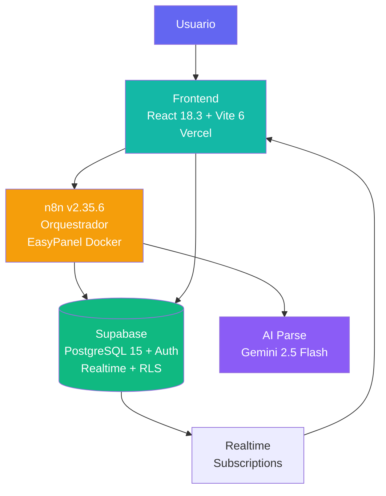

# TEG+ ERP — Mapa da Aplicacao

> Sistema ERP modular para gestao de obras de engenharia eletrica/transmissao.
> **16 modulos operacionais** · 170+ tabelas · 75 migrations · 90+ RPCs · 200+ paginas

---

## Paineis de Gestao

| Painel | Descricao | Audiencia |
|--------|-----------|-----------|
| [[Paineis/PAINEL PRINCIPAL\|Painel Principal]] | Central de comando — KPIs, status, alertas | DEV + GESTAO |
| [[Paineis/BI Dashboard\|BI Dashboard]] | Visao executiva visual com graficos | GESTAO |
| [[Paineis/Dev Hub BI\|Dev Hub BI]] | Analytics de desenvolvimento, velocidade, saude | DEV |
| [[Paineis/Tasks Board\|Tasks Board]] | Kanban de tarefas por status e sprint | DEV |
| [[Paineis/Roadmap Board\|Roadmap]] | Timeline de milestones e progresso | DEV + GESTAO |
| [[Paineis/Issues Board\|Issues Board]] | Tracker de bugs e problemas | DEV |
| [[Paineis/Execucao Board\|Execucao Board]] | Pipeline de melhorias e bug fixes (GitHub) | DEV |
| [[Paineis/Requisitos Board\|Requisitos]] | Rastreabilidade de requisitos | DEV + GESTAO |
| [[Paineis/Relatorio Desenvolvimento\|Relatorio Dev]] | Scorecard semanal e velocidade | DEV |

### Dashboards por Modulo

| Dashboard | Completude | Status |
|-----------|-----------|--------|
| [[Paineis/Compras Dashboard\|Compras]] | 95% | Operacional |
| [[Paineis/Financeiro Dashboard\|Financeiro]] | 70% | Operacional |
| [[Paineis/Estoque Dashboard\|Estoque]] | 65% | Em evolucao |
| [[Paineis/Logistica Dashboard\|Logistica]] | 85% | Operacional |
| [[Paineis/Frotas Dashboard\|Frotas]] | 85% | Operacional |
| [[Paineis/Cadastros Dashboard\|Cadastros]] | 100% | Operacional |
| Fiscal | 80% | Operacional |
| Controladoria | 75% | Operacional |
| PMO/EGP | 80% | Operacional |
| Obras | 75% | Operacional |
| Contratos | 85% | Operacional |
| Patrimonio | 60% | Em evolucao |
| [[Paineis/RH Dashboard\|RH]] | 15% | Em evolucao |
| Locacao | 40% | NOVO — Abr 2026 |
| SSMA | 10% | Q2-Q3 2026 |
| HHT | 5% | Q3 2026 |

> **Como usar:** edite os arquivos em `Database/Tarefas/`, `Database/Issues/`, `Database/Requisitos/` ou `Database/Milestones/` — os paineis atualizam automaticamente via Dataview.

---

## Database — Rastreamento de Projeto

> Os paineis acima sao gerados automaticamente a partir dos arquivos abaixo via Dataview.
> Cada arquivo tem frontmatter padronizado (`status`, `modulo`, `sprint`, `milestone`).

### Milestones (entregas macro)

| ID | Titulo | Status |
|----|--------|--------|
| [[Database/Milestones/MS-001 - Modulo Compras Core\|MS-001]] | Modulo Compras Core | Concluido |
| [[Database/Milestones/MS-002 - Cotacoes e Notificacoes\|MS-002]] | Cotacoes e Notificacoes | Concluido |
| [[Database/Milestones/MS-003 - HHt e Schema v2\|MS-003]] | HHT e Schema v2 | Em andamento |
| [[Database/Milestones/MS-004 - Modulo Financeiro\|MS-004]] | Modulo Financeiro | Concluido |
| [[Database/Milestones/MS-005 - AI TEG+ Agent\|MS-005]] | AI TEG+ Agent | Concluido |
| [[Database/Milestones/MS-006 - Modulo Estoque Patrimonial\|MS-006]] | Estoque e Patrimonial | Concluido |
| [[Database/Milestones/MS-006 - Modulo Logistica Transportes\|MS-006b]] | Logistica e Transportes | Concluido |
| [[Database/Milestones/MS-007 - Modulo Frotas Manutencao\|MS-007]] | Frotas e Manutencao | Concluido |
| [[Database/Milestones/MS-008 - Modulo RH Completo\|MS-008]] | RH Completo | Em andamento |
| [[Database/Milestones/MS-009 - Modulo SSMA\|MS-009]] | Modulo SSMA | Q2-Q3 2026 |
| [[Database/Milestones/MS-010 - Modulo Contratos Medicoes\|MS-010]] | Contratos e Medicoes | Em andamento |
| [[Database/Milestones/MS-011 - AI TEG+ Agent\|MS-011]] | AI Agent v2 (Claude) | Em andamento |
| [[Database/Milestones/MS-012 - Controladoria BI\|MS-012]] | Controladoria BI | Concluido |
| [[Database/Milestones/MS-013 - Monday PMO\|MS-013]] | PMO/EGP | Concluido |
| [[Database/Milestones/MS-014 - Modulo Cadastros AI\|MS-014]] | Cadastros AI | Concluido |

### Tarefas (sprints + entregas)

> Tarefas ativas e pendentes — para historico completo, veja [[Paineis/Tasks Board]]

| ID | Titulo | Modulo | Status |
|----|--------|--------|--------|
| [[Database/Tarefas/TASK-025 - Contratos Gestao Medicoes\|TASK-025]] | Contratos e Medicoes | contratos | Em andamento |
| [[Database/Tarefas/TASK-027 - Estoque Solicitacoes Transferencias\|TASK-027]] | Estoque Solicitacoes | estoque | Em andamento |
| [[Database/Tarefas/TASK-028 - Frotas Telemetria Custos\|TASK-028]] | Frotas Telemetria | frotas | Em andamento |
| [[Database/Tarefas/TASK-029 - Controladoria DRE\|TASK-029]] | Controladoria DRE | controladoria | Em andamento |
| [[Database/Tarefas/TASK-030 - Testes CI CD\|TASK-030]] | Testes e CI/CD | infra | Backlog |

### Requisitos (especificacoes funcionais)

> Para board completo, veja [[Paineis/Requisitos Board]]

| ID | Titulo | Status |
|----|--------|--------|
| [[Database/Requisitos/REQ-001 - Notificacoes Automaticas\|REQ-001]] | Notificacoes Automaticas | Entregue |
| [[Database/Requisitos/REQ-004 - Interface Mobile Aprovadores\|REQ-004]] | Interface Mobile (AprovAi) | Entregue |
| [[Database/Requisitos/REQ-006 - Integracao Omie\|REQ-006]] | Integracao Omie | Entregue |
| [[Database/Requisitos/REQ-007 - Agente IA Conversacional\|REQ-007]] | Agente IA Conversacional | Entregue |

### Issues conhecidas

> Para board completo, veja [[Paineis/Issues Board]] e [[Paineis/Execucao Board]]

| ID | Titulo | Severidade | Status |
|----|--------|-----------|--------|
| [[Database/Issues/ISSUE-001 - Token expiracao producao\|ISSUE-001]] | Token expiracao producao | alta | Resolvida |
| [[Database/Issues/ISSUE-002 - Dashboard volume alto\|ISSUE-002]] | Dashboard volume alto | media | Resolvida |
| [[Database/Issues/ISSUE-005 - Ausencia de testes automatizados\|ISSUE-005]] | Ausencia de testes | alta | Aberta |

### Planos de Arquitetura

| Documento | Modulo | Status |
|-----------|--------|--------|
| [[Requisitos/PLAN-CONTRATOS-v2\|PLAN-CONTRATOS-v2]] | Contratos | Executado (Mar 2026) |

---

## Guia do Usuario — Como usar o TEG+

> Fluxos principais explicados para usuarios finais (nao-tecnicos).

| Fluxo | O que faz | Doc |
|-------|-----------|-----|
| Requisicao de Compra | Solicitar materiais/servicos via wizard 3 etapas | [[11 - Fluxo Requisição]] |
| Aprovacao (AprovAi) | Aprovar/rejeitar via celular, link direto | [[12 - Fluxo Aprovação]] |
| Cotacao e Pedido | Comparar fornecedores e emitir PO | [[14 - Compradores e Categorias]] |
| Contratos | Solicitar, analisar minuta AI, aprovar, assinar | [[27 - Módulo Contratos Gestão]] |
| Pagamento | Liberar parcela, anexar NF, confirmar pgto | [[21 - Fluxo Pagamento]] |
| Estoque | Movimentar materiais, inventario, patrimonio | [[22 - Módulo Estoque e Patrimonial]] |
| Logistica | Solicitar transporte, rastrear, receber | [[23 - Módulo Logística e Transportes]] |
| Frotas | OS manutencao, checklist, abastecimento | [[24 - Módulo Frotas e Manutenção]] |
| Fiscal | Pipeline de notas fiscais | [[29 - Módulo Fiscal]] |
| Obras | Apontamentos, RDO, adiantamentos | [[32 - Módulo Obras]] |

### Permissoes e Papeis

| Papel | Nivel | O que pode fazer |
|-------|-------|------------------|
| CEO | 7 | Tudo — visao global |
| Admin | 6 | Tudo — configuracao do sistema |
| Diretor/Gerente | 5 | Aprovacoes finais, gestao de modulo |
| Supervisor/Aprovador | 4 | Aprovacoes tecnicas, edicoes no modulo |
| Gestor/Comprador | 3 | Operacao diaria (cotacoes, pedidos) |
| Requisitante | 2 | Criar requisicoes |
| Visitante | 1 | Somente leitura |

> Permissoes sao definidas por modulo via `modulo_papeis` — veja [[09 - Auth Sistema]]

---

## Documentacao Tecnica

| Area | Nota |
|------|------|
| Visao geral | [[01 - Arquitetura Geral]] |
| Premissas | [[00 - Premissas do Projeto]] |
| Frontend | [[02 - Frontend Stack]] |
| Paginas & Rotas | [[03 - Páginas e Rotas]] |
| Componentes | [[04 - Componentes]] |
| Hooks | [[05 - Hooks Customizados]] |
| Banco de Dados | [[06 - Supabase]] |
| Schema SQL | [[07 - Schema Database]] |
| Migracoes | [[08 - Migrações SQL]] |
| Autenticacao | [[09 - Auth Sistema]] |
| Automacao | [[10 - n8n Workflows]] |
| Fluxo Requisicao | [[11 - Fluxo Requisição]] |
| Fluxo Aprovacao | [[12 - Fluxo Aprovação]] |
| Alcadas | [[13 - Alçadas]] |
| Compradores & Categorias | [[14 - Compradores e Categorias]] |
| Deploy & GitHub | [[15 - Deploy e GitHub]] |
| Variaveis de Ambiente | [[16 - Variáveis de Ambiente]] |
| Roadmap | [[17 - Roadmap]] |
| Glossario | [[18 - Glossário]] |
| Integracao Omie ERP | [[19 - Integração Omie]] |
| Modulo Financeiro | [[20 - Módulo Financeiro]] |
| Fluxo de Pagamento | [[21 - Fluxo Pagamento]] |
| Modulo Estoque e Patrimonial | [[22 - Módulo Estoque e Patrimonial]] |
| Modulo Logistica | [[23 - Módulo Logística e Transportes]] |
| Modulo Frotas | [[24 - Módulo Frotas e Manutenção]] |
| Mural de Recados | [[25 - Mural de Recados]] |
| Upload Inteligente Cotacao | [[26 - Upload Inteligente Cotacao]] |
| Modulo Contratos | [[27 - Módulo Contratos Gestão]] |
| Modulo Cadastros AI | [[28 - Módulo Cadastros AI]] |
| Modulo Fiscal | [[29 - Módulo Fiscal]] |
| Modulo Controladoria | [[30 - Módulo Controladoria]] |
| Modulo PMO/EGP | [[31 - Módulo PMO-EGP]] |
| Modulo Obras | [[32 - Módulo Obras]] |
| Modulo SSMA | [[33 - Módulo SSMA]] |
| Modulo Locacao | [[34 - Módulo Locação]] |

### Dev Guides (Novos)

| Area | Nota |
|------|------|
| Onboarding | [[35 - Onboarding DEV]] |
| Contribuicao | [[36 - Guia de Contribuição]] |
| Troubleshooting | [[37 - Troubleshooting FAQ]] |
| Mapa de APIs | [[38 - Mapa de APIs]] |
| Modelo de Dados ERD | [[39 - Modelo de Dados ERD]] |
| ADRs | [[40 - ADRs Index]] |
| Seguranca e RLS | [[41 - Segurança e RLS]] |
| Testes | [[42 - Estratégia de Testes]] |
| Runbook Incidentes | [[43 - Runbook de Incidentes]] |
| Changelog | [[44 - Changelog]] |
| Mapa Integracoes | [[45 - Mapa de Integrações]] |
| Performance | [[46 - Performance e Monitoring]] |
| Disaster Recovery | [[47 - Disaster Recovery]] |
| Guia de Estilo UI | [[48 - Guia de Estilo UI]] |

---

## Arquitetura em 3 Camadas

---

## Modulos da Aplicacao (16)

```mermaid
graph LR
    M[TEG+ ERP] --> C[Compras]
    M --> F[Financeiro]
    M --> E[Estoque]
    M --> L[Logistica]
    M --> FR[Frotas]
    M --> R[RH]
    M --> SS[SSMA]
    M --> K[Contratos]
    M --> CAD[Cadastros]
    M --> FIS[Fiscal]
    M --> CTRL[Controladoria]
    M --> PMO[PMO/EGP]
    M --> OBR[Obras]
    M --> PAT[Patrimonio]
    M --> LOC[Locacao]
    M --> HHT[HHT]

    CAD --> CAD1[Fornecedores AI]
    CAD --> CAD2[Itens]
    CAD --> CAD3[Classes Fin.]
    CAD --> CAD4[C. Custo]
    CAD --> CAD5[Obras AI]
    CAD --> CAD6[Colaboradores AI]

    C --> C1[Requisicoes]
    C --> C2[Cotacoes]
    C --> C3[Aprovacoes]
    C --> C4[Pedidos]

    E --> E1[Almoxarifado]
    E --> E2[Inventario]

    PAT --> PAT1[Imobilizados]
    PAT --> PAT2[Depreciacao]

    L --> L1[Solicitacoes]
    L --> L2[Expedicao]
    L --> L3[Transportes]
    L --> L4[Recebimentos]

    FR --> FR1[OS Manutencao]
    FR --> FR2[Checklists]
    FR --> FR3[Telemetria]

    FIS --> FIS1[Pipeline NF]
    FIS --> FIS2[Historico NF]

    CTRL --> CTRL1[DRE]
    CTRL --> CTRL2[KPIs]
    CTRL --> CTRL3[Orcamentos]
    CTRL --> CTRL4[Alertas]

    PMO --> PMO1[Portfolio]
    PMO --> PMO2[EAP/TAP]
    PMO --> PMO3[Cronograma]
    PMO --> PMO4[Medicoes]

    OBR --> OBR1[Apontamentos]
    OBR --> OBR2[RDO]
    OBR --> OBR3[Adiantamentos]

    LOC --> LOC1[Contratos Locacao]
    LOC --> LOC2[Equipamentos]
    LOC --> LOC3[Medicoes]

    style C  fill:#10B981,color:#fff
    style F  fill:#10B981,color:#fff
    style E  fill:#3B82F6,color:#fff
    style L  fill:#EA580C,color:#fff
    style FR fill:#F43F5E,color:#fff
    style R  fill:#64748B,color:#fff
    style SS fill:#64748B,color:#fff
    style K  fill:#8B5CF6,color:#fff
    style CAD fill:#8B5CF6,color:#fff
    style FIS fill:#F59E0B,color:#fff
    style CTRL fill:#14B8A6,color:#fff
    style PMO fill:#6366F1,color:#fff
    style OBR fill:#059669,color:#fff
    style PAT fill:#3B82F6,color:#fff
    style LOC fill:#D97706,color:#fff
    style HHT fill:#64748B,color:#fff
```

---

## Status do Projeto

| Funcionalidade | Status | Notas |
|---|---|---|
| Portal de Requisicoes | Entregue | 3-step wizard + AI |
| Aprovacoes multi-nivel | Entregue | 4 alcadas, token-based |
| AprovAi (mobile) | Entregue | Interface responsiva, multi-tipo |
| Dashboard KPIs | Entregue | RPC + realtime |
| Schema Supabase | Entregue | 75 migrations, 170+ tabelas |
| AI Parse requisicoes | Entregue | Keywords + n8n |
| Cotacoes | Entregue | Regras de alcada + bypass sem minimo + recomendacao AI |
| PO — PDF e Compartilhamento | Entregue | Sem deps externas, WhatsApp + E-mail |
| Fluxo Pagamento (Compras->Fin) | Entregue | Triggers, anexos, comprovante |
| Financeiro (Omie ERP) | Entregue | CP, CR, Fornecedores, 4 squads n8n |
| Estoque e Patrimonial | Entregue | Almoxarifado, inventario, imobilizados, depreciacao |
| Logistica e Transportes | Entregue | 9 etapas, NF-e, rastreamento, avaliacoes |
| Frotas e Manutencao | Entregue | OS, checklist, abastecimento, telemetria |
| Mural de Recados | Entregue | Slideshow corporativo + gestao admin RH |
| Contratos v2 | Entregue | Fluxo 7 etapas, solicitacoes, minutas AI, analise juridica, PDF, AprovAi |
| AprovAi Multi-tipo | Entregue | 4 tipos: Compras, Pagamentos, Minutas Contratuais, Validacao Tec. Requisicao |
| ApprovalBadge (Header) | Entregue | Badge com contador de pendencias no header global |
| Cadastros AI (Master Data) | Entregue | 6 entidades, MagicModal AI/Manual, CNPJ/CPF lookup, em todos os modulos |
| Fiscal — Emissao NF | Entregue | Pipeline Kanban + historico NFs + Painel Fiscal |
| Controladoria — BI | Entregue | DRE, orcamentos, KPIs, cenarios, plano/controle orcamentario, alertas |
| PMO/EGP | Entregue | Portfolio, TAP, EAP, cronograma, medicoes, histograma, custos, reunioes |
| Obras | Entregue | Apontamentos, RDO, adiantamentos, prestacao de contas, planejamento de equipe |
| RBAC v2 | Entregue | sys_perfil_setores, roles por setor, permissoes granulares |
| Cotacao Recomendacao AI | Entregue | Motor de recomendacao para cotacoes |
| Locacao | Em desenvolvimento | Contratos de locacao, equipamentos, medicoes — NOVO Abr 2026 |
| SSMA (stub) | Entregue | Tela de roadmap com funcionalidades planejadas Q2-Q4 2026 |
| RH Completo | Em andamento | Headcount, cultura, endomarketing |
| SSMA — Modulo Completo | Q2-Q4 2026 | Ocorrencias, EPIs, checklists, treinamentos NR, auditorias |
| HHT — Modulo | Q3 2026 | Horas de trabalho e apontamentos |

---

## Obras Ativas (6)

- SE Frutal
- SE Paracatu
- SE Perdizes
- SE Tres Marias
- SE Rio Paranaiba
- SE Ituiutaba

---

---

## Setup do Vault

Para configurar este vault Obsidian, veja [[SETUP - Plugins Necessários]].

*Vault gerado em 2026-03-02 a partir do codigo-fonte. Ultima atualizacao: 2026-04-08.*
