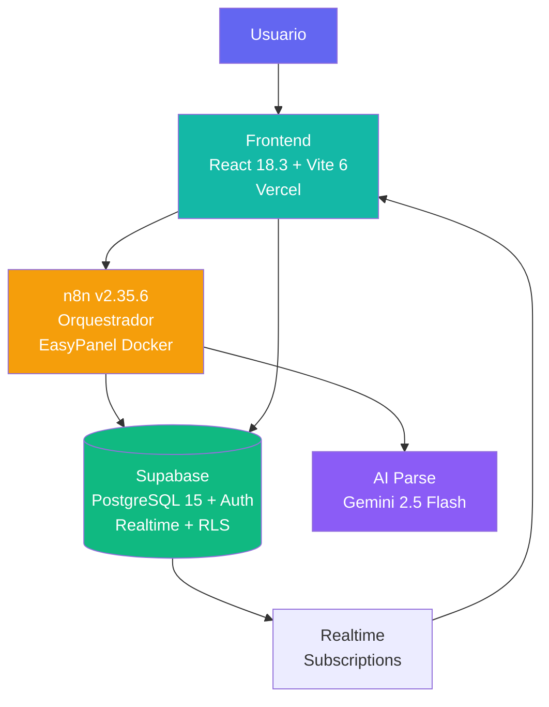

# TEG+ ERP — Mapa da Aplicacao

> Sistema ERP modular para gestao de obras de engenharia eletrica/transmissao.
> **16 modulos operacionais** · 170+ tabelas · 75 migrations · 90+ RPCs · 200+ paginas

---

## Paineis de Gestao

| Painel | Descricao |
|--------|-----------|
| [[Paineis/PAINEL PRINCIPAL\|Painel Principal]] | Central de comando — KPIs, status, alertas |
| [[Paineis/BI Dashboard\|BI Dashboard]] | Visao executiva visual com graficos |
| [[Paineis/Tasks Board\|Tasks Board]] | Kanban de tarefas por status e sprint |
| [[Paineis/Roadmap Board\|Roadmap]] | Timeline de milestones e progresso |
| [[Paineis/Issues Board\|Issues Board]] | Tracker de bugs e problemas |
| [[Paineis/Requisitos Board\|Requisitos]] | Rastreabilidade de requisitos |

### Dashboards por Modulo

| Dashboard | Completude | Status |
|-----------|-----------|--------|
| [[Paineis/Compras Dashboard\|Compras]] | 95% | Operacional |
| [[Paineis/Financeiro Dashboard\|Financeiro]] | 70% | Operacional |
| [[Paineis/Estoque Dashboard\|Estoque]] | 65% | Em evolucao |
| [[Paineis/Logistica Dashboard\|Logistica]] | 85% | Operacional |
| [[Paineis/Frotas Dashboard\|Frotas]] | 85% | Operacional |
| [[Paineis/Cadastros Dashboard\|Cadastros]] | 100% | Operacional |
| Fiscal | 80% | Operacional |
| Controladoria | 75% | Operacional |
| PMO/EGP | 80% | Operacional |
| Obras | 75% | Operacional |
| Contratos | 85% | Operacional |
| Patrimonio | 60% | Em evolucao |
| [[Paineis/RH Dashboard\|RH]] | 15% | Em evolucao |
| Locacao | 40% | NOVO — Abr 2026 |
| SSMA | 10% | Q2-Q3 2026 |
| HHT | 5% | Q3 2026 |

> **Como usar:** edite os arquivos em `Database/Tarefas/`, `Database/Issues/`, `Database/Requisitos/` ou `Database/Milestones/` — os paineis atualizam automaticamente via Dataview.

---

## Documentacao Tecnica

| Area | Nota |
|------|------|
| Visao geral | [[01 - Arquitetura Geral]] |
| Premissas | [[00 - Premissas do Projeto]] |
| Frontend | [[02 - Frontend Stack]] |
| Paginas & Rotas | [[03 - Paginas e Rotas]] |
| Componentes | [[04 - Componentes]] |
| Hooks | [[05 - Hooks Customizados]] |
| Banco de Dados | [[06 - Supabase]] |
| Schema SQL | [[07 - Schema Database]] |
| Migracoes | [[08 - Migracoes SQL]] |
| Autenticacao | [[09 - Auth Sistema]] |
| Automacao | [[10 - n8n Workflows]] |
| Fluxo Requisicao | [[11 - Fluxo Requisicao]] |
| Fluxo Aprovacao | [[12 - Fluxo Aprovacao]] |
| Alcadas | [[13 - Alcadas]] |
| Compradores & Categorias | [[14 - Compradores e Categorias]] |
| Deploy & GitHub | [[15 - Deploy e GitHub]] |
| Variaveis de Ambiente | [[16 - Variaveis de Ambiente]] |
| Roadmap | [[17 - Roadmap]] |
| Glossario | [[18 - Glossario]] |
| Integracao Omie ERP | [[19 - Integracao Omie]] |
| Modulo Financeiro | [[20 - Modulo Financeiro]] |
| Fluxo de Pagamento | [[21 - Fluxo Pagamento]] |
| Modulo Estoque e Patrimonial | [[22 - Modulo Estoque e Patrimonial]] |
| Modulo Logistica | [[23 - Modulo Logistica e Transportes]] |
| Modulo Frotas | [[24 - Modulo Frotas e Manutencao]] |
| Mural de Recados | [[25 - Mural de Recados]] |
| Upload Inteligente Cotacao | [[26 - Upload Inteligente Cotacao]] |
| Modulo Contratos | [[27 - Modulo Contratos Gestao]] |
| Modulo Cadastros AI | [[28 - Modulo Cadastros AI]] |
| Modulo Fiscal | [[29 - Modulo Fiscal]] |
| Modulo Controladoria | [[30 - Modulo Controladoria]] |
| Modulo PMO/EGP | [[31 - Modulo PMO-EGP]] |
| Modulo Obras | [[32 - Modulo Obras]] |
| Modulo SSMA | [[33 - Modulo SSMA]] |
| Modulo Locacao | [[34 - Modulo Locacao]] |

---

## Arquitetura em 3 Camadas

---

## Modulos da Aplicacao (16)

```mermaid
graph LR
    M[TEG+ ERP] --> C[Compras]
    M --> F[Financeiro]
    M --> E[Estoque]
    M --> L[Logistica]
    M --> FR[Frotas]
    M --> R[RH]
    M --> SS[SSMA]
    M --> K[Contratos]
    M --> CAD[Cadastros]
    M --> FIS[Fiscal]
    M --> CTRL[Controladoria]
    M --> PMO[PMO/EGP]
    M --> OBR[Obras]
    M --> PAT[Patrimonio]
    M --> LOC[Locacao]
    M --> HHT[HHT]

    CAD --> CAD1[Fornecedores AI]
    CAD --> CAD2[Itens]
    CAD --> CAD3[Classes Fin.]
    CAD --> CAD4[C. Custo]
    CAD --> CAD5[Obras AI]
    CAD --> CAD6[Colaboradores AI]

    C --> C1[Requisicoes]
    C --> C2[Cotacoes]
    C --> C3[Aprovacoes]
    C --> C4[Pedidos]

    E --> E1[Almoxarifado]
    E --> E2[Inventario]

    PAT --> PAT1[Imobilizados]
    PAT --> PAT2[Depreciacao]

    L --> L1[Solicitacoes]
    L --> L2[Expedicao]
    L --> L3[Transportes]
    L --> L4[Recebimentos]

    FR --> FR1[OS Manutencao]
    FR --> FR2[Checklists]
    FR --> FR3[Telemetria]

    FIS --> FIS1[Pipeline NF]
    FIS --> FIS2[Historico NF]

    CTRL --> CTRL1[DRE]
    CTRL --> CTRL2[KPIs]
    CTRL --> CTRL3[Orcamentos]
    CTRL --> CTRL4[Alertas]

    PMO --> PMO1[Portfolio]
    PMO --> PMO2[EAP/TAP]
    PMO --> PMO3[Cronograma]
    PMO --> PMO4[Medicoes]

    OBR --> OBR1[Apontamentos]
    OBR --> OBR2[RDO]
    OBR --> OBR3[Adiantamentos]

    LOC --> LOC1[Contratos Locacao]
    LOC --> LOC2[Equipamentos]
    LOC --> LOC3[Medicoes]

    style C  fill:#10B981,color:#fff
    style F  fill:#10B981,color:#fff
    style E  fill:#3B82F6,color:#fff
    style L  fill:#EA580C,color:#fff
    style FR fill:#F43F5E,color:#fff
    style R  fill:#64748B,color:#fff
    style SS fill:#64748B,color:#fff
    style K  fill:#8B5CF6,color:#fff
    style CAD fill:#8B5CF6,color:#fff
    style FIS fill:#F59E0B,color:#fff
    style CTRL fill:#14B8A6,color:#fff
    style PMO fill:#6366F1,color:#fff
    style OBR fill:#059669,color:#fff
    style PAT fill:#3B82F6,color:#fff
    style LOC fill:#D97706,color:#fff
    style HHT fill:#64748B,color:#fff
```

---

## Status do Projeto

| Funcionalidade | Status | Notas |
|---|---|---|
| Portal de Requisicoes | Entregue | 3-step wizard + AI |
| Aprovacoes multi-nivel | Entregue | 4 alcadas, token-based |
| AprovAi (mobile) | Entregue | Interface responsiva, multi-tipo |
| Dashboard KPIs | Entregue | RPC + realtime |
| Schema Supabase | Entregue | 75 migrations, 170+ tabelas |
| AI Parse requisicoes | Entregue | Keywords + n8n |
| Cotacoes | Entregue | Regras de alcada + bypass sem minimo + recomendacao AI |
| PO — PDF e Compartilhamento | Entregue | Sem deps externas, WhatsApp + E-mail |
| Fluxo Pagamento (Compras->Fin) | Entregue | Triggers, anexos, comprovante |
| Financeiro (Omie ERP) | Entregue | CP, CR, Fornecedores, 4 squads n8n |
| Estoque e Patrimonial | Entregue | Almoxarifado, inventario, imobilizados, depreciacao |
| Logistica e Transportes | Entregue | 9 etapas, NF-e, rastreamento, avaliacoes |
| Frotas e Manutencao | Entregue | OS, checklist, abastecimento, telemetria |
| Mural de Recados | Entregue | Slideshow corporativo + gestao admin RH |
| Contratos v2 | Entregue | Fluxo 7 etapas, solicitacoes, minutas AI, analise juridica, PDF, AprovAi |
| AprovAi Multi-tipo | Entregue | 4 tipos: Compras, Pagamentos, Minutas Contratuais, Validacao Tec. Requisicao |
| ApprovalBadge (Header) | Entregue | Badge com contador de pendencias no header global |
| Cadastros AI (Master Data) | Entregue | 6 entidades, MagicModal AI/Manual, CNPJ/CPF lookup, em todos os modulos |
| Fiscal — Emissao NF | Entregue | Pipeline Kanban + historico NFs + Painel Fiscal |
| Controladoria — BI | Entregue | DRE, orcamentos, KPIs, cenarios, plano/controle orcamentario, alertas |
| PMO/EGP | Entregue | Portfolio, TAP, EAP, cronograma, medicoes, histograma, custos, reunioes |
| Obras | Entregue | Apontamentos, RDO, adiantamentos, prestacao de contas, planejamento de equipe |
| RBAC v2 | Entregue | sys_perfil_setores, roles por setor, permissoes granulares |
| Cotacao Recomendacao AI | Entregue | Motor de recomendacao para cotacoes |
| Locacao | Em desenvolvimento | Contratos de locacao, equipamentos, medicoes — NOVO Abr 2026 |
| SSMA (stub) | Entregue | Tela de roadmap com funcionalidades planejadas Q2-Q4 2026 |
| RH Completo | Em andamento | Headcount, cultura, endomarketing |
| SSMA — Modulo Completo | Q2-Q4 2026 | Ocorrencias, EPIs, checklists, treinamentos NR, auditorias |
| HHT — Modulo | Q3 2026 | Horas de trabalho e apontamentos |

---

## Obras Ativas (6)

- SE Frutal
- SE Paracatu
- SE Perdizes
- SE Tres Marias
- SE Rio Paranaiba
- SE Ituiutaba

---

*Vault gerado em 2026-03-02 a partir do codigo-fonte. Ultima atualizacao: 2026-04-07.*
