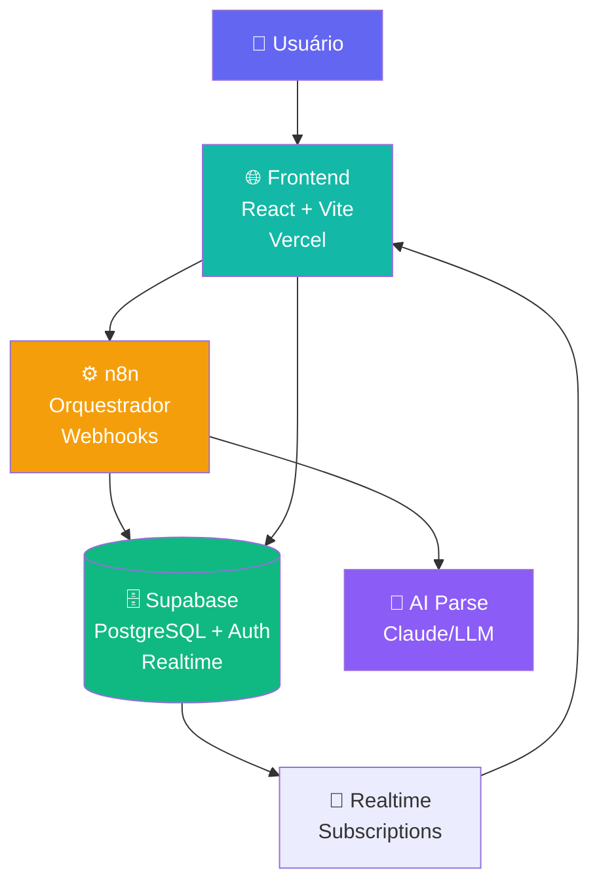
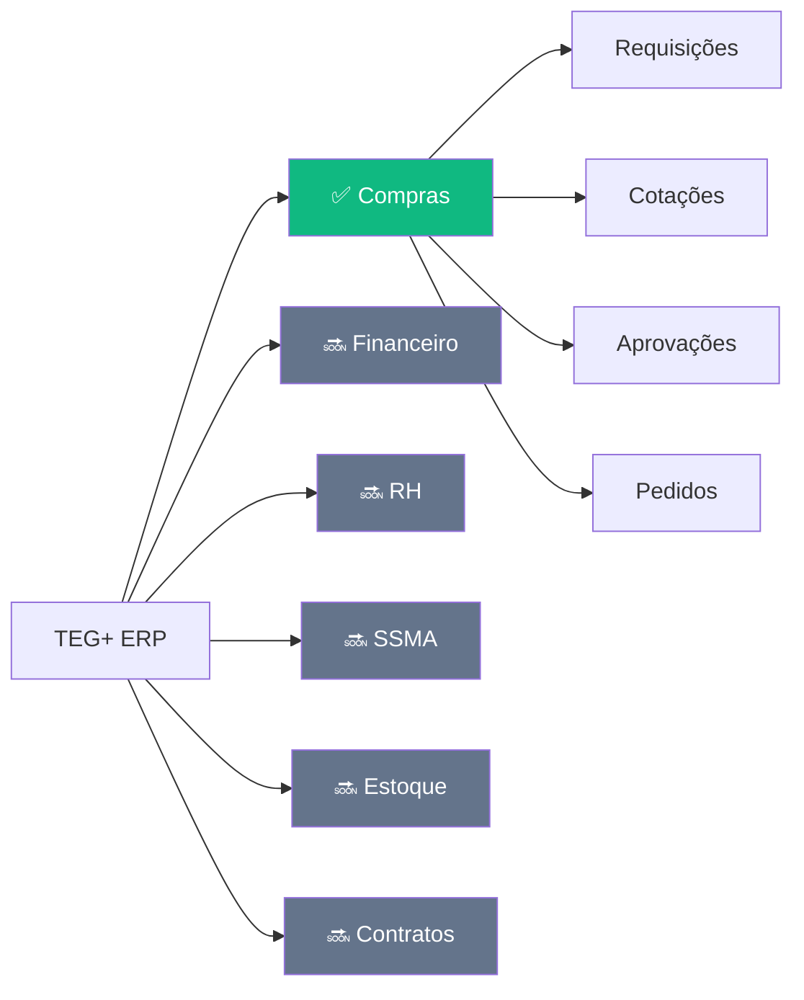

# TEG+ ERP — Mapa da Aplicação

> Sistema ERP modular para gestão de obras de engenharia elétrica/transmissão.
> Foco atual: **Módulo de Compras** com fluxo completo de requisições e aprovações.

---

## Navegação Rápida

| Área | Nota |
|------|------|
| Visão geral | [[01 - Arquitetura Geral]] |
| Frontend | [[02 - Frontend Stack]] |
| Páginas & Rotas | [[03 - Páginas e Rotas]] |
| Componentes | [[04 - Componentes]] |
| Hooks | [[05 - Hooks Customizados]] |
| Banco de Dados | [[06 - Supabase]] |
| Schema SQL | [[07 - Schema Database]] |
| Migrações | [[08 - Migrações SQL]] |
| Autenticação | [[09 - Auth Sistema]] |
| Automação | [[10 - n8n Workflows]] |
| Fluxo Requisição | [[11 - Fluxo Requisição]] |
| Fluxo Aprovação | [[12 - Fluxo Aprovação]] |
| Alçadas | [[13 - Alçadas]] |
| Compradores & Categorias | [[14 - Compradores e Categorias]] |
| Deploy & GitHub | [[15 - Deploy e GitHub]] |
| Variáveis de Ambiente | [[16 - Variáveis de Ambiente]] |
| Roadmap | [[17 - Roadmap]] |
| Glossário | [[18 - Glossário]] |

---

## Arquitetura em 3 Camadas

---

## Módulos da Aplicação

---

## Status do Projeto

| Funcionalidade | Status | Notas |
|---|---|---|
| Portal de Requisições | ✅ Entregue | 3-step wizard + AI |
| Aprovações multi-nível | ✅ Entregue | 4 alçadas, token-based |
| ApprovaAi (mobile) | ✅ Entregue | Interface responsiva |
| Dashboard KPIs | ✅ Entregue | RPC + realtime |
| Schema Supabase | ✅ Entregue | 11 migrations |
| AI Parse requisições | ✅ Entregue | Keywords + n8n |
| Cotações | 🔄 Parcial | UI básica, sem n8n completo |
| WhatsApp (Evolution API) | 🔜 Planejado | Notificações |
| Financeiro (Omie ERP) | 🔜 Planejado | NF-e, Contas a Pagar |
| AI TEG+ (Claude API) | 🔜 Planejado | Agente conversacional |
| Monday.com PMO | 🔜 Planejado | Gestão de portfólio |

---

## Obras Ativas (6)

- SE Frutal
- SE Paracatu
- SE Perdizes
- SE Três Marias
- SE Rio Paranaíba
- SE Ituiutaba

---

*Vault gerado automaticamente em 2026-03-02 a partir do código-fonte.*
