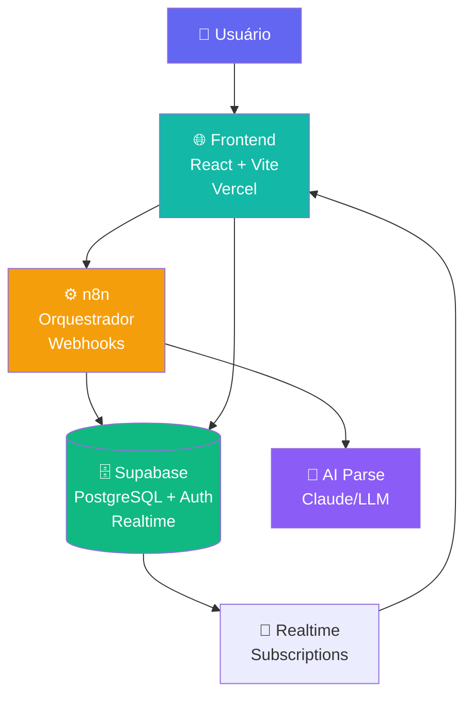
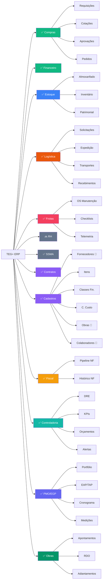

# TEG+ ERP — Mapa da Aplicação

> Sistema ERP modular para gestão de obras de engenharia elétrica/transmissão.
> **13 módulos operacionais** · 1 em planejamento (RH) · 14 milestones · 30 tarefas

---

## 🏠 Painéis de Gestão

| Painel | Descrição |
|--------|-----------|
| [[Paineis/PAINEL PRINCIPAL\|🏠 Painel Principal]] | Central de comando — KPIs, status, alertas |
| [[Paineis/BI Dashboard\|📊 BI Dashboard]] | Visão executiva visual com gráficos |
| [[Paineis/Tasks Board\|📋 Tasks Board]] | Kanban de tarefas por status e sprint |
| [[Paineis/Roadmap Board\|🗺️ Roadmap]] | Timeline de milestones e progresso |
| [[Paineis/Issues Board\|🐛 Issues Board]] | Tracker de bugs e problemas |
| [[Paineis/Requisitos Board\|📦 Requisitos]] | Rastreabilidade de requisitos |

### Dashboards por Módulo

| Dashboard | Completude | Status |
|-----------|-----------|--------|
| [[Paineis/Compras Dashboard\|🛒 Compras]] | 95% | ✅ Operacional |
| [[Paineis/Financeiro Dashboard\|💰 Financeiro]] | 65% | 🔵 Em evolução |
| [[Paineis/Estoque Dashboard\|📦 Estoque]] | 60% | 🔵 Em evolução |
| [[Paineis/Logistica Dashboard\|🚚 Logística]] | 85% | ✅ Operacional |
| [[Paineis/Frotas Dashboard\|🚛 Frotas]] | 80% | ✅ Operacional |
| [[Paineis/RH Dashboard\|👥 RH]] | 5% | 🔜 Q2 2026 |
| [[Paineis/Cadastros Dashboard\|⚙️ Cadastros]] | 100% | ✅ Operacional |
| Fiscal | 80% | ✅ Operacional |
| Controladoria | 70% | ✅ Operacional |
| PMO/EGP | 75% | ✅ Operacional |
| Obras | 70% | ✅ Operacional |
| SSMA | 10% | 🔜 Q2-Q3 2026 |

> **Como usar:** edite os arquivos em `Database/Tarefas/`, `Database/Issues/`, `Database/Requisitos/` ou `Database/Milestones/` — os painéis atualizam automaticamente via Dataview.

---

## 📖 Documentação Técnica

| Área | Nota |
|------|------|
| Visão geral | [[01 - Arquitetura Geral]] |
| Frontend | [[02 - Frontend Stack]] |
| Páginas & Rotas | [[03 - Páginas e Rotas]] |
| Componentes | [[04 - Componentes]] |
| Hooks | [[05 - Hooks Customizados]] |
| Banco de Dados | [[06 - Supabase]] |
| Schema SQL | [[07 - Schema Database]] |
| Migrações | [[08 - Migrações SQL]] |
| Autenticação | [[09 - Auth Sistema]] |
| Automação | [[10 - n8n Workflows]] |
| Fluxo Requisição | [[11 - Fluxo Requisição]] |
| Fluxo Aprovação | [[12 - Fluxo Aprovação]] |
| Alçadas | [[13 - Alçadas]] |
| Compradores & Categorias | [[14 - Compradores e Categorias]] |
| Deploy & GitHub | [[15 - Deploy e GitHub]] |
| Variáveis de Ambiente | [[16 - Variáveis de Ambiente]] |
| Roadmap | [[17 - Roadmap]] |
| Glossário | [[18 - Glossário]] |
| Integração Omie ERP | [[19 - Integração Omie]] |
| Módulo Financeiro | [[20 - Módulo Financeiro]] |
| Fluxo de Pagamento | [[21 - Fluxo Pagamento]] |
| Módulo Estoque e Patrimonial | [[22 - Módulo Estoque e Patrimonial]] |
| Módulo Logística | [[23 - Módulo Logística e Transportes]] |
| Módulo Frotas | [[24 - Módulo Frotas e Manutenção]] |
| Mural de Recados | [[25 - Mural de Recados]] |
| Upload Inteligente Cotação | [[26 - Upload Inteligente Cotacao]] |
| Módulo Contratos | [[27 - Módulo Contratos Gestão]] |
| Módulo Cadastros AI | [[28 - Módulo Cadastros AI]] |
| Módulo Fiscal | [[29 - Módulo Fiscal]] |
| Módulo Controladoria | [[30 - Módulo Controladoria]] |
| Módulo PMO/EGP | [[31 - Módulo PMO-EGP]] |
| Módulo Obras | [[32 - Módulo Obras]] |
| Módulo SSMA | [[33 - Módulo SSMA]] |

---

## Arquitetura em 3 Camadas

---

## Módulos da Aplicação

---

## Status do Projeto

| Funcionalidade | Status | Notas |
|---|---|---|
| Portal de Requisições | ✅ Entregue | 3-step wizard + AI |
| Aprovações multi-nível | ✅ Entregue | 4 alçadas, token-based |
| ApprovaAi (mobile) | ✅ Entregue | Interface responsiva |
| Dashboard KPIs | ✅ Entregue | RPC + realtime |
| Schema Supabase | ✅ Entregue | 25 migrations |
| AI Parse requisições | ✅ Entregue | Keywords + n8n |
| Cotações | ✅ Entregue | Regras de alçada + bypass sem mínimo |
| PO — PDF e Compartilhamento | ✅ Entregue | Sem deps externas, WhatsApp + E-mail |
| Fluxo Pagamento (Compras→Fin) | ✅ Entregue | Triggers, anexos, comprovante |
| Financeiro (Omie ERP) | ✅ Entregue | CP, CR, Fornecedores, 4 squads n8n |
| Estoque e Patrimonial | ✅ Entregue | Almoxarifado, inventário, imobilizados, depreciação |
| Logística e Transportes | ✅ Entregue | 9 etapas, NF-e, rastreamento, avaliações |
| Frotas e Manutenção | ✅ Entregue | OS, checklist, abastecimento, telemetria |
| Mural de Recados | ✅ Entregue | Slideshow corporativo + gestão admin RH |
| Contratos v2 | ✅ Entregue | Fluxo 7 etapas, solicitacoes, minutas AI, analise juridica, PDF, AprovAi |
| AprovAi Multi-tipo | ✅ Entregue | 4 tipos: Compras, Pagamentos, Minutas Contratuais, Validacao Tec. Requisicao |
| ApprovalBadge (Header) | ✅ Entregue | Badge com contador de pendencias no header global |
| Cadastros AI (Master Data) | ✅ Entregue | 6 entidades, MagicModal AI/Manual, CNPJ/CPF lookup, em todos os modulos |
| Fiscal — Emissão NF | ✅ Entregue | Pipeline Kanban + histórico NFs + Painel Fiscal |
| Controladoria — BI | ✅ Entregue | DRE, orçamentos, KPIs, cenários, plano/controle orçamentário, alertas |
| PMO/EGP | ✅ Entregue | Portfólio, TAP, EAP, cronograma, medições, histograma, custos, reuniões |
| Obras | ✅ Entregue | Apontamentos, RDO, adiantamentos, prestação de contas, planejamento de equipe |
| SSMA (stub) | ✅ Entregue | Tela de roadmap com funcionalidades planejadas Q2-Q4 2026 |
| WhatsApp (Evolution API) | 🔜 Q1 2026 | Notificações automáticas |
| RH Completo | 🔜 Q2 2026 | Colaboradores, ponto, folha, eSocial |
| AI TEG+ (Claude API) | 🔜 Q2-Q3 2026 | Agente conversacional + RAG |
| SSMA — Módulo Completo | 🔜 Q2-Q4 2026 | Ocorrências, EPIs, checklists, treinamentos NR, auditorias |
| Monday.com PMO | 🔜 Q4 2026 | Gestão de portfólio das 6 obras |

---

## Obras Ativas (6)

- SE Frutal
- SE Paracatu
- SE Perdizes
- SE Três Marias
- SE Rio Paranaíba
- SE Ituiutaba

---

*Vault gerado em 2026-03-02 a partir do codigo-fonte. Ultima atualizacao: 2026-03-12.*
