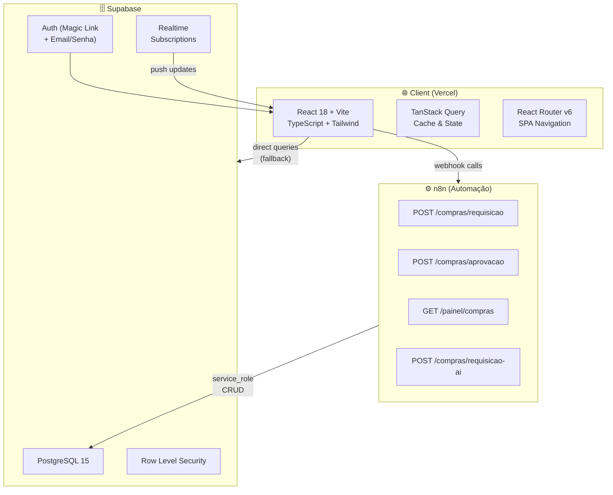

# Arquitetura Geral — TEG+ ERP

## Visão de Alto Nível



---

## Stack Tecnológica

| Camada | Tecnologia | Versão | Responsabilidade |
|--------|-----------|--------|-----------------|
| **Frontend** | React | 18.3 | UI framework |
| **Frontend** | Vite | 6.0 | Build & dev server |
| **Frontend** | TypeScript | 5.6 | Tipagem estática |
| **Frontend** | Tailwind CSS | 3.4 | Design system |
| **Frontend** | React Router | 6.28 | Roteamento SPA |
| **Frontend** | TanStack Query | 5.60 | Fetching & cache |
| **Backend/DB** | Supabase | 2.45 | BaaS (DB + Auth + Realtime) |
| **Automação** | n8n | — | Orquestração de workflows |
| **Deploy** | Vercel | — | Hosting + CDN |
| **AI** | LLM (n8n) | — | Parse de requisições |

---

## Estrutura de Diretórios

```
/teg-plus/
├── frontend/
│   ├── src/
│   │   ├── components/      → [[04 - Componentes]]
│   │   ├── contexts/        → AuthContext.tsx
│   │   ├── hooks/           → [[05 - Hooks Customizados]]
│   │   ├── pages/           → [[03 - Páginas e Rotas]]
│   │   ├── services/
│   │   │   ├── api.ts       → Cliente n8n webhooks
│   │   │   └── supabase.ts  → Cliente Supabase
│   │   ├── types/
│   │   │   └── index.ts     → Tipos TypeScript
│   │   ├── App.tsx          → Router principal
│   │   └── main.tsx         → Entry point
│   ├── package.json
│   ├── vite.config.ts
│   ├── tailwind.config.js
│   └── tsconfig.json
├── supabase/
│   └── migrations/          → [[08 - Migrações SQL]]
├── n8n-docs/                 → [[10 - n8n Workflows]]
├── docs/obsidian/            → Este vault
└── vercel.json               → [[15 - Deploy e GitHub]]
```

---

## Padrões de Comunicação

### Frontend → n8n → Supabase (fluxo primário)
```
React Component
  └─→ services/api.ts (axios/fetch)
        └─→ n8n Webhook
              ├─→ Validação
              ├─→ Lógica de negócio
              └─→ Supabase (service_role)
```

### Frontend → Supabase (fallback direto)
```
React Component
  └─→ TanStack Query hook
        └─→ supabase.ts client (anon key)
              └─→ Supabase RLS policies
```

### Realtime (push de atualizações)
```
Supabase DB change
  └─→ Realtime channel
        └─→ TanStack Query invalidation
              └─→ React re-render
```

---

## Princípios Arquiteturais

1. **n8n como hub** — toda lógica de negócio complexa passa pelo n8n
2. **Fallback direto** — se n8n indisponível, Supabase aceita direto
3. **RLS por padrão** — todas as tabelas têm Row Level Security
4. **Cache agressivo** — TanStack Query com stale time configurado
5. **Token-based approvals** — aprovadores externos via link único
6. **Modular** — cada módulo futuro terá prefixo de tabela próprio

---

## Links Relacionados

- [[02 - Frontend Stack]] — Detalhes do frontend
- [[06 - Supabase]] — Banco de dados e auth
- [[10 - n8n Workflows]] — Automações e webhooks
- [[15 - Deploy e GitHub]] — Infraestrutura de deploy
- [[16 - Variáveis de Ambiente]] — Configuração
