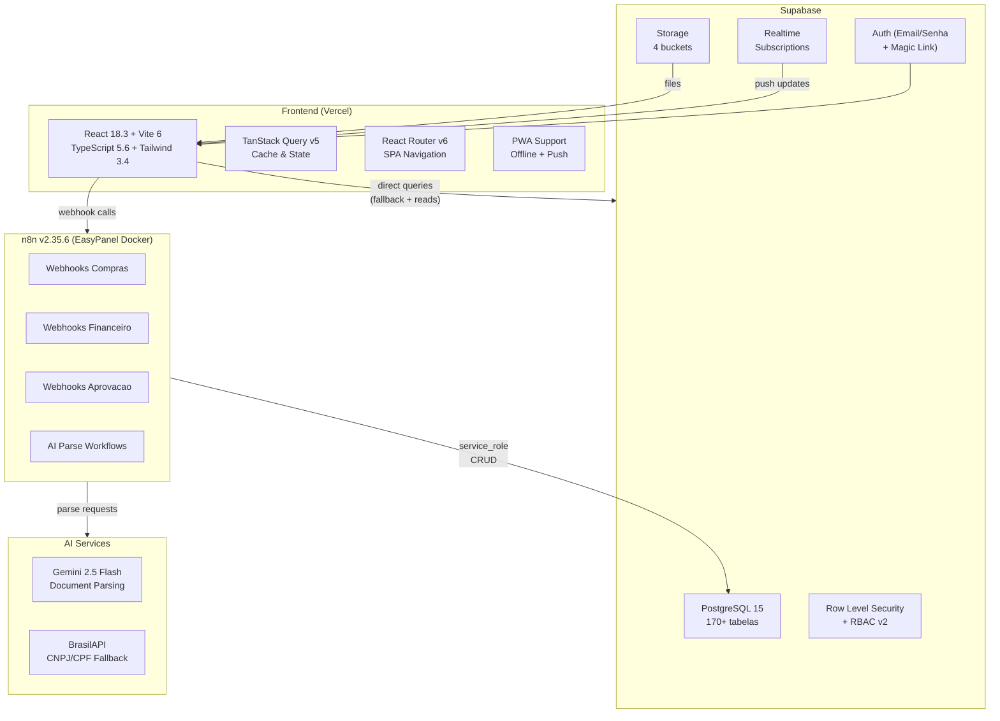

# Arquitetura Geral — TEG+ ERP

## Visao de Alto Nivel



---

## Stack Tecnologica

| Camada | Tecnologia | Versao | Responsabilidade |
|--------|-----------|--------|-----------------|
| **Frontend** | React | 18.3 | UI framework |
| **Frontend** | Vite | 6.0 | Build & dev server |
| **Frontend** | TypeScript | 5.6 | Tipagem estatica |
| **Frontend** | Tailwind CSS | 3.4 | Design system |
| **Frontend** | React Router | 6.28 | Roteamento SPA |
| **Frontend** | TanStack Query | 5.60 | Fetching & cache |
| **Backend/DB** | Supabase | 2.45 | BaaS (DB + Auth + Realtime + Storage) |
| **Automacao** | n8n | 2.35.6 | Orquestracao de workflows (EasyPanel Docker) |
| **Deploy** | Vercel | — | Hosting + CDN (auto-deploy on main push) |
| **AI Parse** | Gemini 2.5 Flash | — | Parsing de documentos e cotacoes |
| **AI Cadastro** | BrasilAPI | — | CNPJ/CPF lookup fallback |

---

## Estrutura de Diretorios

```
/teg-plus/
├── frontend/
│   ├── src/
│   │   ├── components/      → [[04 - Componentes]] (60+ compartilhados)
│   │   ├── contexts/        → AuthContext, ThemeContext, etc.
│   │   ├── hooks/           → [[05 - Hooks Customizados]] (47 hooks)
│   │   ├── pages/           → [[03 - Páginas e Rotas]] (200+ paginas, 16 modulos)
│   │   ├── layouts/         → 18 module layouts (lazy-loaded)
│   │   ├── services/
│   │   │   ├── api.ts       → Cliente n8n webhooks
│   │   │   └── supabase.ts  → Cliente Supabase
│   │   ├── types/           → 30+ arquivos de tipos (4.551 linhas)
│   │   ├── utils/           → 16 utility files
│   │   ├── App.tsx          → Router principal
│   │   ├── main.tsx         → Entry point principal
│   │   └── aprovaai-main.tsx → Entry point AprovAi (bundle separado)
│   ├── package.json
│   ├── vite.config.ts
│   ├── tailwind.config.js
│   └── tsconfig.json
├── supabase/
│   └── migrations/          → [[08 - Migrações SQL]] (75 migrations)
├── n8n-docs/                 → [[10 - n8n Workflows]]
├── docs/obsidian/            → Este vault
└── vercel.json               → [[15 - Deploy e GitHub]]
```

---

## Prefixos de Tabelas por Modulo (18)

| Prefixo | Modulo | Exemplos |
|---------|--------|----------|
| `sys_` | Sistema | sys_perfil_setores, sys_roles, sys_role_permissoes, sys_obras |
| `cmp_` | Compras | cmp_requisicoes, cmp_itens_requisicao, cmp_pedidos |
| `fin_` | Financeiro | fin_contas_pagar, fin_contas_receber |
| `con_` | Contratos | con_contratos, con_medicoes, con_aditivos |
| `ctrl_` | Controladoria | ctrl_orcamentos, ctrl_dre, ctrl_kpis |
| `log_` | Logistica | log_transportes, log_recebimentos |
| `est_` | Estoque | est_itens, est_movimentacoes |
| `pat_` | Patrimonio | pat_imobilizados, pat_depreciacao |
| `fro_` | Frotas | fro_veiculos, fro_ordens_servico |
| `obr_` | Obras | obr_apontamentos, obr_rdo |
| `pmo_` | PMO/EGP | pmo_portfolios, pmo_eap, pmo_cronograma |
| `rh_` | RH | rh_colaboradores, rh_mural |
| `ssm_` | SSMA | ssm_ocorrencias |
| `fis_` | Fiscal | fis_notas_fiscais, fis_solicitacoes_nf |
| `egp_` | EGP | egp_tap, egp_reunioes |
| `loc_` | Locacao | loc_contratos, loc_equipamentos |
| `apr_` | Aprovacoes | apr_aprovacoes, apr_alcadas |
| `cot_` | Cotacoes | cot_cotacoes, cot_itens_cotacao |

---

## Padroes de Comunicacao

### Frontend -> n8n -> Supabase (fluxo primario)
```
React Component
  └-> services/api.ts (fetch)
        └-> n8n Webhook
              ├-> Validacao
              ├-> Logica de negocio
              ├-> AI Parse (Gemini 2.5 Flash)
              └-> Supabase (service_role)
```

### Frontend -> Supabase (fallback direto / leituras)
```
React Component
  └-> TanStack Query hook
        └-> supabase.ts client (anon key)
              └-> Supabase RLS policies + RBAC v2
```

### Realtime (push de atualizacoes)
```
Supabase DB change
  └-> Realtime channel
        └-> TanStack Query invalidation
              └-> React re-render
```

---

## RBAC v2 — Controle de Acesso

O sistema utiliza RBAC v2 baseado em setores:

| Tabela | Funcao |
|--------|--------|
| `sys_perfil_setores` | Vincula usuario a setor(es) com role |
| `sys_roles` | Define roles disponiveis (admin, gestor, operador, viewer, etc.) |
| `sys_role_permissoes` | Mapeia permissoes granulares por role e modulo |

Cada modulo verifica permissoes via hook `usePermissions()` que consulta o perfil do usuario logado contra as tabelas de RBAC.

---

## Principios Arquiteturais

1. **n8n como hub** — toda logica de negocio complexa passa pelo n8n
2. **Fallback direto** — se n8n indisponivel, Supabase aceita direto
3. **RLS por padrao** — todas as tabelas tem Row Level Security
4. **RBAC v2** — controle de acesso granular por setor e modulo
5. **Cache agressivo** — TanStack Query com stale time configurado
6. **Token-based approvals** — aprovadores externos via link unico
7. **Modular** — cada modulo tem prefixo de tabela proprio (18 prefixos)
8. **Code splitting** — React.lazy + Suspense com 3 tipos de skeleton
9. **PWA-ready** — install prompt, offline banner, push notifications
10. **AI-enhanced** — Gemini 2.5 Flash para parsing, BrasilAPI para cadastros

---

## Links Relacionados

- [[02 - Frontend Stack]] — Detalhes do frontend
- [[06 - Supabase]] — Banco de dados e auth
- [[10 - n8n Workflows]] — Automacoes e webhooks
- [[15 - Deploy e GitHub]] — Infraestrutura de deploy
- [[16 - Variáveis de Ambiente]] — Configuracao
