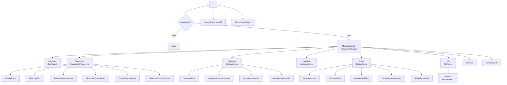

# Páginas e Rotas — TEG+ ERP

## Mapa de Rotas (`App.tsx`)



---

## Rotas Públicas (sem autenticação)

| Rota | Componente | Descrição |
|------|-----------|-----------|
| `/login` | `Login.tsx` | Email/senha ou magic link |
| `/nova-senha` | — | Reset de senha |
| `/aprovacao/:token` | `Aprovacao.tsx` | Aprovação via link externo |
| `/aprovaai` | `AprovAi.tsx` | Interface mobile ApprovaAi |

---

## Rotas Privadas (requerem auth)

### Módulo Seletor

| Rota | Componente | Descrição |
|------|-----------|-----------|
| `/` | `ModuloSelector.tsx` | Dashboard + **BannerSlideshow** entre saudação e grade de módulos |

### Módulo RH (com `RHLayout` — violet)

| Rota | Componente | Acesso |
|------|-----------|--------|
| `/rh` | `RHHome.tsx` | Todos autenticados |
| `/rh/mural` | `MuralAdmin.tsx` | **Admin only** — gestão de banners |

> O módulo RH aparece como `active: false` para usuários comuns ("Em breve"). Admins veem o card habilitado com badge "Admin" e acesso direto ao Mural.

### Módulo Financeiro (com `FinanceiroLayout`)

| Rota | Componente | Descrição |
|------|-----------|-----------|
| `/financeiro` | `DashboardFinanceiro.tsx` | KPIs, pipeline, vencimentos, centro de custo |
| `/financeiro/cp` | `ContasPagar.tsx` | Lista CP, filtros por status |
| `/financeiro/cr` | `ContasReceber.tsx` | Lista CR, vencidos |
| `/financeiro/aprovacoes` | `AprovacoesPagamento.tsx` | Fila aprovação Diretoria |
| `/financeiro/conciliacao` | `Conciliacao.tsx` | Remessa CNAB, retorno |
| `/financeiro/relatorios` | `Relatorios.tsx` | DRE, Fluxo de Caixa, Aging |
| `/financeiro/fornecedores` | `Fornecedores.tsx` | Cadastro, dados bancários, Omie |
| `/financeiro/configuracoes` | `Configuracoes.tsx` | Config do módulo |

### Módulo Estoque (com `EstoqueLayout`)

| Rota | Componente | Descrição |
|------|-----------|-----------|
| `/estoque` | `EstoqueHome.tsx` | Dashboard de estoque |
| `/estoque/itens` | `Itens.tsx` | Catálogo de itens |
| `/estoque/movimentacoes` | `Movimentacoes.tsx` | Entradas e saídas |
| `/estoque/inventario` | `Inventario.tsx` | Inventário físico |
| `/estoque/patrimonial` | `Patrimonial.tsx` | Imobilizados e depreciação |

### Módulo Logística (com `LogisticaLayout`)

| Rota | Componente | Descrição |
|------|-----------|-----------|
| `/logistica` | `LogisticaHome.tsx` | Painel de transportes |
| `/logistica/transportes` | `Transportes.tsx` | Solicitações de transporte |
| `/logistica/recebimentos` | `Recebimentos.tsx` | Recebimento de materiais |
| `/logistica/expedicao` | `Expedicao.tsx` | Expedição e entregas |
| `/logistica/solicitacoes` | `Solicitacoes.tsx` | Fila de solicitações |
| `/logistica/transportadoras` | `Transportadoras.tsx` | Cadastro de transportadoras |

### Módulo Frotas (com `FrotasLayout`)

| Rota | Componente | Descrição |
|------|-----------|-----------|
| `/frotas` | `FrotasHome.tsx` | Dashboard de frotas |
| `/frotas/veiculos` | `Veiculos.tsx` | Cadastro de veículos |
| `/frotas/ordens` | `Ordens.tsx` | Ordens de serviço |
| `/frotas/checklists` | `Checklists.tsx` | Checklists de inspeção |
| `/frotas/abastecimentos` | `Abastecimentos.tsx` | Controle de combustível |
| `/frotas/telemetria` | `Telemetria.tsx` | KPIs e rastreamento |

### Módulo Compras (com `Layout`)

| Rota | Componente | Descrição |
|------|-----------|-----------|
| `/compras` | `Dashboard.tsx` | KPIs, pipeline, analytics |
| `/nova` | `NovaRequisicao.tsx` | Wizard 3 etapas + AI |
| `/requisicoes` | `ListaRequisicoes.tsx` | Lista com filtros |
| `/cotacoes` | `FilaCotacoes.tsx` | Fila de cotações |
| `/cotacoes/:id` | `CotacaoForm.tsx` | Formulário de cotação |
| `/pedidos` | `Pedidos.tsx` | Ordens de compra |
| `/perfil` | `Perfil.tsx` | Perfil e preferências |

### Módulos Stub (em desenvolvimento)

| Rota | Status |
|------|--------|
| `/ssma` | 🔜 Planejado |
| `/contratos` | 🔜 Planejado |

### Admin

| Rota | Componente | Acesso |
|------|-----------|--------|
| `/admin/usuarios` | `AdminUsuarios.tsx` | Admin only |

---

## Guards de Rota

```tsx
// PrivateRoute — redireciona para /login se não autenticado
<PrivateRoute>
  <Dashboard />
</PrivateRoute>

// AdminRoute — redireciona para /compras se não for admin
<AdminRoute>
  <AdminUsuarios />
</AdminRoute>

// MuralAdmin — verificação inline via isAdmin do AuthContext
// Exibe "Acesso restrito" se não for admin (não redireciona)
```

---

## BannerSlideshow na Tela Inicial

O `ModuloSelector.tsx` renderiza o componente `BannerSlideshow` **entre** o hero de saudação e a grade de módulos:

```
[Header]
  ↓
[Hero: logo + TEG+ + saudação personalizada]
  ↓
[BannerSlideshow]   ← banners do mural (auto-advance 5.5s, Ken Burns)
  ↓
[Grade de Módulos: 2×4 grid responsivo]
```

Sem banners no banco, exibe 3 slides padrão. Gerenciado em `/rh/mural`. Ver [[25 - Mural de Recados]].

---

## Links Relacionados

- [[02 - Frontend Stack]] — Stack e configuração
- [[04 - Componentes]] — Layouts e componentes
- [[05 - Hooks Customizados]] — Hooks de dados
- [[09 - Auth Sistema]] — Autenticação e guards
- [[25 - Mural de Recados]] — Slideshow e gestão de banners
