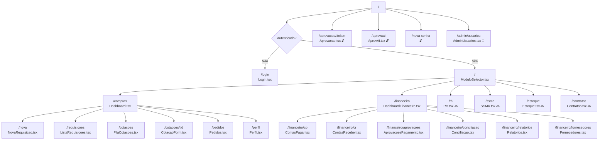

# Páginas e Rotas — TEG+ ERP

## Mapa de Rotas (`App.tsx`)



---

## Rotas Públicas (sem autenticação)

| Rota | Componente | Descrição |
|------|-----------|-----------|
| `/login` | `Login.tsx` | Email/senha ou magic link |
| `/nova-senha` | — | Reset de senha |
| `/aprovacao/:token` | `Aprovacao.tsx` | Aprovação via link externo |
| `/aprovaai` | `AprovAi.tsx` | Interface mobile ApprovaAi |

---

## Rotas Privadas (requerem auth)

### Módulo Seletor
| Rota | Componente | Descrição |
|------|-----------|-----------|
| `/` | `ModuloSelector.tsx` | Dashboard de seleção de módulos |

### Módulo Financeiro (com FinanceiroLayout/Sidebar)
| Rota | Componente | Descrição |
|------|-----------|-----------|
| `/financeiro` | `DashboardFinanceiro.tsx` | KPIs, pipeline, vencimentos, centro de custo |
| `/financeiro/cp` | `ContasPagar.tsx` | Lista CP, filtros por status, busca |
| `/financeiro/cr` | `ContasReceber.tsx` | Lista CR, filtros, vencidos |
| `/financeiro/aprovacoes` | `AprovacoesPagamento.tsx` | Fila aprovação Diretoria, aprovar/rejeitar |
| `/financeiro/conciliacao` | `Conciliacao.tsx` | Remessa CNAB, retorno, conciliação |
| `/financeiro/relatorios` | `Relatorios.tsx` | DRE, Fluxo de Caixa, CC, Aging |
| `/financeiro/fornecedores` | `Fornecedores.tsx` | Cadastro, dados bancários, Omie |

### Módulos Stub (UI pronta, lógica pendente)
| Rota | Componente | Status |
|------|-----------|--------|
| `/rh` | `RH.tsx` | 🔜 Stub |
| `/ssma` | `SSMA.tsx` | 🔜 Stub |
| `/estoque` | `Estoque.tsx` | 🔜 Stub |
| `/contratos` | `Contratos.tsx` | 🔜 Stub |

### Módulo Compras (com Layout/Sidebar)
| Rota | Componente | Descrição |
|------|-----------|-----------|
| `/compras` | `Dashboard.tsx` | KPIs, pipeline, analytics |
| `/nova` | `NovaRequisicao.tsx` | Wizard 3 etapas + AI |
| `/requisicoes` | `ListaRequisicoes.tsx` | Lista com filtros |
| `/cotacoes` | `FilaCotacoes.tsx` | Fila de cotações |
| `/cotacoes/:id` | `CotacaoForm.tsx` | Formulário de cotação |
| `/pedidos` | `Pedidos.tsx` | Ordens de compra |
| `/perfil` | `Perfil.tsx` | Perfil e preferências |

### Admin (requer role admin)
| Rota | Componente | Descrição |
|------|-----------|-----------|
| `/admin/usuarios` | `AdminUsuarios.tsx` | Gestão de usuários |

---

## Detalhamento por Página

### `Dashboard.tsx` — `/compras`
- KPIs em tempo real (total, pendentes, aprovadas, valor)
- Pipeline visual de requisições por status
- Gráfico por obra
- Últimas atividades
- Usa: [[05 - Hooks Customizados#useDashboard]]

### `NovaRequisicao.tsx` — `/nova`
**Wizard em 3 etapas:**
1. Identificação (obra, categoria, urgência)
2. Itens (descrição, quantidade, valor estimado)
3. Revisão e envio

**AI Mode:**
- Campo de texto livre
- Envia para `POST /compras/requisicao-ai`
- Retorna: itens estruturados, obra sugerida, categoria, comprador, score de confiança
- Usa: [[05 - Hooks Customizados#useAiParse]]

### `ListaRequisicoes.tsx` — `/requisicoes`
- Lista paginada de requisições
- Filtros: status, obra, período
- Badge de status colorido
- Usa: [[05 - Hooks Customizados#useRequisicoes]]

### `FilaCotacoes.tsx` — `/cotacoes`
- Fila de requisições aguardando cotação
- Atribuídas ao comprador logado
- Usa: [[05 - Hooks Customizados#useCotacoes]]

### `Aprovacao.tsx` — `/aprovacao/:token`
- **Pública** (não requer login)
- Carrega dados via token da URL
- Botões: Aprovar / Rejeitar + campo de observação
- Chama `POST /compras/aprovacao`
- Fluxo: [[12 - Fluxo Aprovação]]

### `AprovAi.tsx` — `/aprovaai`
- Interface mobile otimizada
- Branded como "ApprovaAi"
- Lista de aprovações pendentes
- Ação rápida por swipe/botão

### `AdminUsuarios.tsx` — `/admin/usuarios`
- Listagem de todos os usuários
- Edição de role e alçada
- Requer role: `admin`
- Guarda: `AdminRoute` component

---

## Guards de Rota

```tsx
// PrivateRoute — redireciona para /login se não autenticado
<PrivateRoute>
  <Dashboard />
</PrivateRoute>

// AdminRoute — redireciona se não for admin
<AdminRoute>
  <AdminUsuarios />
</AdminRoute>
```

---

## Links Relacionados

- [[02 - Frontend Stack]] — Stack e configuração
- [[04 - Componentes]] — Componentes utilizados nas páginas
- [[05 - Hooks Customizados]] — Hooks de dados
- [[09 - Auth Sistema]] — Autenticação e guards
- [[11 - Fluxo Requisição]] — Fluxo de criação
- [[12 - Fluxo Aprovação]] — Fluxo de aprovação
