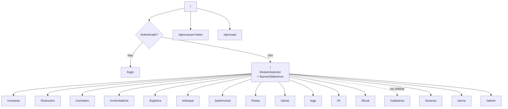

# Paginas e Rotas — TEG+ ERP

> 200+ paginas across 16 modulos, 18 layouts lazy-loaded, 2 entry points

## Mapa de Rotas (`App.tsx`)



---

## Rotas Publicas (sem autenticacao)

| Rota | Componente | Descricao |
|------|-----------|-----------|
| `/login` | `Login.tsx` | Email/senha ou magic link |
| `/nova-senha` | `NovaSenha.tsx` | Reset de senha |
| `/bem-vindo` | `BemVindo.tsx` | Onboarding pos-cadastro |
| `/aprovacao/:token` | `Aprovacao.tsx` | Aprovacao via link externo (token-based) |
| `/aprovaai` | `AprovAi.tsx` | Interface mobile AprovAi (entry point separado) |

---

## Rotas Privadas (requerem auth)

### Modulo Seletor

| Rota | Componente | Descricao |
|------|-----------|-----------|
| `/` | `ModuloSelector.tsx` | Dashboard + **BannerSlideshow** entre saudacao e grade de modulos |

---

### Modulo Compras (com `ComprasLayout`) — 7 paginas

| Rota | Componente | Descricao |
|------|-----------|-----------|
| `/compras` | `Dashboard.tsx` | KPIs, pipeline, analytics |
| `/compras/nova` | `NovaRequisicao.tsx` | Wizard 3 etapas + AI parse |
| `/compras/requisicoes` | `ListaRequisicoes.tsx` | Lista com filtros avancados |
| `/compras/cotacoes` | `FilaCotacoes.tsx` | Fila de cotacoes + recomendacao AI |
| `/compras/cotacoes/:id` | `CotacaoForm.tsx` | Formulario de cotacao |
| `/compras/pedidos` | `Pedidos.tsx` | Ordens de compra (PO) |
| `/compras/perfil` | `Perfil.tsx` | Perfil e preferencias |

---

### Modulo Financeiro (com `FinanceiroLayout`) — 8 paginas + 2 apontamentos

| Rota | Componente | Descricao |
|------|-----------|-----------|
| `/financeiro` | `DashboardFinanceiro.tsx` | KPIs, pipeline, vencimentos, centro de custo |
| `/financeiro/cp` | `ContasPagar.tsx` | Lista CP, filtros por status |
| `/financeiro/cr` | `ContasReceber.tsx` | Lista CR, vencidos |
| `/financeiro/aprovacoes` | `AprovacoesPagamento.tsx` | Fila aprovacao Diretoria |
| `/financeiro/conciliacao` | `Conciliacao.tsx` | Remessa CNAB, retorno |
| `/financeiro/relatorios` | `Relatorios.tsx` | DRE, Fluxo de Caixa, Aging |
| `/financeiro/fornecedores` | `Fornecedores.tsx` | Cadastro, dados bancarios, Omie |
| `/financeiro/configuracoes` | `Configuracoes.tsx` | Config do modulo |
| `/apontamentos` | `Apontamentos.tsx` | Apontamentos financeiros |
| `/apontamentos/novo` | `NovoApontamento.tsx` | Novo apontamento |

---

### Modulo Contratos (com `ContratosLayout`) — 17 paginas

| Rota | Componente | Descricao |
|------|-----------|-----------|
| `/contratos` | `DashboardContratos.tsx` | Painel com KPIs e parcelas |
| `/contratos/lista` | `ListaContratos.tsx` | Lista de contratos |
| `/contratos/novo` | `NovoContrato.tsx` | Formulario de criacao |
| `/contratos/:id` | `ContratoDetalhe.tsx` | Detalhe do contrato |
| `/contratos/:id/medicoes` | `Medicoes.tsx` | Medicoes do contrato |
| `/contratos/:id/aditivos` | `Aditivos.tsx` | Aditivos contratuais |
| `/contratos/:id/reajustes` | `Reajustes.tsx` | Reajustes de valor |
| `/contratos/parcelas` | `Parcelas.tsx` | Gestao de parcelas |
| `/contratos/solicitacoes` | `Solicitacoes.tsx` | Solicitacoes de contrato |
| `/contratos/solicitacoes/nova` | `NovaSolicitacao.tsx` | Nova solicitacao |
| `/contratos/minutas` | `Minutas.tsx` | Minutas contratuais (AI) |
| `/contratos/minutas/:id` | `MinutaDetalhe.tsx` | Detalhe da minuta |
| `/contratos/analise-juridica` | `AnaliseJuridica.tsx` | Analise juridica |
| `/contratos/assinaturas` | `Assinaturas.tsx` | Gestao de assinaturas |
| `/contratos/equipe-pj` | `EquipePJ.tsx` | Equipe PJ do contrato |
| `/contratos/relatorios` | `Relatorios.tsx` | Relatorios contratuais |
| `/contratos/configuracoes` | `Configuracoes.tsx` | Config do modulo |

Ver [[27 - Módulo Contratos Gestão]].

---

### Modulo Controladoria (com `ControladoriaLayout`) — 5 paginas

| Rota | Componente | Descricao |
|------|-----------|-----------|
| `/controladoria` | `ControladoriaHome.tsx` | Dashboard — custos, margens, alertas ativos |
| `/controladoria/orcamentos` | `Orcamentos.tsx` | Gestao de orcamentos por obra |
| `/controladoria/dre` | `DRE.tsx` | DRE consolidado |
| `/controladoria/kpis` | `KPIs.tsx` | Indicadores de desempenho |
| `/controladoria/cenarios` | `Cenarios.tsx` | Simulacao de cenarios financeiros |

Ver [[30 - Módulo Controladoria]].

---

### Modulo Logistica (com `LogisticaLayout`) — 8 paginas

| Rota | Componente | Descricao |
|------|-----------|-----------|
| `/logistica` | `LogisticaHome.tsx` | Painel de transportes |
| `/logistica/transportes` | `Transportes.tsx` | Solicitacoes de transporte |
| `/logistica/recebimentos` | `Recebimentos.tsx` | Recebimento de materiais |
| `/logistica/expedicao` | `Expedicao.tsx` | Expedicao e entregas |
| `/logistica/solicitacoes` | `Solicitacoes.tsx` | Fila de solicitacoes |
| `/logistica/planejamento` | `PlanejamentoRota.tsx` | Planejamento de rota com mapa |
| `/logistica/transportadoras` | `Transportadoras.tsx` | Gestao de transportadoras |
| `/logistica/avaliacoes` | `Avaliacoes.tsx` | Avaliacoes de transporte |

Ver [[23 - Módulo Logística e Transportes]].

---

### Modulo Estoque (com `EstoqueLayout`) — 6 paginas

| Rota | Componente | Descricao |
|------|-----------|-----------|
| `/estoque` | `EstoqueHome.tsx` | Dashboard de estoque |
| `/estoque/itens` | `Itens.tsx` | Catalogo de itens |
| `/estoque/movimentacoes` | `Movimentacoes.tsx` | Entradas e saidas |
| `/estoque/inventario` | `Inventario.tsx` | Inventario fisico |
| `/estoque/transferencias` | `Transferencias.tsx` | Transferencias entre almoxarifados |
| `/estoque/relatorios` | `Relatorios.tsx` | Relatorios de estoque |

---

### Modulo Patrimonio (com `PatrimonialLayout`) — 3 paginas

| Rota | Componente | Descricao |
|------|-----------|-----------|
| `/patrimonial` | `PatrimonialHome.tsx` | Dashboard patrimonial |
| `/patrimonial/imobilizados` | `Imobilizados.tsx` | Cadastro de bens imobilizados |
| `/patrimonial/depreciacao` | `Depreciacao.tsx` | Calculo e controle de depreciacao |

---

### Modulo Frotas (com `FrotasLayout`) — 17 paginas, 3 sub-hubs

| Rota | Componente | Sub-hub | Descricao |
|------|-----------|---------|-----------|
| `/frotas` | `FrotasHome.tsx` | — | Dashboard de frotas |
| `/frotas/veiculos` | `Veiculos.tsx` | Frota | Cadastro de veiculos |
| `/frotas/veiculos/:id` | `VeiculoDetalhe.tsx` | Frota | Detalhe do veiculo |
| `/frotas/documentos` | `Documentos.tsx` | Frota | Documentacao veicular |
| `/frotas/motoristas` | `Motoristas.tsx` | Frota | Gestao de motoristas |
| `/frotas/multas` | `Multas.tsx` | Frota | Controle de multas |
| `/frotas/ordens` | `Ordens.tsx` | Manutencao | Ordens de servico |
| `/frotas/ordens/:id` | `OrdemDetalhe.tsx` | Manutencao | Detalhe da OS |
| `/frotas/preventivas` | `Preventivas.tsx` | Manutencao | Manutencoes preventivas |
| `/frotas/pecas` | `Pecas.tsx` | Manutencao | Estoque de pecas |
| `/frotas/oficinas` | `Oficinas.tsx` | Manutencao | Oficinas credenciadas |
| `/frotas/checklists` | `Checklists.tsx` | Operacao | Checklists de inspecao |
| `/frotas/abastecimentos` | `Abastecimentos.tsx` | Operacao | Controle de combustivel |
| `/frotas/telemetria` | `Telemetria.tsx` | Operacao | KPIs e rastreamento |
| `/frotas/viagens` | `Viagens.tsx` | Operacao | Controle de viagens |
| `/frotas/relatorios` | `Relatorios.tsx` | — | Relatorios de frotas |
| `/frotas/configuracoes` | `Configuracoes.tsx` | — | Config do modulo |

Ver [[24 - Módulo Frotas e Manutenção]].

---

### Modulo Obras (com `ObrasLayout`) — 6 paginas

| Rota | Componente | Descricao |
|------|-----------|-----------|
| `/obras` | `ObrasHome.tsx` | Dashboard — KPIs, apontamentos recentes, mobilizacoes |
| `/obras/apontamentos` | `Apontamentos.tsx` | Apontamentos de campo (HH, equipes) |
| `/obras/rdo` | `RDO.tsx` | Relatorio Diario de Obra |
| `/obras/adiantamentos` | `Adiantamentos.tsx` | Adiantamentos financeiros para obras |
| `/obras/prestacao` | `PrestacaoContas.tsx` | Prestacao de contas de adiantamentos |
| `/obras/equipe` | `PlanejamentoEquipe.tsx` | Planejamento e gestao de equipe por obra |

Ver [[32 - Módulo Obras]].

---

### Modulo EGP/PMO (com `EGPLayout`) — 32 paginas, 5 lifecycle phases

| Rota | Componente | Fase | Descricao |
|------|-----------|------|-----------|
| `/egp` | `EGPHome.tsx` | — | Dashboard — portfolio de obras e KPIs |
| `/egp/portfolio` | `Portfolio.tsx` | Iniciacao | Lista de portfolios/obras |
| `/egp/portfolio/novo` | `NovoPortfolio.tsx` | Iniciacao | Criar novo portfolio |
| `/egp/portfolio/:id` | `PortfolioDetalhe.tsx` | Iniciacao | Detalhe de portfolio |
| `/egp/tap` | `TapHub.tsx` | Iniciacao | Seletor de TAP por portfolio |
| `/egp/tap/:portfolioId` | `TapPage.tsx` | Iniciacao | Termo de Abertura de Projeto |
| `/egp/eap` | `EAPHub.tsx` | Planejamento | Seletor de EAP por portfolio |
| `/egp/eap/:portfolioId` | `EAP.tsx` | Planejamento | Estrutura Analitica do Projeto |
| `/egp/cronograma` | `CronogramaHub.tsx` | Planejamento | Seletor de cronograma por portfolio |
| `/egp/cronograma/:portfolioId` | `Cronograma.tsx` | Planejamento | Cronograma Gantt |
| `/egp/medicoes` | `MedicoesHub.tsx` | Execucao | Seletor de medicoes por portfolio |
| `/egp/medicoes/:portfolioId` | `Medicoes.tsx` | Execucao | Boletins de Medicao |
| `/egp/histograma` | `HistogramaHub.tsx` | Execucao | Seletor de histograma por portfolio |
| `/egp/histograma/:portfolioId` | `Histograma.tsx` | Execucao | Histograma de recursos |
| `/egp/custos` | `CustosHub.tsx` | Controle | Seletor de custos por portfolio |
| `/egp/custos/:portfolioId` | `ControleCustos.tsx` | Controle | Controle de custos |
| `/egp/fluxo-os` | `FluxoOS.tsx` | Execucao | Fluxo de Ordens de Servico |
| `/egp/reunioes` | `Reunioes.tsx` | Controle | Atas de reunioes |
| `/egp/indicadores` | `StatusReportList.tsx` | Controle | Status Reports / indicadores |
| `/egp/multas` | `Multas.tsx` | Controle | Controle de multas contratuais |
| `/egp/riscos` | `Riscos.tsx` | Planejamento | Matriz de riscos |
| `/egp/riscos/:portfolioId` | `RiscosDetalhe.tsx` | Planejamento | Riscos por portfolio |
| `/egp/qualidade` | `Qualidade.tsx` | Controle | Controle de qualidade |
| `/egp/comunicacao` | `Comunicacao.tsx` | Execucao | Plano de comunicacao |
| `/egp/aquisicoes` | `Aquisicoes.tsx` | Planejamento | Plano de aquisicoes |
| `/egp/stakeholders` | `Stakeholders.tsx` | Iniciacao | Partes interessadas |
| `/egp/licoes` | `LicoesAprendidas.tsx` | Encerramento | Licoes aprendidas |
| `/egp/encerramento` | `Encerramento.tsx` | Encerramento | Termo de encerramento |
| `/egp/dashboard-obra/:id` | `DashboardObra.tsx` | — | Dashboard especifico da obra |
| `/egp/relatorios` | `Relatorios.tsx` | — | Relatorios PMO |
| `/egp/configuracoes` | `Configuracoes.tsx` | — | Config do modulo |
| `/egp/baseline` | `Baseline.tsx` | Planejamento | Gestao de baselines |

Ver [[31 - Módulo PMO-EGP]].

---

### Modulo RH (com `RHLayout` — violet) — 10 paginas, 3 sub-modulos

| Rota | Componente | Sub-modulo | Acesso |
|------|-----------|------------|--------|
| `/rh` | `RHHome.tsx` | Main | Todos autenticados |
| `/rh/mural` | `MuralAdmin.tsx` | Main | **Admin only** — gestao de banners |
| `/rh/colaboradores` | `Colaboradores.tsx` | Headcount | Gestao de colaboradores |
| `/rh/organograma` | `Organograma.tsx` | Headcount | Organograma da empresa |
| `/rh/cargos` | `Cargos.tsx` | Headcount | Cargos e salarios |
| `/rh/endomarketing` | `Endomarketing.tsx` | Cultura | Campanhas internas |
| `/rh/comunicados` | `Comunicados.tsx` | Cultura | Comunicados internos |
| `/rh/pesquisas` | `Pesquisas.tsx` | Cultura | Pesquisas de clima |
| `/rh/treinamentos` | `Treinamentos.tsx` | Cultura | Gestao de treinamentos |
| `/rh/relatorios` | `Relatorios.tsx` | Main | Relatorios de RH |

---

### Modulo Fiscal (com `FiscalLayout`) — 2 paginas

| Rota | Componente | Descricao |
|------|-----------|-----------|
| `/fiscal` | `PainelFiscal.tsx` | Dashboard — KPIs, NFs por origem, por obra, fila pendentes |
| `/fiscal/pipeline` | `FiscalPipeline.tsx` | Pipeline Kanban de solicitacoes de NF (emissao) |
| `/fiscal/historico` | `NotasFiscais.tsx` | Repositorio / historico de NFs emitidas |

Ver [[29 - Módulo Fiscal]].

---

### Modulo Cadastros (com `CadastrosLayout` — via sidebar de todos os modulos) — 11 paginas

| Rota | Componente | Descricao | AI? |
|------|-----------|-----------|-----|
| `/cadastros` | `CadastrosHome.tsx` | Dashboard 2x3 grid de entidades | — |
| `/cadastros/fornecedores` | `FornecedoresCad.tsx` | Cards + MagicModal CNPJ | AI |
| `/cadastros/itens` | `ItensCad.tsx` | Tabela CRUD, filtro Curva ABC | — |
| `/cadastros/classes` | `ClassesFinanceiras.tsx` | Tabela CRUD | — |
| `/cadastros/centros-custo` | `CentrosCusto.tsx` | Tabela CRUD | — |
| `/cadastros/obras` | `ObrasCad.tsx` | Cards + MagicModal | AI |
| `/cadastros/colaboradores` | `ColaboradoresCad.tsx` | Cards + MagicModal CPF | AI |
| `/cadastros/categorias` | `Categorias.tsx` | Categorias de compras | — |
| `/cadastros/grupos` | `GruposFinanceiros.tsx` | Grupos financeiros | — |
| `/cadastros/unidades` | `Unidades.tsx` | Unidades de medida | — |
| `/cadastros/empresas` | `Empresas.tsx` | Empresas do grupo | — |

> Acessivel de qualquer modulo via icone "Cadastros" na sidebar. Ver [[28 - Módulo Cadastros AI]].

---

### Modulo Locacao (com `LocacaoLayout`) — 9 paginas — NOVO Abr 2026

| Rota | Componente | Descricao |
|------|-----------|-----------|
| `/locacao` | `LocacaoHome.tsx` | Dashboard de locacao |
| `/locacao/contratos` | `ContratosLocacao.tsx` | Lista de contratos de locacao |
| `/locacao/contratos/novo` | `NovoContratoLocacao.tsx` | Novo contrato de locacao |
| `/locacao/contratos/:id` | `ContratoLocacaoDetalhe.tsx` | Detalhe do contrato |
| `/locacao/equipamentos` | `Equipamentos.tsx` | Catalogo de equipamentos locados |
| `/locacao/medicoes` | `MedicoesLocacao.tsx` | Medicoes de utilizacao |
| `/locacao/devolucoes` | `Devolucoes.tsx` | Controle de devolucoes |
| `/locacao/fornecedores` | `FornecedoresLocacao.tsx` | Locadores cadastrados |
| `/locacao/relatorios` | `RelatoriosLocacao.tsx` | Relatorios de locacao |

Ver [[34 - Módulo Locação]].

---

### Modulo SSMA

| Rota | Componente | Descricao |
|------|-----------|-----------|
| `/ssma` | `SSMA.tsx` | Tela informativa com roadmap do modulo (stub) |

> SSMA esta implementado como stub informativo. Funcionalidades completas planejadas para Q2-Q4 2026. Ver [[33 - Módulo SSMA]].

---

### Admin — 3 paginas

| Rota | Componente | Acesso |
|------|-----------|--------|
| `/admin/usuarios` | `AdminUsuarios.tsx` | Admin only — gestao de usuarios e RBAC |
| `/admin/desenvolvimento` | `Desenvolvimento.tsx` | Admin only — Dev Hub |
| `/admin/configuracoes` | `ConfigSistema.tsx` | Admin only — Configuracoes globais |

---

## Guards de Rota

```tsx
// PrivateRoute — redireciona para /login se nao autenticado
<PrivateRoute>
  <Dashboard />
</PrivateRoute>

// AdminRoute — redireciona para / se nao for admin
<AdminRoute>
  <AdminUsuarios />
</AdminRoute>

// Permissoes por modulo via usePermissions() + RBAC v2
// Verifica sys_perfil_setores para acesso ao modulo
```

---

## BannerSlideshow na Tela Inicial

O `ModuloSelector.tsx` renderiza o componente `BannerSlideshow` **entre** o hero de saudacao e a grade de modulos:

```
[Header]
  |
[Hero: logo + TEG+ + saudacao personalizada]
  |
[BannerSlideshow]   <- banners do mural (auto-advance 5.5s, Ken Burns)
  |
[Grade de Modulos: grid responsivo 16 modulos]
```

Sem banners no banco, exibe 3 slides padrao. Gerenciado em `/rh/mural`. Ver [[25 - Mural de Recados]].

---

## Links Relacionados

- [[02 - Frontend Stack]] — Stack e configuracao
- [[04 - Componentes]] — Layouts e componentes
- [[05 - Hooks Customizados]] — Hooks de dados
- [[09 - Auth Sistema]] — Autenticacao e guards
- [[25 - Mural de Recados]] — Slideshow e gestao de banners
- [[27 - Módulo Contratos Gestão]] — Rotas do modulo de contratos
- [[28 - Módulo Cadastros AI]] — Rotas do modulo de cadastros AI
- [[29 - Módulo Fiscal]] — Rotas do modulo fiscal
- [[30 - Módulo Controladoria]] — Rotas do modulo de controladoria
- [[31 - Módulo PMO-EGP]] — Rotas do modulo PMO/EGP
- [[32 - Módulo Obras]] — Rotas do modulo de obras
- [[33 - Módulo SSMA]] — Modulo SSMA (stub)
- [[34 - Módulo Locação]] — Modulo Locacao (novo)
