# Páginas e Rotas — TEG+ ERP

## Mapa de Rotas (`App.tsx`)

```mermaid
graph TD
    ROOT["/"] --> AUTH{Autenticado?}
    AUTH -->|Não| LOGIN["/login"]
    AUTH -->|Sim| MOD["/\nModuloSelector\n+ BannerSlideshow"]

    MOD --> COMPRAS["/compras\nDashboard"]
    MOD --> FIN["/financeiro\nDashboardFinanceiro"]
    MOD --> EST["/estoque\nEstoqueHome"]
    MOD --> LOG["/logistica\nLogisticaHome"]
    MOD --> FR["/frotas\nFrotasHome"]
    MOD --> RH["/rh\nRHHome"]
    MOD -.->|⚙️ via sidebar| CAD["/cadastros\nCadastrosHome"]
    MOD --> FIS["/fiscal\nPainelFiscal"]
    MOD --> CTRL["/controladoria\nControladoriaHome"]
    MOD --> EGP["/egp\nEGPHome"]
    MOD --> OBR["/obras\nObrasHome"]
    MOD --> SSMA["/ssma\nSSMA stub"]

    RH --> MURAL["/rh/mural\nMuralAdmin 🔐"]

    CAD --> CADF["/cadastros/fornecedores 🤖"]
    CAD --> CADI["/cadastros/itens"]
    CAD --> CADC["/cadastros/classes"]
    CAD --> CADCC["/cadastros/centros-custo"]
    CAD --> CADO["/cadastros/obras 🤖"]
    CAD --> CADCL["/cadastros/colaboradores 🤖"]

    FIN --> FINCP["/financeiro/cp"]
    FIN --> FINCR["/financeiro/cr"]
    FIN --> FINAP["/financeiro/aprovacoes"]
    FIN --> FINCO["/financeiro/conciliacao"]
    FIN --> FINRE["/financeiro/relatorios"]
    FIN --> FINFO["/financeiro/fornecedores"]

    EST --> EST1["/estoque/itens"]
    EST --> EST2["/estoque/movimentacoes"]
    EST --> EST3["/estoque/inventario"]
    EST --> EST4["/estoque/patrimonial"]

    FR --> FR1["/frotas/veiculos"]
    FR --> FR2["/frotas/ordens"]
    FR --> FR3["/frotas/checklists"]
    FR --> FR4["/frotas/abastecimentos"]
    FR --> FR5["/frotas/telemetria"]

    FIS --> FIS1["/fiscal/pipeline"]
    FIS --> FIS2["/fiscal/historico"]

    CTRL --> CTRL1["/controladoria/orcamentos"]
    CTRL --> CTRL2["/controladoria/dre"]
    CTRL --> CTRL3["/controladoria/kpis"]
    CTRL --> CTRL4["/controladoria/cenarios"]
    CTRL --> CTRL5["/controladoria/plano-orcamentario"]
    CTRL --> CTRL6["/controladoria/controle-orcamentario"]
    CTRL --> CTRL7["/controladoria/indicadores"]
    CTRL --> CTRL8["/controladoria/alertas"]

    EGP --> EGP1["/egp/portfolio"]
    EGP --> EGP2["/egp/tap"]
    EGP --> EGP3["/egp/eap"]
    EGP --> EGP4["/egp/cronograma"]
    EGP --> EGP5["/egp/medicoes"]
    EGP --> EGP6["/egp/histograma"]
    EGP --> EGP7["/egp/custos"]
    EGP --> EGP8["/egp/fluxo-os"]
    EGP --> EGP9["/egp/reunioes"]
    EGP --> EGP10["/egp/indicadores"]

    OBR --> OBR1["/obras/apontamentos"]
    OBR --> OBR2["/obras/rdo"]
    OBR --> OBR3["/obras/adiantamentos"]
    OBR --> OBR4["/obras/prestacao"]
    OBR --> OBR5["/obras/equipe"]

    MOD --> CON["/contratos"]
    ROOT --> APROV["/aprovacao/:token 🔓"]
    ROOT --> ADMIN["/admin/usuarios 🔐"]
    ROOT --> ADMINDEV["/admin/desenvolvimento 🔐"]
```



---

## Rotas Públicas (sem autenticação)

| Rota | Componente | Descrição |
|------|-----------|-----------|
| `/login` | `Login.tsx` | Email/senha ou magic link |
| `/nova-senha` | — | Reset de senha |
| `/aprovacao/:token` | `Aprovacao.tsx` | Aprovação via link externo |
| `/aprovaai` | `AprovAi.tsx` | Interface mobile ApprovaAi |

---

## Rotas Privadas (requerem auth)

### Módulo Seletor

| Rota | Componente | Descrição |
|------|-----------|-----------|
| `/` | `ModuloSelector.tsx` | Dashboard + **BannerSlideshow** entre saudação e grade de módulos |

### Módulo RH (com `RHLayout` — violet)

| Rota | Componente | Acesso |
|------|-----------|--------|
| `/rh` | `RHHome.tsx` | Todos autenticados |
| `/rh/mural` | `MuralAdmin.tsx` | **Admin only** — gestão de banners |

> O módulo RH aparece como `active: false` para usuários comuns ("Em breve"). Admins veem o card habilitado com badge "Admin" e acesso direto ao Mural.

### Módulo Financeiro (com `FinanceiroLayout`)

| Rota | Componente | Descrição |
|------|-----------|-----------|
| `/financeiro` | `DashboardFinanceiro.tsx` | KPIs, pipeline, vencimentos, centro de custo |
| `/financeiro/cp` | `ContasPagar.tsx` | Lista CP, filtros por status |
| `/financeiro/cr` | `ContasReceber.tsx` | Lista CR, vencidos |
| `/financeiro/aprovacoes` | `AprovacoesPagamento.tsx` | Fila aprovação Diretoria |
| `/financeiro/conciliacao` | `Conciliacao.tsx` | Remessa CNAB, retorno |
| `/financeiro/relatorios` | `Relatorios.tsx` | DRE, Fluxo de Caixa, Aging |
| `/financeiro/fornecedores` | `Fornecedores.tsx` | Cadastro, dados bancários, Omie |
| `/financeiro/configuracoes` | `Configuracoes.tsx` | Config do módulo |

### Módulo Estoque (com `EstoqueLayout`)

| Rota | Componente | Descrição |
|------|-----------|-----------|
| `/estoque` | `EstoqueHome.tsx` | Dashboard de estoque |
| `/estoque/itens` | `Itens.tsx` | Catálogo de itens |
| `/estoque/movimentacoes` | `Movimentacoes.tsx` | Entradas e saídas |
| `/estoque/inventario` | `Inventario.tsx` | Inventário físico |
| `/estoque/patrimonial` | `Patrimonial.tsx` | Imobilizados e depreciação |

### Módulo Logística (com `LogisticaLayout`)

| Rota | Componente | Descrição |
|------|-----------|-----------|
| `/logistica` | `LogisticaHome.tsx` | Painel de transportes |
| `/logistica/transportes` | `Transportes.tsx` | Solicitações de transporte |
| `/logistica/recebimentos` | `Recebimentos.tsx` | Recebimento de materiais |
| `/logistica/expedicao` | `Expedicao.tsx` | Expedição e entregas |
| `/logistica/solicitacoes` | `Solicitacoes.tsx` | Fila de solicitações |

> Transportadoras não são mais um módulo separado. O cadastro de transportadoras é gerido via `cmp_fornecedores` no módulo Cadastros.

### Módulo Frotas (com `FrotasLayout`)

| Rota | Componente | Descrição |
|------|-----------|-----------|
| `/frotas` | `FrotasHome.tsx` | Dashboard de frotas |
| `/frotas/veiculos` | `Veiculos.tsx` | Cadastro de veículos |
| `/frotas/ordens` | `Ordens.tsx` | Ordens de serviço |
| `/frotas/checklists` | `Checklists.tsx` | Checklists de inspeção |
| `/frotas/abastecimentos` | `Abastecimentos.tsx` | Controle de combustível |
| `/frotas/telemetria` | `Telemetria.tsx` | KPIs e rastreamento |

### Módulo Compras (com `Layout`)

| Rota | Componente | Descrição |
|------|-----------|-----------|
| `/compras` | `Dashboard.tsx` | KPIs, pipeline, analytics |
| `/nova` | `NovaRequisicao.tsx` | Wizard 3 etapas + AI |
| `/requisicoes` | `ListaRequisicoes.tsx` | Lista com filtros |
| `/cotacoes` | `FilaCotacoes.tsx` | Fila de cotações |
| `/cotacoes/:id` | `CotacaoForm.tsx` | Formulário de cotação |
| `/pedidos` | `Pedidos.tsx` | Ordens de compra |
| `/perfil` | `Perfil.tsx` | Perfil e preferências |

### Módulo Contratos (com `ContratosLayout`)

| Rota | Componente | Descrição |
|------|-----------|-----------|
| `/contratos` | `DashboardContratos.tsx` | Painel com KPIs e parcelas |
| `/contratos/lista` | `ListaContratos.tsx` | Lista de contratos |
| `/contratos/novo` | `NovoContrato.tsx` | Formulário de criação |
| `/contratos/parcelas` | `Parcelas.tsx` | Gestão de parcelas |

### Módulo Cadastros (com `CadastrosLayout` — ⚙️ via sidebar de todos os módulos)

| Rota | Componente | Descrição | AI? |
|------|-----------|-----------|-----|
| `/cadastros` | `CadastrosHome.tsx` | Dashboard 2×3 grid de entidades | — |
| `/cadastros/fornecedores` | `FornecedoresCad.tsx` | Cards + MagicModal CNPJ | 🤖 |
| `/cadastros/itens` | `ItensCad.tsx` | Tabela CRUD, filtro Curva ABC | — |
| `/cadastros/classes` | `ClassesFinanceiras.tsx` | Tabela CRUD | — |
| `/cadastros/centros-custo` | `CentrosCusto.tsx` | Tabela CRUD | — |
| `/cadastros/obras` | `ObrasCad.tsx` | Cards + MagicModal | 🤖 |
| `/cadastros/colaboradores` | `ColaboradoresCad.tsx` | Cards + MagicModal CPF | 🤖 |

> Acessível de qualquer módulo via ícone ⚙️ "Cadastros" na sidebar. Ver [[28 - Módulo Cadastros AI]].

### Módulo Fiscal (com `FiscalLayout`)

| Rota | Componente | Descrição |
|------|-----------|-----------|
| `/fiscal` | `PainelFiscal.tsx` | Dashboard — KPIs, NFs por origem, por obra, fila pendentes |
| `/fiscal/pipeline` | `FiscalPipeline.tsx` | Pipeline Kanban de solicitações de NF (emissão) |
| `/fiscal/historico` | `NotasFiscais.tsx` | Repositório / histórico de NFs emitidas |

Ver [[29 - Módulo Fiscal]].

### Módulo Controladoria (com `ControladoriaLayout`)

| Rota | Componente | Descrição |
|------|-----------|-----------|
| `/controladoria` | `ControladoriaHome.tsx` | Dashboard — custos, margens, alertas ativos |
| `/controladoria/orcamentos` | `Orcamentos.tsx` | Gestão de orçamentos por obra |
| `/controladoria/dre` | `DRE.tsx` | DRE consolidado |
| `/controladoria/kpis` | `KPIs.tsx` | Indicadores de desempenho |
| `/controladoria/cenarios` | `Cenarios.tsx` | Simulação de cenários financeiros |
| `/controladoria/plano-orcamentario` | `PlanoOrcamentario.tsx` | Plano orçamentário por obra |
| `/controladoria/controle-orcamentario` | `ControleOrcamentario.tsx` | Orçado vs Realizado |
| `/controladoria/indicadores` | `PainelIndicadores.tsx` | Painel de indicadores executivos |
| `/controladoria/alertas` | `AlertasDesvio.tsx` | Alertas de desvio orçamentário |

Ver [[30 - Módulo Controladoria]].

### Módulo PMO/EGP (com `EGPLayout`)

| Rota | Componente | Descrição |
|------|-----------|-----------|
| `/egp` | `EGPHome.tsx` (PMOHome) | Dashboard — portfólio de obras e KPIs |
| `/egp/portfolio` | `Portfolio.tsx` | Lista de portfólios/obras |
| `/egp/portfolio/novo` | `NovoPortfolio.tsx` | Criar novo portfólio |
| `/egp/portfolio/:id` | `PortfolioDetalhe.tsx` | Detalhe de portfólio |
| `/egp/tap` | `TapHub.tsx` | Seletor de TAP por portfólio |
| `/egp/tap/:portfolioId` | `TapPage.tsx` | Termo de Abertura de Projeto |
| `/egp/eap` | `EAPHub.tsx` | Seletor de EAP por portfólio |
| `/egp/eap/:portfolioId` | `EAP.tsx` | Estrutura Analítica do Projeto |
| `/egp/cronograma` | `CronogramaHub.tsx` | Seletor de cronograma por portfólio |
| `/egp/cronograma/:portfolioId` | `Cronograma.tsx` | Cronograma Gantt |
| `/egp/medicoes` | `MedicoesHub.tsx` | Seletor de medições por portfólio |
| `/egp/medicoes/:portfolioId` | `Medicoes.tsx` | Boletins de Medição |
| `/egp/histograma` | `HistogramaHub.tsx` | Seletor de histograma por portfólio |
| `/egp/histograma/:portfolioId` | `Histograma.tsx` | Histograma de recursos |
| `/egp/custos` | `CustosHub.tsx` | Seletor de custos por portfólio |
| `/egp/custos/:portfolioId` | `ControleCustos.tsx` | Controle de custos |
| `/egp/fluxo-os` | `FluxoOS.tsx` | Fluxo de Ordens de Serviço |
| `/egp/reunioes` | `Reunioes.tsx` | Atas de reuniões |
| `/egp/indicadores` | `StatusReportList.tsx` | Status Reports / indicadores |

Ver [[31 - Módulo PMO-EGP]].

### Módulo Obras (com `ObrasLayout`)

| Rota | Componente | Descrição |
|------|-----------|-----------|
| `/obras` | `ObrasHome.tsx` | Dashboard — KPIs, apontamentos recentes, mobilizações |
| `/obras/apontamentos` | `Apontamentos.tsx` | Apontamentos de campo (HH, equipes) |
| `/obras/rdo` | `RDO.tsx` | Relatório Diário de Obra |
| `/obras/adiantamentos` | `Adiantamentos.tsx` | Adiantamentos financeiros para obras |
| `/obras/prestacao` | `PrestacaoContas.tsx` | Prestação de contas de adiantamentos |
| `/obras/equipe` | `PlanejamentoEquipe.tsx` | Planejamento e gestão de equipe por obra |

Ver [[32 - Módulo Obras]].

### Módulo SSMA

| Rota | Componente | Descrição |
|------|-----------|-----------|
| `/ssma` | `SSMA.tsx` | Tela informativa com roadmap do módulo (stub) |

> SSMA está implementado como stub informativo. Funcionalidades completas planejadas para Q2-Q4 2026. Ver [[33 - Módulo SSMA]].

### Admin

| Rota | Componente | Acesso |
|------|-----------|--------|
| `/admin/usuarios` | `AdminUsuarios.tsx` | Admin only |
| `/admin/desenvolvimento` | `Desenvolvimento.tsx` | Admin only — Dev Hub |

---

## Guards de Rota

```tsx
// PrivateRoute — redireciona para /login se não autenticado
<PrivateRoute>
  <Dashboard />
</PrivateRoute>

// AdminRoute — redireciona para /compras se não for admin
<AdminRoute>
  <AdminUsuarios />
</AdminRoute>

// MuralAdmin — verificação inline via isAdmin do AuthContext
// Exibe "Acesso restrito" se não for admin (não redireciona)
```

---

## BannerSlideshow na Tela Inicial

O `ModuloSelector.tsx` renderiza o componente `BannerSlideshow` **entre** o hero de saudação e a grade de módulos:

```
[Header]
  ↓
[Hero: logo + TEG+ + saudação personalizada]
  ↓
[BannerSlideshow]   ← banners do mural (auto-advance 5.5s, Ken Burns)
  ↓
[Grade de Módulos: grid responsivo]
```

Sem banners no banco, exibe 3 slides padrão. Gerenciado em `/rh/mural`. Ver [[25 - Mural de Recados]].

---

## Links Relacionados

- [[02 - Frontend Stack]] — Stack e configuração
- [[04 - Componentes]] — Layouts e componentes
- [[05 - Hooks Customizados]] — Hooks de dados
- [[09 - Auth Sistema]] — Autenticação e guards
- [[25 - Mural de Recados]] — Slideshow e gestão de banners
- [[27 - Módulo Contratos Gestão]] — Rotas do módulo de contratos
- [[28 - Módulo Cadastros AI]] — Rotas do módulo de cadastros AI
- [[29 - Módulo Fiscal]] — Rotas do módulo fiscal
- [[30 - Módulo Controladoria]] — Rotas do módulo de controladoria
- [[31 - Módulo PMO-EGP]] — Rotas do módulo PMO/EGP
- [[32 - Módulo Obras]] — Rotas do módulo de obras
- [[33 - Módulo SSMA]] — Módulo SSMA (stub)
