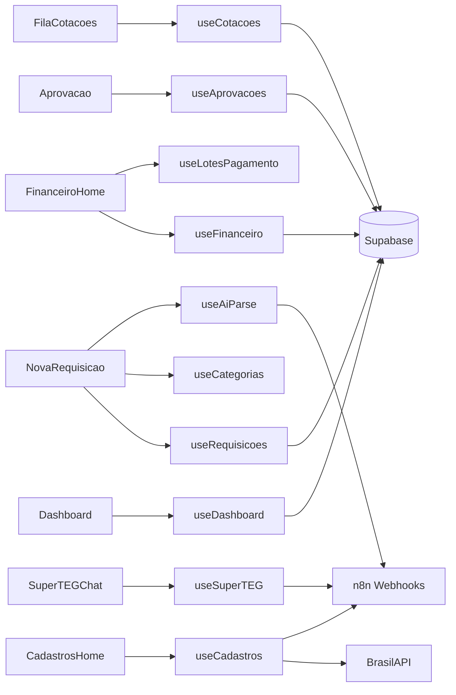

# Hooks Customizados — TEG+ ERP

> Todos os hooks usam **TanStack Query v5** para cache, refetch e loading states.
> Total: **46 hooks** organizados por módulo.

```
src/hooks/
├── ── Compras (6) ──────────────────────────────────────────────
│   ├── useDashboard.ts        → KPIs e pipeline do dashboard
│   ├── useRequisicoes.ts      → CRUD de requisições
│   ├── useCotacoes.ts         → Fila de cotações do comprador
│   ├── useConsultas.ts        → Consultas de RC (busca, filtros)
│   ├── usePedidos.ts          → Ordens de compra
│   └── useRecebimento.ts      → Recebimento de materiais
│
├── ── Financeiro (4) ───────────────────────────────────────────
│   ├── useFinanceiro.ts       → CP, CR, aprovações de pagamento
│   ├── useLotesPagamento.ts   → Lotes de pagamento batch
│   ├── useCartoes.ts          → Cartões corporativos
│   └── useNotasFiscais.ts     → NFs emitidas/recebidas
│
├── ── Contratos (2) ────────────────────────────────────────────
│   ├── useContratos.ts        → Contratos, parcelas, liberação
│   └── useAprovacoes.ts       → Aprovações multi-tipo
│
├── ── Logística (1) ────────────────────────────────────────────
│   └── useLogistica.ts        → Transportes, expedição, recebimentos
│
├── ── Frotas (1) ───────────────────────────────────────────────
│   └── useFrotas.ts           → Veículos, OS, checklists, abastecimentos
│
├── ── RH (3) ───────────────────────────────────────────────────
│   ├── useRH.ts               → Colaboradores, funções, mobilizações
│   ├── useEndomarketing.ts    → Comunicação interna
│   └── useMural.ts            → Banners do Mural de Recados
│
├── ── Estoque (1) ──────────────────────────────────────────────
│   └── useEstoque.ts          → Almoxarifado, inventário, movimentações
│
├── ── Obras (1) ────────────────────────────────────────────────
│   └── useObras.ts            → Apontamentos, RDO, adiantamentos
│
├── ── Cadastros (2) ────────────────────────────────────────────
│   ├── useCadastros.ts        → Master data (6 entidades + AI parse)
│   └── useCategorias.ts       → Categorias com regras e compradores
│
├── ── PMO / EGP (1) ────────────────────────────────────────────
│   └── usePMO.ts              → Portfólio, TAP, EAP, cronograma
│
├── ── Controladoria (1) ────────────────────────────────────────
│   └── useControladoria.ts    → DRE, orçamentos, KPIs, cenários
│
├── ── Patrimônio (1) ───────────────────────────────────────────
│   └── usePatrimonial.ts      → Imobilizados e depreciação
│
├── ── Locação (1) ──────────────────────────────────────────────
│   └── useLocacao.ts          → Acordos, vistorias, fluxo locação
│
├── ── Despesas (2) ─────────────────────────────────────────────
│   ├── useDespesas.ts         → Controle de despesas
│   └── useCartoes.ts          → Cartões corporativos (compartilhado)
│
├── ── Fiscal (1) ───────────────────────────────────────────────
│   └── useSolicitacoesNF.ts   → Pipeline de solicitações de NF
│
├── ── Utility (16) ─────────────────────────────────────────────
│   ├── useLookups.ts          → Tabelas de lookup (obras, categorias, etc.)
│   ├── usePermissoes.ts       → Permissões RBAC v2 por módulo
│   ├── useAiParse.ts          → Parse de texto livre → estruturado
│   ├── useSuperTEG.ts         → Chat AI SuperTEG
│   ├── useAnexos.ts           → Upload e listagem de anexos
│   ├── useOmie.ts             → Integração Omie ERP (sync)
│   ├── useOmieApi.ts          → API calls Omie via n8n
│   ├── useOnlineStatus.ts     → Detecção de status online/offline
│   ├── usePWAInstall.ts       → Prompt de instalação PWA
│   ├── usePushNotifications.ts→ Notificações push (Web Push API)
│   ├── useSound.ts            → Efeitos sonoros (notificação, sucesso)
│   ├── useVoiceRecorder.ts    → Gravação de áudio (MediaRecorder API)
│   ├── usePagination.ts       → Lógica de paginação
│   ├── useSmartForm.ts        → Formulário inteligente com validação
│   ├── usePreCadastros.ts     → Pré-cadastros via SuperTEG
│   └── useSolicitacoes.ts     → Solicitações genéricas
│
└── ── Tesouraria (1) ───────────────────────────────────────────
    └── useTesouraria.ts       → Fluxo de caixa, saldos, conciliação
```

---

## Compras

### `useDashboard`

**Arquivo:** `src/hooks/useDashboard.ts`

Busca KPIs, pipeline e dados agregados do dashboard de Compras.

```ts
const { kpis, porStatus, porObra, recentes, isLoading } = useDashboard({
  periodo: '30d',   // '7d' | '30d' | '90d'
  obra_id?: string
})
```

**Estratégia de fetch:**
1. Tenta RPC `get_dashboard_compras(p_periodo, p_obra_id)` — retorna JSON agregado
2. Fallback: queries SQL diretas se RPC falhar
3. Cache: `staleTime: 30s`, refetch a cada `60s`
4. Realtime: subscription em `requisicoes` e `aprovacoes`

**Retorno:**
```ts
{
  kpis: { total, pendentes, aprovadas, em_cotacao, valor_total, valor_aprovado }
  porStatus: { status: string; count: number }[]
  porObra: { obra: string; count: number; valor: number }[]
  recentes: Requisicao[]
}
```

### `useRequisicoes`

**Arquivo:** `src/hooks/useRequisicoes.ts`

CRUD completo de requisições.

```ts
const { requisicoes, isLoading, criarRequisicao, isCreating } = useRequisicoes({ status?, obra_id?, page?, limit? })
```

**Mutations:** `criarRequisicao(payload)` — invalida `['requisicoes']` e `['dashboard']`

### `useCotacoes`

**Arquivo:** `src/hooks/useCotacoes.ts`

Fila de cotações do comprador logado.

```ts
const { fila, cotacao, submeter } = useCotacoes(id?)
```

### `useConsultas`

**Arquivo:** `src/hooks/useConsultas.ts`

Consultas de requisições com filtros avançados (status, obra, período, solicitante).

### `usePedidos`

**Arquivo:** `src/hooks/usePedidos.ts`

Listagem de pedidos de compra gerados. Fonte: tabela `cmp_pedidos`.

### `useRecebimento`

**Arquivo:** `src/hooks/useRecebimento.ts`

Gestão de recebimento de materiais. Suporta recebimento parcial, vinculação com estoque, e criação automática de movimentações.

---

## Financeiro

### `useFinanceiro`

**Arquivo:** `src/hooks/useFinanceiro.ts`

Hook principal do módulo financeiro: Contas a Pagar, Contas a Receber, aprovações de pagamento.

### `useLotesPagamento`

**Arquivo:** `src/hooks/useLotesPagamento.ts`

Gestão de lotes de pagamento (batch payment approval). Permite aprovar/rejeitar títulos em lote com decisões parciais.

### `useCartoes`

**Arquivo:** `src/hooks/useCartoes.ts`

Gestão de cartões corporativos e controle de despesas por cartão (compartilhado entre Financeiro e Despesas).

### `useNotasFiscais`

**Arquivo:** `src/hooks/useNotasFiscais.ts`

Notas fiscais emitidas e recebidas. Pipeline de NFs com status e histórico.

---

## Contratos

### `useContratos`

**Arquivo:** `src/hooks/useContratos.ts`

Contratos, parcelas, medições, liberação de pagamento. Integração com financeiro.

### `useAprovacoes`

**Arquivo:** `src/hooks/useAprovacoes.ts`

Aprovações multi-tipo: `requisicao_compra`, `cotacao`, `autorizacao_pagamento`, `minuta_contratual`.

```ts
const { aprovacoes, processar } = useAprovacoes({ aprovador_id?, status?, tipo? })
```

---

## Logística

### `useLogistica`

**Arquivo:** `src/hooks/useLogistica.ts`

Transportes, expedição, recebimentos, solicitações. Pipeline com 9 etapas.

---

## Frotas

### `useFrotas`

**Arquivo:** `src/hooks/useFrotas.ts`

Veículos, ordens de serviço, checklists, abastecimentos, telemetria.

---

## RH

### `useRH`

Colaboradores, funções, departamentos, mobilizações e desmobilizações.

### `useEndomarketing`

Comunicação interna, campanhas e eventos.

### `useMural`

**Arquivo:** `src/hooks/useMural.ts`

Gestão dos banners do Mural de Recados.

**Sub-hooks exportados:**
```ts
useBanners()             // Slideshow: banners ativos e vigentes
useBannersAdmin()        // Admin: todos os banners
useSalvarBanner()        // INSERT/UPDATE
useToggleBanner()        // Toggle ativo/inativo
useExcluirBanner()       // DELETE
useUploadBannerImagem()  // Upload → bucket 'mural-banners'
```

Ver [[25 - Mural de Recados]].

---

## Estoque

### `useEstoque`

**Arquivo:** `src/hooks/useEstoque.ts`

Almoxarifado, inventário, movimentações, itens do catálogo. Curva ABC.

---

## Obras

### `useObras`

**Arquivo:** `src/hooks/useObras.ts`

Apontamentos, RDO (Relatório Diário de Obra), adiantamentos, prestação de contas, planejamento de equipe.

---

## Cadastros

### `useCadastros`

**Arquivo:** `src/hooks/useCadastros.ts`

Módulo unificado com hooks para gerenciamento de dados mestres + AI parsing.

**Query Hooks:** `useCadFornecedores`, `useCadClasses`, `useCadCentrosCusto`, `useCadObras`, `useCadColaboradores`
**Mutation Hooks:** `useSalvarFornecedor`, `useSalvarClasse`, `useSalvarCentroCusto`, `useSalvarObra`, `useSalvarColaborador`
**AI Hook:** `useAiCadastroParse` — 3 camadas (BrasilAPI CNPJ → n8n LLM → regex fallback)

**Cross-module invalidation:** Mutations invalidam cache do cadastros E do módulo original.

Ver [[28 - Módulo Cadastros AI]].

### `useCategorias`

**Arquivo:** `src/hooks/useCategorias.ts`

Lista de categorias com regras e compradores. Cache: `staleTime: Infinity` (dados estáticos).

---

## PMO / EGP

### `usePMO`

**Arquivo:** `src/hooks/usePMO.ts`

Portfólio de projetos, TAP (Termo de Abertura), EAP (Estrutura Analítica), cronograma Gantt, medições, histograma de recursos, status reports.

---

## Controladoria

### `useControladoria`

**Arquivo:** `src/hooks/useControladoria.ts`

DRE, orçamentos, KPIs operacionais, cenários, indicadores de produção, alertas.

---

## Patrimônio

### `usePatrimonial`

**Arquivo:** `src/hooks/usePatrimonial.ts`

Imobilizados, depreciação linear, baixas, transferências entre obras.

---

## Locação

### `useLocacao`

Acordos de locação de equipamentos, vistorias (entrada/saída), fluxo de locação, comparativos.

---

## Despesas

### `useDespesas`

Controle de despesas operacionais, categorização, aprovações.

**Hooks exportados (`hooks/useDespesas.ts`):**

| Hook | Descrição |
|------|-----------|
| `useAdiantamentosDespesa` | Lista adiantamentos com filtros |
| `useCriarSolicitacaoAdiantamento` | Cria nova solicitação de adiantamento |
| `useAtualizarClasseAdiantamento` | Atualiza `classe_financeira` e `classe_financeira_id` de um adiantamento existente |

```ts
// useAtualizarClasseAdiantamento — adicionado em 2026-04-08
const { mutate } = useAtualizarClasseAdiantamento()
mutate({ id, classe_financeira, classe_financeira_id })
```

### `useCartoes`

Cartões corporativos (compartilhado com Financeiro).

---

## Fiscal

### `useSolicitacoesNF`

**Arquivo:** `src/hooks/useSolicitacoesNF.ts`

Pipeline de solicitações de nota fiscal. Fluxo: Logística → Fiscal → Emissão.

---

## Hooks Utilitários

### `useLookups`

**Arquivo:** `src/hooks/useLookups.ts`

Tabelas de lookup centralizadas (obras, categorias, compradores, centros de custo, etc.). Cache longo, compartilhado entre módulos.

### `usePermissoes`

Permissões [[09 - Auth Sistema|RBAC v2]] por módulo. Expõe: `hasModule()`, `hasSetorPapel()`, `atLeast()`, `canApprove()`.

### `useAiParse`

**Arquivo:** `src/hooks/useAiParse.ts`

Parse de texto livre para requisição estruturada via n8n + Gemini.

```ts
const { parse, resultado, isParsing } = useAiParse()
parse({ texto: "Preciso de 10 capacetes para Frutal", solicitante_nome: "João" })
```

**Retorno:** `{ itens[], obra_sugerida, categoria_sugerida, confianca }`

### `useSuperTEG`

**Arquivo:** `src/hooks/useSuperTEG.ts`

Interface com o agente AI SuperTEG via n8n. Gerencia sessão, histórico e envio de mensagens.

### `useAnexos`

**Arquivo:** `src/hooks/useAnexos.ts`

Upload e listagem de anexos em qualquer módulo. Supabase Storage.

### `useOmie` / `useOmieApi`

**Arquivos:** `src/hooks/useOmie.ts`, `src/hooks/useOmieApi.ts`

Integração com Omie ERP. `useOmie` gerencia sync; `useOmieApi` faz chamadas via n8n.

### `useOnlineStatus`

Detecta se o usuário está online/offline via `navigator.onLine` + event listeners.

### `usePWAInstall`

Gerencia o prompt de instalação PWA (`beforeinstallprompt` event).

### `usePushNotifications`

Integração com Web Push API para notificações push no navegador.

### `useSound`

Efeitos sonoros para eventos (nova notificação, sucesso, erro). Usa Web Audio API.

### `useVoiceRecorder`

**Arquivo:** `src/hooks/useVoiceRecorder.ts`

Gravação de áudio via MediaRecorder API. Usado para input por voz no SuperTEG.

### `usePagination`

**Arquivo:** `src/hooks/usePagination.ts`

Lógica de paginação reutilizável. Props: `totalItems`, `pageSize`. Retorna: `page`, `totalPages`, `setPage`.

### `useSmartForm`

**Arquivo:** `src/hooks/useSmartForm.ts`

Formulário inteligente com validação, dirty tracking e auto-save.

---

## Diagrama de Dependências



---

## Links Relacionados

- [[02 - Frontend Stack]] — TanStack Query setup
- [[04 - Componentes]] — Componentes que consomem os hooks
- [[06 - Supabase]] — Fonte de dados
- [[09 - Auth Sistema]] — RBAC e permissões (usePermissoes)
- [[10 - n8n Workflows]] — Webhooks chamados pelas mutations
- [[25 - Mural de Recados]] — useMural detalhado
- [[27 - Módulo Contratos Gestão]] — useContratos detalhado
- [[28 - Módulo Cadastros AI]] — useCadastros detalhado
