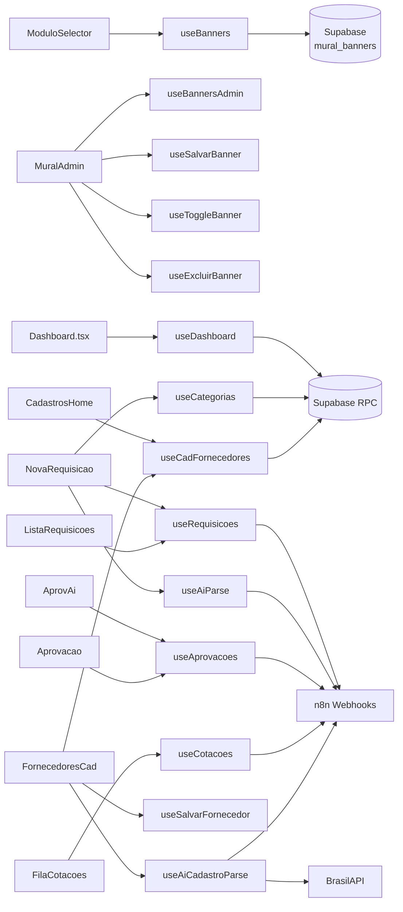

# Hooks Customizados — TEG+ ERP

> Todos os hooks usam **TanStack Query v5** para cache, refetch e loading states.

```
src/hooks/
├── useDashboard.ts        → KPIs e pipeline do dashboard Compras
├── useRequisicoes.ts      → CRUD de requisições
├── useAprovacoes.ts       → Listagem e processamento de aprovações
├── useCotacoes.ts         → Fila de cotações do comprador
├── usePedidos.ts          → Ordens de compra
├── useCategorias.ts       → Categorias com regras e compradores
├── useAiParse.ts          → Parse de texto livre → requisição estruturada
├── useAnexos.ts           → Upload e listagem de anexos
├── useOmie.ts             → Integração Omie ERP (sync, fornecedores)
├── useFinanceiro.ts       → CP, CR, aprovações de pagamento
├── useEstoque.ts          → Almoxarifado, inventário, patrimonial
├── useLogistica.ts        → Transportes, expedição, recebimentos
├── usePatrimonial.ts      → Imobilizados e depreciação
├── useFrotas.ts           → Veículos, OS, checklists, abastecimentos
├── useMural.ts            → Banners do Mural de Recados
├── useContratos.ts        → Contratos, parcelas, liberação, pagamento
└── useCadastros.ts        → Master data: 6 entidades + AI parse [novo]
```

---

## `useDashboard`

**Arquivo:** `src/hooks/useDashboard.ts`

**Responsabilidade:** Busca KPIs, pipeline e dados agregados do dashboard.

```ts
const { kpis, porStatus, porObra, recentes, isLoading } = useDashboard({
  periodo: '30d',   // '7d' | '30d' | '90d'
  obra_id?: string
})
```

**Estratégia de fetch:**
1. Tenta RPC `get_dashboard_compras(p_periodo, p_obra_id)` — retorna JSON agregado
2. Fallback: queries SQL diretas se RPC falhar
3. Cache: `staleTime: 30s`, refetch a cada `60s`
4. Realtime: subscription em `requisicoes` e `aprovacoes`

**Retorno:**
```ts
{
  kpis: {
    total: number
    pendentes: number
    aprovadas: number
    em_cotacao: number
    valor_total: number
    valor_aprovado: number
  }
  porStatus: { status: string; count: number }[]
  porObra: { obra: string; count: number; valor: number }[]
  recentes: Requisicao[]
}
```

---

## `useRequisicoes`

**Arquivo:** `src/hooks/useRequisicoes.ts`

**Responsabilidade:** CRUD completo de requisições.

```ts
const {
  requisicoes,
  isLoading,
  criarRequisicao,
  isCreating
} = useRequisicoes({ status?, obra_id?, page?, limit? })
```

**Queries:**
- `GET` — lista com filtros, paginada
- Query key: `['requisicoes', filtros]`

**Mutations:**
```ts
criarRequisicao(payload) // → n8n POST /compras/requisicao
                         //   ou Supabase direto (fallback)
```

**Invalidação:** após mutação invalida `['requisicoes']` e `['dashboard']`

---

## `useAprovacoes`

**Arquivo:** `src/hooks/useAprovacoes.ts`

**Responsabilidade:** Listagem e processamento de aprovações.

```ts
const { aprovacoes, processar } = useAprovacoes({
  aprovador_id?: string
  status?: 'pendente' | 'aprovada' | 'rejeitada'
})
```

**Mutations:**
```ts
processar({ token, decisao, observacao })
// → n8n POST /compras/aprovacao
```

---

## `useCotacoes`

**Arquivo:** `src/hooks/useCotacoes.ts`

**Responsabilidade:** Fila de cotações do comprador.

```ts
const { fila, cotacao, submeter } = useCotacoes(id?)
```

**Queries:**
- Lista: todas cotações pendentes do comprador logado
- Detalhe: cotação específica por ID com itens

**Mutations:**
```ts
submeter(cotacaoData)  // → n8n POST /compras/cotacao
```

---

## `usePedidos`

**Arquivo:** `src/hooks/usePedidos.ts`

**Responsabilidade:** Listagem de pedidos de compra gerados.

```ts
const { pedidos, isLoading } = usePedidos({ obra_id?, status? })
```

**Fonte:** Tabela `cmp_pedidos` via Supabase direto

---

## `useCategorias`

**Arquivo:** `src/hooks/useCategorias.ts`

**Responsabilidade:** Lista de categorias com regras e compradores.

```ts
const { categorias } = useCategorias()
```

**Fonte:** Tabela `cmp_categorias` via Supabase
**Cache:** `staleTime: Infinity` (dados estáticos)

**Retorno por categoria:**
```ts
{
  id, codigo, nome,
  comprador_nome, comprador_email,
  alcada1_limite,
  cotacoes_regras,   // "1 cotação até R$1k..."
  keywords,          // para AI detection
  icone, cor
}
```

---

## `useAiParse`

**Arquivo:** `src/hooks/useAiParse.ts`

**Responsabilidade:** Parseia texto livre para requisição estruturada.

```ts
const { parse, resultado, isParsing } = useAiParse()

// Uso
parse({
  texto: "Preciso de 10 capacetes e 5 pares de luvas para obra de Frutal",
  solicitante_nome: "João Silva"
})
```

**Fluxo:**
1. Envia para `POST /compras/requisicao-ai` no n8n
2. n8n usa LLM para extrair itens
3. Fallback: parser local por keywords se n8n indisponível

**Retorno:**
```ts
{
  itens: { descricao, quantidade, unidade, categoria_sugerida }[]
  obra_sugerida: string
  categoria_sugerida: string
  comprador_sugerido: string
  confianca: number  // 0-1
  observacoes: string
}
```

---

## `useMural` ⭐ (novo)

**Arquivo:** `src/hooks/useMural.ts`

Gestão completa dos banners do Mural de Recados. Usado em `BannerSlideshow` (tela inicial) e `MuralAdmin` (admin RH).

### `useBanners()` — Slideshow
```ts
const { data: banners } = useBanners()
// banners ativos e vigentes, ordem ASC
// fixa=sempre; campanha=data_inicio≤hoje≤data_fim (filtro client-side)
// staleTime: 5 min | queryKey: ['mural-banners-active']
```

### `useBannersAdmin()` — Gestão
```ts
const { data: banners } = useBannersAdmin()
// TODOS os banners, inclusive inativos e fora do período
// queryKey: ['mural-banners-admin']
```

### Mutations
```ts
useSalvarBanner()          // INSERT (sem id) ou UPDATE (com id)
useToggleBanner()          // toggle ativo/inativo inline: { id, ativo }
useExcluirBanner()         // DELETE por id
useUploadBannerImagem()    // upload → bucket 'mural-banners' → publicUrl
```

**Tipo exportado:**
```ts
interface MuralBanner {
  id: string; titulo: string; subtitulo?: string; imagem_url: string
  tipo: 'fixa' | 'campanha'; ativo: boolean; ordem: number
  data_inicio?: string; data_fim?: string   // 'YYYY-MM-DD'
  cor_titulo?: string; cor_subtitulo?: string; criado_por?: string
  created_at: string; updated_at: string
}
```

Ver [[25 - Mural de Recados]] para documentação completa.

---

## `useCadastros` ⭐ (novo)

**Arquivo:** `src/hooks/useCadastros.ts`

Módulo unificado com **13 hooks** para gerenciamento de dados mestres + AI parsing.

### Query Hooks (10)
```ts
useCadFornecedores()       // → cmp_fornecedores (SELECT *)
useCadClasses()            // → fin_classes_financeiras (SELECT * ORDER BY codigo)
useCadCentrosCusto()       // → sys_centros_custo + join obras
useCadObras()              // → obras (SELECT *)
useCadColaboradores()      // → rh_colaboradores + join obras
```

### Mutation Hooks (5)
```ts
useSalvarFornecedor()      // → upsert cmp_fornecedores | invalida ['cad-fornecedores', 'fornecedores']
useSalvarClasse()          // → upsert fin_classes_financeiras | invalida ['cad-classes']
useSalvarCentroCusto()     // → upsert sys_centros_custo | invalida ['cad-centros-custo']
useSalvarObra()            // → upsert obras | invalida ['cad-obras', 'obras']
useSalvarColaborador()     // → upsert rh_colaboradores | invalida ['cad-colaboradores']
```

### AI Hook
```ts
const { mutateAsync: parse, isPending } = useAiCadastroParse()

// Uso:
parse({ entity: 'fornecedor', content: '12.345.678/0001-90' })
// → Tenta BrasilAPI (CNPJ) → n8n webhook → regex fallback
// → Retorna: { fields: [{ name, value, confidence }], raw }
```

**Estratégia AI (3 camadas):**
1. **CNPJ** → `brasilapi.com.br/api/cnpj/v1/{cnpj}` (grátis, 95% confidence)
2. **Arquivo/Texto** → `n8n POST /cadastros/ai-parse` (LLM extraction)
3. **Fallback** → Regex local (50-60% confidence)

**Cross-module invalidation:** Mutations invalidam cache do cadastros E do módulo original.

Ver [[28 - Módulo Cadastros AI]] para documentação completa.

---

## Diagrama de Dependências



---

## Links Relacionados

- [[02 - Frontend Stack]] — TanStack Query setup
- [[06 - Supabase]] — Fonte de dados
- [[10 - n8n Workflows]] — Webhooks chamados pelas mutations
- [[11 - Fluxo Requisição]] — Fluxo de criação
- [[12 - Fluxo Aprovação]] — Fluxo de aprovação
- [[25 - Mural de Recados]] — useMural detalhado
- [[27 - Módulo Contratos Gestão]] — useContratos detalhado
- [[28 - Módulo Cadastros AI]] — useCadastros detalhado
