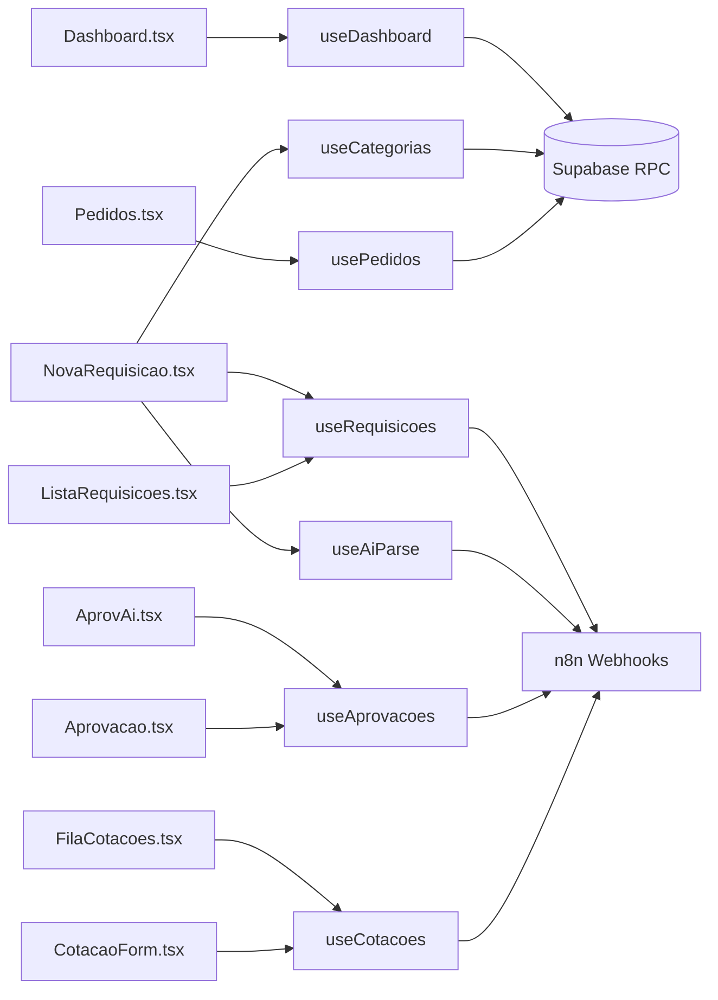

# Hooks Customizados — TEG+ ERP

> Todos os hooks usam **TanStack Query v5** para cache, refetch e loading states.

---

## `useDashboard`

**Arquivo:** `src/hooks/useDashboard.ts`

**Responsabilidade:** Busca KPIs, pipeline e dados agregados do dashboard.

```ts
const { kpis, porStatus, porObra, recentes, isLoading } = useDashboard({
  periodo: '30d',   // '7d' | '30d' | '90d'
  obra_id?: string
})
```

**Estratégia de fetch:**
1. Tenta RPC `get_dashboard_compras(p_periodo, p_obra_id)` — retorna JSON agregado
2. Fallback: queries SQL diretas se RPC falhar
3. Cache: `staleTime: 30s`, refetch a cada `60s`
4. Realtime: subscription em `requisicoes` e `aprovacoes`

**Retorno:**
```ts
{
  kpis: {
    total: number
    pendentes: number
    aprovadas: number
    em_cotacao: number
    valor_total: number
    valor_aprovado: number
  }
  porStatus: { status: string; count: number }[]
  porObra: { obra: string; count: number; valor: number }[]
  recentes: Requisicao[]
}
```

---

## `useRequisicoes`

**Arquivo:** `src/hooks/useRequisicoes.ts`

**Responsabilidade:** CRUD completo de requisições.

```ts
const {
  requisicoes,
  isLoading,
  criarRequisicao,
  isCreating
} = useRequisicoes({ status?, obra_id?, page?, limit? })
```

**Queries:**
- `GET` — lista com filtros, paginada
- Query key: `['requisicoes', filtros]`

**Mutations:**
```ts
criarRequisicao(payload) // → n8n POST /compras/requisicao
                         //   ou Supabase direto (fallback)
```

**Invalidação:** após mutação invalida `['requisicoes']` e `['dashboard']`

---

## `useAprovacoes`

**Arquivo:** `src/hooks/useAprovacoes.ts`

**Responsabilidade:** Listagem e processamento de aprovações.

```ts
const { aprovacoes, processar } = useAprovacoes({
  aprovador_id?: string
  status?: 'pendente' | 'aprovada' | 'rejeitada'
})
```

**Mutations:**
```ts
processar({ token, decisao, observacao })
// → n8n POST /compras/aprovacao
```

---

## `useCotacoes`

**Arquivo:** `src/hooks/useCotacoes.ts`

**Responsabilidade:** Fila de cotações do comprador.

```ts
const { fila, cotacao, submeter } = useCotacoes(id?)
```

**Queries:**
- Lista: todas cotações pendentes do comprador logado
- Detalhe: cotação específica por ID com itens

**Mutations:**
```ts
submeter(cotacaoData)  // → n8n POST /compras/cotacao
```

---

## `usePedidos`

**Arquivo:** `src/hooks/usePedidos.ts`

**Responsabilidade:** Listagem de pedidos de compra gerados.

```ts
const { pedidos, isLoading } = usePedidos({ obra_id?, status? })
```

**Fonte:** Tabela `cmp_pedidos` via Supabase direto

---

## `useCategorias`

**Arquivo:** `src/hooks/useCategorias.ts`

**Responsabilidade:** Lista de categorias com regras e compradores.

```ts
const { categorias } = useCategorias()
```

**Fonte:** Tabela `cmp_categorias` via Supabase
**Cache:** `staleTime: Infinity` (dados estáticos)

**Retorno por categoria:**
```ts
{
  id, codigo, nome,
  comprador_nome, comprador_email,
  alcada1_limite,
  cotacoes_regras,   // "1 cotação até R$1k..."
  keywords,          // para AI detection
  icone, cor
}
```

---

## `useAiParse`

**Arquivo:** `src/hooks/useAiParse.ts`

**Responsabilidade:** Parseia texto livre para requisição estruturada.

```ts
const { parse, resultado, isParsing } = useAiParse()

// Uso
parse({
  texto: "Preciso de 10 capacetes e 5 pares de luvas para obra de Frutal",
  solicitante_nome: "João Silva"
})
```

**Fluxo:**
1. Envia para `POST /compras/requisicao-ai` no n8n
2. n8n usa LLM para extrair itens
3. Fallback: parser local por keywords se n8n indisponível

**Retorno:**
```ts
{
  itens: { descricao, quantidade, unidade, categoria_sugerida }[]
  obra_sugerida: string
  categoria_sugerida: string
  comprador_sugerido: string
  confianca: number  // 0-1
  observacoes: string
}
```

---

## Diagrama de Dependências



---

## Links Relacionados

- [[02 - Frontend Stack]] — TanStack Query setup
- [[06 - Supabase]] — Fonte de dados
- [[10 - n8n Workflows]] — Webhooks chamados pelas mutations
- [[11 - Fluxo Requisição]] — Fluxo de criação
- [[12 - Fluxo Aprovação]] — Fluxo de aprovação
