# Schema do Banco de Dados - TEG+ ERP

> **82 objetos** no schema `public`: 79 tabelas + 3 views
> **~100 foreign keys** interligando todos os modulos
> Atualizado em 2026-03-08

---

## Indice de Modulos

| Prefixo | Modulo | Tabelas | Descricao |
|---------|--------|---------|-----------|
| `sys_` | Sistema | 11 | Usuarios, obras, config, logs, convites, pre-cadastros |
| `cmp_` | Compras | 11 | Requisicoes, cotacoes, pedidos, recebimentos, fornecedores |
| `apr_` | Aprovacoes | 2 | Alcadas e aprovacoes multi-nivel |
| `fin_` | Financeiro | 7 | CP, CR, classes, categorias, grupos, sync, docs |
| `est_` | Estoque | 8 | Itens, bases, saldos, movimentacoes, inventario, solicitacoes |
| `log_` | Logistica | 9 | Solicitacoes, transportes, NF-e, rotas, transportadoras |
| `fro_` | Frotas | 10 | Veiculos, OS, checklists, abastecimentos, telemetria |
| `con_` | Contratos | 5 | Contratos, clientes, parcelas, itens, anexos |
| `pat_` | Patrimonial | 4 | Imobilizados, depreciacoes, movimentacoes, termos |
| `fis_` | Fiscal | 2 | Notas fiscais, solicitacoes NF |
| `rh_` | RH | 1 | Colaboradores |
| `mural_` | Mural | 1 | Banners do slideshow |
| — | Cache/AI | 2 | cache_consultas, n8n_chat_histories |

---

## Diagrama ER - Visao Geral Inter-Modulos

```mermaid
erDiagram
    %% === SISTEMA ===
    sys_obras ||--o{ cmp_requisicoes : "tem requisicoes"
    sys_obras ||--o{ sys_usuarios : "aloca usuarios"
    sys_obras ||--o{ sys_centros_custo : "possui CC"
    sys_obras ||--o{ con_contratos : "vincula contratos"
    sys_obras ||--o{ rh_colaboradores : "tem colaboradores"
    sys_obras ||--o{ fis_notas_fiscais : "recebe NFs"

    sys_usuarios ||--o{ cmp_requisicoes : "cria"
    sys_usuarios ||--o{ apr_aprovacoes : "aprova"
    sys_usuarios ||--o{ sys_log_atividades : "registra acoes"

    sys_perfis ||--o{ sys_convites : "convida"
    sys_perfis ||--o{ sys_whatsapp_log : "envia msgs"

    sys_empresas ||--o{ sys_centros_custo : "agrupa CC"
    sys_empresas ||--o{ fis_notas_fiscais : "emite NFs"

    %% === COMPRAS ===
    cmp_requisicoes ||--o{ cmp_requisicao_itens : "contem itens"
    cmp_requisicoes ||--o{ cmp_cotacoes : "gera cotacao"
    cmp_requisicoes ||--o{ cmp_pedidos : "gera pedido"
    cmp_requisicoes ||--o{ apr_aprovacoes : "requer aprovacao"
    cmp_requisicoes ||--o{ fin_contas_pagar : "gera CP"

    cmp_cotacoes ||--o{ cmp_cotacao_fornecedores : "recebe propostas"
    cmp_pedidos ||--o{ cmp_pedidos_anexos : "tem anexos"
    cmp_pedidos ||--o{ cmp_recebimentos : "gera recebimento"
    cmp_pedidos ||--o{ fin_contas_pagar : "gera CP"

    cmp_recebimentos ||--o{ cmp_recebimento_itens : "confere itens"
    cmp_recebimento_itens ||--o{ est_movimentacoes : "da entrada"
    cmp_recebimento_itens ||--o{ pat_imobilizados : "imobiliza"

    cmp_fornecedores ||--o{ cmp_pedidos : "fornece"
    cmp_fornecedores ||--o{ fin_contas_pagar : "recebe pgto"
    cmp_fornecedores ||--o{ con_contratos : "contrata"
    cmp_fornecedores ||--o{ fis_notas_fiscais : "emite NF"

    cmp_compradores ||--o{ cmp_requisicoes : "atende"
    cmp_compradores ||--o{ cmp_cotacoes : "processa"
    cmp_compradores ||--o{ cmp_pedidos : "emite PO"

    %% === FINANCEIRO ===
    fin_grupos_financeiros ||--o{ fin_categorias_financeiras : "agrupa"
    fin_categorias_financeiras ||--o{ fin_classes_financeiras : "classifica"
    fin_classes_financeiras ||--o{ fis_notas_fiscais : "classifica NF"

    %% === ESTOQUE ===
    est_itens ||--o{ est_movimentacoes : "movimenta"
    est_itens ||--o{ est_saldos : "tem saldo"
    est_itens ||--o{ est_inventario_itens : "inventariado"
    est_bases ||--o{ est_localizacoes : "tem locais"
    est_bases ||--o{ est_saldos : "armazena"
    est_bases ||--o{ fro_veiculos : "aloca veiculos"
    est_bases ||--o{ pat_imobilizados : "guarda ativos"

    %% === LOGISTICA ===
    log_solicitacoes ||--o{ log_transportes : "gera transporte"
    log_solicitacoes ||--o{ log_nfe : "emite NF-e"
    log_solicitacoes ||--o{ log_recebimentos : "confirma entrega"
    log_solicitacoes ||--o{ log_ocorrencias : "registra problemas"
    log_transportadoras ||--o{ log_rotas : "opera rotas"
    log_transportadoras ||--o{ log_solicitacoes : "transporta"

    %% === FROTAS ===
    fro_veiculos ||--o{ fro_ordens_servico : "tem OS"
    fro_veiculos ||--o{ fro_abastecimentos : "abastece"
    fro_veiculos ||--o{ fro_checklists : "verifica"
    fro_veiculos ||--o{ fro_planos_preventiva : "tem plano"
    fro_veiculos ||--o{ fro_ocorrencias_telemetria : "monitora"
    fro_fornecedores ||--o{ fro_ordens_servico : "executa OS"
    fro_ordens_servico ||--o{ fro_itens_os : "lista pecas"
    fro_ordens_servico ||--o{ fro_cotacoes_os : "recebe orcamentos"

    %% === CONTRATOS ===
    con_contratos ||--o{ con_contrato_itens : "detalha itens"
    con_contratos ||--o{ con_parcelas : "gera parcelas"
    con_parcelas }o--|| fin_contas_pagar : "vincula CP"
    con_parcelas }o--|| fin_contas_receber : "vincula CR"
    con_clientes ||--o{ con_contratos : "assina"

    %% === PATRIMONIAL ===
    pat_imobilizados ||--o{ pat_depreciacoes : "deprecia"
    pat_imobilizados ||--o{ pat_movimentacoes : "transfere"
    pat_imobilizados ||--o{ pat_termos_responsabilidade : "assina termo"
```



---

## 1. Sistema (`sys_*`) - 11 tabelas

### `sys_obras`
Central do sistema - toda operacao vincula-se a uma obra.

| Coluna | Tipo | Null | Default | Descricao |
|--------|------|------|---------|-----------|
| `id` | UUID | PK | gen_random_uuid() | Identificador |
| `codigo` | VARCHAR | NOT NULL | — | Ex: SE-FRU, SE-PAR |
| `nome` | VARCHAR | NOT NULL | — | Nome completo da SE |
| `municipio` | VARCHAR | — | — | Municipio |
| `uf` | VARCHAR | — | 'MG' | Estado |
| `status` | VARCHAR | — | 'ativa' | ativa/concluida/paralisada |
| `responsavel_nome` | VARCHAR | — | — | Nome do responsavel |
| `responsavel_email` | VARCHAR | — | — | Email do responsavel |
| `centro_custo_id` | UUID | FK | — | → sys_centros_custo |
| `created_at` | TIMESTAMPTZ | — | now() | — |
| `updated_at` | TIMESTAMPTZ | — | now() | — |

**FK recebidas:** cmp_requisicoes.obra_id, cmp_requisicoes.projeto_id, cmp_pedidos.projeto_id, fin_contas_pagar.projeto_id, fin_contas_receber.projeto_id, con_contratos.obra_id, fis_notas_fiscais.obra_id, sys_usuarios.obra_id, sys_centros_custo.obra_id, rh_colaboradores.obra_id

---

### `sys_perfis`
Perfil completo do usuario (tabela principal de identidade).

| Coluna | Tipo | Null | Default | Descricao |
|--------|------|------|---------|-----------|
| `id` | UUID | PK | gen_random_uuid() | Identificador |
| `auth_id` | UUID | FK | — | → auth.users (Supabase Auth) |
| `nome` | TEXT | NOT NULL | — | Nome completo |
| `email` | TEXT | NOT NULL | — | Email unico |
| `cargo` | TEXT | — | — | Cargo/funcao |
| `departamento` | TEXT | — | — | Departamento |
| `avatar_url` | TEXT | — | — | URL da foto |
| `role` | TEXT | NOT NULL | 'requisitante' | admin/gerente/aprovador/comprador/requisitante/visitante |
| `alcada_nivel` | INTEGER | NOT NULL | 0 | Nivel de alcada 0-4 |
| `modulos` | JSONB | NOT NULL | {"compras":true} | Modulos habilitados |
| `preferencias` | JSONB | NOT NULL | {} | Preferencias UI |
| `telefone` | TEXT | — | — | Telefone |
| `ativo` | BOOLEAN | NOT NULL | true | Ativo |
| `ultimo_acesso` | TIMESTAMPTZ | — | — | Ultimo login |
| `created_at` | TIMESTAMPTZ | NOT NULL | now() | — |
| `updated_at` | TIMESTAMPTZ | NOT NULL | now() | — |

**FK recebidas:** sys_convites.convidado_por, sys_whatsapp_log.perfil_id

---

### `sys_usuarios`
Tabela legada de usuarios (usada por modulos antigos).

| Coluna | Tipo | Null | Default | Descricao |
|--------|------|------|---------|-----------|
| `id` | UUID | PK | gen_random_uuid() | Identificador |
| `auth_id` | UUID | — | — | Supabase Auth ID |
| `nome` | VARCHAR | NOT NULL | — | Nome |
| `email` | VARCHAR | NOT NULL | — | Email |
| `cargo` | VARCHAR | — | — | Cargo |
| `departamento` | VARCHAR | — | — | Departamento |
| `obra_id` | UUID | FK | — | → sys_obras |
| `nivel_alcada` | INTEGER | — | 0 | Nivel 0-4 |
| `telefone` | VARCHAR | — | — | Telefone |
| `ativo` | BOOLEAN | — | true | — |
| `created_at` | TIMESTAMPTZ | — | now() | — |
| `updated_at` | TIMESTAMPTZ | — | now() | — |

**FK recebidas:** cmp_requisicoes.solicitante_id, cmp_compradores.usuario_id, apr_aprovacoes.aprovador_id, apr_alcadas.aprovador_padrao_id, sys_log_atividades.usuario_id, cmp_recebimentos.recebido_por

---

### `sys_empresas`
Empresas do grupo TEG.

| Coluna | Tipo | Descricao |
|--------|------|-----------|
| `id` | UUID PK | Identificador |
| `codigo` | TEXT NOT NULL | Codigo da empresa |
| `razao_social` | TEXT NOT NULL | Razao social |
| `nome_fantasia` | TEXT | Nome fantasia |
| `cnpjs` | TEXT[] | Array de CNPJs |
| `ativo` | BOOLEAN | Default true |

**FK recebidas:** sys_centros_custo.empresa_id, fis_notas_fiscais.empresa_id

---

### `sys_centros_custo`
Centros de custo vinculados a obras e empresas.

| Coluna | Tipo | Descricao |
|--------|------|-----------|
| `id` | UUID PK | Identificador |
| `codigo` | TEXT NOT NULL | Codigo do CC |
| `descricao` | TEXT NOT NULL | Descricao |
| `obra_id` | UUID FK | → sys_obras |
| `empresa_id` | UUID FK | → sys_empresas |
| `ativo` | BOOLEAN | Default true |

**FK recebidas:** sys_obras.centro_custo_id, fis_notas_fiscais.centro_custo_id

---

### `sys_log_atividades`
Auditoria de acoes em todos os modulos.

| Coluna | Tipo | Descricao |
|--------|------|-----------|
| `id` | UUID PK | — |
| `modulo` | VARCHAR NOT NULL | 'cmp', 'fin', 'est', etc. |
| `entidade_tipo` | VARCHAR | Tipo da entidade |
| `entidade_id` | UUID | ID da entidade |
| `tipo` | VARCHAR NOT NULL | Tipo do evento |
| `descricao` | TEXT | Descricao do evento |
| `usuario_id` | UUID FK | → sys_usuarios |
| `usuario_nome` | VARCHAR | Nome do usuario |
| `dados` | JSONB | Detalhes extras |
| `created_at` | TIMESTAMPTZ | — |

---

### `sys_convites`
Convites para novos usuarios com roles pre-definidos.

| Coluna | Tipo | Descricao |
|--------|------|-----------|
| `id` | UUID PK | — |
| `email` | TEXT NOT NULL | Email do convidado |
| `role` | TEXT NOT NULL | Role atribuido |
| `alcada_nivel` | INTEGER | Nivel 0-4 |
| `modulos` | JSONB | Modulos habilitados |
| `nome_sugerido` | TEXT | Nome sugerido |
| `convidado_por` | UUID FK | → sys_perfis |
| `aceito` | BOOLEAN | Default false |
| `expires_at` | TIMESTAMPTZ | Expira em 7 dias |

---

### `sys_configuracoes` / `sys_config`
Duas tabelas de configuracao do sistema (legado + nova).

| Tabela | Chave PK | Valor | Uso |
|--------|---------|-------|-----|
| sys_configuracoes | `chave` VARCHAR | TEXT | Contador RC, configs gerais |
| sys_config | `chave` VARCHAR | TEXT | Omie keys (via get_omie_config()) |

---

### `sys_pre_cadastros`
Staging area para cadastros solicitados pelo SuperTEG AI.

| Coluna | Tipo | Descricao |
|--------|------|-----------|
| `id` | UUID PK | — |
| `entidade` | TEXT NOT NULL | fornecedor/transportadora/item_estoque |
| `tabela_destino` | TEXT NOT NULL | cmp_fornecedores/log_transportadoras/etc |
| `dados` | JSONB NOT NULL | Dados do cadastro |
| `status` | TEXT NOT NULL | pendente/aprovado/rejeitado |
| `solicitado_por` | UUID | Quem solicitou |
| `solicitante_nome` | TEXT | Nome do solicitante |
| `revisado_por` | UUID | Admin que revisou |
| `revisor_nome` | TEXT | Nome do revisor |
| `motivo_rejeicao` | TEXT | Se rejeitado |

---

### `sys_feedbacks`
Feedbacks e bug reports do SuperTEG AI.

| Coluna | Tipo | Descricao |
|--------|------|-----------|
| `id` | UUID PK | — |
| `tipo` | TEXT NOT NULL | bug/sugestao/melhoria |
| `titulo` | TEXT NOT NULL | Titulo |
| `descricao` | TEXT | Descricao detalhada |
| `modulo` | TEXT | Modulo afetado |
| `prioridade` | TEXT | baixa/media/alta/critica |
| `status` | TEXT | aberto/em_progresso/fechado |
| `criado_por` | UUID | ID do usuario |
| `session_id` | TEXT | Sessao do chat |

---

### `sys_whatsapp_log`
Log de mensagens WhatsApp enviadas/recebidas.

| Coluna | Tipo | Descricao |
|--------|------|-----------|
| `id` | UUID PK | — |
| `perfil_id` | UUID FK | → sys_perfis |
| `direcao` | TEXT NOT NULL | entrada/saida |
| `telefone` | TEXT NOT NULL | Numero |
| `mensagem` | TEXT | Conteudo |
| `tipo` | TEXT | text/image/document |
| `dados_extra` | JSONB | Metadados |

---

## 2. Compras (`cmp_*`) - 11 tabelas

### `cmp_requisicoes`
Requisicoes de compra - ponto de partida do fluxo.

| Coluna | Tipo | Descricao |
|--------|------|-----------|
| `id` | UUID PK | — |
| `numero` | VARCHAR NOT NULL | RC-YYYYMM-XXXX |
| `solicitante_id` | UUID FK | → sys_usuarios |
| `solicitante_nome` | VARCHAR NOT NULL | Nome do solicitante |
| `obra_id` | UUID FK | → sys_obras |
| `obra_nome` | VARCHAR | Nome da obra |
| `projeto_id` | UUID FK | → sys_obras (alias) |
| `comprador_id` | UUID FK | → cmp_compradores |
| `categoria` | VARCHAR | Categoria atribuida |
| `classe_financeira` | VARCHAR | Classe financeira |
| `centro_custo` | VARCHAR | Centro de custo |
| `descricao` | TEXT NOT NULL | Descricao da necessidade |
| `justificativa` | TEXT | Justificativa |
| `texto_original` | TEXT | Texto bruto (AI parse) |
| `ai_confianca` | NUMERIC | Confianca do AI parse 0-1 |
| `valor_estimado` | NUMERIC NOT NULL | Valor total estimado |
| `urgencia` | ENUM | normal/urgente/critica |
| `status` | ENUM | rascunho→pendente→em_aprovacao→aprovada→... |
| `alcada_nivel` | INTEGER NOT NULL | Nivel de alcada 1-4 |
| `alcada_atual` | INTEGER | Nivel sendo aprovado |
| `data_necessidade` | DATE | Quando precisa |
| `data_aprovacao` | TIMESTAMPTZ | Quando foi aprovada |
| `esclarecimento_msg` | TEXT | Pedido de esclarecimento |
| `esclarecimento_por` | VARCHAR | Quem pediu |
| `created_at` | TIMESTAMPTZ | — |
| `updated_at` | TIMESTAMPTZ | — |

**FK enviadas:** solicitante_id → sys_usuarios, obra_id → sys_obras, projeto_id → sys_obras, comprador_id → cmp_compradores
**FK recebidas:** cmp_requisicao_itens, cmp_cotacoes, cmp_pedidos, cmp_historico_status, apr_aprovacoes, fin_contas_pagar

---

### `cmp_requisicao_itens`
Itens individuais de cada requisicao.

| Coluna | Tipo | Descricao |
|--------|------|-----------|
| `id` | UUID PK | — |
| `requisicao_id` | UUID FK | → cmp_requisicoes |
| `descricao` | VARCHAR NOT NULL | Descricao do item |
| `quantidade` | NUMERIC NOT NULL | Quantidade |
| `unidade` | VARCHAR NOT NULL | UN, M, KG, etc. |
| `valor_unitario_estimado` | NUMERIC | Preco estimado |
| `valor_total_estimado` | NUMERIC | Calculado |
| `observacao` | TEXT | Detalhes tecnicos |

**FK recebidas:** cmp_recebimento_itens.requisicao_item_id

---

### `cmp_compradores`
Compradores responsaveis por categorias.

| Coluna | Tipo | Descricao |
|--------|------|-----------|
| `id` | UUID PK | — |
| `usuario_id` | UUID FK | → sys_usuarios |
| `nome` | VARCHAR NOT NULL | Nome |
| `email` | VARCHAR NOT NULL | Email |
| `telefone` | VARCHAR | Telefone |
| `categorias` | TEXT[] | Categorias atendidas |
| `ativo` | BOOLEAN | Default true |

**FK recebidas:** cmp_requisicoes.comprador_id, cmp_cotacoes.comprador_id, cmp_pedidos.comprador_id

---

### `cmp_categorias`
Categorias de compra com regras de cotacao.

| Coluna | Tipo | Descricao |
|--------|------|-----------|
| `id` | UUID PK | — |
| `codigo` | VARCHAR NOT NULL | Ex: ELE, MEC, CIV |
| `nome` | VARCHAR NOT NULL | Nome |
| `keywords` | TEXT[] | Palavras-chave AI |
| `cor` | VARCHAR | Cor hex |
| `icone` | VARCHAR | Icone Lucide |
| `comprador_nome` | TEXT | Comprador responsavel |
| `alcada1_limite` | NUMERIC | Limite alcada 1 |
| `cotacoes_regras` | JSONB | Regras min cotacoes |
| `politica_resumo` | TEXT | Resumo da politica |

---

### `cmp_cotacoes`
Processos de cotacao vinculados a requisicoes.

| Coluna | Tipo | Descricao |
|--------|------|-----------|
| `id` | UUID PK | — |
| `requisicao_id` | UUID FK | → cmp_requisicoes |
| `comprador_id` | UUID FK | → cmp_compradores |
| `fornecedor_selecionado_id` | UUID FK | → cmp_cotacao_fornecedores |
| `status` | ENUM | pendente/em_andamento/concluida/cancelada |
| `valor_selecionado` | NUMERIC | Valor vencedor |
| `fornecedor_selecionado_nome` | VARCHAR | Nome vencedor |
| `data_limite` | TIMESTAMPTZ | Prazo |
| `sem_cotacoes_minimas` | BOOLEAN | Bypass |
| `justificativa_sem_cotacoes` | TEXT | Justificativa |

---

### `cmp_cotacao_fornecedores`
Propostas de fornecedores em cada cotacao.

| Coluna | Tipo | Descricao |
|--------|------|-----------|
| `id` | UUID PK | — |
| `cotacao_id` | UUID FK | → cmp_cotacoes |
| `fornecedor_nome` | VARCHAR NOT NULL | Nome |
| `fornecedor_cnpj` | VARCHAR | CNPJ |
| `valor_total` | NUMERIC | Valor da proposta |
| `prazo_entrega_dias` | INTEGER | Prazo |
| `condicao_pagamento` | VARCHAR | 30/60/90 |
| `itens_precos` | JSONB | Precos por item |
| `selecionado` | BOOLEAN | Vencedor? |

---

### `cmp_pedidos`
Pedidos de compra (PO) gerados apos cotacao.

| Coluna | Tipo | Descricao |
|--------|------|-----------|
| `id` | UUID PK | — |
| `requisicao_id` | UUID FK | → cmp_requisicoes |
| `cotacao_id` | UUID FK | → cmp_cotacoes |
| `comprador_id` | UUID FK | → cmp_compradores |
| `fornecedor_id` | UUID FK | → cmp_fornecedores |
| `projeto_id` | UUID FK | → sys_obras |
| `numero_pedido` | VARCHAR | PO-AAAA-NNNNN |
| `fornecedor_nome` | TEXT NOT NULL | Nome |
| `valor_total` | NUMERIC | Valor contratado |
| `status` | TEXT NOT NULL | emitido/confirmado/em_entrega/entregue/cancelado |
| `data_pedido` | DATE | Data emissao |
| `data_prevista_entrega` | DATE | Prazo |
| `data_entrega_real` | DATE | Entrega efetiva |
| `nf_numero` | TEXT | Numero NF |
| `status_pagamento` | VARCHAR | null/liberado/pago |
| `liberado_pagamento_em` | TIMESTAMPTZ | Quando liberado |
| `liberado_pagamento_por` | TEXT | Quem liberou |
| `pago_em` | TIMESTAMPTZ | Quando pago |
| `qtd_itens_total` | INTEGER | Total itens |
| `qtd_itens_recebidos` | INTEGER | Itens conferidos |

**FK recebidas:** cmp_pedidos_anexos, cmp_recebimentos, fin_contas_pagar.pedido_id, fis_notas_fiscais.pedido_id

---

### `cmp_pedidos_anexos`
Documentos anexados a pedidos.

| Coluna | Tipo | Descricao |
|--------|------|-----------|
| `id` | UUID PK | — |
| `pedido_id` | UUID FK | → cmp_pedidos |
| `tipo` | VARCHAR NOT NULL | nota_fiscal/comprovante_entrega/medicao/etc |
| `nome_arquivo` | TEXT NOT NULL | Nome do arquivo |
| `url` | TEXT NOT NULL | URL no Storage |
| `origem` | VARCHAR | compras/financeiro |
| `uploaded_by_nome` | TEXT | Quem enviou |

---

### `cmp_fornecedores`
Cadastro central de fornecedores.

| Coluna | Tipo | Descricao |
|--------|------|-----------|
| `id` | UUID PK | — |
| `razao_social` | TEXT NOT NULL | Razao social |
| `nome_fantasia` | TEXT | Nome fantasia |
| `cnpj` | VARCHAR | CNPJ |
| `inscricao_estadual` | VARCHAR | IE |
| `endereco` | TEXT | Endereco completo |
| `cidade` | VARCHAR | Cidade |
| `uf` | VARCHAR | UF |
| `cep` | VARCHAR | CEP |
| `telefone` | VARCHAR | Telefone |
| `email` | VARCHAR | Email |
| `contato_nome` | VARCHAR | Nome do contato |
| `banco_codigo` | VARCHAR | Codigo banco |
| `banco_nome` | VARCHAR | Nome banco |
| `agencia` | VARCHAR | Agencia |
| `conta` | VARCHAR | Conta |
| `tipo_conta` | VARCHAR | corrente/poupanca |
| `pix_chave` | VARCHAR | Chave PIX |
| `pix_tipo` | VARCHAR | Tipo PIX |
| `omie_id` | BIGINT | ID no Omie |
| `ativo` | BOOLEAN | Default true |

**FK recebidas:** cmp_pedidos.fornecedor_id, fin_contas_pagar.fornecedor_id, con_contratos.fornecedor_id, fis_notas_fiscais.fornecedor_id, fis_solicitacoes_nf.fornecedor_id

---

### `cmp_recebimentos`
Recebimentos fisicos de pedidos.

| Coluna | Tipo | Descricao |
|--------|------|-----------|
| `id` | UUID PK | — |
| `pedido_id` | UUID FK | → cmp_pedidos |
| `base_id` | UUID FK | → est_bases |
| `recebido_por` | UUID FK | → sys_usuarios (auth.uid()) |
| `nf_numero` | TEXT | Numero NF |
| `nf_chave` | TEXT | Chave NF-e |
| `data_recebimento` | TIMESTAMPTZ | Data |
| `observacao` | TEXT | — |

---

### `cmp_recebimento_itens`
Itens conferidos no recebimento.

| Coluna | Tipo | Descricao |
|--------|------|-----------|
| `id` | UUID PK | — |
| `recebimento_id` | UUID FK | → cmp_recebimentos |
| `requisicao_item_id` | UUID FK | → cmp_requisicao_itens |
| `item_estoque_id` | UUID FK | → est_itens |
| `descricao` | TEXT NOT NULL | Descricao |
| `quantidade_esperada` | NUMERIC NOT NULL | Qtd esperada |
| `quantidade_recebida` | NUMERIC NOT NULL | Qtd conferida |
| `tipo_destino` | TEXT NOT NULL | consumo/imobilizado |
| `lote` | TEXT | Lote |
| `numero_serie` | TEXT | Serie |
| `data_validade` | DATE | Validade |

**FK recebidas:** est_movimentacoes.recebimento_item_id, pat_imobilizados.recebimento_item_id

---

### `cmp_historico_status`
Historico de mudancas de status das requisicoes.

| Coluna | Tipo | Descricao |
|--------|------|-----------|
| `id` | UUID PK | — |
| `requisicao_id` | UUID FK | → cmp_requisicoes |
| `status_anterior` | TEXT | Status antes |
| `status_novo` | TEXT NOT NULL | Status depois |
| `responsavel_nome` | TEXT | Quem mudou |
| `responsavel_tipo` | TEXT | sistema/usuario/aprovador |
| `dados_extra` | JSONB | Metadados |

---

### `cmp_anexos`
Anexos genericos de compras (OCR/LLM).

| Coluna | Tipo | Descricao |
|--------|------|-----------|
| `id` | UUID PK | — |
| `entidade_tipo` | TEXT NOT NULL | requisicao/cotacao/pedido |
| `entidade_id` | UUID NOT NULL | ID da entidade |
| `tipo_doc` | TEXT NOT NULL | nota_fiscal/orcamento/outros |
| `nome_arquivo` | TEXT NOT NULL | Nome |
| `url` | TEXT NOT NULL | URL |
| `ocr_status` | TEXT NOT NULL | pendente/processando/concluido/erro |
| `ocr_texto` | TEXT | Texto extraido |
| `llm_dados` | JSONB | Dados parseados pelo LLM |

---

## 3. Aprovacoes (`apr_*`) - 2 tabelas

### `apr_alcadas`
Definicao dos niveis de alcada por valor.

| Coluna | Tipo | Descricao |
|--------|------|-----------|
| `id` | UUID PK | — |
| `nivel` | INTEGER NOT NULL | 1 a 4 |
| `nome` | VARCHAR NOT NULL | Coordenador/Gerente/Diretor/Presidente |
| `descricao` | TEXT | Descricao |
| `valor_min` | NUMERIC | Valor minimo |
| `valor_max` | NUMERIC | Valor maximo |
| `aprovador_padrao_id` | UUID FK | → sys_usuarios |
| `prazo_horas` | INTEGER | Default 48h |
| `ativo` | BOOLEAN | Default true |

**FK recebidas:** apr_aprovacoes.alcada_id

---

### `apr_aprovacoes`
Registro de cada aprovacao individual (multi-modulo).

| Coluna | Tipo | Descricao |
|--------|------|-----------|
| `id` | UUID PK | — |
| `modulo` | VARCHAR NOT NULL | 'cmp' default |
| `entidade_id` | UUID NOT NULL | ID da entidade |
| `entidade_numero` | VARCHAR | Numero da entidade |
| `entity_type` | VARCHAR | requisicao/contrato/etc |
| `entity_id` | UUID | ID alternativo |
| `aprovador_id` | UUID FK | → sys_usuarios |
| `aprovador_nome` | VARCHAR NOT NULL | Nome |
| `aprovador_email` | VARCHAR NOT NULL | Email |
| `nivel` | INTEGER NOT NULL | Nivel 1-4 |
| `alcada_id` | UUID FK | → apr_alcadas |
| `status` | ENUM | pendente/aprovada/rejeitada/expirada |
| `token` | VARCHAR NOT NULL | Token unico para link externo |
| `observacao` | TEXT | Comentario |
| `data_limite` | TIMESTAMPTZ | Prazo |
| `data_decisao` | TIMESTAMPTZ | Quando decidiu |

---

## 4. Financeiro (`fin_*`) - 7 tabelas

### `fin_contas_pagar`
Contas a pagar - vinculadas a pedidos, requisicoes e fornecedores.

| Coluna | Tipo | Descricao |
|--------|------|-----------|
| `id` | UUID PK | — |
| `pedido_id` | UUID FK | → cmp_pedidos |
| `requisicao_id` | UUID FK | → cmp_requisicoes |
| `fornecedor_id` | UUID FK | → cmp_fornecedores |
| `projeto_id` | UUID FK | → sys_obras |
| `fornecedor_nome` | TEXT NOT NULL | Nome |
| `valor_original` | NUMERIC NOT NULL | Valor original |
| `valor_pago` | NUMERIC | Valor pago |
| `data_emissao` | DATE NOT NULL | Emissao |
| `data_vencimento` | DATE NOT NULL | Vencimento |
| `data_vencimento_orig` | DATE NOT NULL | Vencimento original |
| `data_pagamento` | DATE | Quando pago |
| `centro_custo` | VARCHAR | CC |
| `classe_financeira` | VARCHAR | Classe |
| `natureza` | VARCHAR | material/servico |
| `forma_pagamento` | VARCHAR | Forma pgto |
| `status` | VARCHAR | previsto/aguardando_aprovacao/aprovado/pago/rejeitado |
| `omie_cp_id` | BIGINT | ID no Omie |
| `created_by` | UUID | Criado por |

**FK recebidas:** con_parcelas.fin_cp_id, fis_notas_fiscais.conta_pagar_id

---

### `fin_contas_receber`
Contas a receber de clientes.

| Coluna | Tipo | Descricao |
|--------|------|-----------|
| `id` | UUID PK | — |
| `cliente_nome` | TEXT NOT NULL | Nome |
| `cliente_cnpj` | VARCHAR | CNPJ |
| `valor_original` | NUMERIC NOT NULL | Valor |
| `valor_recebido` | NUMERIC | Recebido |
| `data_vencimento` | DATE NOT NULL | Vencimento |
| `data_recebimento` | DATE | Quando recebeu |
| `projeto_id` | UUID FK | → sys_obras |
| `status` | VARCHAR | previsto/recebido/atrasado/cancelado |
| `omie_cr_id` | BIGINT | ID no Omie |

**FK recebidas:** con_parcelas.fin_cr_id

---

### `fin_grupos_financeiros` → `fin_categorias_financeiras` → `fin_classes_financeiras`
Hierarquia de classificacao financeira em 3 niveis.

```
Grupo (fin_grupos_financeiros)
  └── Categoria (fin_categorias_financeiras) — grupo_id FK
       └── Classe (fin_classes_financeiras) — categoria_id FK
```

| Tabela | Colunas Principais |
|--------|-------------------|
| fin_grupos_financeiros | codigo, descricao, tipo (receita/despesa/ambos) |
| fin_categorias_financeiras | codigo, descricao, grupo_id → fin_grupos |
| fin_classes_financeiras | codigo, descricao, tipo, categoria_id → fin_categorias |

**FK recebidas por fin_classes:** fis_notas_fiscais.classe_id

---

### `fin_documentos`
Documentos financeiros genericos.

| Coluna | Tipo | Descricao |
|--------|------|-----------|
| `id` | UUID PK | — |
| `entity_type` | VARCHAR NOT NULL | cp/cr/pedido |
| `entity_id` | UUID NOT NULL | ID da entidade |
| `tipo` | VARCHAR NOT NULL | Tipo documento |
| `nome_arquivo` | TEXT NOT NULL | Nome |
| `arquivo_url` | TEXT NOT NULL | URL |

---

### `fin_sync_log`
Log de sincronizacao com Omie ERP.

| Coluna | Tipo | Descricao |
|--------|------|-----------|
| `id` | UUID PK | — |
| `dominio` | VARCHAR NOT NULL | fornecedores/contas-pagar/contas-receber |
| `status` | VARCHAR NOT NULL | success/erro/parcial |
| `registros` | INTEGER | Qtd processada |
| `mensagem` | TEXT | Mensagem |
| `executado_por` | VARCHAR | n8n/manual |

---

## 5. Estoque (`est_*`) - 8 tabelas

### `est_itens`
Cadastro mestre de itens de estoque.

| Coluna | Tipo | Descricao |
|--------|------|-----------|
| `id` | UUID PK | — |
| `codigo` | VARCHAR NOT NULL | Codigo unico |
| `descricao` | TEXT NOT NULL | Descricao |
| `descricao_complementar` | TEXT | Complemento |
| `categoria` | VARCHAR | Categoria |
| `subcategoria` | VARCHAR | Subcategoria |
| `unidade` | ENUM | UN/M/KG/L/etc |
| `curva_abc` | ENUM | A/B/C |
| `estoque_minimo` | NUMERIC | Minimo |
| `estoque_maximo` | NUMERIC | Maximo |
| `ponto_reposicao` | NUMERIC | Ponto de reposicao |
| `lead_time_dias` | INTEGER | Lead time |
| `controla_lote` | BOOLEAN | Controla lote? |
| `controla_serie` | BOOLEAN | Controla serie? |
| `tem_validade` | BOOLEAN | Tem validade? |
| `valor_medio` | NUMERIC | Custo medio |
| `valor_ultima_entrada` | NUMERIC | Ultimo custo |
| `ncm` | VARCHAR | NCM fiscal |
| `ativo` | BOOLEAN | Default true |

**FK recebidas:** est_movimentacoes.item_id, est_saldos.item_id, est_inventario_itens.item_id, est_solicitacao_itens.item_id, cmp_recebimento_itens.item_estoque_id

---

### `est_bases`
Almoxarifados/bases fisicas de estoque.

| Coluna | Tipo | Descricao |
|--------|------|-----------|
| `id` | UUID PK | — |
| `codigo` | VARCHAR NOT NULL | Codigo |
| `nome` | VARCHAR NOT NULL | Nome |
| `endereco` | TEXT | Endereco |
| `responsavel` | TEXT | Responsavel |
| `ativa` | BOOLEAN | Default true |

**FK recebidas:** est_localizacoes.base_id, est_movimentacoes.base_id, est_movimentacoes.base_destino_id, est_saldos.base_id, est_inventarios.base_id, est_inventario_itens.base_id, cmp_recebimentos.base_id, fro_veiculos.base_id, pat_imobilizados.base_id, pat_movimentacoes.base_origem_id, pat_movimentacoes.base_destino_id

---

### `est_saldos`
Saldo atual por item + base (UNIQUE item_id + base_id).

| Coluna | Tipo | Descricao |
|--------|------|-----------|
| `id` | UUID PK | — |
| `item_id` | UUID FK | → est_itens |
| `base_id` | UUID FK | → est_bases |
| `saldo` | NUMERIC | Saldo disponivel |
| `saldo_reservado` | NUMERIC | Reservado |
| `ultima_entrada` | TIMESTAMPTZ | Ultima entrada |
| `ultima_saida` | TIMESTAMPTZ | Ultima saida |

---

### `est_movimentacoes`
Todas as movimentacoes de estoque (entrada/saida/transferencia/ajuste).

| Coluna | Tipo | Descricao |
|--------|------|-----------|
| `id` | UUID PK | — |
| `item_id` | UUID FK | → est_itens |
| `base_id` | UUID FK | → est_bases (origem) |
| `base_destino_id` | UUID FK | → est_bases (destino) |
| `localizacao_id` | UUID FK | → est_localizacoes |
| `recebimento_item_id` | UUID FK | → cmp_recebimento_itens |
| `tipo` | ENUM | entrada/saida/transferencia/ajuste/devolucao |
| `quantidade` | NUMERIC NOT NULL | Quantidade |
| `valor_unitario` | NUMERIC | Custo unitario |
| `nf_numero` | VARCHAR | NF referencia |
| `lote` | VARCHAR | Lote |
| `numero_serie` | VARCHAR | Serie |
| `responsavel_nome` | TEXT | Quem movimentou |

---

### `est_localizacoes`
Enderecos dentro de cada base (corredor/prateleira/posicao).

| Coluna | Tipo | Descricao |
|--------|------|-----------|
| `id` | UUID PK | — |
| `base_id` | UUID FK | → est_bases |
| `corredor` | VARCHAR NOT NULL | Corredor |
| `prateleira` | VARCHAR NOT NULL | Prateleira |
| `posicao` | VARCHAR NOT NULL | Posicao |

---

### `est_inventarios` + `est_inventario_itens`
Inventarios ciclicos e gerais com contagem/recontagem.

| Tabela | FK | Descricao |
|--------|-----|-----------|
| est_inventarios | base_id → est_bases | Cabecalho do inventario |
| est_inventario_itens | inventario_id → est_inventarios, item_id → est_itens, base_id → est_bases | Itens contados |

---

### `est_solicitacoes` + `est_solicitacao_itens`
Solicitacoes internas de material (saida de estoque).

| Tabela | FK | Descricao |
|--------|-----|-----------|
| est_solicitacoes | — | Cabecalho da solicitacao |
| est_solicitacao_itens | solicitacao_id → est_solicitacoes, item_id → est_itens | Itens solicitados |

---

## 6. Logistica (`log_*`) - 9 tabelas

### `log_transportadoras`
Cadastro de transportadoras.

| Coluna | Tipo | Descricao |
|--------|------|-----------|
| `id` | UUID PK | — |
| `razao_social` | TEXT NOT NULL | Razao social |
| `nome_fantasia` | TEXT | Fantasia |
| `cnpj` | TEXT NOT NULL | CNPJ |
| `modalidades` | TEXT[] | rodoviario/aereo/etc |
| `avaliacao_media` | NUMERIC | Media avaliacoes |
| `ativo` | BOOLEAN | Default true |

**FK recebidas:** log_rotas.transportadora_id, log_solicitacoes.transportadora_id, log_avaliacoes.transportadora_id

---

### `log_rotas`
Rotas pre-definidas com custos de referencia.

| Coluna | Tipo | Descricao |
|--------|------|-----------|
| `id` | UUID PK | — |
| `nome` | TEXT NOT NULL | Nome |
| `origem` | TEXT NOT NULL | Cidade origem |
| `destino` | TEXT NOT NULL | Cidade destino |
| `distancia_km` | NUMERIC | Distancia |
| `tempo_estimado_h` | NUMERIC | Tempo |
| `custo_referencia` | NUMERIC | Custo base |
| `transportadora_id` | UUID FK | → log_transportadoras |
| `modal_preferencial` | ENUM | Modal preferido |

**FK recebidas:** log_solicitacoes.rota_id, log_solicitacoes.rota_planejada_id

---

### `log_solicitacoes`
Solicitacoes de transporte - 9 etapas.

| Coluna | Tipo | Descricao |
|--------|------|-----------|
| `id` | UUID PK | — |
| `numero` | TEXT | Numero sequencial |
| `tipo` | ENUM NOT NULL | remessa/coleta/transferencia |
| `status` | ENUM | solicitado→validado→programado→em_coleta→em_transito→entregue→... |
| `solicitante_id` | UUID | Quem solicitou |
| `solicitante_nome` | TEXT | Nome |
| `obra_nome` | TEXT | Obra |
| `origem` | TEXT NOT NULL | Endereco origem |
| `destino` | TEXT NOT NULL | Endereco destino |
| `rota_id` | UUID FK | → log_rotas |
| `rota_planejada_id` | UUID FK | → log_rotas |
| `transportadora_id` | UUID FK | → log_transportadoras |
| `data_desejada` | DATE | Data desejada |
| `urgente` | BOOLEAN | Urgente? |
| `modal` | ENUM | Modal selecionado |
| `custo_estimado` | NUMERIC | Custo |

**FK recebidas:** log_transportes, log_nfe, log_recebimentos, log_ocorrencias, log_itens_solicitacao, log_checklists_expedicao, log_avaliacoes, fis_solicitacoes_nf.solicitacao_log_id

---

### `log_transportes`
Execucao do transporte com rastreamento.

| Coluna | Tipo | Descricao |
|--------|------|-----------|
| `id` | UUID PK | — |
| `solicitacao_id` | UUID FK | → log_solicitacoes |
| `placa` | TEXT | Placa do veiculo |
| `motorista_nome` | TEXT | Motorista |
| `latitude_atual` | NUMERIC | GPS lat |
| `longitude_atual` | NUMERIC | GPS long |
| `eta_original` | TIMESTAMPTZ | ETA original |
| `eta_atual` | TIMESTAMPTZ | ETA atualizada |
| `hora_chegada` | TIMESTAMPTZ | Chegada efetiva |

**FK recebidas:** log_ocorrencias.transporte_id

---

### Demais tabelas logistica

| Tabela | FK Principal | Descricao |
|--------|-------------|-----------|
| `log_itens_solicitacao` | solicitacao_id → log_solicitacoes | Itens do transporte |
| `log_nfe` | solicitacao_id → log_solicitacoes | NF-e de transporte |
| `log_recebimentos` | solicitacao_id → log_solicitacoes | Confirmacao de entrega |
| `log_ocorrencias` | transporte_id → log_transportes, solicitacao_id → log_solicitacoes | Avarias, atrasos |
| `log_checklists_expedicao` | solicitacao_id → log_solicitacoes | Checklist de expedicao |
| `log_avaliacoes` | transportadora_id → log_transportadoras, solicitacao_id → log_solicitacoes | Avaliacoes de servico |

---

## 7. Frotas (`fro_*`) - 10 tabelas

### `fro_veiculos`
Frota propria e terceirizada.

| Coluna | Tipo | Descricao |
|--------|------|-----------|
| `id` | UUID PK | — |
| `placa` | TEXT NOT NULL | Placa (UNIQUE) |
| `marca` | TEXT NOT NULL | Marca |
| `modelo` | TEXT NOT NULL | Modelo |
| `ano_fab` | SMALLINT | Ano fabricacao |
| `categoria` | ENUM | passeio/utilitario/caminhao/maquina |
| `combustivel` | ENUM | flex/gasolina/diesel/eletrico |
| `propriedade` | ENUM | propria/locada/comodato |
| `status` | ENUM | disponivel/em_uso/manutencao/inativa |
| `hodometro_atual` | INTEGER NOT NULL | Km atual |
| `base_id` | UUID FK | → est_bases |
| `motorista_responsavel_id` | UUID | Motorista fixo |
| `vencimento_crlv` | DATE | CRLV |
| `vencimento_seguro` | DATE | Seguro |
| `km_proxima_preventiva` | INTEGER | Proxima preventiva |

**FK recebidas:** fro_ordens_servico.veiculo_id, fro_abastecimentos.veiculo_id, fro_checklists.veiculo_id, fro_planos_preventiva.veiculo_id, fro_ocorrencias_telemetria.veiculo_id

---

### `fro_fornecedores`
Fornecedores especificos de frotas (oficinas, postos, etc).

| Coluna | Tipo | Descricao |
|--------|------|-----------|
| `id` | UUID PK | — |
| `razao_social` | TEXT NOT NULL | — |
| `nome_fantasia` | TEXT | — |
| `cnpj` | TEXT | — |
| `tipo` | ENUM | oficina/autopecas/pneus/eletrica/funilaria/posto |
| `avaliacao_media` | NUMERIC | Nota media |

**FK recebidas:** fro_ordens_servico.fornecedor_id, fro_cotacoes_os.fornecedor_id, fro_avaliacoes_fornecedor.fornecedor_id

---

### Demais tabelas frotas

| Tabela | FK Principal | Descricao |
|--------|-------------|-----------|
| `fro_ordens_servico` | veiculo_id → fro_veiculos, fornecedor_id → fro_fornecedores | OS de manutencao |
| `fro_itens_os` | os_id → fro_ordens_servico | Pecas e servicos da OS |
| `fro_cotacoes_os` | os_id → fro_ordens_servico, fornecedor_id → fro_fornecedores | Orcamentos para OS |
| `fro_avaliacoes_fornecedor` | fornecedor_id → fro_fornecedores, os_id → fro_ordens_servico | Avaliacao pos-servico |
| `fro_abastecimentos` | veiculo_id → fro_veiculos | Abastecimentos com desvio |
| `fro_checklists` | veiculo_id → fro_veiculos | Checklist pre/pos viagem |
| `fro_planos_preventiva` | veiculo_id → fro_veiculos | Planos de preventiva |
| `fro_ocorrencias_telemetria` | veiculo_id → fro_veiculos | Excesso velocidade, frenagem brusca |

---

## 8. Contratos (`con_*`) - 5 tabelas

### `con_contratos`
Contratos de receita e despesa vinculados a obras.

| Coluna | Tipo | Descricao |
|--------|------|-----------|
| `id` | UUID PK | — |
| `numero` | TEXT NOT NULL | Numero do contrato |
| `tipo_contrato` | ENUM | receita/despesa/misto |
| `cliente_id` | UUID FK | → con_clientes |
| `fornecedor_id` | UUID FK | → cmp_fornecedores |
| `obra_id` | UUID FK | → sys_obras |
| `objeto` | TEXT NOT NULL | Objeto contratual |
| `valor_total` | NUMERIC | Valor total |
| `valor_aditivos` | NUMERIC | Aditivos |
| `valor_medido` | NUMERIC | Valor ja medido |
| `data_inicio` | DATE NOT NULL | Inicio |
| `data_fim_previsto` | DATE NOT NULL | Fim previsto |
| `recorrencia` | ENUM | mensal/quinzenal/semanal/unica |
| `dia_vencimento` | INTEGER | Dia do vencimento |
| `status` | ENUM | em_negociacao/ativo/suspenso/encerrado/cancelado |

**FK recebidas:** con_contrato_itens.contrato_id, con_parcelas.contrato_id, fis_notas_fiscais.contrato_id

---

### `con_clientes`
Clientes de contratos de receita.

| Coluna | Tipo | Descricao |
|--------|------|-----------|
| `id` | UUID PK | — |
| `nome` | TEXT NOT NULL | Nome |
| `cnpj` | TEXT | CNPJ |
| `tipo` | ENUM | publico/privado/misto |

---

### `con_parcelas`
Parcelas dos contratos com link financeiro.

| Coluna | Tipo | Descricao |
|--------|------|-----------|
| `id` | UUID PK | — |
| `contrato_id` | UUID FK | → con_contratos |
| `numero` | INTEGER NOT NULL | Parcela # |
| `valor` | NUMERIC NOT NULL | Valor |
| `data_vencimento` | DATE NOT NULL | Vencimento |
| `status` | ENUM | previsto/liberado/pago/atrasado |
| `fin_cp_id` | UUID FK | → fin_contas_pagar |
| `fin_cr_id` | UUID FK | → fin_contas_receber |
| `nf_numero` | TEXT | NF |
| `medicao_url` | TEXT | Medicao |

**FK recebidas:** con_parcela_anexos.parcela_id

---

### `con_contrato_itens` / `con_parcela_anexos`

| Tabela | FK | Descricao |
|--------|-----|-----------|
| con_contrato_itens | contrato_id → con_contratos | Itens do contrato (BDI) |
| con_parcela_anexos | parcela_id → con_parcelas | Anexos de medicao/NF/recibo |

---

## 9. Patrimonial (`pat_*`) - 4 tabelas

### `pat_imobilizados`
Ativos imobilizados com depreciacao.

| Coluna | Tipo | Descricao |
|--------|------|-----------|
| `id` | UUID PK | — |
| `numero_patrimonio` | VARCHAR NOT NULL | Plaqueta |
| `descricao` | TEXT NOT NULL | Descricao |
| `categoria` | VARCHAR NOT NULL | Categoria |
| `base_id` | UUID FK | → est_bases |
| `recebimento_item_id` | UUID FK | → cmp_recebimento_itens |
| `status` | ENUM | ativo/em_manutencao/cedido/baixado |
| `valor_aquisicao` | NUMERIC NOT NULL | Valor compra |
| `vida_util_meses` | INTEGER | Vida util |
| `taxa_depreciacao_anual` | NUMERIC | % ao ano |
| `valor_residual` | NUMERIC | Valor residual |
| `valor_atual` | NUMERIC | Valor contabil |

**FK recebidas:** pat_depreciacoes.imobilizado_id, pat_movimentacoes.imobilizado_id, pat_termos_responsabilidade.imobilizado_id

---

### Demais tabelas patrimonial

| Tabela | FK | Descricao |
|--------|-----|-----------|
| `pat_depreciacoes` | imobilizado_id → pat_imobilizados | Calculo mensal de depreciacao |
| `pat_movimentacoes` | imobilizado_id → pat_imobilizados, base_origem_id → est_bases, base_destino_id → est_bases | Transferencias entre bases |
| `pat_termos_responsabilidade` | imobilizado_id → pat_imobilizados | Termos de custodia |

---

## 10. Fiscal (`fis_*`) - 2 tabelas

### `fis_notas_fiscais`
NFs de entrada com multiplas origens (tabela mais conectada do sistema).

| Coluna | Tipo | Descricao |
|--------|------|-----------|
| `id` | UUID PK | — |
| `numero` | TEXT | Numero NF |
| `serie` | TEXT | Serie |
| `chave_acesso` | TEXT | Chave NF-e 44 digitos |
| `data_emissao` | DATE NOT NULL | Emissao |
| `data_entrada` | DATE | Entrada |
| `fornecedor_id` | UUID FK | → cmp_fornecedores |
| `empresa_id` | UUID FK | → sys_empresas |
| `obra_id` | UUID FK | → sys_obras |
| `classe_id` | UUID FK | → fin_classes_financeiras |
| `centro_custo_id` | UUID FK | → sys_centros_custo |
| `pedido_id` | UUID FK | → cmp_pedidos |
| `conta_pagar_id` | UUID FK | → fin_contas_pagar |
| `contrato_id` | UUID FK | → con_contratos |
| `valor_total` | NUMERIC NOT NULL | Valor |
| `origem` | TEXT NOT NULL | avulso/pedido/contrato |
| `pdf_url` | TEXT | PDF |
| `xml_url` | TEXT | XML |

> **8 FKs enviadas** - a tabela mais interconectada do sistema, liga fiscal a compras, financeiro, contratos, estoque e sistema.

---

### `fis_solicitacoes_nf`
Solicitacoes de emissao de NF (logistica → fiscal).

| Coluna | Tipo | Descricao |
|--------|------|-----------|
| `id` | UUID PK | — |
| `status` | ENUM | pendente/em_emissao/emitida/rejeitada |
| `fornecedor_id` | UUID FK | → cmp_fornecedores |
| `nota_fiscal_id` | UUID FK | → fis_notas_fiscais |
| `solicitacao_log_id` | UUID FK | → log_solicitacoes |
| `valor_total` | NUMERIC NOT NULL | Valor |
| `origem` | TEXT NOT NULL | logistica/compras |

---

## 11. RH (`rh_*`) - 1 tabela

### `rh_colaboradores`
Cadastro basico de colaboradores (modulo em desenvolvimento).

| Coluna | Tipo | Descricao |
|--------|------|-----------|
| `id` | UUID PK | — |
| `nome` | TEXT NOT NULL | Nome |
| `cpf` | TEXT | CPF |
| `cargo` | TEXT | Cargo |
| `departamento` | TEXT | Departamento |
| `obra_id` | UUID FK | → sys_obras |
| `email` | TEXT | Email |
| `telefone` | TEXT | Telefone |
| `data_admissao` | DATE | Admissao |
| `ativo` | BOOLEAN | Default true |

---

## 12. Mural (`mural_*`) - 1 tabela

### `mural_banners`
Banners do slideshow da tela inicial.

| Coluna | Tipo | Descricao |
|--------|------|-----------|
| `id` | UUID PK | — |
| `titulo` | TEXT NOT NULL | Titulo |
| `subtitulo` | TEXT | Subtitulo |
| `imagem_url` | TEXT NOT NULL | URL da imagem |
| `tipo` | ENUM | fixa/sazonal/evento |
| `ativo` | BOOLEAN | Default true |
| `ordem` | INTEGER | Ordem de exibicao |
| `data_inicio` | DATE | Inicio exibicao |
| `data_fim` | DATE | Fim exibicao |
| `cor_titulo` | TEXT | Cor hex titulo |
| `cor_subtitulo` | TEXT | Cor hex subtitulo |

---

## 13. Tabelas Auxiliares - 2 tabelas

### `cache_consultas`
Cache de consultas CNPJ/CEP (BrasilAPI).

| Coluna | Tipo | Descricao |
|--------|------|-----------|
| `id` | UUID PK | — |
| `tipo` | TEXT NOT NULL | cnpj/cep |
| `chave` | TEXT NOT NULL | CNPJ ou CEP |
| `dados` | JSONB NOT NULL | Dados retornados |
| `consultado_em` | TIMESTAMPTZ | Quando consultou |
| `expira_em` | TIMESTAMPTZ | Expira em 7 dias |

### `n8n_chat_histories`
Historico de conversas do SuperTEG AI.

| Coluna | Tipo | Descricao |
|--------|------|-----------|
| `id` | SERIAL PK | Auto-increment |
| `session_id` | TEXT NOT NULL | ID da sessao |
| `role` | TEXT NOT NULL | user/assistant |
| `content` | TEXT NOT NULL | Mensagem |
| `created_at` | TIMESTAMPTZ | — |

---

## Mapa Completo de Foreign Keys

### Relacoes entre modulos (cross-module)

```
COMPRAS → SISTEMA
  cmp_requisicoes.solicitante_id   → sys_usuarios.id
  cmp_requisicoes.obra_id          → sys_obras.id
  cmp_requisicoes.projeto_id       → sys_obras.id
  cmp_compradores.usuario_id       → sys_usuarios.id
  cmp_pedidos.projeto_id           → sys_obras.id
  cmp_recebimentos.recebido_por    → sys_usuarios.id
  cmp_recebimentos.base_id         → est_bases.id

COMPRAS → ESTOQUE
  cmp_recebimento_itens.item_estoque_id → est_itens.id

FINANCEIRO → COMPRAS
  fin_contas_pagar.pedido_id       → cmp_pedidos.id
  fin_contas_pagar.requisicao_id   → cmp_requisicoes.id
  fin_contas_pagar.fornecedor_id   → cmp_fornecedores.id

FINANCEIRO → SISTEMA
  fin_contas_pagar.projeto_id      → sys_obras.id
  fin_contas_receber.projeto_id    → sys_obras.id

CONTRATOS → COMPRAS
  con_contratos.fornecedor_id      → cmp_fornecedores.id

CONTRATOS → FINANCEIRO
  con_parcelas.fin_cp_id           → fin_contas_pagar.id
  con_parcelas.fin_cr_id           → fin_contas_receber.id

CONTRATOS → SISTEMA
  con_contratos.obra_id            → sys_obras.id

ESTOQUE → COMPRAS
  est_movimentacoes.recebimento_item_id → cmp_recebimento_itens.id

PATRIMONIAL → COMPRAS
  pat_imobilizados.recebimento_item_id  → cmp_recebimento_itens.id

PATRIMONIAL → ESTOQUE
  pat_imobilizados.base_id         → est_bases.id
  pat_movimentacoes.base_origem_id → est_bases.id
  pat_movimentacoes.base_destino_id→ est_bases.id

FROTAS → ESTOQUE
  fro_veiculos.base_id             → est_bases.id

FISCAL → COMPRAS
  fis_notas_fiscais.fornecedor_id  → cmp_fornecedores.id
  fis_notas_fiscais.pedido_id      → cmp_pedidos.id
  fis_solicitacoes_nf.fornecedor_id→ cmp_fornecedores.id

FISCAL → FINANCEIRO
  fis_notas_fiscais.conta_pagar_id → fin_contas_pagar.id
  fis_notas_fiscais.classe_id      → fin_classes_financeiras.id

FISCAL → CONTRATOS
  fis_notas_fiscais.contrato_id    → con_contratos.id

FISCAL → SISTEMA
  fis_notas_fiscais.empresa_id     → sys_empresas.id
  fis_notas_fiscais.obra_id        → sys_obras.id
  fis_notas_fiscais.centro_custo_id→ sys_centros_custo.id

FISCAL → LOGISTICA
  fis_solicitacoes_nf.solicitacao_log_id → log_solicitacoes.id

RH → SISTEMA
  rh_colaboradores.obra_id         → sys_obras.id
```

---

## Enums

| Enum | Valores |
|------|---------|
| `status_requisicao` | rascunho, pendente, em_aprovacao, aprovada, rejeitada, cotacao_enviada, cotacao_aprovada, pedido_emitido, entregue, cancelada |
| `status_aprovacao` | pendente, aprovada, rejeitada, expirada |
| `urgencia_tipo` | normal, urgente, critica |
| `status_cotacao` | pendente, em_andamento, concluida, cancelada |
| `est_tipo_inventario` | ciclico, geral, rotativo |
| `est_unidade` | UN, M, KG, L, M2, M3, CX, PC, etc. |
| `est_curva_abc` | A, B, C |
| `est_tipo_movimentacao` | entrada, saida, transferencia, ajuste, devolucao |
| `est_status_solicitacao` | aberta, aprovada, atendida, cancelada |
| `log_status_solicitacao` | solicitado, validado, programado, em_coleta, em_transito, entregue, cancelado, rejeitado, devolvido |
| `log_tipo_solicitacao` | remessa, coleta, transferencia |
| `log_status_nfe` | pendente, emitida, cancelada, rejeitada |
| `fro_status_veiculo` | disponivel, em_uso, manutencao, inativa |
| `fro_categoria` | passeio, utilitario, caminhao, maquina |
| `fro_combustivel` | flex, gasolina, diesel, eletrico |
| `fro_propriedade` | propria, locada, comodato |
| `fro_status_os` | aberta, aprovada, em_execucao, concluida, cancelada, rejeitada |
| `fro_tipo_checklist` | pre_viagem, pos_viagem, semanal |
| `status_contrato` | em_negociacao, ativo, suspenso, encerrado, cancelado |
| `tipo_contrato` | receita, despesa, misto |
| `recorrencia_contrato` | mensal, quinzenal, semanal, unica |
| `status_parcela_con` | previsto, liberado, pago, atrasado, cancelado |
| `fis_status_solicitacao_nf` | pendente, em_emissao, emitida, rejeitada |
| `pat_status_imob` | ativo, em_manutencao, cedido, baixado |
| `mural_tipo` | fixa, sazonal, evento |

---

## Funcoes SQL

| Funcao | Descricao |
|--------|-----------|
| `gerar_numero_requisicao()` | Gera RC-YYYYMM-XXXX sequencial |
| `determinar_alcada(valor)` | Retorna nivel 1-4 baseado no valor |
| `get_dashboard_compras(periodo, obra_id)` | KPIs agregados de compras |
| `get_omie_config()` | Credenciais Omie (SECURITY DEFINER) |
| `get_alerta_cotacao(req_id)` | Verifica bypass de cotacoes minimas |

---

## Triggers

| Trigger | Tabela | Evento | Acao |
|---------|--------|--------|------|
| `trig_criar_cp_ao_emitir_pedido` | cmp_pedidos | AFTER INSERT | Cria CP em fin_contas_pagar |
| `trig_atualizar_cp_ao_liberar` | cmp_pedidos | AFTER UPDATE | Propaga status_pagamento → CP |

---

## Links Relacionados

- [[06 - Supabase]] - Configuracao e acesso
- [[08 - Migracoes SQL]] - Historico de mudancas
- [[13 - Alcadas]] - Tabela apr_alcadas detalhada
- [[14 - Compradores e Categorias]] - cmp_categorias e cmp_compradores
- [[19 - Integracao Omie]] - Sync financeiro
- [[21 - Fluxo Pagamento]] - Fluxo pedido → CP → pagamento
