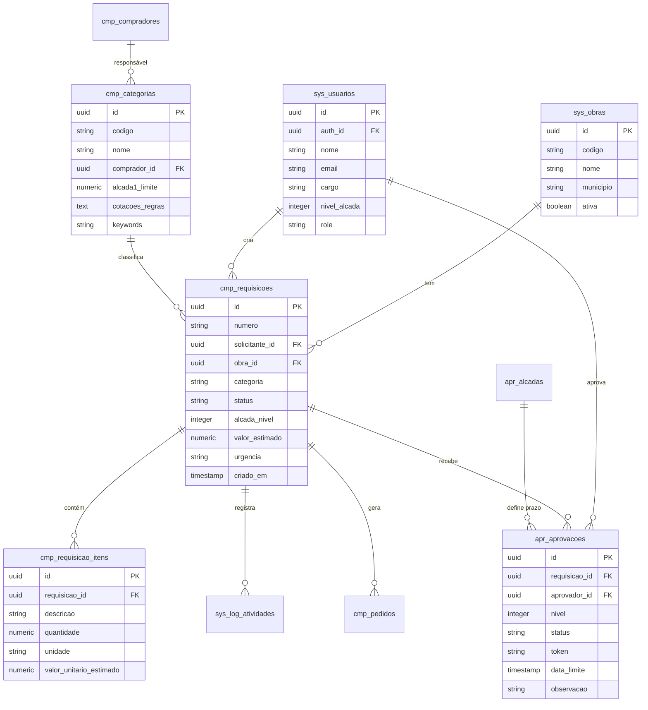

# Schema do Banco de Dados — TEG+ ERP

## Diagrama Entidade-Relacionamento



---

## Tabelas do Sistema (`sys_*`)

### `sys_obras`
| Coluna | Tipo | Descrição |
|--------|------|-----------|
| `id` | UUID PK | Identificador |
| `codigo` | VARCHAR | Ex: SE-FRU |
| `nome` | VARCHAR | Nome completo |
| `municipio` | VARCHAR | Município - UF |
| `ativa` | BOOLEAN | Obra em andamento |
| `criado_em` | TIMESTAMP | Data de cadastro |

### `sys_usuarios` / `sys_perfis`
| Coluna | Tipo | Descrição |
|--------|------|-----------|
| `id` | UUID PK | = auth.uid() |
| `auth_id` | UUID FK | Supabase Auth ID |
| `nome` | VARCHAR | Nome completo |
| `email` | VARCHAR | Email único |
| `cargo` | VARCHAR | Cargo/função |
| `departamento` | VARCHAR | Departamento |
| `role` | VARCHAR | admin/gerente/aprovador/comprador/requisitante/visitante |
| `nivel_alcada` | INTEGER | 0-4 |
| `modulos` | JSONB | Módulos habilitados |
| `preferencias` | JSONB | Preferências UI |
| `avatar_url` | TEXT | URL da foto |
| `ultimo_acesso` | TIMESTAMP | Last login |

### `sys_log_atividades`
| Coluna | Tipo | Descrição |
|--------|------|-----------|
| `id` | UUID PK | — |
| `requisicao_id` | UUID FK | Requisição relacionada |
| `tipo` | VARCHAR | Tipo do evento |
| `usuario_id` | UUID FK | Quem realizou |
| `dados` | JSONB | Detalhes do evento |
| `criado_em` | TIMESTAMP | Quando ocorreu |

### `sys_configuracoes`
| Coluna | Tipo | Descrição |
|--------|------|-----------|
| `chave` | VARCHAR PK | Chave de config |
| `valor` | JSONB | Valor (inclui contador RC) |

### `sys_config`
| Coluna | Tipo | Descrição |
|--------|------|-----------|
| `chave` | VARCHAR PK | Chave (ex: `omie_app_key`) |
| `valor` | TEXT | Valor da configuração |
| `atualizado_em` | TIMESTAMPTZ | Última atualização |

> Acesso via `get_omie_config()` (SECURITY DEFINER). Escrita restrita a admins.

### `fin_sync_log`
| Coluna | Tipo | Descrição |
|--------|------|-----------|
| `id` | UUID PK | — |
| `dominio` | VARCHAR | fornecedores / contas-pagar / contas-receber |
| `status` | VARCHAR | sucesso / erro / parcial |
| `registros` | INTEGER | Qtd de registros processados |
| `executado_em` | TIMESTAMPTZ | Timestamp da execução |
| `detalhes` | JSONB | Erros ou dados adicionais |

---

## Tabelas de Compras (`cmp_*`)

### `cmp_requisicoes`
| Coluna | Tipo | Descrição |
|--------|------|-----------|
| `id` | UUID PK | — |
| `numero` | VARCHAR | RC-YYYYMM-XXXX |
| `solicitante_id` | UUID FK | → sys_usuarios |
| `obra_id` | UUID FK | → sys_obras |
| `categoria` | VARCHAR | Categoria da requisição |
| `status` | ENUM | Ver enums abaixo |
| `alcada_nivel` | INTEGER | 1-4 determinado por valor |
| `valor_estimado` | NUMERIC | Total estimado |
| `urgencia` | ENUM | normal/urgente/critica |
| `descricao` | TEXT | Justificativa |
| `observacoes` | TEXT | Obs adicionais |
| `criado_em` | TIMESTAMP | — |
| `atualizado_em` | TIMESTAMP | — |

### `cmp_requisicao_itens`
| Coluna | Tipo | Descrição |
|--------|------|-----------|
| `id` | UUID PK | — |
| `requisicao_id` | UUID FK | → cmp_requisicoes |
| `descricao` | TEXT | Descrição do item |
| `quantidade` | NUMERIC | Quantidade |
| `unidade` | VARCHAR | UN, M, KG, etc. |
| `valor_unitario_estimado` | NUMERIC | Preço estimado unit. |
| `especificacoes` | TEXT | Detalhes técnicos |

### `cmp_categorias`
Ver detalhes em [[14 - Compradores e Categorias]].

### `cmp_compradores`
Ver detalhes em [[14 - Compradores e Categorias]].

### `cmp_cotacoes`
| Coluna | Tipo | Descrição |
|--------|------|-----------|
| `id` | UUID PK | — |
| `requisicao_id` | UUID FK | → cmp_requisicoes |
| `comprador_id` | UUID FK | → cmp_compradores |
| `status` | ENUM | pendente / em_andamento / concluida / cancelada |
| `data_limite` | DATE | Prazo para propostas |
| `fornecedor_selecionado_nome` | TEXT | Vencedor |
| `valor_selecionado` | NUMERIC | Valor da proposta vencedora |
| `sem_cotacoes_minimas` | BOOLEAN | Bypass do mínimo de fornecedores |
| `justificativa_sem_cotacoes` | TEXT | Justificativa obrigatória para bypass |

### `cmp_cotacao_fornecedores`
| Coluna | Tipo | Descrição |
|--------|------|-----------|
| `id` | UUID PK | — |
| `cotacao_id` | UUID FK | → cmp_cotacoes |
| `fornecedor_nome` | TEXT | Nome do fornecedor |
| `fornecedor_cnpj` | VARCHAR | CNPJ |
| `valor_total` | NUMERIC | Proposta total |
| `prazo_entrega_dias` | INTEGER | Prazo em dias |
| `condicao_pagamento` | TEXT | Ex: 30/60/90 dias |
| `itens_precos` | JSONB | Array de preços por item |
| `selecionado` | BOOLEAN | Fornecedor vencedor |

### `cmp_pedidos`
| Coluna | Tipo | Descrição |
|--------|------|-----------|
| `id` | UUID PK | — |
| `requisicao_id` | UUID FK | → cmp_requisicoes |
| `numero_pedido` | VARCHAR | PO-AAAA-NNNNN |
| `fornecedor_nome` | TEXT | Nome do fornecedor |
| `valor_total` | NUMERIC | Valor final contratado |
| `status` | ENUM | emitido / confirmado / em_entrega / entregue / cancelado |
| `data_pedido` | DATE | Data de emissão |
| `data_prevista_entrega` | DATE | Prazo previsto |
| `data_entrega_real` | DATE | Data efetiva |
| `nf_numero` | VARCHAR | Número da nota fiscal |
| `status_pagamento` | VARCHAR | null / `liberado` / `pago` |
| `liberado_pagamento_em` | TIMESTAMPTZ | Quando foi liberado |
| `liberado_pagamento_por` | TEXT | Quem liberou |
| `pago_em` | TIMESTAMPTZ | Quando foi pago |
| `criado_em` | TIMESTAMPTZ | — |

### `cmp_pedidos_anexos`
| Coluna | Tipo | Descrição |
|--------|------|-----------|
| `id` | UUID PK | — |
| `pedido_id` | UUID FK | → cmp_pedidos |
| `tipo` | ENUM | nota_fiscal / comprovante_entrega / medicao / comprovante_pagamento / contrato / outro |
| `nome_arquivo` | TEXT | Nome original do arquivo |
| `url` | TEXT | URL pública no Storage |
| `mime_type` | VARCHAR | Tipo MIME |
| `origem` | VARCHAR | `compras` / `financeiro` |
| `uploaded_by_nome` | TEXT | Nome de quem enviou |
| `uploaded_at` | TIMESTAMPTZ | Quando foi enviado |
| `observacao` | TEXT | Obs opcional |

---

## Tabelas Financeiras (`fin_*`)

### `fin_contas_pagar`
| Coluna | Tipo | Descrição |
|--------|------|-----------|
| `id` | UUID PK | — |
| `omie_id` | BIGINT | ID Omie (sync key) |
| `pedido_id` | UUID FK | → cmp_pedidos |
| `fornecedor_nome` | TEXT | Nome do fornecedor |
| `valor` | NUMERIC | Valor da conta |
| `data_vencimento` | DATE | Data de vencimento |
| `data_pagamento` | DATE | Data efetiva de pagamento |
| `status` | VARCHAR | previsto / aguardando_aprovacao / aprovado / pago / rejeitado |
| `categoria` | VARCHAR | Categoria do gasto |
| `centro_custo` | VARCHAR | Obra / centro de custo |
| `descricao` | TEXT | Descrição |
| `natureza` | VARCHAR | material / serviço / outros |
| `comprovante_url` | TEXT | URL do comprovante |
| `omie_sincronizado` | BOOLEAN | Confirmado no Omie |
| `criado_em` | TIMESTAMPTZ | — |

### `fin_contas_receber`
| Coluna | Tipo | Descrição |
|--------|------|-----------|
| `id` | UUID PK | — |
| `omie_id` | BIGINT | ID Omie (sync key) |
| `cliente_nome` | TEXT | Nome do cliente |
| `valor` | NUMERIC | Valor a receber |
| `data_vencimento` | DATE | Vencimento |
| `data_recebimento` | DATE | Recebimento efetivo |
| `status` | VARCHAR | previsto / recebido / atrasado / cancelado |
| `descricao` | TEXT | Descrição |

---

## Tabelas de Aprovação (`apr_*`)

### `apr_aprovacoes`
| Coluna | Tipo | Descrição |
|--------|------|-----------|
| `id` | UUID PK | — |
| `requisicao_id` | UUID FK | → cmp_requisicoes |
| `aprovador_id` | UUID FK | → sys_usuarios |
| `nivel` | INTEGER | 1-4 |
| `status` | VARCHAR | pendente/aprovada/rejeitada/expirada |
| `token` | VARCHAR | UUID único para link externo |
| `data_limite` | TIMESTAMP | Prazo de aprovação |
| `observacao` | TEXT | Comentário do aprovador |
| `decidido_em` | TIMESTAMP | Quando foi aprovada/rejeitada |

### `apr_alcadas`
Ver detalhes em [[13 - Alçadas]].

---

## Enums

### `status_requisicao`
```sql
CREATE TYPE status_requisicao AS ENUM (
  'rascunho',
  'pendente',
  'em_aprovacao',
  'aprovada',
  'rejeitada',
  'cotacao_enviada',
  'cotacao_aprovada',
  'pedido_emitido',
  'entregue',
  'cancelada'
);
```

### `status_aprovacao`
```sql
CREATE TYPE status_aprovacao AS ENUM (
  'pendente',
  'aprovada',
  'rejeitada',
  'expirada'
);
```

### `urgencia_tipo`
```sql
CREATE TYPE urgencia_tipo AS ENUM (
  'normal',
  'urgente',
  'critica'
);
```

---

## Funções SQL

### `gerar_numero_requisicao()`
```sql
-- Gera RC-YYYYMM-XXXX sequencial
-- Ex: RC-202602-0001
SELECT gerar_numero_requisicao();
```

### `determinar_alcada(valor numeric)`
```sql
-- Retorna nível de alçada baseado no valor
SELECT determinar_alcada(15000);  -- → 2 (Gerente)
```

### `get_dashboard_compras(p_periodo, p_obra_id)`
```sql
-- RPC que retorna JSON com KPIs agregados
SELECT get_dashboard_compras('30d', NULL);
```

### `get_omie_config()`
```sql
-- Retorna credenciais Omie sem expor via RLS (SECURITY DEFINER)
SELECT get_omie_config();
-- → { "app_key": "...", "app_secret": "...", "habilitado": true, "n8n_base_url": "..." }
```

### `get_alerta_cotacao(p_requisicao_id UUID)`
```sql
-- Verifica se cotação foi enviada sem mínimo de fornecedores
SELECT get_alerta_cotacao('uuid-da-requisicao');
-- → { "sem_cotacoes_minimas": true, "justificativa": "Fornecedor exclusivo" }
```

---

## Triggers

| Trigger | Tabela | Evento | Função |
|---------|--------|--------|--------|
| `trig_criar_cp_ao_emitir_pedido` | `cmp_pedidos` | AFTER INSERT | Cria CP em `fin_contas_pagar` com status `previsto` |
| `trig_atualizar_cp_ao_liberar` | `cmp_pedidos` | AFTER UPDATE | Propaga `status_pagamento` → `fin_contas_pagar` |

---

## Links Relacionados

- [[06 - Supabase]] — Configuração e acesso
- [[08 - Migrações SQL]] — Histórico de mudanças
- [[13 - Alçadas]] — Tabela apr_alcadas detalhada
- [[14 - Compradores e Categorias]] — Tabelas cmp_categorias e cmp_compradores
- [[11 - Fluxo Requisição]] — Como os dados são criados
