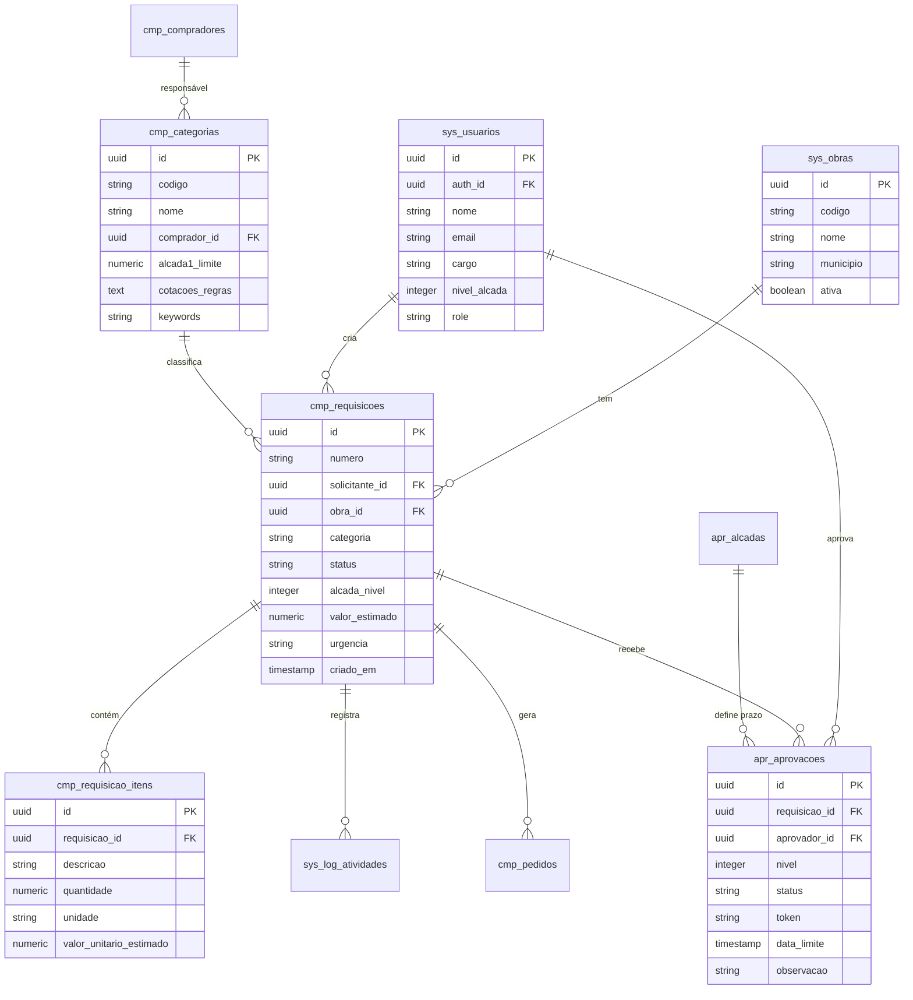

# Schema do Banco de Dados — TEG+ ERP

## Diagrama Entidade-Relacionamento



---

## Tabelas do Sistema (`sys_*`)

### `sys_obras`
| Coluna | Tipo | Descrição |
|--------|------|-----------|
| `id` | UUID PK | Identificador |
| `codigo` | VARCHAR | Ex: SE-FRU |
| `nome` | VARCHAR | Nome completo |
| `municipio` | VARCHAR | Município - UF |
| `ativa` | BOOLEAN | Obra em andamento |
| `criado_em` | TIMESTAMP | Data de cadastro |

### `sys_usuarios` / `sys_perfis`
| Coluna | Tipo | Descrição |
|--------|------|-----------|
| `id` | UUID PK | = auth.uid() |
| `auth_id` | UUID FK | Supabase Auth ID |
| `nome` | VARCHAR | Nome completo |
| `email` | VARCHAR | Email único |
| `cargo` | VARCHAR | Cargo/função |
| `departamento` | VARCHAR | Departamento |
| `role` | VARCHAR | admin/gerente/aprovador/comprador/requisitante/visitante |
| `nivel_alcada` | INTEGER | 0-4 |
| `modulos` | JSONB | Módulos habilitados |
| `preferencias` | JSONB | Preferências UI |
| `avatar_url` | TEXT | URL da foto |
| `ultimo_acesso` | TIMESTAMP | Last login |

### `sys_log_atividades`
| Coluna | Tipo | Descrição |
|--------|------|-----------|
| `id` | UUID PK | — |
| `requisicao_id` | UUID FK | Requisição relacionada |
| `tipo` | VARCHAR | Tipo do evento |
| `usuario_id` | UUID FK | Quem realizou |
| `dados` | JSONB | Detalhes do evento |
| `criado_em` | TIMESTAMP | Quando ocorreu |

### `sys_configuracoes`
| Coluna | Tipo | Descrição |
|--------|------|-----------|
| `chave` | VARCHAR PK | Chave de config |
| `valor` | JSONB | Valor (inclui contador RC) |

---

## Tabelas de Compras (`cmp_*`)

### `cmp_requisicoes`
| Coluna | Tipo | Descrição |
|--------|------|-----------|
| `id` | UUID PK | — |
| `numero` | VARCHAR | RC-YYYYMM-XXXX |
| `solicitante_id` | UUID FK | → sys_usuarios |
| `obra_id` | UUID FK | → sys_obras |
| `categoria` | VARCHAR | Categoria da requisição |
| `status` | ENUM | Ver enums abaixo |
| `alcada_nivel` | INTEGER | 1-4 determinado por valor |
| `valor_estimado` | NUMERIC | Total estimado |
| `urgencia` | ENUM | normal/urgente/critica |
| `descricao` | TEXT | Justificativa |
| `observacoes` | TEXT | Obs adicionais |
| `criado_em` | TIMESTAMP | — |
| `atualizado_em` | TIMESTAMP | — |

### `cmp_requisicao_itens`
| Coluna | Tipo | Descrição |
|--------|------|-----------|
| `id` | UUID PK | — |
| `requisicao_id` | UUID FK | → cmp_requisicoes |
| `descricao` | TEXT | Descrição do item |
| `quantidade` | NUMERIC | Quantidade |
| `unidade` | VARCHAR | UN, M, KG, etc. |
| `valor_unitario_estimado` | NUMERIC | Preço estimado unit. |
| `especificacoes` | TEXT | Detalhes técnicos |

### `cmp_categorias`
Ver detalhes em [[14 - Compradores e Categorias]].

### `cmp_compradores`
Ver detalhes em [[14 - Compradores e Categorias]].

### `cmp_pedidos`
| Coluna | Tipo | Descrição |
|--------|------|-----------|
| `id` | UUID PK | — |
| `requisicao_id` | UUID FK | → cmp_requisicoes |
| `numero_pedido` | VARCHAR | PO-YYYYMM-XXXX |
| `fornecedor` | VARCHAR | Nome do fornecedor |
| `valor_total` | NUMERIC | Valor final contratado |
| `status` | VARCHAR | emitido/parcial/entregue |
| `prazo_entrega` | DATE | Data prevista |
| `criado_em` | TIMESTAMP | — |

---

## Tabelas de Aprovação (`apr_*`)

### `apr_aprovacoes`
| Coluna | Tipo | Descrição |
|--------|------|-----------|
| `id` | UUID PK | — |
| `requisicao_id` | UUID FK | → cmp_requisicoes |
| `aprovador_id` | UUID FK | → sys_usuarios |
| `nivel` | INTEGER | 1-4 |
| `status` | VARCHAR | pendente/aprovada/rejeitada/expirada |
| `token` | VARCHAR | UUID único para link externo |
| `data_limite` | TIMESTAMP | Prazo de aprovação |
| `observacao` | TEXT | Comentário do aprovador |
| `decidido_em` | TIMESTAMP | Quando foi aprovada/rejeitada |

### `apr_alcadas`
Ver detalhes em [[13 - Alçadas]].

---

## Enums

### `status_requisicao`
```sql
CREATE TYPE status_requisicao AS ENUM (
  'rascunho',
  'pendente',
  'em_aprovacao',
  'aprovada',
  'rejeitada',
  'cotacao_enviada',
  'cotacao_aprovada',
  'pedido_emitido',
  'entregue',
  'cancelada'
);
```

### `status_aprovacao`
```sql
CREATE TYPE status_aprovacao AS ENUM (
  'pendente',
  'aprovada',
  'rejeitada',
  'expirada'
);
```

### `urgencia_tipo`
```sql
CREATE TYPE urgencia_tipo AS ENUM (
  'normal',
  'urgente',
  'critica'
);
```

---

## Funções SQL

### `gerar_numero_requisicao()`
```sql
-- Gera RC-YYYYMM-XXXX sequencial
-- Ex: RC-202602-0001
SELECT gerar_numero_requisicao();
```

### `determinar_alcada(valor numeric)`
```sql
-- Retorna nível de alçada baseado no valor
SELECT determinar_alcada(15000);  -- → 2 (Gerente)
```

### `get_dashboard_compras(p_periodo, p_obra_id)`
```sql
-- RPC que retorna JSON com KPIs agregados
SELECT get_dashboard_compras('30d', NULL);
```

---

## Links Relacionados

- [[06 - Supabase]] — Configuração e acesso
- [[08 - Migrações SQL]] — Histórico de mudanças
- [[13 - Alçadas]] — Tabela apr_alcadas detalhada
- [[14 - Compradores e Categorias]] — Tabelas cmp_categorias e cmp_compradores
- [[11 - Fluxo Requisição]] — Como os dados são criados
