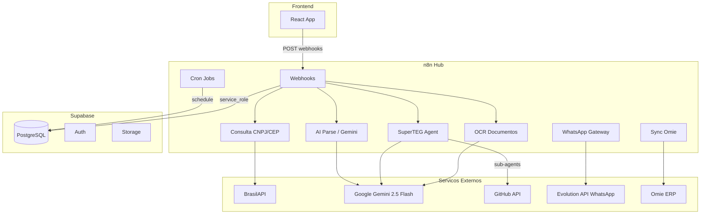
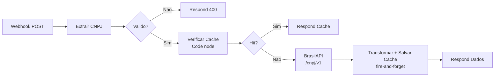
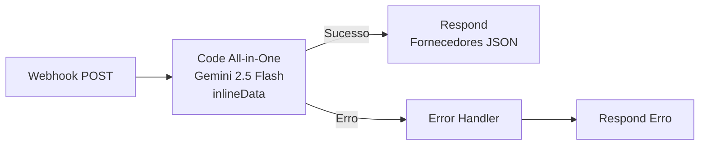
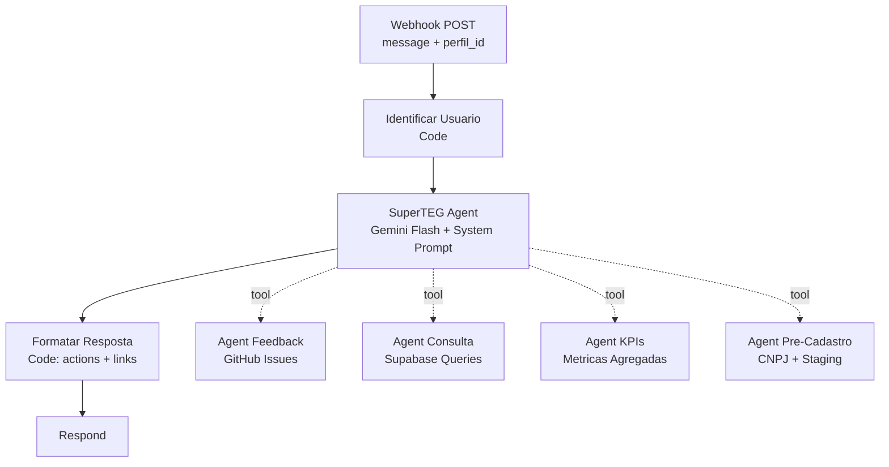

# n8n Workflows — TEG+ ERP

> **31 workflows** totais: 16 ativos, 13 inativos, 2 defasados
> Instancia: https://teg-agents-n8n.nmmcas.easypanel.host
> Versao: 2.35.6 | EasyPanel (Docker)
> Atualizado em 2026-04-07

---

## Visao Geral da Arquitetura

O n8n e o **hub de orquestracao** do TEG+. Toda logica complexa passa por aqui antes de chegar ao Supabase.



---

## Configuracao

### Infraestrutura

| Item | Valor |
|------|-------|
| URL Base | https://teg-agents-n8n.nmmcas.easypanel.host |
| Webhook Base | https://teg-agents-n8n.nmmcas.easypanel.host/webhook |
| Hospedagem | EasyPanel (Docker) em 104.236.46.36 |
| Env var | WEBHOOK_URL=https://teg-agents-n8n.nmmcas.easypanel.host |
| Versao | 2.35.6 |

### Credenciais configuradas no n8n

| Credencial | Uso |
|-----------|-----|
| Supabase service_role key | Bypass RLS em todas as operacoes |
| Google Gemini API Key | AI Parse, OCR, SuperTEG Agent |
| GitHub Personal Access Token | Dev Hub, Agent Feedback |
| Evolution API (WhatsApp) | Gateway WhatsApp |
| Omie app_key + app_secret | Sync financeiro (via sys_config) |

### Regras Importantes

- Updates via API (REST ou MCP) so alteram o **DRAFT** do workflow
- Para ativar webhooks de producao, e obrigatorio **Publicar via UI** do editor n8n
- Apos restart do container EasyPanel, webhooks sao re-registrados automaticamente
- Frontend fallback: se n8n falhar, consulta BrasilAPI/Supabase direto

---

## Inventario Completo de Workflows

### Ativos (16)

| # | ID | Nome | Webhook | Nodes | Descricao |
|---|-----|------|---------|-------|-----------|
| 1 | 6rfMdHdRdJefrKB3 | Consulta CNPJ | POST /consulta-cnpj | 10 | Consulta CNPJ via BrasilAPI com cache |
| 2 | iZGk3HiN35xGxe7K | Consulta CEP | POST /consulta-cep | 12 | Consulta CEP via BrasilAPI com cache |
| 3 | eorVVBHlkNrRWILU | AI Parse Requisicao | POST /compras/requisicao-ai | 3 | Extrai itens de texto livre via Gemini |
| 4 | P5xDZQJ2Hh6mVXO0 | AI Parse Cotacao | POST /compras/parse-cotacao | 5 | Parse de orcamentos PDF/imagem via Gemini |
| 5 | hQcdcPpLhvnGGYxF | Compras OCR Documentos | POST /compras/ocr | 7 | OCR de documentos com Gemini multimodal |
| 6 | 2OxlIc2UcvuYyt5H | WhatsApp Notificacoes | POST /whatsapp/notificar | 8 | Envia notificacoes via Evolution API |
| 7 | cpiy9UzgmDUSYESQ | WhatsApp Gateway | POST /whatsapp/gateway | 10 | Recebe msgs WhatsApp e roteia para AI |
| 8 | KJUlWGP1ItQkUQOB | **SuperTEG AI Agent** | POST /superteg/chat | 11 | Agent conversacional principal |
| 9 | WAkswySm6FNrISs4 | Agent Feedback | — (sub-agent) | 4 | Registra issues no GitHub via API |
| 10 | IIRQPZwOb8SIKvKe | Agent Consulta Dados | — (sub-agent) | 4 | Busca dados no Supabase por modulo |
| 11 | BrqB98dDsv7KKoMF | Agent Dashboard KPIs | — (sub-agent) | 4 | Agrega metricas financeiro/compras/estoque |
| 12 | mrGPcuWzcVPUwMPA | Agent Pre-Cadastro | — (sub-agent) | 7 | Cria pre-cadastros com enriquecimento CNPJ |
| 13 | fY781S723TYNMYdU | Dev Hub | POST /dev-hub | 3 | Backend para tela Desenvolvimento |
| 14 | pxhj2bgacHUC1Jsc | Expiracao de Aprovacoes | Cron (diario) | 6 | Expira aprovacoes vencidas automaticamente |

### Inativos (13)

| # | ID | Nome | Motivo |
|---|-----|------|--------|
| 1 | 8NjfiPcQHHZxSKUp | Nova Requisicao | Substituido por insert direto Supabase |
| 2 | mdpXcMsQonwnQuT6 | Processar Aprovacao | Substituido por insert direto Supabase |
| 3 | fb6kSj7ZSxPU2TjO | Dashboard API Compras | Frontend usa RPC direto |
| 4 | TArMjd2faXDgdAOx | Aprovacoes Pendentes | Funcionalidade absorvida pelo frontend |
| 5 | wlwnMleVkg7FEgnd | Submeter Cotacao | Frontend faz insert direto |
| 6 | UYgLUU9v7cfMJN8k | Notificacoes de Status | Substituido por WhatsApp Notificacoes |
| 7 | 6Dh8b6VOP09GpH0x | E-mail AI Agent | Prototipo descontinuado |
| 8 | rUoNHA8xSoGSpwKR | AI Agent Compras | Substituido por SuperTEG AI Agent |
| 9 | 8hSUspdhb1EwuFFg | Omie - Sync Fornecedores | Planejado para reativacao |
| 10 | wvnoOFS0QxHOq7cB | Omie - Sync CP | Planejado para reativacao |
| 11 | j682f59Mlg6Ta6oN | Omie - Sync CR | Planejado para reativacao |
| 12 | XDKGIEUvjsf4nlWJ | Omie - Aprovacao Pagamento | Planejado para reativacao |
| 13 | mb5ff29QyHfs09ij | AI Personal Assistant | Template original, arquivado |

### Defasados (2) — NAO USAR

| ID | Nome | Motivo |
|----|------|--------|
| 5mtQRzoZWfmNtXyE | Planilha - Sync Automatico | Google Sheets (fase prototipal) |
| rVIjII1INC3g7S52 | Sync Google Sheets → Supabase | Idem, versao alternativa |

---

## Workflows Detalhados

### 1. Consulta CNPJ (`6rfMdHdRdJefrKB3`)

**Webhook:** `POST /consulta-cnpj`
**Payload:** `{ "valor": "59460450000100" }`



- Cache: tabela `cache_consultas` no Supabase, TTL 7 dias
- Frontend fallback: se n8n falhar, consulta BrasilAPI direto via `api.ts`

### 2. Consulta CEP (`iZGk3HiN35xGxe7K`)

**Webhook:** `POST /consulta-cep`
Mesmo padrao do CNPJ. Cache em `cache_consultas`.

### 3. AI Parse Requisicao (`eorVVBHlkNrRWILU`)

**Webhook:** `POST /compras/requisicao-ai`
**LLM:** Gemini 2.5 Flash

Payload: `{ "texto": "...", "solicitante_nome": "..." }`
Resposta: Array de itens com descricao, quantidade, unidade, categoria_sugerida, confianca.

### 4. AI Parse Cotacao (`P5xDZQJ2Hh6mVXO0`)

**Webhook:** `POST /compras/parse-cotacao`
**LLM:** Gemini 2.5 Flash (multimodal)

#### Arquitetura Consolidada (Code All-in-One)

O workflow usa um **Code node unico** que faz todo o processamento: recebe o arquivo, envia para Gemini via `inlineData`, e retorna o JSON estruturado.



**Payload padrao (arquivos pequenos, < 8MB):**
```json
{
  "file_base64": "...",
  "file_name": "cotacao.pdf",
  "mime_type": "application/pdf"
}
```

**Pattern file_url (arquivos grandes, > 8MB):**
Para arquivos acima de 8MB, o frontend faz upload para Supabase Storage (bucket `temp-uploads`) e envia apenas a URL:

```json
{
  "file_url": "https://xxx.supabase.co/storage/v1/object/public/temp-uploads/abc123.pdf",
  "file_name": "cotacao_grande.pdf",
  "mime_type": "application/pdf"
}
```

O Code node detecta `file_url` vs `file_base64` e ajusta a chamada Gemini:
- `file_base64` → usa `inlineData` (base64 direto no payload Gemini)
- `file_url` → baixa o arquivo, converte para base64, usa `inlineData`

**Formatos aceitos:** JPG, PNG, WebP, PDF (ate ~50 MB via file_url)
**Resposta:** Array de fornecedores com nome, CNPJ, valor_total, prazo, itens com precos.
**Usado por:** `UploadCotacao.tsx`

### 5. Compras OCR Documentos (`hQcdcPpLhvnGGYxF`)

**Webhook:** `POST /compras/ocr`
Processa documentos anexados (NF, orcamentos) via Gemini multimodal. Salva em `cmp_anexos.llm_dados`.

### 6-7. WhatsApp Notificacoes e Gateway

**Notificacoes:** `POST /whatsapp/notificar` — Envia via Evolution API
**Gateway:** `POST /whatsapp/gateway` — Recebe msgs e roteia para SuperTEG Agent

### 8. SuperTEG AI Agent (`KJUlWGP1ItQkUQOB`)

**Webhook:** `POST /superteg/chat`
**LLM:** Google Gemini 2.5 Flash



**System Prompt:** Assistente ERP especialista em engenharia eletrica/transmissao. Responde em PT-BR, usa structured actions protocol.

**Structured Actions Protocol:**
- Links markdown `[texto](url)` sao extraidos como botoes de navegacao
- Pre-cadastros geram `notify_admins` action para [[04 - Componentes|NotificationBell]]
- Resposta formatada com `text` + `actions[]` array

### 9-12. Sub-Agents do SuperTEG

| Sub-Agent | ID | Funcao |
|-----------|-----|--------|
| Agent Feedback | WAkswySm6FNrISs4 | Registra bugs/sugestoes como GitHub Issues |
| Agent Consulta Dados | IIRQPZwOb8SIKvKe | Busca dados no Supabase por modulo |
| Agent Dashboard KPIs | BrqB98dDsv7KKoMF | Agrega metricas de todos os modulos |
| Agent Pre-Cadastro | mrGPcuWzcVPUwMPA | Cria pre-cadastros com enriquecimento CNPJ |

### 13. Dev Hub (`fY781S723TYNMYdU`)

**Webhook:** `POST /dev-hub`
Backend auxiliar para tela de Desenvolvimento. Na pratica, frontend chama GitHub API diretamente.

### 14. Expiracao de Aprovacoes (`pxhj2bgacHUC1Jsc`)

**Trigger:** Cron diario
Busca aprovacoes com `data_limite < now()` e `status = 'pendente'`. Atualiza para `expirada`.

---

## Workflows Omie (Inativos — Planejados para Reativacao)

| Workflow | ID | Funcao |
|---------|-----|--------|
| Sync Fornecedores | 8hSUspdhb1EwuFFg | Omie → `cmp_fornecedores` |
| Sync CP | wvnoOFS0QxHOq7cB | Omie → `fin_contas_pagar` |
| Sync CR | j682f59Mlg6Ta6oN | Omie → `fin_contas_receber` |
| Aprovacao Pagamento | XDKGIEUvjsf4nlWJ | AlterarStatusCP no Omie |

Detalhes em [[19 - Integração Omie]].

---

## Fallback Strategy

Se o n8n estiver **indisponivel**, o frontend tem fallback automatico:

```
Frontend api.ts
├── consultarCNPJ → POST n8n /consulta-cnpj → FALLBACK → GET brasilapi.com.br/api/cnpj/v1/{cnpj}
├── consultarCEP  → POST n8n /consulta-cep  → FALLBACK → GET brasilapi.com.br/api/cep/v2/{cep}
├── SuperTEG Chat → POST n8n /superteg/chat → FALLBACK → Mensagem de indisponibilidade
└── Demais ops    → Direto Supabase (hooks TanStack Query)
```

---

## Webhooks Ativos — Referencia Rapida

| Metodo | Path | Workflow | Descricao |
|--------|------|----------|-----------|
| POST | /consulta-cnpj | Consulta CNPJ | Consulta + cache |
| POST | /consulta-cep | Consulta CEP | Consulta + cache |
| POST | /compras/requisicao-ai | AI Parse Requisicao | Parse texto → itens |
| POST | /compras/parse-cotacao | AI Parse Cotacao | Parse PDF/imagem (inlineData) |
| POST | /compras/ocr | OCR Documentos | OCR multimodal |
| POST | /superteg/chat | SuperTEG Agent | Chat AI principal |
| POST | /dev-hub | Dev Hub | Backend dev tools |
| POST | /whatsapp/notificar | WhatsApp Notif. | Enviar notificacao |
| POST | /whatsapp/gateway | WhatsApp Gateway | Receber mensagem |
| CRON | — (diario) | Expiracao Aprov. | Job automatico |

---

## Links Relacionados

- [[01 - Arquitetura Geral]] — Posicao do n8n na arquitetura
- [[04 - Componentes]] — SuperTEGChat, UploadCotacao
- [[05 - Hooks Customizados]] — useAiParse, useSuperTEG, useOmieApi
- [[07 - Schema Database]] — Tabelas utilizadas pelos workflows
- [[11 - Fluxo Requisição]] — Fluxo detalhado de criacao
- [[12 - Fluxo Aprovação]] — Fluxo detalhado de aprovacao
- [[19 - Integração Omie]] — Squads Omie detalhados
- [[28 - Módulo Cadastros AI]] — Pre-cadastros via SuperTEG
