# n8n Workflows - TEG+ ERP

> **31 workflows** totais: 16 ativos, 13 inativos, 2 defasados
> Instancia: https://teg-agents-n8n.nmmcas.easypanel.host
> Versao: 2.35.6 | EasyPanel (Docker)
> Atualizado em 2026-03-08

---

## Visao Geral da Arquitetura

O n8n e o **hub de orquestracao** do TEG+. Toda logica complexa passa por aqui antes de chegar ao Supabase.

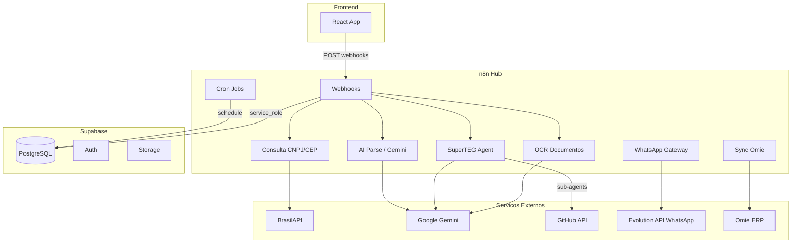

---

## Configuracao

### Infraestrutura

| Item | Valor |
|------|-------|
| URL Base | https://teg-agents-n8n.nmmcas.easypanel.host |
| Webhook Base | https://teg-agents-n8n.nmmcas.easypanel.host/webhook |
| Hospedagem | EasyPanel (Docker) em 104.236.46.36 |
| Env var | WEBHOOK_URL=https://teg-agents-n8n.nmmcas.easypanel.host |
| Versao | 2.35.6 |

### Credenciais configuradas no n8n

| Credencial | Uso |
|-----------|-----|
| Supabase service_role key | Bypass RLS em todas as operacoes |
| Google Gemini API Key | AI Parse, OCR, SuperTEG Agent |
| GitHub Personal Access Token | Dev Hub, Agent Feedback |
| Evolution API (WhatsApp) | Gateway WhatsApp |
| Omie app_key + app_secret | Sync financeiro (via sys_config) |

### Regras Importantes

- Updates via API (REST ou MCP) so alteram o **DRAFT** do workflow
- Para ativar webhooks de producao, e obrigatorio **Publicar via UI** do editor n8n
- Apos restart do container EasyPanel, webhooks sao re-registrados automaticamente
- Frontend fallback: se n8n falhar, consulta BrasilAPI/Supabase direto

---

## Inventario Completo de Workflows

### Ativos (16)

| # | ID | Nome | Webhook | Nodes | Descricao |
|---|-----|------|---------|-------|-----------|
| 1 | 6rfMdHdRdJefrKB3 | Consulta CNPJ | POST /consulta-cnpj | 10 | Consulta CNPJ via BrasilAPI com cache |
| 2 | iZGk3HiN35xGxe7K | Consulta CEP | POST /consulta-cep | 12 | Consulta CEP via BrasilAPI com cache |
| 3 | eorVVBHlkNrRWILU | AI Parse Requisicao | POST /compras/requisicao-ai | 3 | Extrai itens de texto livre via Gemini |
| 4 | P5xDZQJ2Hh6mVXO0 | AI Parse Cotacao | POST /compras/parse-cotacao | 5 | Parse de orcamentos PDF/imagem via Gemini |
| 5 | hQcdcPpLhvnGGYxF | Compras OCR Documentos | POST /compras/ocr | 7 | OCR de documentos com Gemini multimodal |
| 6 | 2OxlIc2UcvuYyt5H | WhatsApp Notificacoes | POST /whatsapp/notificar | 8 | Envia notificacoes via Evolution API |
| 7 | cpiy9UzgmDUSYESQ | WhatsApp Gateway | POST /whatsapp/gateway | 10 | Recebe msgs WhatsApp e roteia para AI |
| 8 | KJUlWGP1ItQkUQOB | **SuperTEG AI Agent** | POST /superteg/chat | 11 | Agent conversacional principal |
| 9 | WAkswySm6FNrISs4 | Agent Feedback | — (sub-agent) | 4 | Registra issues no GitHub via API |
| 10 | IIRQPZwOb8SIKvKe | Agent Consulta Dados | — (sub-agent) | 4 | Busca dados no Supabase por modulo |
| 11 | BrqB98dDsv7KKoMF | Agent Dashboard KPIs | — (sub-agent) | 4 | Agrega metricas financeiro/compras/estoque |
| 12 | mrGPcuWzcVPUwMPA | Agent Pre-Cadastro | — (sub-agent) | 7 | Cria pre-cadastros com enriquecimento CNPJ |
| 13 | fY781S723TYNMYdU | Dev Hub | POST /dev-hub | 3 | Backend para tela Desenvolvimento |
| 14 | pxhj2bgacHUC1Jsc | Expiracao de Aprovacoes | Cron (diario) | 6 | Expira aprovacoes vencidas automaticamente |

### Inativos (13)

| # | ID | Nome | Nodes | Motivo |
|---|-----|------|-------|--------|
| 1 | 8NjfiPcQHHZxSKUp | Nova Requisicao | 10 | Substituido por insert direto Supabase |
| 2 | mdpXcMsQonwnQuT6 | Processar Aprovacao | 17 | Substituido por insert direto Supabase |
| 3 | fb6kSj7ZSxPU2TjO | Dashboard API Compras | 8 | Frontend usa RPC direto |
| 4 | TArMjd2faXDgdAOx | Aprovacoes Pendentes | 3 | Funcionalidade absorvida pelo frontend |
| 5 | wlwnMleVkg7FEgnd | Submeter Cotacao | 4 | Frontend faz insert direto |
| 6 | UYgLUU9v7cfMJN8k | Notificacoes de Status | 6 | Substituido por WhatsApp Notificacoes |
| 7 | 6Dh8b6VOP09GpH0x | E-mail AI Agent | 7 | Prototipo descontinuado |
| 8 | rUoNHA8xSoGSpwKR | AI Agent Compras | 15 | Substituido por SuperTEG AI Agent |
| 9 | 8hSUspdhb1EwuFFg | Omie - Sync Fornecedores | 9 | Planejado para reativacao |
| 10 | wvnoOFS0QxHOq7cB | Omie - Sync CP | 11 | Planejado para reativacao |
| 11 | j682f59Mlg6Ta6oN | Omie - Sync CR | 11 | Planejado para reativacao |
| 12 | XDKGIEUvjsf4nlWJ | Omie - Aprovacao Pagamento | 10 | Planejado para reativacao |
| 13 | mb5ff29QyHfs09ij | AI Personal Assistant | 76 | Template original, arquivado |

### Defasados (2) - NAO USAR

| ID | Nome | Motivo |
|----|------|--------|
| 5mtQRzoZWfmNtXyE | Planilha - Sync Automatico | Google Sheets → Supabase (fase prototipal) |
| rVIjII1INC3g7S52 | Sync Google Sheets → Supabase | Idem, versao alternativa |

---

## Workflows Detalhados

### 1. Consulta CNPJ (`6rfMdHdRdJefrKB3`)

**Webhook:** `POST /consulta-cnpj`
**Payload:** `{ "valor": "59460450000100" }`

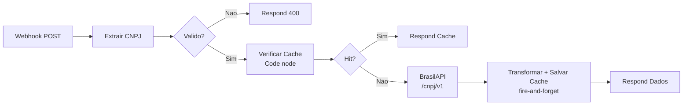

**Notas tecnicas:**
- "Verificar Cache" e Code node (nao HTTP Request) - sempre retorna, nao para o pipeline
- Cache: tabela `cache_consultas` no Supabase, TTL 7 dias
- Frontend fallback: se n8n falhar, consulta BrasilAPI direto via `api.ts`

---

### 2. Consulta CEP (`iZGk3HiN35xGxe7K`)

**Webhook:** `POST /consulta-cep`
**Payload:** `{ "valor": "01001000" }`

Mesmo padrao do CNPJ. **Bug conhecido:** cache usa HTTP Request ao inves de Code node (precisa mesma fix do CNPJ).

---

### 3. AI Parse Requisicao (`eorVVBHlkNrRWILU`)

**Webhook:** `POST /compras/requisicao-ai`

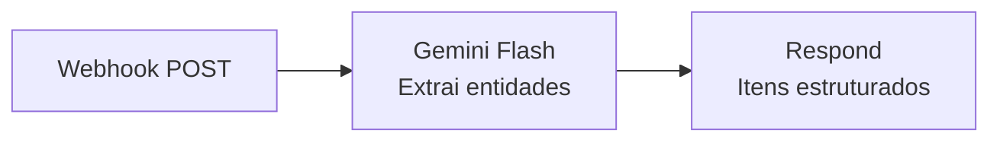

**Payload entrada:**
```json
{
  "texto": "Preciso de 10 capacetes e 5 luvas para Frutal urgente",
  "solicitante_nome": "Joao Silva"
}
```

**Resposta:** Array de itens com descricao, quantidade, unidade, categoria_sugerida, obra_sugerida, urgencia_detectada, confianca (0-1).

**Usado por:** `useAiParse` hook no frontend (wizard de requisicao step 1).

---

### 4. AI Parse Cotacao (`P5xDZQJ2Hh6mVXO0`)

**Webhook:** `POST /compras/parse-cotacao`

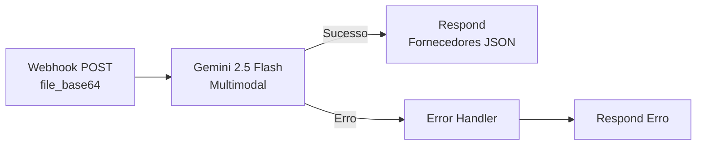

**Payload:** `{ "file_base64": "...", "file_name": "cotacao.pdf", "mime_type": "application/pdf" }`
**Formatos aceitos:** JPG, PNG, WebP, PDF (ate 10 MB)
**Resposta:** Array de fornecedores com nome, CNPJ, valor_total, prazo, itens com precos.
**Usado por:** `UploadCotacao.tsx` (drag & drop com auto-preenchimento).

---

### 5. Compras OCR Documentos (`hQcdcPpLhvnGGYxF`)

**Webhook:** `POST /compras/ocr`

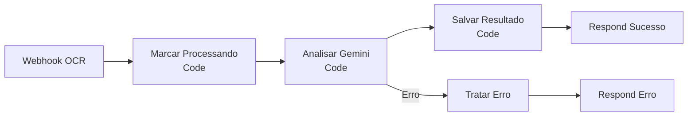

Processa documentos anexados a compras (NF, orcamentos) via Gemini multimodal. Salva resultado em `cmp_anexos.llm_dados`.

---

### 6. WhatsApp Notificacoes (`2OxlIc2UcvuYyt5H`)

**Webhook:** `POST /whatsapp/notificar`

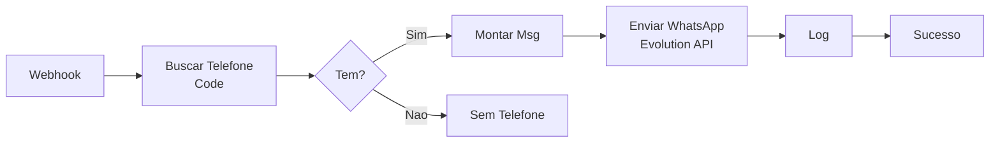

Envia notificacoes de aprovacao, status de pedido, etc. via Evolution API (WhatsApp). Log em `sys_whatsapp_log`.

---

### 7. WhatsApp Gateway (`cpiy9UzgmDUSYESQ`)

**Webhook:** `POST /whatsapp/gateway`

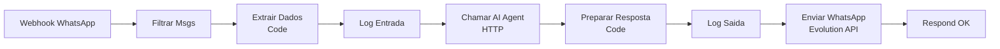

Recebe mensagens do WhatsApp via webhook Evolution API. Roteia para SuperTEG Agent. Envia resposta de volta.

---

### 8. SuperTEG AI Agent (`KJUlWGP1ItQkUQOB`) ⭐

**Webhook:** `POST /superteg/chat`
**LLM:** Google Gemini 2.5 Flash
**Criado:** 2026-03-07

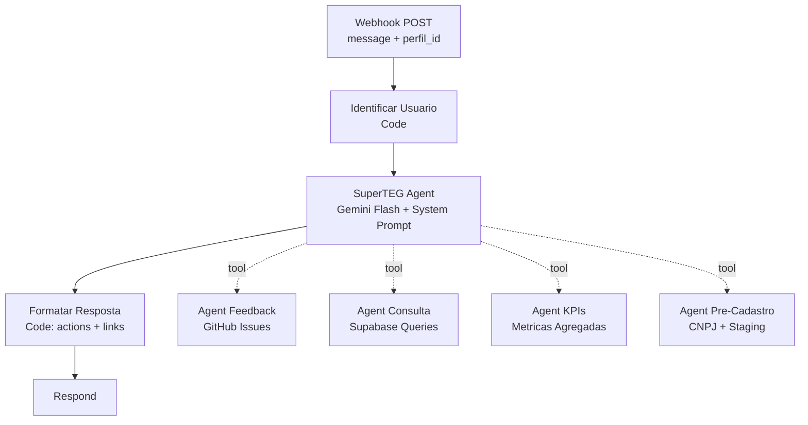

**Payload:**
```json
{
  "chatInput": "Qual o status das compras da obra Frutal?",
  "sessionId": "user-uuid-session",
  "perfil_id": "user-uuid",
  "perfil_nome": "Joao Silva",
  "perfil_role": "admin"
}
```

**System Prompt:** Assistente ERP especialista em engenharia eletrica/transmissao. Responde em PT-BR, usa structured actions protocol.

**Structured Actions Protocol:**
- Links markdown `[texto](url)` sao extraidos como botoes de navegacao
- Pre-cadastros geram `notify_admins` action para NotificationBell
- Resposta formatada com `text` + `actions[]` array

**Componente frontend:** `SuperTEGChat.tsx` (FAB no canto inferior direito).

---

### 9-12. Sub-Agents do SuperTEG

#### Agent Feedback (`WAkswySm6FNrISs4`)
- **Funcao:** Registra bugs/sugestoes como issues no GitHub
- **Nodes:** Webhook Execute → Code (GitHub API) → Salvar sys_feedbacks → Respond
- **Saida:** Issue URL + numero

#### Agent Consulta Dados (`IIRQPZwOb8SIKvKe`)
- **Funcao:** Busca dados no Supabase por modulo
- **Nodes:** Webhook Execute → Code (Query Builder) → Supabase REST → Respond
- **Modulos:** compras, financeiro, estoque, logistica, frotas, contratos

#### Agent Dashboard KPIs (`BrqB98dDsv7KKoMF`)
- **Funcao:** Agrega metricas de todos os modulos
- **Nodes:** Webhook Execute → Code (Aggregate Queries) → Supabase → Respond
- **Metricas:** totais, por status, por obra, por periodo

#### Agent Pre-Cadastro (`mrGPcuWzcVPUwMPA`)
- **Funcao:** Cria pre-cadastros com enriquecimento CNPJ
- **Nodes:** Webhook Execute → Extrair Dados → Tem CNPJ? → BrasilAPI → Inserir Pre-Cadastro → Respond
- **Tabela destino:** `sys_pre_cadastros` (staging, admin revisa via NotificationBell)
- **Entidades:** fornecedor, transportadora, item_estoque

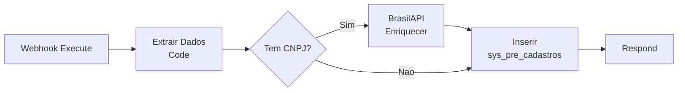

---

### 13. Dev Hub (`fY781S723TYNMYdU`)

**Webhook:** `POST /dev-hub`

Backend auxiliar para tela de Desenvolvimento (`/admin/desenvolvimento`). Na pratica, o frontend chama a GitHub API diretamente (CORS OK). Workflow criado como backup.

---

### 14. Expiracao de Aprovacoes (`pxhj2bgacHUC1Jsc`)

**Trigger:** Cron (execucao diaria)

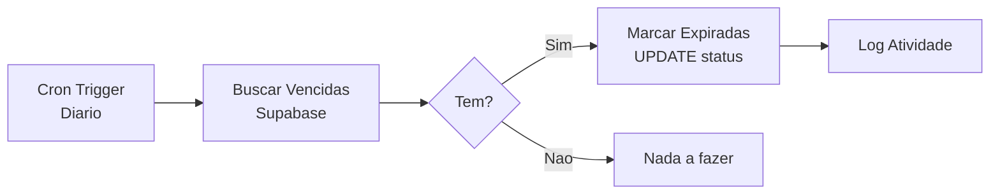

Busca aprovacoes com `data_limite < now()` e `status = 'pendente'`. Atualiza para `expirada`.

---

## Workflows Omie (Inativos - Planejados para Reativacao)

Quatro workflows dedicados a integracao com Omie ERP. Detalhes completos em [[19 - Integracao Omie]].

### Sync Fornecedores (`8hSUspdhb1EwuFFg`)
```
Webhook/Schedule → get_omie_config() RPC → Omie API ListarFornecedores → Upsert cmp_fornecedores → fin_sync_log
```

### Sync Contas a Pagar (`wvnoOFS0QxHOq7cB`)
```
Schedule 6h → get_omie_config() → Omie API ListarContasPagar → Upsert fin_contas_pagar → fin_sync_log
```

### Sync Contas a Receber (`j682f59Mlg6Ta6oN`)
```
Schedule 6h → get_omie_config() → Omie API ListarContasReceber → Upsert fin_contas_receber → fin_sync_log
```

### Aprovacao Pagamento (`XDKGIEUvjsf4nlWJ`)
```
Webhook POST cp_id → get_omie_config() → Omie API AlterarStatusCP → UPDATE omie_sincronizado=true → fin_sync_log
```

---

## Workflows Inativos Legados

| Workflow | Motivo Inativacao | Substituido por |
|---------|-------------------|-----------------|
| Nova Requisicao | Frontend faz insert direto no Supabase via hooks | `useRequisicoes` hook |
| Processar Aprovacao | Frontend faz update direto + token validation | `useAprovacoes` hook |
| Dashboard API Compras | Frontend usa RPC `get_dashboard_compras()` | `useDashboard` hook |
| Aprovacoes Pendentes | Funcionalidade absorvida pelo frontend | `useAprovacoes` hook |
| Submeter Cotacao | Frontend faz insert direto | `useCotacoes` hook |
| Notificacoes de Status | Substituido por WhatsApp Notificacoes | Workflow 2OxlIc2UcvuYyt5H |
| E-mail AI Agent | Prototipo descontinuado | SuperTEG Agent via WhatsApp |
| AI Agent Compras | Prototipo inicial | SuperTEG AI Agent |
| AI Personal Assistant | Template original n8n | Arquivado |

---

## Fallback Strategy

Se o n8n estiver **indisponivel**, o frontend tem fallback automatico:

```
Frontend api.ts
├── consultarCNPJ → POST n8n /consulta-cnpj → FALLBACK → GET brasilapi.com.br/api/cnpj/v1/{cnpj}
├── consultarCEP  → POST n8n /consulta-cep  → FALLBACK → GET brasilapi.com.br/api/cep/v2/{cep}
├── SuperTEG Chat → POST n8n /superteg/chat → FALLBACK → Mensagem de indisponibilidade
└── Demais ops    → Direto Supabase (hooks TanStack Query)
```

Hooks como `useRequisicoes`, `useCotacoes`, `useEstoque` etc. fazem operacoes diretamente no Supabase sem passar pelo n8n.

---

## Diagrama de Comunicacao Frontend → n8n

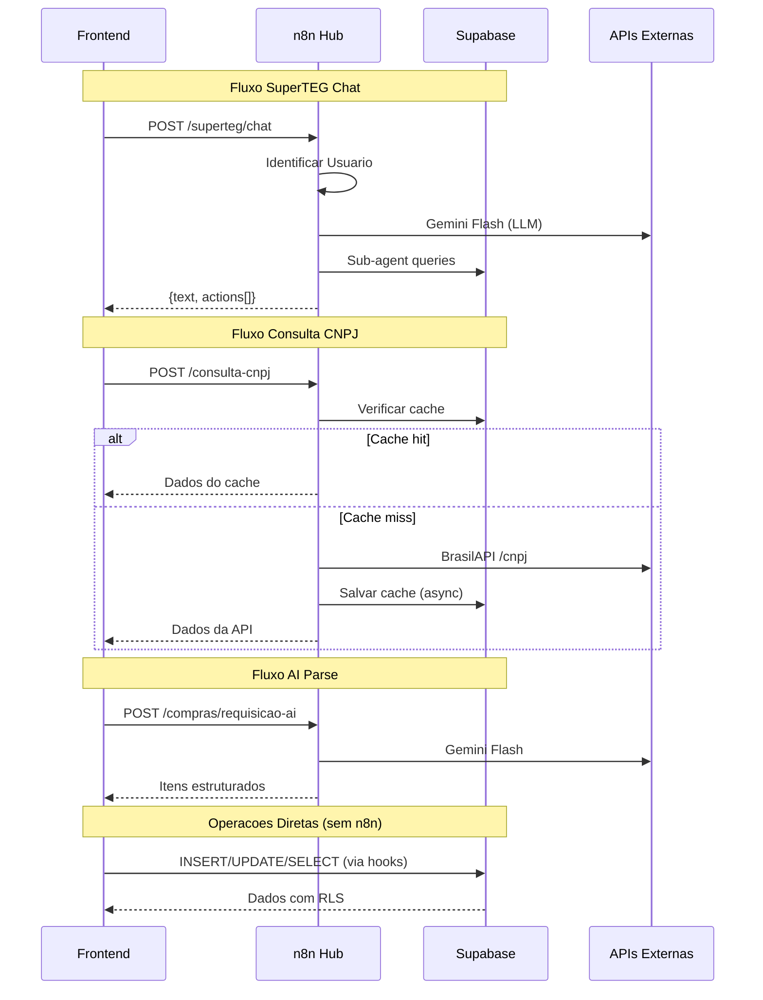

---

## Webhooks Ativos - Referencia Rapida

| Metodo | Path | Workflow | Descricao |
|--------|------|----------|-----------|
| POST | /consulta-cnpj | Consulta CNPJ | Consulta + cache |
| POST | /consulta-cep | Consulta CEP | Consulta + cache |
| POST | /compras/requisicao-ai | AI Parse Requisicao | Parse texto → itens |
| POST | /compras/parse-cotacao | AI Parse Cotacao | Parse PDF/imagem |
| POST | /compras/ocr | OCR Documentos | OCR multimodal |
| POST | /superteg/chat | SuperTEG Agent | Chat AI principal |
| POST | /dev-hub | Dev Hub | Backend dev tools |
| POST | /whatsapp/notificar | WhatsApp Notif. | Enviar notificacao |
| POST | /whatsapp/gateway | WhatsApp Gateway | Receber mensagem |
| CRON | — (diario) | Expiracao Aprov. | Job automatico |

---

## Links Relacionados

- [[01 - Arquitetura Geral]] - Posicao do n8n na arquitetura
- [[07 - Schema Database]] - Tabelas utilizadas pelos workflows
- [[11 - Fluxo Requisicao]] - Fluxo detalhado de criacao
- [[12 - Fluxo Aprovacao]] - Fluxo detalhado de aprovacao
- [[19 - Integracao Omie]] - Squads Omie detalhados
- [[28 - Modulo Cadastros AI]] - Pre-cadastros via SuperTEG
