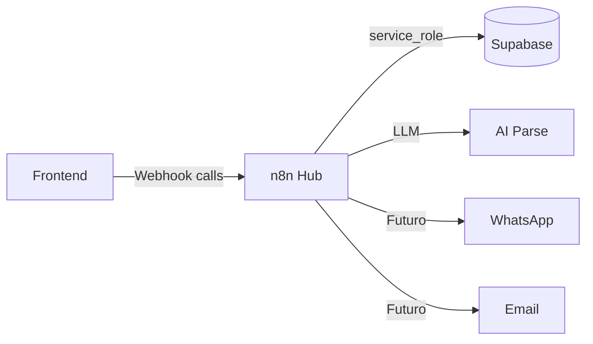
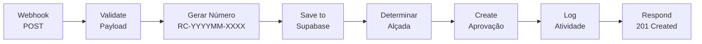
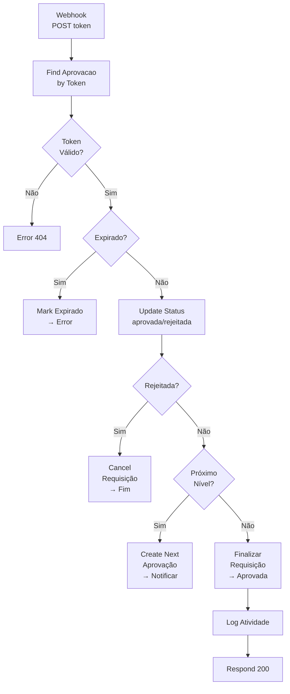
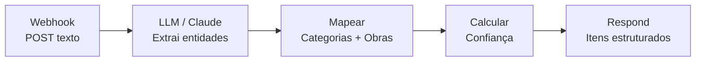
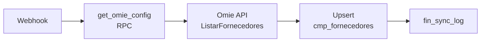
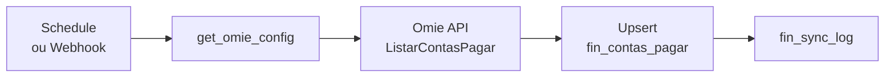
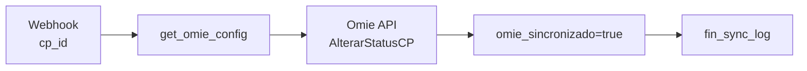

# n8n Workflows — TEG+ ERP

## Visão Geral

O n8n é o **hub de orquestração** do TEG+. Toda lógica de negócio complexa passa por aqui antes de chegar ao Supabase.



---

## Configuração

```env
# .env
VITE_N8N_WEBHOOK_URL=https://seu-n8n.com/webhook
```

**Credenciais no n8n:**
- Supabase: `service_role key` (bypass RLS)
- LLM API: configurado para AI parse

---

## Workflows Documentados

### 1. TEG+ | Nova Requisição
**Webhook:** `POST /compras/requisicao`
**ID n8n:** `8NjfiPcQHHZxSKUp`
**Nodes:** 9



**Payload de entrada:**
```json
{
  "solicitante_id": "uuid",
  "obra_id": "uuid",
  "categoria": "string",
  "urgencia": "normal|urgente|critica",
  "valor_estimado": 15000.00,
  "descricao": "Justificativa...",
  "itens": [
    {
      "descricao": "Cabo ACSR 250MCM",
      "quantidade": 500,
      "unidade": "M",
      "valor_unitario_estimado": 25.00
    }
  ]
}
```

**Resposta de sucesso:**
```json
{
  "success": true,
  "requisicao": {
    "id": "uuid",
    "numero": "RC-202602-0042",
    "status": "em_aprovacao",
    "alcada_nivel": 2
  },
  "aprovacao": {
    "aprovador": "Gerente",
    "prazo_horas": 24,
    "token": "approval-token-uuid"
  }
}
```

---

### 2. TEG+ | Processar Aprovação
**Webhook:** `POST /compras/aprovacao`
**ID n8n:** `mdpXcMsQonwnQuT6`
**Nodes:** 16



**Payload de entrada:**
```json
{
  "token": "approval-token-uuid",
  "decisao": "aprovada|rejeitada",
  "observacao": "Aprovado conforme orçamento."
}
```

---

### 3. TEG+ | Dashboard API
**Webhook:** `GET /painel/compras`
**ID n8n:** `fb6kSj7ZSxPU2TjO`
**Nodes:** 6

**Query params aceitos:**
```
?status=pendente
?obra_id=uuid
?periodo=30d           (7d | 30d | 90d)
?page=1
?limit=20
```

**Resposta:**
```json
{
  "kpis": {
    "total": 142,
    "pendentes": 23,
    "aprovadas": 89,
    "em_cotacao": 15,
    "valor_total": 1850000.00,
    "valor_aprovado": 1200000.00
  },
  "por_status": [
    { "status": "pendente", "count": 23, "percentual": 16.2 }
  ],
  "por_obra": [
    { "obra": "SE Frutal", "count": 34, "valor": 420000.00 }
  ],
  "recentes": [...]
}
```

---

### 4. TEG+ | AI Parse Requisição
**Webhook:** `POST /compras/requisicao-ai`
**ID n8n:** (configurado)



**Payload de entrada:**
```json
{
  "texto": "Preciso de 10 capacetes amarelos e 5 pares de luvas de raspa para obra de Frutal urgente",
  "solicitante_nome": "João Silva"
}
```

**Resposta:**
```json
{
  "itens": [
    {
      "descricao": "Capacete de segurança amarelo",
      "quantidade": 10,
      "unidade": "UN",
      "categoria_sugerida": "EPI/EPC"
    },
    {
      "descricao": "Luvas de raspa",
      "quantidade": 5,
      "unidade": "PAR",
      "categoria_sugerida": "EPI/EPC"
    }
  ],
  "obra_sugerida": "SE Frutal",
  "categoria_sugerida": "EPI/EPC",
  "comprador_sugerido": "Lauany",
  "urgencia_detectada": "urgente",
  "confianca": 0.92,
  "observacoes": "Obra identificada por menção direta. Urgência detectada."
}
```

---

## Fallback Strategy

Se o n8n estiver **indisponível**:

```ts
// src/services/api.ts
async criarRequisicao(payload) {
  try {
    // Tenta n8n primeiro
    return await fetch(`${N8N_URL}/compras/requisicao`, ...)
  } catch (e) {
    // Fallback: insert direto no Supabase
    console.warn('n8n indisponível, usando Supabase direto')
    return await supabase.from('requisicoes').insert(payload)
  }
}
```

---

---

## Squads Omie ERP (Módulo Financeiro)

Quatro workflows dedicados à integração com o Omie ERP. Detalhes completos em [[19 - Integração Omie]].

### 5. TEG+ | Omie — Sync Fornecedores
**Arquivo:** `n8n-docs/workflow-omie-sync-fornecedores.json`
**Webhook:** `POST /omie/sync/fornecedores`



---

### 6. TEG+ | Omie — Sync Contas a Pagar
**Arquivo:** `n8n-docs/workflow-omie-sync-cp.json`
**Webhook:** `POST /omie/sync/contas-pagar`
**Trigger:** Schedule 6h + Manual



---

### 7. TEG+ | Omie — Sync Contas a Receber
**Arquivo:** `n8n-docs/workflow-omie-sync-cr.json`
**Webhook:** `POST /omie/sync/contas-receber`
**Trigger:** Schedule 6h + Manual

Mesmo padrão do Squad 6, aplicado a `fin_contas_receber`.

---

### 8. TEG+ | Omie — Aprovar Pagamento
**Arquivo:** `n8n-docs/workflow-omie-aprovacao-pgto.json`
**Webhook:** `POST /omie/aprovar-pagamento`



---

## Workflows Futuros

| Workflow | Trigger | Função |
|----------|---------|--------|
| WhatsApp Notificações | Nova aprovação | Envia link WhatsApp via Evolution API |
| Email Aprovação | Nova aprovação | Email Outlook com link de aprovação |
| AI TEG+ Agent | Mensagem WhatsApp | Responde dúvidas e cria requisições |

---

## Links Relacionados

- [[01 - Arquitetura Geral]] — Posição do n8n na arquitetura
- [[11 - Fluxo Requisição]] — Fluxo detalhado de criação
- [[12 - Fluxo Aprovação]] — Fluxo detalhado de aprovação
- [[19 - Integração Omie]] — Squads Omie detalhados
- [[05 - Hooks Customizados]] — Como o frontend chama os webhooks
- [[17 - Roadmap]] — Integrações futuras planejadas
