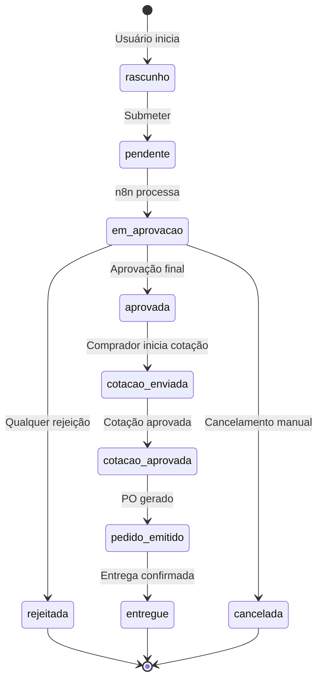

# Fluxo de Requisição — TEG+ ERP

## Ciclo de Vida Completo



---

## Etapa 1 — Criação pelo Requisitante

### Via Wizard (3 etapas)

**Etapa 1 — Identificação:**
```
┌─────────────────────────────────┐
│  Obra: [SE Frutal ▼]            │
│  Categoria: [EPI/EPC ▼]         │
│  Urgência: ○ Normal ● Urgente   │
│  Justificativa: [____________]   │
└─────────────────────────────────┘
```

**Etapa 2 — Itens:**
```
┌─────────────────────────────────────────────┐
│  + Adicionar Item                            │
│  ┌──────────────────────────────────────┐   │
│  │ Descrição: Capacete amarelo          │   │
│  │ Qtd: 10    Un: UN   Vlr: R$25,00    │   │
│  └──────────────────────────────────────┘   │
│  TOTAL ESTIMADO: R$ 250,00                   │
└─────────────────────────────────────────────┘
```

**Etapa 3 — Revisão e Envio:**
```
┌──────────────────────────────┐
│ RC-202602-XXXX               │
│ Obra: SE Frutal              │
│ Categoria: EPI/EPC           │
│ Comprador: Lauany            │
│ Alçada: Nível 1 (até R$5k)  │
│ 2 itens | R$ 250,00          │
│                              │
│ [Confirmar Envio]            │
└──────────────────────────────┘
```

### Via AI (texto livre)

```
┌──────────────────────────────────────────────┐
│  Descreva o que você precisa:                 │
│  ┌──────────────────────────────────────┐    │
│  │ Preciso de 10 capacetes e 5 luvas    │    │
│  │ para obra de Frutal urgente          │    │
│  └──────────────────────────────────────┘    │
│                                              │
│  [🤖 Analisar com IA]                        │
│                                              │
│  ✅ Identificado:                            │
│  • 10x Capacete amarelo (EPI/EPC)            │
│  • 5x Luvas de raspa (EPI/EPC)               │
│  Obra: SE Frutal | Urgência: Urgente         │
│  Confiança: 92% | Comprador: Lauany          │
└──────────────────────────────────────────────┘
```

---

## Etapa 2 — Processamento n8n

Quando o requisitante confirma o envio:

```
Frontend
  └─→ POST /compras/requisicao (n8n)
        │
        ├─ Valida payload obrigatório
        ├─ Gera número: RC-202602-0042
        ├─ Calcula valor total dos itens
        ├─ Determina alçada: determinar_alcada(valor)
        ├─ INSERT em cmp_requisicoes (status: 'em_aprovacao')
        ├─ INSERT em cmp_requisicao_itens (1 por item)
        ├─ INSERT em apr_aprovacoes (nível 1, token UUID)
        ├─ INSERT em sys_log_atividades
        └─ RETURN { numero, status, aprovacao }
```

---

## Etapa 3 — Aprovação Multi-nível

Ver [[12 - Fluxo Aprovação]] para detalhes completos.

**Resumo:**
- Aprovação sequencial por alçada
- Aprovador recebe link: `/aprovacao/:token`
- Rejeição em qualquer nível cancela a requisição
- Aprovação no último nível → status = `aprovada`

---

## Etapa 4 — Cotação

Após aprovação, a requisição entra na fila de cotações:

```
Comprador (Lauany/Fernando/Aline) acessa:
  /cotacoes → Fila de requisições aprovadas

Seleciona a requisição:
  /cotacoes/:id → CotacaoForm.tsx

Preenche preços por fornecedor:
  ┌──────────┬──────────┬──────────┬──────────┐
  │ Item     │ Forn. A  │ Forn. B  │ Forn. C  │
  ├──────────┼──────────┼──────────┼──────────┤
  │ Capacete │ R$28,00  │ R$25,00✓ │ R$30,00  │
  └──────────┴──────────┴──────────┴──────────┘

Submete cotação:
  POST /compras/cotacao (n8n)
  → status: 'cotacao_enviada'
```

**Regras de cotação por categoria:**
- Até R$1.000: 1 cotação obrigatória
- R$1.001-5.000: 2 cotações obrigatórias
- Acima de R$5.000: 3 cotações obrigatórias

---

## Etapa 5 — Pedido de Compra

Cotação aprovada → Comprador emite PO:

```
cmp_pedidos INSERT:
  numero_pedido: PO-202602-0042
  requisicao_id: uuid
  fornecedor: "Empresa XYZ Ltda"
  valor_total: 250.00
  prazo_entrega: 2026-03-15
  status: 'emitido'

requisicoes UPDATE:
  status: 'pedido_emitido'
```

---

## Etapa 6 — Entrega

Confirmação de entrega:

```
cmp_pedidos UPDATE:
  status: 'entregue'
  data_entrega: 2026-03-15

requisicoes UPDATE:
  status: 'entregue'

sys_log_atividades INSERT:
  tipo: 'entrega_confirmada'
```

---

## Número da Requisição

**Formato:** `RC-YYYYMM-XXXX`

```sql
-- Função PostgreSQL
CREATE OR REPLACE FUNCTION gerar_numero_requisicao()
RETURNS text AS $$
DECLARE
  ano_mes text := to_char(NOW(), 'YYYYMM');
  seq integer;
BEGIN
  -- Pega e incrementa contador no configuracoes
  UPDATE configuracoes
  SET valor = (valor::integer + 1)::text
  WHERE chave = 'seq_requisicao_' || ano_mes
  RETURNING valor::integer INTO seq;

  -- Se não existe, cria com 1
  IF NOT FOUND THEN
    INSERT INTO configuracoes (chave, valor) VALUES ('seq_requisicao_' || ano_mes, '1');
    seq := 1;
  END IF;

  RETURN 'RC-' || ano_mes || '-' || lpad(seq::text, 4, '0');
END;
$$ LANGUAGE plpgsql;
```

---

## Dashboard — Visão do Pipeline

```
┌────────────────────────────────────────────────────┐
│  PIPELINE DE COMPRAS                               │
│                                                    │
│  Em Aprovação  Em Cotação  Pedido Emitido  Entregue│
│  ┌──────────┐  ┌────────┐  ┌───────────┐  ┌─────┐ │
│  │    23    │→ │   15   │→ │     8     │→ │ 44  │ │
│  │ requisic.│  │cotações│  │   POs     │  │ ok  │ │
│  └──────────┘  └────────┘  └───────────┘  └─────┘ │
└────────────────────────────────────────────────────┘
```

---

## Links Relacionados

- [[12 - Fluxo Aprovação]] — Detalhes da aprovação multi-nível
- [[10 - n8n Workflows]] — Webhooks utilizados no fluxo
- [[13 - Alçadas]] — Regras de alçada por valor
- [[14 - Compradores e Categorias]] — Atribuição de compradores
- [[03 - Páginas e Rotas]] — Páginas do fluxo
