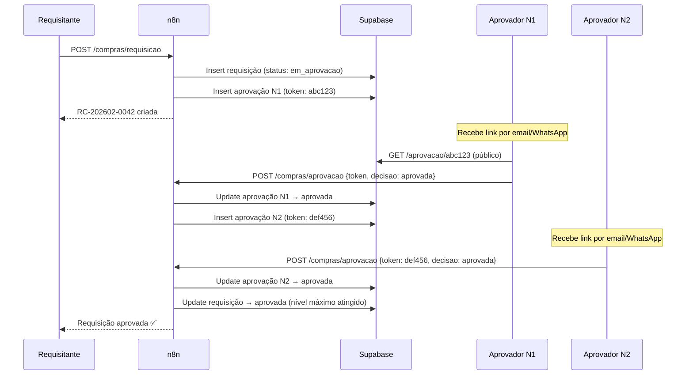
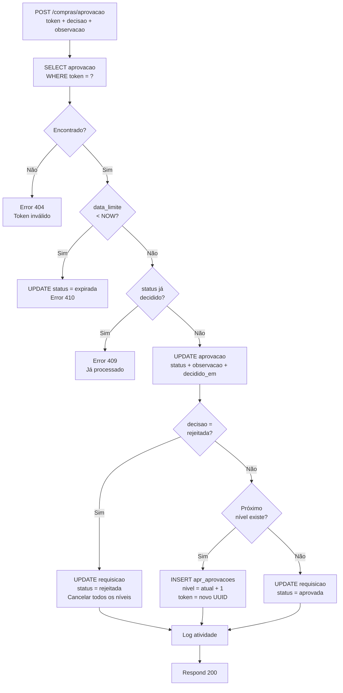

# Fluxo de Aprovação — TEG+ ERP

## Visão Geral



---

## Determinação da Alçada

Baseada no valor total estimado da requisição:

```
valor ≤ R$ 5.000      → Nível 1 (Coordenador) — apenas 1 aprovação
valor ≤ R$ 25.000     → Nível 2 (Gerente)     — aprovação 1→2
valor ≤ R$ 100.000    → Nível 3 (Diretor)     — aprovações 1→2→3
valor > R$ 100.000    → Nível 4 (CEO)         — aprovações 1→2→3→4
```

Ver detalhes em [[13 - Alçadas]].

---

## Aprovação Multi-nível (sequencial)

### Exemplo: Requisição de R$30.000 (Alçada 3)

```
Nível 1 (Coordenador)  ──aprovado──→  Nível 2 (Gerente)  ──aprovado──→  Nível 3 (Diretor)
                                                                               │
                                                                         ──aprovado──→
                                                                         REQUISIÇÃO APROVADA ✅
```

### Regras:
- Aprovação é **sequencial** (N1 → N2 → N3 → N4)
- N2 só é criado após N1 aprovar
- **Rejeição em qualquer nível** cancela toda a cadeia
- Aprovações têm **prazo** (configurável por alçada)
- Após prazo: status `expirada` → nova aprovação pode ser criada

---

## Interface de Aprovação (pública)

URL: `https://tegplus.com.br/aprovacao/[token-uuid]`

```
┌──────────────────────────────────────────────┐
│  [Logo TEG+]    ApprovaAi                    │
│                                              │
│  REQUISIÇÃO RC-202602-0042                   │
│  ─────────────────────────                   │
│  Solicitante: João Silva                     │
│  Obra: SE Frutal                             │
│  Categoria: EPI/EPC                          │
│  Urgência: 🟡 Urgente                        │
│  Valor: R$ 250,00                            │
│                                              │
│  ITENS:                                      │
│  • 10x Capacete amarelo — R$25,00/un         │
│  • 5x Luvas de raspa — R$10,00/un            │
│                                              │
│  Observação: [_____________________________] │
│                                              │
│  [✅ APROVAR]          [❌ REJEITAR]          │
└──────────────────────────────────────────────┘
```

> Esta página é **pública** — não requer login.
> Usa token UUID único gerado por requisição/nível.

---

## Lógica n8n — Processar Aprovação



---

## Token de Aprovação

```ts
// Gerado no n8n ao criar aprovação
const token = crypto.randomUUID()  // Ex: 550e8400-e29b-41d4-a716-446655440000

// Inserido na tabela
{
  requisicao_id: "...",
  aprovador_id: "uuid-do-aprovador",
  nivel: 1,
  status: "pendente",
  token: "550e8400-e29b-41d4-a716-446655440000",
  data_limite: new Date(Date.now() + 24 * 60 * 60 * 1000)  // +24h
}

// URL enviada
`https://tegplus.com.br/aprovacao/${token}`
```

---

## Prazos por Nível

| Nível | Cargo | Prazo |
|-------|-------|-------|
| 1 | Coordenador | 24 horas |
| 2 | Gerente | 24 horas |
| 3 | Diretor | 48 horas |
| 4 | CEO | 72 horas |

---

## AprovAi — Central de Aprovacoes Multi-tipo

Rota: `/aprovaai`

Interface unificada para **todas as aprovacoes** do sistema, agrupadas por tipo com cores distintas.

### 4 Tipos de Aprovacao

| Tipo | Label | Cor | Origem | Icone |
|------|-------|-----|--------|-------|
| `cotacao` | Aprovacao Compras | Azul | Cotacoes de compras | FileSearch |
| `autorizacao_pagamento` | Autorizacoes de Pagamento | Amber | Financeiro (`syncCPsParaAprovacao`) | Banknote |
| `minuta_contratual` | Minutas Contratuais | Violeta | Contratos (analise AI) | FileSignature |
| `requisicao_compra` | Validacao Tec. Requisicao de Compra | Teal | Requisicoes de compras | ShoppingCart |

### ApprovalBadge (Header Global)

Componente `ApprovalBadge` exibido no header de todos os modulos:
- Badge circular com contador de aprovacoes pendentes
- Cor teal com animacao de pulse quando ha pendencias
- Clique navega para `/aprovaai`
- Presente em `ModuloSelector.tsx` e `ModuleLayout.tsx`

### Integracao Financeiro → AprovAi

A funcao `syncCPsParaAprovacao()` em `useFinanceiro.ts`:
1. Busca CPs com `status = 'aguardando_aprovacao'` que ainda nao tem registro em `apr_aprovacoes`
2. Cria registros `apr_aprovacoes` com `tipo = 'autorizacao_pagamento'`
3. Executada automaticamente ao carregar aprovacoes pendentes no AprovAi

### Integracao Contratos → AprovAi

Minutas contratuais analisadas pela AI geram registro em `apr_aprovacoes`:
- `tipo = 'minuta_contratual'`
- Vinculado ao contrato/solicitacao
- Card violeta na tela AprovAi com dados do contrato

### Hooks

| Hook | Descricao |
|------|-----------|
| `useAprovacoesPendentes(tipo?)` | Lista aprovacoes pendentes, opcionalmente filtrada por tipo |
| `useDecisaoRequisicao()` | Aprovar/rejeitar requisicao (tipo cotacao/requisicao_compra) |
| `useDecisaoGenerica()` | Aprovar/rejeitar aprovacao generica (pagamento, minuta) |
| `useHistoricoAprovacoes(filtros)` | Historico com filtros por tipo, data, status |
| `useAprovacaoKPIs()` | KPIs: total pendentes, tempo medio, taxa aprovacao |

### KPIs e Historico

A tela AprovAi inclui:
- Cards de KPIs (total pendentes, taxa de aprovacao, tempo medio)
- Aba de historico com filtros por tipo, periodo e status
- Timeline de fluxo (`FluxoTimeline` component)

---

## Notificações (Futuro)

Atualmente: aprovadores recebem o link por **processos manuais**.

**Planejado:**
- WhatsApp via Evolution API → link de aprovação
- Email via Outlook/Microsoft 365 → link de aprovação

Ver [[17 - Roadmap]] para timeline.

---

## Links Relacionados

- [[11 - Fluxo Requisição]] — Contexto do fluxo completo
- [[13 - Alçadas]] — Regras de alçada e prazos
- [[10 - n8n Workflows]] — Workflow de processamento
- [[09 - Auth Sistema]] — Auth e rota pública /aprovacao/:token
- [[03 - Páginas e Rotas]] — Páginas Aprovacao.tsx e AprovAi.tsx
