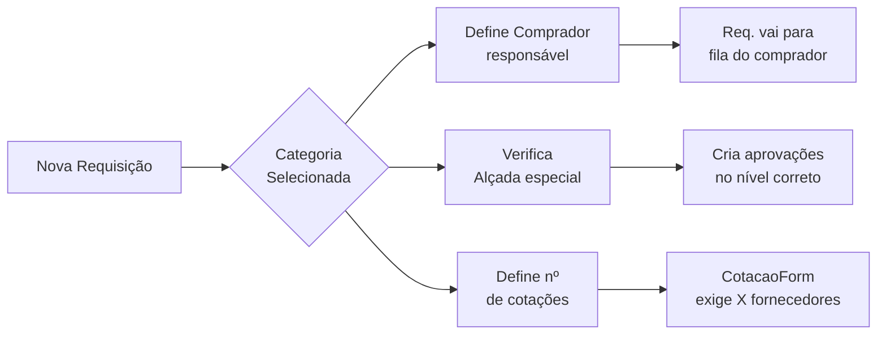

# Compradores e Categorias — TEG+ ERP

## Compradores Ativos

| Comprador    | Email               | Categorias Responsáveis                                                            |
| ------------ | ------------------- | ---------------------------------------------------------------------------------- |
| **Lauany**   | lauany@teg.com.br   | Materiais de Obra, EPI/EPC, Ferramental, Centro de Distribuição, Demais Aquisições |
| **Fernando** | fernando@teg.com.br | Frota/Equipamentos, Serviços, Locação                                              |
| **Aline**    | aline@teg.com.br    | Mobilização, Alojamento, Alimentação, Escritório                                   |
|              |                     |                                                                                    |

---

## 12 Categorias Reais

### Grupo Lauany

#### 1. Materiais de Obra
| Campo | Valor |
|-------|-------|
| Código | `MAT-OBRA` |
| Comprador | Lauany |
| Keywords | cabo, condutor, fio, transformador, isolador, poste, estrutura, ferramenta, material elétrico |
| Alçada N1 | até R$ 5.000 (1 cotação) |
| Regra cotações | <R$1k: 1 cotação / R$1k-5k: 2 cotações / >R$5k: 3 cotações |
| Alçada especial | Segue tabela padrão |

#### 2. EPI/EPC
| Campo | Valor |
|-------|-------|
| Código | `EPI-EPC` |
| Comprador | Lauany |
| Keywords | capacete, luva, bota, cinto, trava-queda, óculos, proteção, epi, epc, segurança |
| Regra cotações | <R$1k: 1 cotação / R$1k-5k: 2 cotações / >R$5k: 3 cotações |
| Alçada especial | Segue tabela padrão |

#### 3. Ferramental
| Campo | Valor |
|-------|-------|
| Código | `FERRAM` |
| Comprador | Lauany |
| Keywords | ferramenta, chave, alicate, martelo, furadeira, esmerilhadeira, talha, macaco |
| Regra cotações | <R$1k: 1 cotação / >R$1k: 2 cotações |
| Alçada especial | Segue tabela padrão |

#### 4. Centro de Distribuição
| Campo | Valor |
|-------|-------|
| Código | `CENTRO-DIST` |
| Comprador | Lauany |
| Keywords | distribuição, estoque, CD, armazenagem, picking, transferência |
| Alçada especial | Segue tabela padrão |

#### 5. Demais Aquisições
| Campo | Valor |
|-------|-------|
| Código | `DEMAIS` |
| Comprador | Lauany |
| Keywords | (categoria genérica/fallback) |
| Alçada especial | Segue tabela padrão |

---

### Grupo Fernando

#### 6. Frota/Equipamentos
| Campo | Valor |
|-------|-------|
| Código | `FROTA-EQUIP` |
| Comprador | Fernando |
| Keywords | caminhão, veículo, carro, moto, trator, retroescavadeira, equipamento pesado, frota |
| Regra cotações | Sempre mínimo 2 cotações |
| Alçada especial | **Mínimo Nível 2 (Gerente)** independente do valor |

#### 7. Serviços
| Campo | Valor |
|-------|-------|
| Código | `SERVICOS` |
| Comprador | Fernando |
| Keywords | serviço, mão de obra, terceiro, empreitada, consultoria, manutenção, reparo |
| Regra cotações | <R$5k: 2 cotações / >R$5k: 3 cotações |
| Alçada especial | **Mínimo Nível 2 (Gerente)** independente do valor |

#### 8. Locação
| Campo | Valor |
|-------|-------|
| Código | `LOCACAO` |
| Comprador | Fernando |
| Keywords | locação, aluguel, aluga, rent, equipamento locado, guindaste, andaime |
| Regra cotações | Sempre mínimo 2 cotações |
| Alçada especial | **Mínimo Nível 2 (Gerente)** independente do valor |

---

### Grupo Aline

#### 9. Mobilização
| Campo | Valor |
|-------|-------|
| Código | `MOBILIZ` |
| Comprador | Aline |
| Keywords | mobilização, desmobilização, deslocamento, transferência de equipe, passagem |
| Regra cotações | Sempre 3 cotações |
| Alçada especial | **Mínimo Nível 3 (Diretor)** independente do valor |

#### 10. Alojamento
| Campo | Valor |
|-------|-------|
| Código | `ALOJAM` |
| Comprador | Aline |
| Keywords | alojamento, hospedagem, hotel, pousada, casa, moradia temporária |
| Regra cotações | <R$5k: 2 cotações / >R$5k: 3 cotações |
| Alçada especial | Segue tabela padrão |

#### 11. Alimentação
| Campo | Valor |
|-------|-------|
| Código | `ALIMENT` |
| Comprador | Aline |
| Keywords | alimentação, refeição, marmita, restaurante, fornecedor de comida, café |
| Regra cotações | <R$2k: 1 cotação / >R$2k: 2 cotações |
| Alçada especial | Segue tabela padrão |

#### 12. Escritório
| Campo | Valor |
|-------|-------|
| Código | `ESCRITORIO` |
| Comprador | Aline |
| Keywords | material escritório, papel, caneta, impressora, toner, informática, notebook |
| Regra cotações | <R$500: 1 cotação / >R$500: 2 cotações |
| Alçada especial | Segue tabela padrão |

---

## Regras de Cotação por Valor

| Valor da Requisição | Cotações Necessárias |
|--------------------|---------------------|
| Até R$ 1.000 | 1 cotação |
| R$ 1.001 a R$ 5.000 | 2 cotações |
| Acima de R$ 5.000 | 3 cotações |

> Categorias com regras especiais sobrescrevem esta tabela padrão.

---

## Como a Categoria é Usada no Fluxo



---

## Schema SQL (`cmp_categorias`, `cmp_compradores`)

```sql
-- Compradores
CREATE TABLE cmp_compradores (
  id          uuid DEFAULT gen_random_uuid() PRIMARY KEY,
  nome        varchar(100) NOT NULL,
  email       varchar(255) NOT NULL UNIQUE,
  ativo       boolean DEFAULT true
);

INSERT INTO cmp_compradores (nome, email) VALUES
  ('Lauany', 'lauany@teg.com.br'),
  ('Fernando', 'fernando@teg.com.br'),
  ('Aline', 'aline@teg.com.br');

-- Categorias
CREATE TABLE cmp_categorias (
  id              uuid DEFAULT gen_random_uuid() PRIMARY KEY,
  codigo          varchar(50) NOT NULL UNIQUE,
  nome            varchar(100) NOT NULL,
  comprador_id    uuid REFERENCES cmp_compradores(id),
  comprador_nome  varchar(100),     -- desnormalizado para performance
  comprador_email varchar(255),     -- desnormalizado
  alcada1_limite  numeric(12,2),   -- override de alçada mínima
  cotacoes_regras text,            -- descrição das regras
  keywords        text,            -- palavras-chave para AI detection
  icone           varchar(50),     -- nome do ícone lucide
  cor             varchar(50),     -- classe tailwind de cor
  ativo           boolean DEFAULT true
);
```

---

## Detecção por AI

O n8n usa as `keywords` de cada categoria para AI parse:

```
Texto: "Preciso de 10 capacetes para obra de Frutal"

Keywords match:
  EPI/EPC: "capacete" ✅ (confiança 0.95)
  Materiais de Obra: sem match
  Ferramental: sem match

→ Categoria sugerida: EPI/EPC
→ Comprador sugerido: Lauany
```

---

## Política de Cotações (`cotacoesPolicy.ts`)

A lógica de quantidade mínima de cotações por categoria e valor está implementada em `src/utils/cotacoesPolicy.ts`. A função `getMinCotacoes(categoria, valor)` retorna o número mínimo de fornecedores a cotizar, considerando as regras especiais de cada categoria (descritas acima) com fallback para a tabela padrão por valor.

---

## Filtro por Categoria no Dashboard

O dashboard de Compras permite filtrar requisições por categoria, mostrando apenas os itens do comprador responsável. Compradores veem por padrão apenas suas categorias atribuídas; roles superiores (supervisor, gerente) veem todas as categorias.

---

## Links Relacionados

- [[11 - Fluxo Requisição]] — Como categorias são usadas
- [[13 - Alçadas]] — Regras de alçada por categoria
- [[07 - Schema Database]] — Tabelas cmp_categorias e cmp_compradores
- [[08 - Migrações SQL]] — Migration 007 com dados reais
