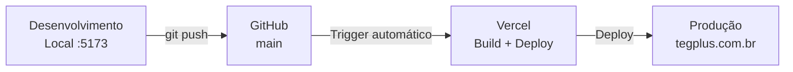

# Deploy e GitHub — TEG+ ERP

## Repositório GitHub

```
Repositório: leandroteg/teg-plus
Branch principal: main
Branch de desenvolvimento: claude/map-app-architecture-*
```

---

## Estratégia de Deploy



---

## Vercel (`vercel.json`)

```json
{
  "buildCommand": "cd frontend && npm install && npm run build",
  "outputDirectory": "frontend/dist",
  "installCommand": "cd frontend && npm install",
  "framework": "vite",
  "rewrites": [
    { "source": "/aprovaai", "destination": "/aprovaai.html" },
    { "source": "/((?!api|_vercel|aprovaai).*)", "destination": "/index.html" }
  ],
  "headers": [
    { "source": "/assets/(.*)", "headers": [{ "key": "Cache-Control", "value": "public, max-age=31536000, immutable" }] },
    { "source": "/sw.js", "headers": [{ "key": "Cache-Control", "value": "no-cache, no-store, must-revalidate" }] },
    { "source": "/workbox-:hash.js", "headers": [{ "key": "Cache-Control", "value": "no-cache, no-store, must-revalidate" }] },
    { "source": "/manifest.webmanifest", "headers": [{ "key": "Cache-Control", "value": "no-cache" }] },
    { "source": "/(.*)", "headers": [
      { "key": "X-Content-Type-Options", "value": "nosniff" },
      { "key": "X-Frame-Options", "value": "DENY" },
      { "key": "Referrer-Policy", "value": "strict-origin-when-cross-origin" },
      { "key": "Permissions-Policy", "value": "camera=(), microphone=(self), geolocation=()" }
    ]}
  ]
}
```

**Detalhes:**
- Build: `cd frontend && npm install && npm run build`
- Output: `frontend/dist`
- Framework detectado: Vite
- SPA rewrite: todas as rotas → `index.html` (exceto `/api`, `/_vercel`, `/aprovaai`)
- AprovAi: bundle separado em `/aprovaai.html`
- Headers de segurança: `X-Content-Type-Options`, `X-Frame-Options`, `Referrer-Policy`, `Permissions-Policy`
- Cache: assets imutáveis (1 ano), service worker sem cache

---

## GitHub Actions

**Status atual:** CI configurado com build + TypeScript check.

```yaml
# .github/workflows/ci.yml
name: CI

on:
  push:
    branches: [main]
  pull_request:
    branches: [main]

jobs:
  build:
    runs-on: ubuntu-latest
    steps:
      - uses: actions/checkout@v4
      - uses: actions/setup-node@v4
        with:
          node-version: '20'
      - run: cd frontend && npm install
      - run: cd frontend && npm run build
      - run: cd frontend && npx tsc --noEmit
```

> **Nota:** Testes automatizados (`npm run test`) ainda não estão integrados no CI.

---

## Variáveis de Ambiente no Vercel

No painel Vercel → Settings → Environment Variables:

| Variável | Ambiente | Descrição |
|----------|----------|-----------|
| `VITE_SUPABASE_URL` | Production + Preview | URL do projeto Supabase |
| `VITE_SUPABASE_ANON_KEY` | Production + Preview | Chave anon pública |
| `VITE_N8N_WEBHOOK_URL` | Production + Preview | Base URL dos webhooks n8n |
| `VITE_VAPID_PUBLIC_KEY` | Production + Preview | Chave pública VAPID para Web Push |

> **Importante:** prefixo `VITE_` é obrigatório para Vite expor as vars para o browser.

---

## Estrutura de Branches

```
main
├── Produção — auto-deploy no Vercel
└── Pull requests → preview deployments

claude/map-app-architecture-*
└── Desenvolvimento atual (Claude Code sessions)
```

---

## Build Local

```bash
# Instalação
cd frontend
npm install

# Desenvolvimento
npm run dev           # http://localhost:5173

# Build de produção
npm run build         # output: frontend/dist/

# Preview local do build
npm run preview       # http://localhost:4173

# Type check
npx tsc --noEmit
```

---

## .gitignore

```gitignore
# Dependências
node_modules/
frontend/node_modules/

# Build
dist/
frontend/dist/

# Ambiente
.env
.env.local
.env.*.local

# Sistema
.DS_Store
.vscode/
*.swp
```

---

## Domínio e SSL

- Deploy automático no domínio Vercel: `teg-plus.vercel.app`
- SSL automático via Vercel (Let's Encrypt)
- Domínio customizado: configurar no painel Vercel

---

## Links Relacionados

- [[01 - Arquitetura Geral]] — Visão da infraestrutura
- [[16 - Variáveis de Ambiente]] — Configuração de variáveis
- [[02 - Frontend Stack]] — Scripts de build
