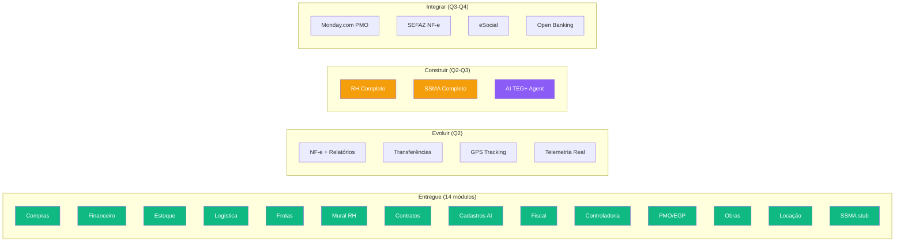
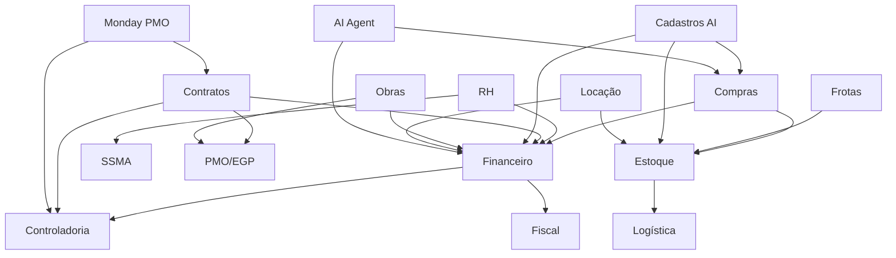

# Roadmap — TEG+ ERP Tailor-Made

> Plano completo para transformar o TEG+ em um ERP sob medida para operações de engenharia elétrica.
> Organizado por trimestre, com dependências e prioridades claras.
> Atualizado em Abril 2026.

---

## Visão Geral do Produto

---

## Status Atual — Abril 2026

### Entregue (14 Módulos Operacionais)

| Módulo | Completude | Funcionalidades |
|--------|-----------|-----------------|
| **Compras** | 95% | Wizard 3 etapas, AI parse, aprovações 4 alçadas, cotações com recomendação, PO, dashboard unificado (RCs + cotações + pedidos) |
| **Financeiro** | 70% | CP pipeline, CR pipeline, lotes de pagamento, Tesouraria, Omie ERP, remessas |
| **Estoque** | 65% | Almoxarifado, inventário, patrimonial, depreciação linear, curva ABC, flags controle |
| **Logística** | 85% | Solicitações 9 etapas, expedição, recebimentos, NF-e, pipeline Kanban, planejamento rota (Leaflet) |
| **Frotas** | 80% | Veículos, OS manutenção, checklists, abastecimentos, telemetria |
| **Mural RH** | 100% | Slideshow Ken Burns, gestão admin, campanhas com vigência |
| **Contratos** | 75% | Contratos base, parcelas, medições, pleitos, modelos, assinaturas, permissões supervisor |
| **Cadastros AI** | 100% | 6 entidades, MagicModal AI/Manual, CNPJ/CPF lookup, cross-module |
| **Fiscal** | 80% | Painel Fiscal, Pipeline Kanban NF, Histórico NFs, solicitações NF |
| **Controladoria** | 75% | DRE, Orçamentos, KPIs, Cenários, Plano/Controle Orçamentário, Alertas, Indicadores Produção |
| **PMO/EGP** | 80% | Portfólio, TAP, EAP, Cronograma, Medições, Histograma, Custos, Reuniões, Status Reports |
| **Obras** | 75% | Apontamentos, RDO, Adiantamentos, Prestação de Contas, Planejamento de Equipe |
| **Locação** | 100% | Acordos de locação, vistorias (entrada/saída), comparativos, fluxo completo |
| **SSMA (stub)** | 10% | Tela informativa com roadmap — funcionalidades Q2-Q4 2026 |

### Entregas Recentes (Q1 2026)

| Entrega | Módulo | Data | Status |
|---------|--------|------|--------|
| Módulo Locação completo | Locação | Abr 2026 | DONE |
| Motor de recomendação de cotações (scoring multi-critério) | Compras | Abr 2026 | DONE |
| RBAC v2 (hasModule, atLeast, canApprove, getPapelForModule) | Auth | Abr 2026 | DONE |
| Dashboard unificado (RCs + cotações + pedidos) | Compras | Abr 2026 | DONE |
| Permissões supervisor em contratos | Contratos | Abr 2026 | DONE |
| Lotes de pagamento batch | Financeiro | Mar 2026 | DONE |
| CP Pipeline unificado | Financeiro | Mar 2026 | DONE |
| CR Pipeline upgrade | Financeiro | Mar 2026 | DONE |
| Tesouraria foundation | Financeiro | Mar 2026 | DONE |
| Production hardening (58 índices) | Infra | Mar 2026 | DONE |

### Infraestrutura Entregue

| Item | Detalhes |
|------|----------|
| Schema Supabase | 75 migrations, RLS, views, funções, triggers |
| Auth | Magic link + email/senha, RBAC v2, 6 roles |
| n8n Workflows | 16 workflows ativos (compras, financeiro, AI parse, WhatsApp) |
| Deploy | Vercel (frontend) + Easypanel (n8n) |
| Obsidian Vault | 33+ docs, painéis Dataview |

---

## Q2 2026 — Módulo RH + AI (Abr → Jun)

> **Foco:** RH completo, AI agent, profundidade financeira.

### MS-008 · Módulo RH Completo

| Funcionalidade | Prioridade | Integrações |
|----------------|-----------|-------------|
| Cadastro de colaboradores | Crítica | Supabase + eSocial |
| Ponto eletrônico | Crítica | REP/Mobile |
| HHt — Homem-hora por obra | Crítica | PWA mobile-first |
| Folha de pagamento (cálculos) | Alta | Omie/Contabilidade |
| Férias, afastamentos, ASO | Alta | eSocial |
| Organograma e cargos | Média | Supabase |
| Relatórios trabalhistas | Média | eSocial/FGTS |

### MS-011 · AI TEG+ Agent

| Capacidade | Canal | Stack |
|-----------|-------|-------|
| "Abrir requisição" → wizard conversacional | WhatsApp + Web | Claude API |
| "Status da RC-XXX" → consulta Supabase | WhatsApp + Web | n8n + RAG |
| "Quantas requisições pendentes?" → dashboard | WhatsApp | Claude + Supabase |
| "Relatório de compras do mês" → AI + SQL | Web chat | Claude + RPC |
| Análise de anomalias financeiras | Web | Claude + cron |

### SSMA — Base Operacional

| Item | Prioridade |
|------|-----------|
| Registro de acidentes/incidentes + CAT | Crítica |
| Gestão de EPIs por colaborador | Alta |
| DDS Digital com lista de presença | Alta |
| Permissão de Trabalho (PT) | Alta |

### Evoluções em Andamento

| # | Item | Módulo | Status |
|---|------|--------|--------|
| 1 | Relatórios Financeiros (DRE, DFC, BP) | Financeiro | Em andamento |
| 2 | Solicitações de material inter-bases | Estoque | Backlog |
| 3 | Transferências entre almoxarifados | Estoque | Backlog |
| 4 | Testes automatizados (Vitest + Playwright) | Infra | Backlog |
| 5 | CI/CD GitHub Actions | Infra | Backlog |

---

## Q3 2026 — SSMA Completo + Integrações (Jul → Set)

### MS-009 · Módulo SSMA — Fase 2

| Funcionalidade | Prioridade | Regulação |
|----------------|-----------|-----------|
| Checklists de segurança digitais | Crítica | NR-10/NR-35 |
| Treinamentos NR com alertas de validade | Alta | NR-1 |
| Indicadores LTIFR, TRIFR | Média | Benchmarking |
| Dashboard de segurança por obra | Média | — |

### Integrações

| Integração | Módulo | Prioridade |
|------------|--------|-----------|
| SEFAZ — NF-e/NFS-e real | Fiscal | Obrigatória |
| eSocial | RH | Obrigatória |
| GPS/Rastreamento frota | Frotas | Média |
| Contabilidade externa | Financeiro | Média |

---

## Q4 2026 — Integrações Enterprise (Out → Dez)

### MS-013 · Monday.com PMO

| Funcionalidade | Descrição |
|----------------|-----------|
| Cronograma por obra | Importação de timeline |
| Status por frente de trabalho | Sync bidirecional |
| Vinculação compras ao cronograma | Compras ↔ Monday items |
| KPIs avanço físico-financeiro | Dashboard combinado |

### SSMA — Fase 3 (Gestão Avançada)

| Funcionalidade | Prioridade |
|----------------|-----------|
| Auditorias internas + planos de ação | Alta |
| Gestão ambiental (resíduos, licenças) | Média |
| PPRA/PCMSO Digital | Média |

---

## Integrações Externas Planejadas

| Integração | Módulo | Prioridade | Trimestre |
|------------|--------|-----------|-----------|
| WhatsApp (Evolution API) | Compras/Notif | Crítica | Q1 (DONE) |
| SEFAZ — NF-e/NFS-e | Fiscal | Obrigatória | Q3 |
| eSocial | RH | Obrigatória | Q2 |
| CNAB 240/480 (bancário) | Financeiro | Obrigatória | Q1-Q2 |
| OFX / Open Banking | Financeiro | Alta | Q2 |
| Receita Federal (CNPJ) | Compras/Fin | Média | Q1 (DONE via BrasilAPI) |
| Monday.com | PMO | Alta | Q4 |
| GPS/Rastreamento frota | Frotas | Média | Q3 |

---

## KPIs de Sucesso do Projeto

| Indicador | Atual (Abr/26) | Meta Q2 | Meta Q4 |
|---|---|---|---|
| Módulos operacionais | 14 | 16 (+ RH, AI) | 17 (todos) |
| Tabelas no schema | ~80 | ~100 | ~130 |
| Workflows n8n | 16 | 20 | 25 |
| Tempo aprovação compra | < 4h | < 2h | < 1h |
| Requisições digitais | 100% | 100% | 100% |
| Cobertura de testes | 0% | 40% | 70% |
| Integrações externas | 2 (Omie, BrasilAPI) | 5 | 8 |
| Visibilidade financeira | Real-time | Real-time | BI completo |
| Migrations SQL | 75 | ~90 | ~120 |

---

## Dependências entre Módulos

---

## Milestones

| ID | Milestone | Fase | Progresso |
|----|-----------|------|-----------|
| [[MS-001 - Modulo Compras Core\|MS-001]] | Compras Core | Q1-2026 | 100% |
| [[MS-002 - Cotacoes e Notificacoes\|MS-002]] | Cotações e Notificações | Q1-2026 | 95% (recomendação DONE) |
| [[MS-004 - Modulo Financeiro\|MS-004]] | Financeiro — Omie Core | Q1-Q2 | 70% |
| [[MS-006 - Modulo Estoque Patrimonial\|MS-006]] | Estoque e Patrimonial | Q1-2026 | 65% |
| [[MS-006 - Modulo Logistica Transportes\|MS-006b]] | Logística e Transportes | Q1-2026 | 85% |
| [[MS-007 - Modulo Frotas Manutencao\|MS-007]] | Frotas e Manutenção | Q1-2026 | 80% |
| [[MS-008 - Modulo RH Completo\|MS-008]] | RH Completo | Q2-2026 | 0% |
| [[MS-009 - Modulo SSMA\|MS-009]] | SSMA | Q2-Q4 2026 | 10% (stub) |
| [[MS-010 - Modulo Contratos Medicoes\|MS-010]] | Contratos e Medições | Q1-2026 | 75% (supervisor DONE) |
| [[MS-011 - AI TEG+ Agent\|MS-011]] | AI TEG+ Agent | Q2-Q3 | 0% |
| [[MS-012 - Controladoria BI\|MS-012]] | Controladoria e BI | Q1-2026 | 75% |
| [[MS-013 - Monday PMO\|MS-013]] | Monday.com PMO | Q4-2026 | 0% |
| [[MS-014 - Modulo Cadastros AI\|MS-014]] | Cadastros AI (Master Data) | Q1-2026 | 100% |
| MS-015 | Fiscal — NF Pipeline ([[29 - Módulo Fiscal]]) | Q1-2026 | 80% |
| MS-016 | PMO/EGP ([[31 - Módulo PMO-EGP]]) | Q1-2026 | 80% |
| MS-017 | Obras ([[32 - Módulo Obras]]) | Q1-2026 | 75% |
| MS-018 | Locação ([[34 - Módulo Locação]]) | Q1-2026 | 100% |
| MS-019 | RBAC v2 ([[09 - Auth Sistema]]) | Q1-2026 | 100% |
| MS-020 | Dashboard Unificado Compras | Q1-2026 | 100% |

---

## Design Docs e Planos de Implementacao

> Documentos tecnicos de design e plano de cada feature implementada.

### Infraestrutura e Arquitetura
| Data | Documento | Modulo |
|------|-----------|--------|
| Mar 04 | [[plans/2026-03-04-approval-flow-design\|Approval Flow Design]] | [[12 - Fluxo Aprovação]] |
| Mar 04 | [[plans/2026-03-04-approval-flow-plan\|Approval Flow Plan]] | [[12 - Fluxo Aprovação]] |
| Mar 05 | [[plans/2026-03-05-split-layout-design\|Split Layout Design]] | [[02 - Frontend Stack]] |
| Mar 06 | [[plans/2026-03-06-foundation-phase1\|Foundation Phase 1]] | [[01 - Arquitetura Geral]] |
| Mar 07 | [[plans/2026-03-07-foundation-phase2\|Foundation Phase 2]] | [[01 - Arquitetura Geral]] |
| Mar 07 | [[plans/2026-03-07-foundation-phase2-security\|Security Hardening]] | [[09 - Auth Sistema]] |
| Mar 07 | [[plans/2026-03-07-avatar-dropdown-design\|Avatar Dropdown]] | [[04 - Componentes]] |
| Mar 07 | [[plans/2026-03-07-issue-batch-fixes-design\|Issue Batch Fixes Design]] | Geral |
| Mar 07 | [[plans/2026-03-07-issue-batch-fixes\|Issue Batch Fixes Plan]] | Geral |
| Mar 22 | [[plans/2026-03-22-permissoes-granulares-design\|Permissoes Granulares]] | [[09 - Auth Sistema]] |

### Modulos Operacionais
| Data | Documento | Modulo |
|------|-----------|--------|
| Mar 05 | [[plans/2026-03-05-cadastros-ai-design\|Cadastros AI Design]] | [[28 - Módulo Cadastros AI]] |
| Mar 05 | [[plans/2026-03-05-cadastros-ai-plan\|Cadastros AI Plan]] | [[28 - Módulo Cadastros AI]] |
| Mar 05 | [[plans/2026-03-05-fiscal-notas-fiscais-design\|Fiscal NF Design]] | [[29 - Módulo Fiscal]] |
| Mar 05 | [[plans/2026-03-05-fiscal-notas-fiscais-plan\|Fiscal NF Plan]] | [[29 - Módulo Fiscal]] |
| Mar 07 | [[plans/2026-03-07-recebimento-integration-design\|Recebimento Integration]] | [[22 - Módulo Estoque e Patrimonial]] |
| Mar 07 | [[plans/2026-03-07-superteg-chat-redesign\|SuperTEG Chat Redesign]] | [[28 - Módulo Cadastros AI]] |
| Mar 09 | [[plans/2026-03-09-nf-romaneio-fiscal-redesign\|NF Romaneio Redesign]] | [[29 - Módulo Fiscal]] |
| Mar 12 | [[plans/2026-03-12-tesouraria-design\|Tesouraria Design]] | [[20 - Módulo Financeiro]] |
| Mar 12 | [[plans/2026-03-12-tesouraria-plan\|Tesouraria Plan]] | [[20 - Módulo Financeiro]] |
| Mar 27 | [[plans/2026-03-27-endomarketing-design\|Endomarketing Design]] | [[25 - Mural de Recados]] |
| Mar 30 | [[plans/2026-03-30-frotas-maquinas-design\|Frotas Maquinas Design]] | [[24 - Módulo Frotas e Manutenção]] |
| Mar 30 | [[plans/2026-03-30-frotas-maquinas-impl\|Frotas Maquinas Impl]] | [[24 - Módulo Frotas e Manutenção]] |
| Mar 31 | [[plans/2026-03-31-compras-dashboard-redesign\|Compras Dashboard Redesign]] | [[14 - Compradores e Categorias]] |
| Mar 31 | [[plans/2026-03-31-endomarketing-imagem-ia-design\|Endomarketing IA Design]] | [[25 - Mural de Recados]] |
| Mar 31 | [[plans/2026-03-31-endomarketing-imagem-ia\|Endomarketing IA Plan]] | [[25 - Mural de Recados]] |

### Contratos e Assinatura Digital
| Data | Documento | Modulo |
|------|-----------|--------|
| Mar 11 | [[plans/2026-03-11-certisign-integration-design\|Certisign Design]] | [[27 - Módulo Contratos Gestão]] |
| Mar 11 | [[plans/2026-03-11-certisign-implementation-plan\|Certisign Plan]] | [[27 - Módulo Contratos Gestão]] |
| Mar 22 | [[plans/2026-03-22-biblioteca-modelos-minuta-design\|Biblioteca Minutas Design]] | [[27 - Módulo Contratos Gestão]] |
| Mar 22 | [[plans/2026-03-22-biblioteca-modelos-minuta\|Biblioteca Minutas Plan]] | [[27 - Módulo Contratos Gestão]] |
| Mar 22 | [[plans/2026-03-22-filtros-grupo-acompanhamento-gestao\|Filtros Gestao Plan]] | [[27 - Módulo Contratos Gestão]] |

### PMO e Gestao de Projetos
| Data | Documento | Modulo |
|------|-----------|--------|
| Abr 06 | [[plans/2026-04-06-egp-ciclo-vida-design\|EGP Ciclo de Vida Design]] | [[31 - Módulo PMO-EGP]] |
| Abr 06 | [[plans/2026-04-06-egp-ciclo-vida-plan\|EGP Ciclo de Vida Plan]] | [[31 - Módulo PMO-EGP]] |

---

## Links Relacionados

- [[00 - TEG+ INDEX]] — Status atual consolidado
- [[01 - Arquitetura Geral]] — Arquitetura técnica
- [[09 - Auth Sistema]] — RBAC v2
- [[10 - n8n Workflows]] — Workflows existentes e futuros
- [[27 - Módulo Contratos Gestão]] — Contratos e parcelas
- [[28 - Módulo Cadastros AI]] — Cadastros AI com MagicModal
- [[29 - Módulo Fiscal]] — Módulo Fiscal
- [[30 - Módulo Controladoria]] — Módulo Controladoria
- [[31 - Módulo PMO-EGP]] — Módulo PMO/EGP
- [[32 - Módulo Obras]] — Módulo Obras
- [[33 - Módulo SSMA]] — Módulo SSMA (planejado)
