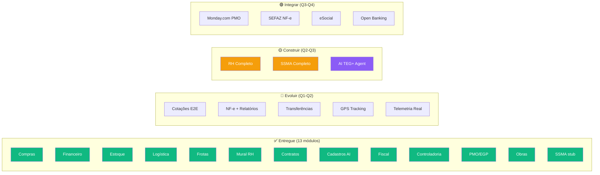
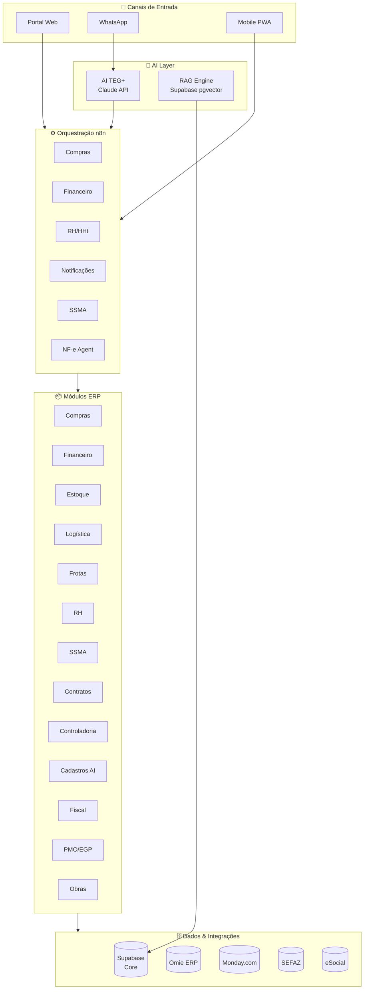
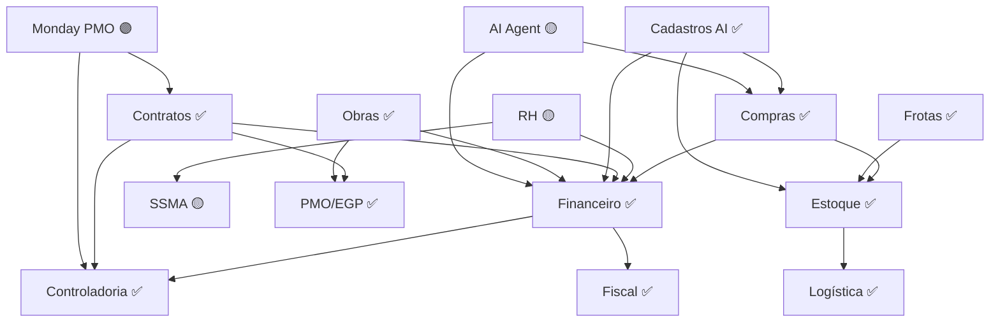

# Roadmap — TEG+ ERP Tailor-Made

> Plano completo para transformar o TEG+ em um ERP sob medida para operações de engenharia elétrica.
> Organizado por trimestre, com dependências e prioridades claras.

---

## Visão Geral do Produto

---

## Status Atual — Março 2026

### Entregue ✅ (13 Módulos Operacionais)

| Módulo | Completude | Funcionalidades |
|--------|-----------|-----------------|
| **Compras** | 95% | Wizard 3 etapas, AI parse, aprovações 4 alçadas, cotações, PO, token-based |
| **Financeiro** | 65% | CP, CR, aprovações, conciliação CNAB, Omie ERP, 4 squads n8n, Tesouraria |
| **Estoque** | 60% | Almoxarifado, inventário, patrimonial, depreciação linear, curva ABC |
| **Logística** | 85% | Solicitações 9 etapas, expedição, recebimentos, NF-e, pipeline Kanban |
| **Frotas** | 80% | Veículos, OS manutenção, checklists, abastecimentos, telemetria |
| **Mural RH** | 100% | Slideshow Ken Burns, gestão admin, campanhas com vigência |
| **Contratos** | 70% | Contratos base, parcelas, medições, pleitos, integração financeiro |
| **Cadastros AI** | 100% | 6 entidades, MagicModal AI/Manual, CNPJ/CPF lookup, cross-module |
| **Fiscal** | 80% | Painel Fiscal, Pipeline Kanban NF, Histórico NFs, hooks completos |
| **Controladoria** | 70% | DRE, Orçamentos, KPIs, Cenários, Plano/Controle Orçamentário, Alertas |
| **PMO/EGP** | 75% | Portfólio, TAP, EAP, Cronograma, Medições, Histograma, Custos, Reuniões, Status Reports |
| **Obras** | 70% | Apontamentos, RDO, Adiantamentos, Prestação de Contas, Planejamento de Equipe |
| **SSMA (stub)** | 10% | Tela informativa com roadmap — funcionalidades Q2-Q4 2026 |

### Infraestrutura Entregue ✅

| Item | Detalhes |
|------|----------|
| Schema Supabase | 25+ migrations, RLS, views, funções, triggers |
| Auth | Magic link + email/senha, 6 roles |
| n8n Workflows | 8+ workflows ativos (compras, financeiro, AI parse) |
| Deploy | Vercel (frontend) + Easypanel (n8n) |
| Obsidian Vault | 33 docs, 7 painéis Dataview |

---

## Q1 2026 — Completar Módulos Core (Mar)

> **Foco:** Fechar gaps dos módulos já entregues.

### Prioridade Crítica

| # | Item | Módulo | Milestone | Status |
|---|------|--------|-----------|--------|
| 1 | Notificações WhatsApp (Evolution API) | Compras | MS-002 | 🔵 Em andamento |
| 2 | Cotações end-to-end com regras automáticas | Compras | MS-002 | 🔵 Em andamento |
| 3 | Conciliação e Remessa Bancária (CNAB 240) | Financeiro | MS-004 | 🔵 Em andamento |
| 4 | Relatórios Financeiros (DRE, DFC, BP) | Financeiro | MS-004 | 🔵 Em andamento |

### Prioridade Alta

| # | Item | Módulo | Status |
|---|------|--------|--------|
| 5 | Solicitações de material inter-bases | Estoque | ⬜ Backlog |
| 6 | Transferências entre almoxarifados | Estoque | ⬜ Backlog |
| 7 | Testes automatizados (Vitest + Playwright) | Infra | ⬜ Backlog |
| 8 | CI/CD GitHub Actions | Infra | ⬜ Backlog |

---

## Q2 2026 — Módulo RH + AI (Abr → Jun)

> **Foco:** RH completo, AI agent, profundidade financeira.

### MS-008 · Módulo RH Completo

| Funcionalidade | Prioridade | Integrações |
|----------------|-----------|-------------|
| Cadastro de colaboradores | Crítica | Supabase + eSocial |
| Ponto eletrônico | Crítica | REP/Mobile |
| HHt — Homem-hora por obra | Crítica | PWA mobile-first |
| Folha de pagamento (cálculos) | Alta | Omie/Contabilidade |
| Férias, afastamentos, ASO | Alta | eSocial |
| Organograma e cargos | Média | Supabase |
| Relatórios trabalhistas | Média | eSocial/FGTS |

### MS-011 · AI TEG+ Agent

| Capacidade | Canal | Stack |
|-----------|-------|-------|
| "Abrir requisição" → wizard conversacional | WhatsApp + Web | Claude API |
| "Status da RC-XXX" → consulta Supabase | WhatsApp + Web | n8n + RAG |
| "Quantas requisições pendentes?" → dashboard | WhatsApp | Claude + Supabase |
| "Relatório de compras do mês" → AI + SQL | Web chat | Claude + RPC |
| Análise de anomalias financeiras | Web | Claude + cron |

### SSMA — Base Operacional

| Item | Prioridade |
|------|-----------|
| Registro de acidentes/incidentes + CAT | Crítica |
| Gestão de EPIs por colaborador | Alta |
| DDS Digital com lista de presença | Alta |
| Permissão de Trabalho (PT) | Alta |

---

## Q3 2026 — SSMA Completo + Integrações (Jul → Set)

> **Foco:** Módulos regulatórios e integrações enterprise.

### MS-009 · Módulo SSMA — Fase 2

| Funcionalidade | Prioridade | Regulação |
|----------------|-----------|-----------|
| Checklists de segurança digitais | Crítica | NR-10/NR-35 |
| Treinamentos NR com alertas de validade | Alta | NR-1 |
| Indicadores LTIFR, TRIFR | Média | Benchmarking |
| Dashboard de segurança por obra | Média | — |

### Integrações

| Integração | Módulo | Prioridade |
|------------|--------|-----------|
| SEFAZ — NF-e/NFS-e real | Fiscal | Obrigatória |
| eSocial | RH | Obrigatória |
| GPS/Rastreamento frota | Frotas | Média |
| Contabilidade externa | Financeiro | Média |

---

## Q4 2026 — Integrações Enterprise (Out → Dez)

> **Foco:** Integrações externas e SSMA completo.

### MS-013 · Monday.com PMO

| Funcionalidade | Descrição |
|----------------|-----------|
| Cronograma por obra | Importação de timeline |
| Status por frente de trabalho | Sync bidirecional |
| Vinculação compras ao cronograma | Compras ↔ Monday items |
| KPIs avanço físico-financeiro | Dashboard combinado |

### SSMA — Fase 3 (Gestão Avançada)

| Funcionalidade | Prioridade |
|----------------|-----------|
| Auditorias internas + planos de ação | Alta |
| Gestão ambiental (resíduos, licenças) | Média |
| PPRA/PCMSO Digital | Média |

---

## Integrações Externas Planejadas

| Integração | Módulo | Prioridade | Trimestre |
|------------|--------|-----------|-----------|
| WhatsApp (Evolution API) | Compras/Notif | Crítica | Q1 |
| SEFAZ — NF-e/NFS-e | Fiscal | Obrigatória | Q3 |
| eSocial | RH | Obrigatória | Q2 |
| CNAB 240/480 (bancário) | Financeiro | Obrigatória | Q1 |
| OFX / Open Banking | Financeiro | Alta | Q2 |
| Receita Federal (CNPJ) | Compras/Fin | Média | Q2 |
| Monday.com | PMO | Alta | Q4 |
| GPS/Rastreamento frota | Frotas | Média | Q3 |

---

## Arquitetura Alvo — ERP Completo

---

## KPIs de Sucesso do Projeto

| Indicador | Atual (Mar/26) | Meta Q2 | Meta Q4 |
|---|---|---|---|
| Módulos operacionais | 13 | 15 (+ RH, AI) | 16 (todos) |
| Tabelas no schema | ~70 | ~100 | ~130 |
| Workflows n8n | 8 | 15 | 25 |
| Tempo aprovação compra | < 4h | < 2h | < 1h |
| Requisições digitais | 100% | 100% | 100% |
| Cobertura de testes | 0% | 40% | 70% |
| Integrações externas | 1 (Omie) | 4 | 8 |
| Visibilidade financeira | Real-time parcial | Real-time | BI completo |

---

## Dependências entre Módulos

---

## Milestones Ativos

| ID | Milestone | Fase | Progresso |
|----|-----------|------|-----------|
| [[MS-001 - Modulo Compras Core\|MS-001]] | Compras Core | Q1-2026 | ✅ 100% |
| [[MS-002 - Cotacoes e Notificacoes\|MS-002]] | Cotações e Notificações | Q1-2026 | 🔵 30% |
| [[MS-004 - Modulo Financeiro\|MS-004]] | Financeiro — Omie Core | Q1-Q2 | 🔵 65% |
| [[MS-006 - Modulo Estoque Patrimonial\|MS-006]] | Estoque e Patrimonial | Q1-2026 | 🔵 60% |
| [[MS-006 - Modulo Logistica Transportes\|MS-006b]] | Logística e Transportes | Q1-2026 | 🔵 85% |
| [[MS-007 - Modulo Frotas Manutencao\|MS-007]] | Frotas e Manutenção | Q1-2026 | 🔵 80% |
| [[MS-008 - Modulo RH Completo\|MS-008]] | RH Completo | Q2-2026 | ⬜ 0% |
| [[MS-009 - Modulo SSMA\|MS-009]] | SSMA | Q2-Q4 2026 | 🔵 10% (stub entregue) |
| [[MS-010 - Modulo Contratos Medicoes\|MS-010]] | Contratos e Medições | Q1-2026 | ✅ 70% |
| [[MS-011 - AI TEG+ Agent\|MS-011]] | AI TEG+ Agent | Q2-Q3 | ⬜ 0% |
| [[MS-012 - Controladoria BI\|MS-012]] | Controladoria e BI | Q1-2026 | ✅ 70% |
| [[MS-013 - Monday PMO\|MS-013]] | Monday.com PMO | Q4-2026 | ⬜ 0% |
| [[MS-014 - Modulo Cadastros AI\|MS-014]] | Cadastros AI (Master Data) | Q1-2026 | ✅ 100% |
| [[MS-015 - Modulo Fiscal\|MS-015]] | Fiscal — NF Pipeline | Q1-2026 | ✅ 80% |
| [[MS-016 - Modulo PMO EGP\|MS-016]] | PMO/EGP | Q1-2026 | ✅ 75% |
| [[MS-017 - Modulo Obras\|MS-017]] | Obras | Q1-2026 | ✅ 70% |

---

## Links Relacionados

- [[00 - TEG+ INDEX]] — Status atual consolidado
- [[01 - Arquitetura Geral]] — Arquitetura técnica
- [[10 - n8n Workflows]] — Workflows existentes e futuros
- [[Paineis/BI Dashboard|📊 BI Dashboard]] — Painel executivo visual
- [[27 - Módulo Contratos Gestão]] — Contratos e parcelas
- [[28 - Módulo Cadastros AI]] — Cadastros AI com MagicModal
- [[29 - Módulo Fiscal]] — Módulo Fiscal
- [[30 - Módulo Controladoria]] — Módulo Controladoria
- [[31 - Módulo PMO-EGP]] — Módulo PMO/EGP
- [[32 - Módulo Obras]] — Módulo Obras
- [[33 - Módulo SSMA]] — Módulo SSMA (planejado)
- [[Paineis/Roadmap Board|🗺️ Roadmap Board]] — Timeline interativa
