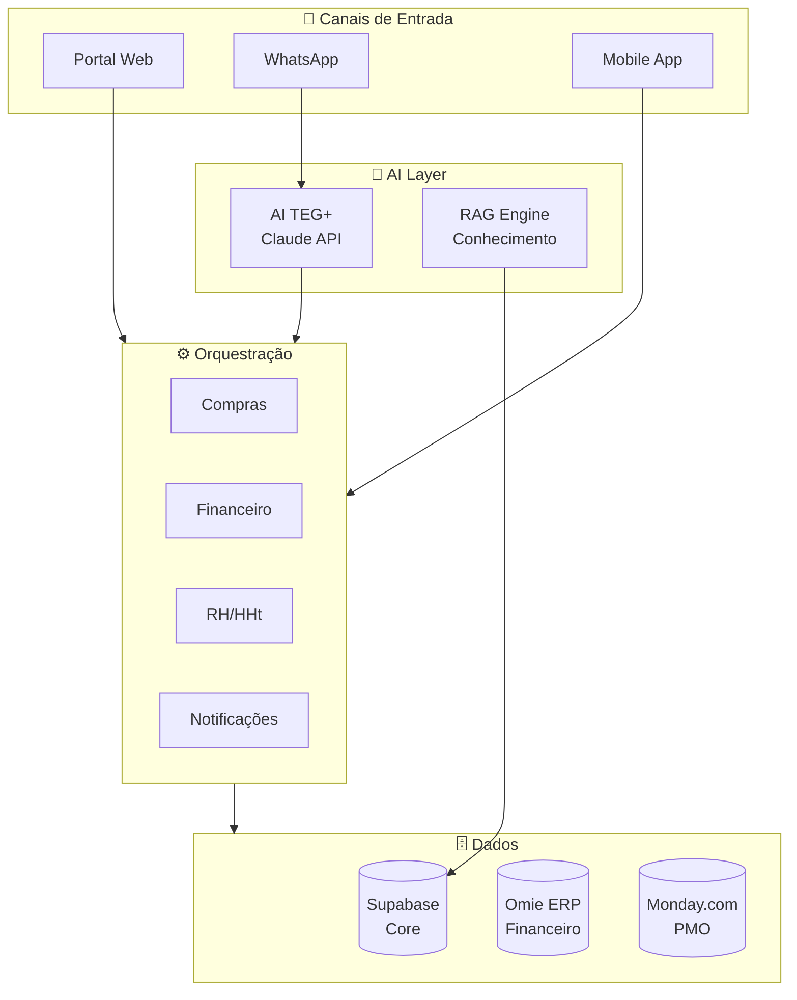

# Roadmap — TEG+ ERP

## Status Atual (Março 2026)

### Entregue ✅

| Funcionalidade | Descrição |
|---|---|
| Portal de Requisições | Wizard 3 etapas + AI parse |
| Aprovações Multi-nível | 4 alçadas, token-based, pública |
| ApprovaAi Mobile | Interface responsiva para aprovadores |
| Dashboard KPIs | RPC + realtime + gráficos |
| Schema Supabase | 18 migrations, RLS, views, funções |
| n8n Workflows | Nova req, aprovação, dashboard, AI parse |
| Auth Sistema | Magic link + email/senha, 6 roles |
| 12 Categorias Reais | Com compradores e regras configuradas |
| 6 Obras Reais | SE's de Minas Gerais |
| **Módulo Financeiro** | CP, CR, Aprovações, Conciliação, Omie ERP |
| **Módulo Estoque** | Almoxarifado, inventário, patrimonial/depreciação |
| **Módulo Logística** | Transportes, NF-e, 9 etapas, transportadoras |
| **Módulo Frotas** | OS, checklists, abastecimento, telemetria |
| **Mural de Recados** | Slideshow corporativo na tela inicial + gestão admin RH |

---

---

## Entregue Adicionalmente (Março 2026)

> Módulos implementados que avançam além do escopo original do Q1.

- **Módulo Financeiro** — CP, CR, Aprovações de pagamento, Conciliação CNAB, Omie ERP, 4 workflows n8n
- **Módulo Estoque e Patrimonial** — Almoxarifado, inventário, imobilizados com depreciação linear
- **Módulo Logística** — Solicitações, expedição, rastreamento 9 etapas, NF-e, avaliação de transportadoras
- **Módulo Frotas** — Veículos, OS preventiva/corretiva, checklists, abastecimentos, telemetria
- **Mural de Recados** — Slideshow cinematográfico na tela inicial (Ken Burns, progress bar, swipe); admin RH gerencia Imagens Fixas + Campanhas com vigência programada

---

## Prioridades Imediatas (Q1 2026)

### 1. Notificações Automáticas
**Objetivo:** Aprovadores recebem link automaticamente.

```
n8n → WhatsApp (Evolution API)
n8n → Email (Microsoft 365 / Outlook)
```

**Benefício:** Elimina processo manual de compartilhar links de aprovação.

---

### 2. Cotações Completas
**Objetivo:** Fluxo de cotação end-to-end no n8n.

```
Workflow n8n: TEG+ | Compras - Processar Cotação
→ Regras automáticas (1/2/3 cotações por valor)
→ Aprovação da cotação pelo solicitante/gerente
→ Geração automática do PO
```

---

### 3. HHt App — Homem-Hora
**Objetivo:** Tracking de horas por obra em campo.

```
Mobile-first (PWA)
→ Check-in/Check-out por obra
→ Aprovação pelo supervisor
→ Integração com RH
```

---

## Médio Prazo (Q2-Q3 2026)

### 4. Módulo Financeiro

**Integrações planejadas:**

| Integração | Função |
|---|---|
| Omie ERP | Contas a Pagar, NF-e automation |
| Supabase | Lançamentos, DRE, C. Receber |
| n8n | Orquestração de NF-e |

**Funcionalidades:**
- Importação automática de NF-e
- Contas a Pagar vinculado aos POs do Compras
- DRE por obra (Demonstrativo de Resultado)
- Curva ABC de fornecedores

---

### 5. AI TEG+ — Agente Conversacional

**Canais:**
- WhatsApp (via Evolution API)
- Painel web (chat)

**Capacidades planejadas:**
```
"Abrir requisição"   → Wizard conversacional
"Status da RC-XXX"   → Consulta ao Supabase
"Quantas requisições pendentes?" → Dashboard via RAG
"Criar cotação"      → Fluxo guiado por chat
"Relatório de compras do mês" → AI + Supabase
```

**Stack:**
- Claude API (Anthropic)
- n8n como orquestrador
- Supabase como base de conhecimento (RAG)

---

### 6. Módulo de Patrimônio

**Contexto:** Portfólio de R$22,5M em ativos.

**Funcionalidades:**
- Cadastro de equipamentos e máquinas
- Controle de localização (por obra)
- Manutenção preventiva / corretiva
- Depreciação e valor de mercado
- Integração com módulo de Compras (aquisições)

---

## Longo Prazo (Q4 2026+)

### 7. Integração Monday.com (PMO)

**Objetivo:** Gestão de portfólio das 6 obras.

```
Monday.com → TEG+ ERP
→ Cronograma da obra
→ Status de cada frente de trabalho
→ Vinculação de compras ao cronograma
→ KPIs de avanço físico-financeiro
```

---

### 8. Controladoria

**Objetivo:** Visão financeira consolidada.

```
Por obra:
  → Orçado vs Realizado
  → Margem de contribuição
  → P&L por centro de custo
  → Forecast de caixa

Corporativo:
  → DRE consolidado
  → EBITDA
  → Indicadores de rentabilidade
```

---

### 9. Módulos Pendentes (stubs)

| Módulo | Prioridade | Status | Integrações |
|--------|-----------|--------|-------------|
| RH | Alta | 🔜 Em desenvolvimento (Q2 2026) | eSocial, Folha, HHt App |
| SSMA | Média | 🔜 Planejado | Registro de acidentes, ASO, NRs |
| Contratos | Baixa | 🔜 Planejado | Jurídico, fornecedores, SLA |

> **RH:** Mural de Recados já entregue (gestão de banners). Colaboradores, Ponto e Folha → Q2 2026.

---

## Arquitetura Alvo



---

## KPIs de Sucesso do Projeto

| Indicador | Atual | Meta 6 meses |
|---|---|---|
| Tempo médio de aprovação | Manual (dias) | < 4 horas |
| Requisições digitalizadas | ~0% | 100% |
| Fornecedores cadastrados | 0 | > 50 |
| Tempo de emissão de PO | 3-5 dias | < 24 horas |
| Cotações comparativas | Manual | 100% automatizado |
| Visibilidade financeira | Excel | Real-time |

---

## Links Relacionados

- [[00 - TEG+ INDEX]] — Status atual consolidado
- [[01 - Arquitetura Geral]] — Arquitetura técnica
- [[10 - n8n Workflows]] — Workflows existentes e futuros
