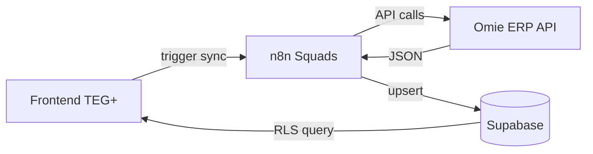
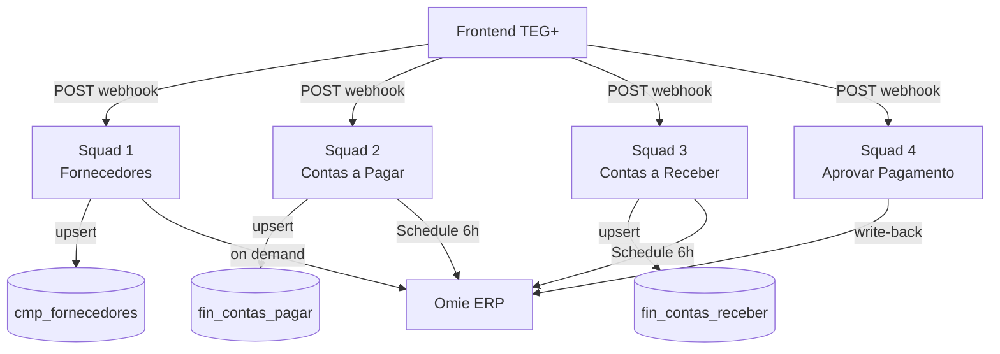
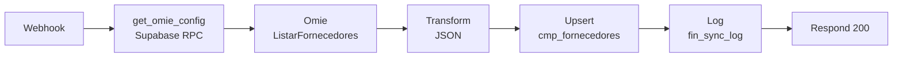
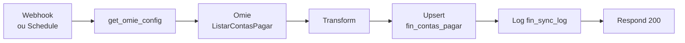
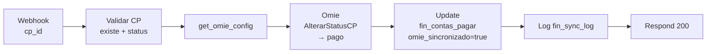

# Integração Omie ERP — TEG+

## Visão Geral

> **⏳ Status: FUTURO (~Jun 2026)** — Esta integração ainda não está ativa. O mapeamento abaixo documenta a arquitetura planejada.

O TEG+ se conectará ao **Omie ERP** para **emissão de lotes de pagamento** e **conciliação bancária**. O **n8n** atuará como middleware, orquestrando chamadas à API Omie e persistindo os dados no Supabase.



**Escopo planejado (NÃO é sync bidirecional completo):**
- Emissão de lotes de contas a pagar para pagamento em massa
- Conciliação de pagamentos (TEG+ ↔ Omie)
- **NÃO inclui**: sync geral de cadastros, fiscal, CR

---

## Configuração

### Credenciais

Armazenadas na tabela `sys_config` (colunas-chave):

| Chave | Descrição |
|-------|-----------|
| `omie_app_key` | App Key gerada no Portal Omie |
| `omie_app_secret` | App Secret correspondente |
| `omie_habilitado` | `"true"` para ativar a integração |
| `n8n_base_url` | URL base do n8n (ex: `https://n8n.tegplus.com.br/webhook`) |

### Onde Configurar

**Financeiro → Configurações** (acesso: role `admin`)

- Campos mascarados para App Key / App Secret
- Toggle para habilitar/desabilitar a integração
- Tabela de status de sync por domínio em tempo real

### Função Helper

```sql
-- Retorna as credenciais com SECURITY DEFINER (bypass RLS)
SELECT get_omie_config();
-- → { "app_key": "...", "app_secret": "...", "habilitado": true }
```

---

## Arquitetura de Squads

Cada squad é um workflow n8n dedicado a um domínio. Operam de forma independente e idempotente.



**Princípios:**
- **Idempotência:** upsert por `omie_id`, sem duplicatas
- **Observabilidade:** toda execução gravada em `fin_sync_log`
- **Responsabilidade única:** cada squad cuida de um domínio

---

## Squad 1 — Sync Fornecedores

**Arquivo:** `n8n-docs/workflow-omie-sync-fornecedores.json`
**Webhook:** `POST /omie/sync/fornecedores`
**Trigger:** Manual / chamado pelo frontend



**Mapeamento Omie → Supabase:**

| Campo Omie | Campo TEG+ | Obs |
|-----------|------------|-----|
| `codigo_cliente_omie` | `omie_id` | PK de sync |
| `razao_social` | `nome` | — |
| `cnpj_cpf` | `cnpj` | — |
| `telefone1_numero` | `telefone` | — |
| `email` | `email` | — |
| `cidade` | `cidade` | — |
| `estado` | `estado` | — |

---

## Squad 2 — Sync Contas a Pagar

**Arquivo:** `n8n-docs/workflow-omie-sync-cp.json`
**Webhook:** `POST /omie/sync/contas-pagar`
**Trigger:** Schedule (6h) + Manual via frontend



**Mapeamento Omie → Supabase:**

| Campo Omie | Campo TEG+ |
|-----------|------------|
| `codigo_lancamento_omie` | `omie_id` |
| `nome_fornecedor` | `fornecedor_nome` |
| `valor_documento` | `valor` |
| `data_vencimento` | `data_vencimento` |
| `status_titulo` | `status` |
| `codigo_categoria` | `categoria` |

---

## Squad 3 — Sync Contas a Receber

**Arquivo:** `n8n-docs/workflow-omie-sync-cr.json`
**Webhook:** `POST /omie/sync/contas-receber`
**Trigger:** Schedule (6h) + Manual

Mesmo padrão do Squad 2, aplicado a `fin_contas_receber`.

**Mapeamento:** `codigo_lancamento_omie` → `omie_id`, cliente, valor, vencimento.

---

## Squad 4 — Aprovar Pagamento

**Arquivo:** `n8n-docs/workflow-omie-aprovacao-pgto.json`
**Webhook:** `POST /omie/aprovar-pagamento`
**Trigger:** Chamado pelo financeiro ao registrar pagamento no TEG+



---

## Log de Sincronização

Tabela `fin_sync_log`:

| Coluna | Tipo | Descrição |
|--------|------|-----------|
| `id` | UUID PK | — |
| `dominio` | VARCHAR | fornecedores / contas-pagar / contas-receber |
| `status` | VARCHAR | sucesso / erro / parcial |
| `registros` | INTEGER | Qtd de registros processados |
| `executado_em` | TIMESTAMPTZ | Timestamp da execução |
| `detalhes` | JSONB | Erros ou informações adicionais |

**Consulta de saúde:**
```sql
SELECT DISTINCT ON (dominio)
  dominio, status, registros,
  to_char(executado_em, 'DD/MM HH24:MI') as ultima_sync
FROM fin_sync_log
ORDER BY dominio, executado_em DESC;
```

---

## SyncBar (Frontend)

Componente exibido em Fornecedores, Contas a Pagar e Contas a Receber quando `omie_habilitado = true`:

```
🔄  Última sync: hoje 14:32 — 127 fornecedores    [Sincronizar]
```

- Verde: sync recente (< 6h)
- Amarelo: sync antiga (> 6h)
- Vermelho: último sync com erro

---

## Troubleshooting

| Erro | Causa provável | Solução |
|------|---------------|---------|
| `401 Unauthorized` (Omie) | App Key/Secret inválidas | Verificar em Financeiro → Configurações |
| `404` no webhook n8n | URL base errada | Verificar `n8n_base_url` em `sys_config` |
| `RLS denied` no upsert | Service Role Key não configurada | Configurar credencial Supabase no n8n |
| Sync parcial | Timeout na API Omie | Verificar `detalhes` em `fin_sync_log` |
| Campos vazios após sync | Mapeamento divergiu | Inspecionar resposta JSON da Omie no log do n8n |

---

## Links Relacionados

- [[10 - n8n Workflows]] — Workflows base do TEG+
- [[20 - Módulo Financeiro]] — Telas e hooks do módulo financeiro
- [[21 - Fluxo Pagamento]] — Fluxo completo compras → pagamento
- [[07 - Schema Database]] — Tabelas `fin_*` e `sys_config`
- [[08 - Migrações SQL]] — Migration `013_omie_integracao.sql`
