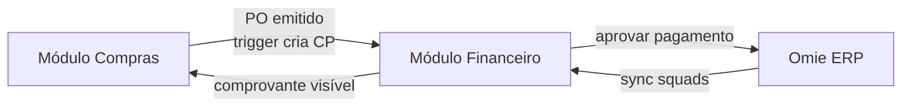
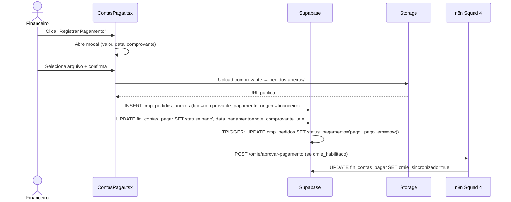

# Módulo Financeiro — TEG+

## Visão Geral

O módulo Financeiro gerencia **Contas a Pagar (CP)**, **Contas a Receber (CR)** e o **cadastro de Fornecedores**, com sincronização opcional com o Omie ERP.



---

## Rotas e Telas

| Rota | Componente | Acesso | Descrição |
|------|-----------|--------|-----------|
| `/financeiro` | FinanceiroLayout | financeiro/admin | Layout com nav lateral |
| `/financeiro/contas-pagar` | ContasPagar.tsx | financeiro/admin | Lista e gestão de CP |
| `/financeiro/contas-receber` | ContasReceber.tsx | financeiro/admin | Lista e gestão de CR |
| `/financeiro/fornecedores` | Fornecedores.tsx | financeiro/admin | Cadastro de fornecedores |
| `/financeiro/configuracoes` | Configuracoes.tsx | **admin** | Credenciais Omie + status sync |

---

## Contas a Pagar

### Tabela: `fin_contas_pagar`

| Coluna | Tipo | Descrição |
|--------|------|-----------|
| `id` | UUID PK | — |
| `omie_id` | BIGINT | ID Omie (sync key) |
| `pedido_id` | UUID FK | → cmp_pedidos (se origem = compras) |
| `fornecedor_nome` | TEXT | Nome do fornecedor |
| `valor` | NUMERIC | Valor da conta |
| `data_vencimento` | DATE | Data de vencimento |
| `data_pagamento` | DATE | Data efetiva de pagamento |
| `status` | VARCHAR | Ver estados abaixo |
| `categoria` | VARCHAR | Categoria do gasto |
| `centro_custo` | VARCHAR | Obra / centro de custo |
| `descricao` | TEXT | Descrição da despesa |
| `natureza` | VARCHAR | material / serviço / outros |
| `comprovante_url` | TEXT | URL do comprovante no Storage |
| `omie_sincronizado` | BOOLEAN | Pagamento confirmado no Omie |
| `criado_em` | TIMESTAMPTZ | — |

### Estados do CP

```
previsto → aguardando_aprovacao → aprovado → pago
         → rejeitado
```

| Status | Descrição | Quem define |
|--------|-----------|-------------|
| `previsto` | CP criado automaticamente ao emitir PO | Trigger |
| `aguardando_aprovacao` | Entregue + liberado para pgto pelo comprador | Trigger |
| `aprovado` | Aprovado pelo financeiro para pagamento | Financeiro |
| `pago` | Pagamento registrado | Financeiro |
| `rejeitado` | Conta rejeitada | Financeiro |

### Filtros Disponíveis (tabs)

- **Todos** — sem filtro
- **Vencer Hoje** — `data_vencimento = today`
- **Em Aberto** — status ≠ pago
- **Aguard. Aprovação** — status = aguardando_aprovacao
- **Pagos** — status = pago

### Ações por Status

| Status | Ações disponíveis |
|--------|------------------|
| `previsto` | Visualizar detalhes |
| `aguardando_aprovacao` | Registrar Pagamento + upload comprovante |
| `aprovado` | Registrar Pagamento + upload comprovante |
| `pago` | Visualizar comprovante |

---

## Contas a Receber

### Tabela: `fin_contas_receber`

| Coluna | Tipo | Descrição |
|--------|------|-----------|
| `id` | UUID PK | — |
| `omie_id` | BIGINT | ID Omie (sync key) |
| `cliente_nome` | TEXT | Nome do cliente |
| `valor` | NUMERIC | Valor a receber |
| `data_vencimento` | DATE | Vencimento |
| `data_recebimento` | DATE | Recebimento efetivo |
| `status` | VARCHAR | previsto / recebido / atrasado / cancelado |
| `descricao` | TEXT | Descrição |
| `criado_em` | TIMESTAMPTZ | — |

---

## Fornecedores

### Tabela: `cmp_fornecedores`

| Coluna | Tipo | Descrição |
|--------|------|-----------|
| `id` | UUID PK | — |
| `omie_id` | BIGINT | ID Omie (sync key) |
| `nome` | VARCHAR | Razão social |
| `cnpj` | VARCHAR | CNPJ / CPF |
| `email` | VARCHAR | E-mail de contato |
| `telefone` | VARCHAR | Telefone |
| `cidade` | VARCHAR | — |
| `estado` | VARCHAR | UF |
| `ativo` | BOOLEAN | Ativo no sistema |
| `sincronizado_em` | TIMESTAMPTZ | Última sync com Omie |

---

## Hooks do Módulo Financeiro

| Hook | Arquivo | Propósito |
|------|---------|-----------|
| `useContasPagar` | useFinanceiro.ts | Lista CP com filtros |
| `useRegistrarPagamento` | useFinanceiro.ts | Marca CP como pago + upload comprovante |
| `useContasReceber` | useFinanceiro.ts | Lista CR |
| `useFornecedores` | useFinanceiro.ts | Lista fornecedores |
| `syncCPsParaAprovacao` | useFinanceiro.ts | Sync CPs aguardando_aprovacao → apr_aprovacoes |
| `useOmieConfig` | useOmie.ts | Le config Omie de sys_config |
| `useSaveOmieConfig` | useOmie.ts | Salva credenciais Omie |
| `useTriggerSync` | useOmie.ts | Dispara webhook de sync no n8n |
| `useLastSync` | useOmie.ts | Ultima execucao de sync por dominio |
| `useTestOmieConnection` | useOmie.ts | Testa credenciais contra API Omie |

---

## Integracao com AprovAi (Autorizacoes de Pagamento)

A partir de 2026-03-10, CPs com status `aguardando_aprovacao` sao automaticamente sincronizados para o sistema unificado de aprovacoes (`apr_aprovacoes`), tornando-os visiveis na tela AprovAi.

### Fluxo

```
CP status: aguardando_aprovacao
    → syncCPsParaAprovacao() verifica se ja existe apr_aprovacoes para esse CP
    → Se nao existe: INSERT apr_aprovacoes (tipo='autorizacao_pagamento')
    → Visivel no AprovAi com card amber "Autorizacoes de Pagamento"
    → Aprovador pode aprovar/rejeitar com observacao
```

### Funcao `syncCPsParaAprovacao()`
- Localizada em `useFinanceiro.ts`
- Chamada automaticamente ao carregar aprovacoes pendentes no AprovAi
- Cria registros em `apr_aprovacoes` com `tipo = 'autorizacao_pagamento'`
- Non-blocking: falha silenciosa nao impede carregamento das aprovacoes

Ver [[12 - Fluxo Aprovação]] para detalhes do sistema multi-tipo.

---

## Configurações Omie (`sys_config`)

| Chave | Tipo | Descrição |
|-------|------|-----------|
| `omie_app_key` | TEXT | App Key do app Omie |
| `omie_app_secret` | TEXT | App Secret do app Omie |
| `omie_habilitado` | TEXT | `"true"` / `"false"` |
| `n8n_base_url` | TEXT | URL base do n8n |

### RLS em `sys_config`

```sql
-- Apenas admins escrevem
CREATE POLICY "admins_write_config" ON sys_config
  FOR ALL USING (is_admin());

-- Todos os autenticados leem (via get_omie_config())
```

---

## Fluxo de Registro de Pagamento

Quando o financeiro clica **"Registrar Pagamento"** em um CP:



---

## Status de Implementação

### Concluido

- [x] Tela Contas a Pagar com filtros e badges de status
- [x] Tela Contas a Receber
- [x] Tela Fornecedores (com sync Omie)
- [x] Tela Configuracoes (credenciais Omie, toggle, status sync)
- [x] SyncBar em CP, CR e Fornecedores
- [x] Registro de pagamento com upload de comprovante
- [x] Trigger automatico: PO emitido → CP previsto
- [x] Trigger automatico: PO liberado → CP aguardando_aprovacao
- [x] Trigger automatico: pagamento registrado → PO.status_pagamento=pago
- [x] Comprovante visivel no modulo Compras (Pedidos)
- [x] Integracao Omie — 4 squads n8n funcionais
- [x] Integracao AprovAi — CPs aguardando_aprovacao visiveis no AprovAi como "Autorizacoes de Pagamento"
- [x] Reset de filtro de datas ao trocar de obra (ISSUE-006)

### Planejado (Futuro)

- [ ] E-mail automatico ao financeiro quando CP → aguardando_aprovacao
- [ ] Squad 5: Agent NF (notas fiscais)
- [ ] Squad 6: Agent Remessa (CNAB)
- [ ] Squad 7: Agent Conciliacao (extrato bancario)
- [ ] Dashboard financeiro com KPIs (DRE, fluxo de caixa)
- [ ] Relatorios de aging (inadimplencia)

---

## Links Relacionados

- [[19 - Integração Omie]] — Squads n8n e configuracao tecnica
- [[21 - Fluxo Pagamento]] — Ciclo completo compras → pagamento
- [[12 - Fluxo Aprovação]] — AprovAi multi-tipo (autorizacoes de pagamento)
- [[07 - Schema Database]] — Tabelas `fin_*`, `sys_config`, `apr_aprovacoes`
- [[08 - Migrações SQL]] — Migrations 013 e 014
- [[11 - Fluxo Requisição]] — Como o CP nasce de um PO
