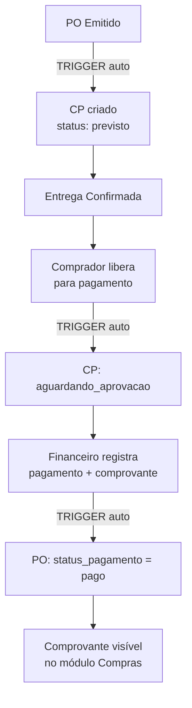
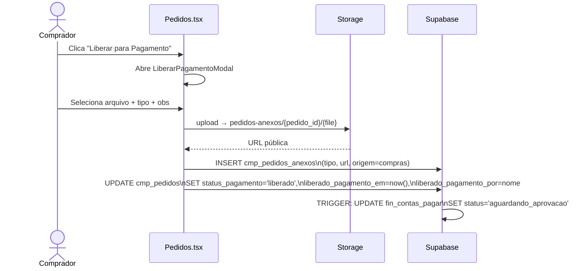
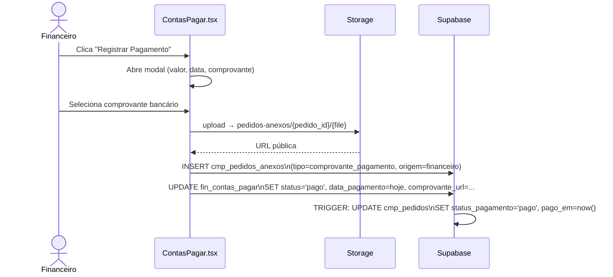
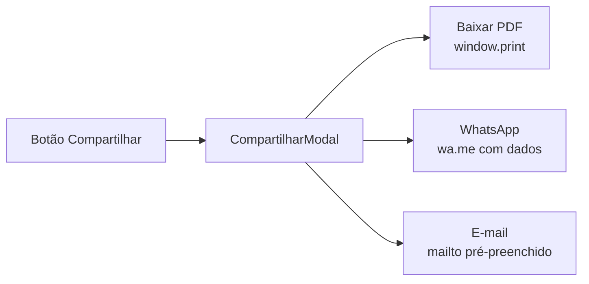

# Fluxo de Pagamento — Compras → Financeiro

## Visão Geral

O fluxo de pagamento conecta os módulos de **Compras** e **Financeiro**, garantindo rastreabilidade completa desde o pedido de compra até o comprovante de pagamento.



---

## Etapa 1 — Emissão do Pedido de Compra

Quando o comprador emite um PO (Pedido de Compra), um trigger PostgreSQL cria automaticamente um registro em `fin_contas_pagar`:

```sql
-- Trigger: trig_criar_cp_ao_emitir_pedido
-- Dispara: AFTER INSERT ON cmp_pedidos

INSERT INTO fin_contas_pagar (
  pedido_id, fornecedor_nome, valor,
  data_vencimento, status, categoria,
  centro_custo, descricao, natureza
) VALUES (
  NEW.id,
  NEW.fornecedor_nome,
  NEW.valor_total,
  COALESCE(NEW.data_prevista_entrega, CURRENT_DATE) + INTERVAL '30 days',
  'previsto',
  req.categoria,
  req.obra_nome,
  req.descricao,
  'material'
);
```

**Resultado:** O financeiro já vê o CP como `Previsto` antes mesmo da entrega.

---

## Etapa 2 — Confirmação de Entrega

O comprador marca o pedido como entregue via botão **"Confirmar Entrega"**:

```sql
UPDATE cmp_pedidos
SET status = 'entregue', data_entrega_real = CURRENT_DATE
WHERE id = $pedido_id;
```

Após isso, o botão **"Liberar para Pagamento"** fica disponível.

---

## Etapa 3 — Liberar para Pagamento

O comprador clica **"Liberar para Pagamento"** e anexa um documento (NF, comprovante de entrega, medição, etc.):



**Campos atualizados em `cmp_pedidos`:**

| Campo | Valor |
|-------|-------|
| `status_pagamento` | `'liberado'` |
| `liberado_pagamento_em` | `NOW()` |
| `liberado_pagamento_por` | Nome do comprador |

---

## Etapa 4 — Registro de Pagamento (Financeiro)

O financeiro vê o CP em status `aguardando_aprovacao` e registra o pagamento com upload do comprovante:



---

## Etapa 5 — Comprovante Visível ao Comprador

Após o pagamento, o comprador acessa a aba **"Anexos"** no card do pedido e vê o comprovante enviado pelo financeiro:

```
Anexos do Pedido PO-2026-0042
─────────────────────────────────────────────────
📄 nota_fiscal_fornecedor.pdf       [compras] ↓
📄 comprovante_entrega_assinado.jpg [compras] ↓
✅ comprovante_pagamento_pix.pdf    [financeiro] ↓  ← Destaque verde
```

**Filtro por origem:** a tabela `cmp_pedidos_anexos` tem campo `origem` (`compras` / `financeiro`) — ambos os módulos exibem todos os anexos.

---

## Triggers Automáticos

### `trig_criar_cp_ao_emitir_pedido`

```sql
CREATE OR REPLACE FUNCTION fn_criar_cp_ao_emitir_pedido()
RETURNS TRIGGER LANGUAGE plpgsql AS $$
BEGIN
  INSERT INTO fin_contas_pagar (...) VALUES (...);
  RETURN NEW;
END;
$$;

CREATE TRIGGER trig_criar_cp_ao_emitir_pedido
  AFTER INSERT ON cmp_pedidos
  FOR EACH ROW EXECUTE FUNCTION fn_criar_cp_ao_emitir_pedido();
```

### `trig_atualizar_cp_ao_liberar`

```sql
CREATE OR REPLACE FUNCTION fn_atualizar_cp_ao_liberar()
RETURNS TRIGGER LANGUAGE plpgsql AS $$
BEGIN
  -- Liberar para pagamento
  IF NEW.status_pagamento = 'liberado' AND OLD.status_pagamento IS DISTINCT FROM 'liberado' THEN
    UPDATE fin_contas_pagar
    SET status = 'aguardando_aprovacao'
    WHERE pedido_id = NEW.id AND status = 'previsto';
  END IF;

  -- Registrar pagamento
  IF NEW.status_pagamento = 'pago' AND OLD.status_pagamento IS DISTINCT FROM 'pago' THEN
    UPDATE fin_contas_pagar
    SET status = 'pago', data_pagamento = CURRENT_DATE
    WHERE pedido_id = NEW.id AND status != 'pago';
  END IF;

  RETURN NEW;
END;
$$;
```

---

## Tabela de Anexos: `cmp_pedidos_anexos`

| Coluna | Tipo | Descrição |
|--------|------|-----------|
| `id` | UUID PK | — |
| `pedido_id` | UUID FK | → cmp_pedidos |
| `tipo` | ENUM | nota_fiscal / comprovante_entrega / medicao / comprovante_pagamento / contrato / outro |
| `nome_arquivo` | TEXT | Nome original |
| `url` | TEXT | URL pública no Storage |
| `mime_type` | VARCHAR | Tipo MIME |
| `origem` | VARCHAR | **compras** / **financeiro** |
| `uploaded_by_nome` | TEXT | Nome de quem enviou |
| `uploaded_at` | TIMESTAMPTZ | Quando foi enviado |
| `observacao` | TEXT | Obs opcional |

**Storage bucket:** `pedidos-anexos` (max 50 MB, formatos: PDF, JPEG, PNG, XLS, XLSX)

---

## PDF e Compartilhamento do Pedido

O comprador pode gerar e compartilhar o PO diretamente da tela de Pedidos:



**Sem dependências externas** — o PDF é gerado 100% no browser via `window.open()` + HTML estilizado + CSS `@media print`.

**Conteúdo do PDF:** número do PO, fornecedor, valor total, RC de origem, obra, datas previstas, NF, observações.

---

## Campos de Status no PO

| Campo | Tipo | Valores |
|-------|------|---------|
| `status` | ENUM | emitido / confirmado / em_entrega / entregue / cancelado |
| `status_pagamento` | VARCHAR | null / `liberado` / `pago` |

**Badges exibidos em Pedidos.tsx:**

| Condição | Badge |
|----------|-------|
| `status_pagamento = null` | — |
| `status_pagamento = 'liberado'` | 🟡 Aguard. Pagamento |
| `status_pagamento = 'pago'` | 🟢 Pago |

---

## Resumo do Ciclo

| Etapa | Ator | Ação | Status CP | Status PO |
|-------|------|------|-----------|-----------|
| 1 | Sistema | Trigger ao emitir PO | `previsto` | `emitido` |
| 2 | Comprador | Confirmar entrega | `previsto` | `entregue` |
| 3 | Comprador | Liberar para pagamento | `aguardando_aprovacao` | `entregue` |
| 4 | Financeiro | Registrar pagamento | `pago` | `entregue` |
| 5 | Sistema | Trigger propaga | `pago` | `status_pagamento=pago` |

---

## Links Relacionados

- [[11 - Fluxo Requisição]] — Fluxo anterior: RC → cotação → PO
- [[12 - Fluxo Aprovação]] — Aprovação da RC
- [[20 - Módulo Financeiro]] — Telas e hooks do financeiro
- [[19 - Integração Omie]] — Sync do CP pago para o Omie
- [[08 - Migrações SQL]] — Migration `014_fluxo_pagamento.sql`
