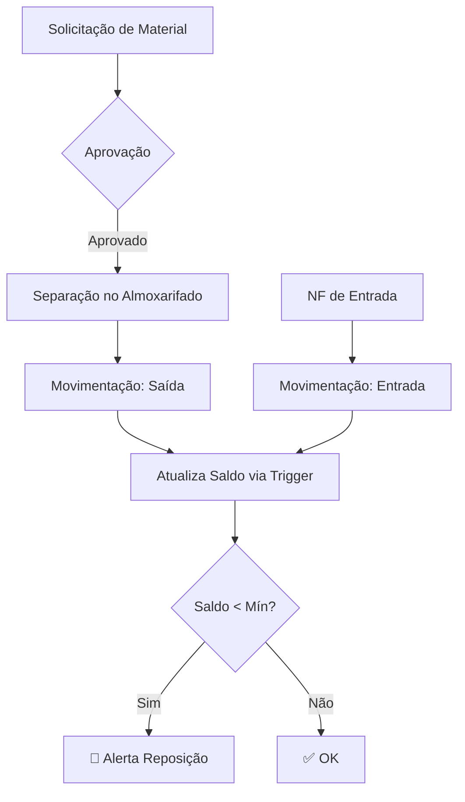
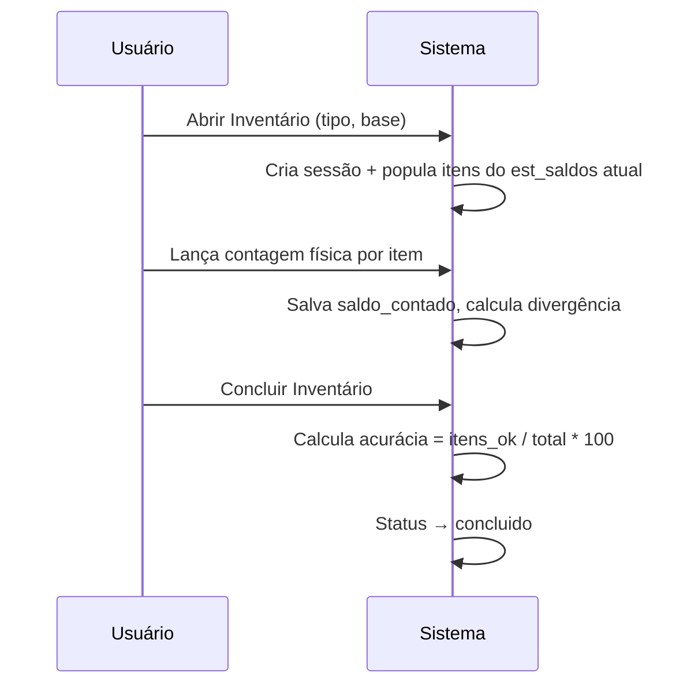

# 📦 Módulo Estoque e Patrimonial

## Visão Geral

Módulo de controle de almoxarifado (estoque físico) e gestão de imobilizados (patrimônio fixo), com rastreabilidade completa, inventário cíclico e depreciação automática.

---

## Estrutura de Rotas

| Rota | Componente | Descrição |
|------|-----------|-----------|
| `/estoque` | `EstoqueHome` | Dashboard com KPIs |
| `/estoque/itens` | `Itens` | Catálogo de itens com curva ABC |
| `/estoque/movimentacoes` | `Movimentacoes` | Entradas, saídas, transferências |
| `/estoque/inventario` | `Inventario` | Sessões de inventário e contagem |
| `/estoque/patrimonial` | `Patrimonial` | Imobilizados e depreciação |

**Layout:** `EstoqueLayout` (sidebar azul/índigo, mesma estrutura do `FinanceiroLayout`)

---

## Banco de Dados — Migration 015

### Estoque

```
est_bases               → almoxarifados / bases físicas
est_localizacoes        → endereçamento (corredor/prateleira/posição)
est_itens               → catálogo com curva ABC, mín/máx, lead time
est_saldos              → saldo por item + base (atualizado por trigger)
est_movimentacoes       → todos os movimentos (entrada/saída/transferência/ajuste)
est_solicitacoes        → solicitações de material para obras
est_solicitacao_itens   → itens de cada solicitação
est_inventarios         → sessões de inventário
est_inventario_itens    → contagem por item na sessão
```

### Patrimonial

```
pat_imobilizados        → ativo fixo (máquinas, veículos, TI, etc.)
pat_movimentacoes       → transferência, cessão, manutenção, retorno
pat_termos_responsabilidade → termos digitais por imobilizado
pat_depreciacoes        → registro mensal de depreciação por competência
```

### Trigger principal

```sql
-- Atualiza est_saldos automaticamente após qualquer movimentação
fn_atualiza_saldo_estoque()
  → calculada delta positivo/negativo por tipo
  → UPSERT em est_saldos com GREATEST(0, saldo + delta)
  → atualiza valor_medio em entradas
```

---

## Curva ABC

| Curva | Critério | Revisão |
|-------|----------|---------|
| A | Alto valor / alta rotatividade | Semanal |
| B | Médio valor / média rotatividade | Quinzenal |
| C | Baixo valor / baixa rotatividade | Mensal |

---

## Fluxo de Estoque



---

## Fluxo de Inventário



---

## Depreciação Patrimonial

- **Cálculo mensal:** `taxa_depreciacao_anual / 100 / 12 × valor_aquisicao`
- **Respeitando valor residual:** `novo_valor = MAX(valor_residual, valor_atual - depreciacao_mensal)`
- **Upsert por competência:** `pat_depreciacoes` (conflito em `imobilizado_id, competencia`)
- **Disparo:** Botão "Depreciar" na tela Patrimonial → `useCalcularDepreciacao(competencia)`

---

## KPIs Disponíveis

### Estoque
- Total de itens ativos
- Itens abaixo do mínimo (alerta vermelho)
- Valor total em estoque
- Movimentações no mês
- Itens parados (> 90 dias sem movimentação)
- Acurácia último inventário
- Solicitações abertas

### Patrimonial
- Total de imobilizados ativos
- Valor bruto / líquido total
- Depreciação mensal estimada
- Em manutenção / Cedidos
- 100% depreciados
- Termos de responsabilidade pendentes

---

## Arquivos Criados

### Backend
- `supabase/015_estoque_patrimonial.sql` — migração completa

### Frontend
```
src/
├── types/estoque.ts                   # Todos os tipos TypeScript
├── hooks/
│   ├── useEstoque.ts                  # Hooks almoxarifado
│   └── usePatrimonial.ts              # Hooks patrimônio
├── components/
│   └── EstoqueLayout.tsx              # Sidebar azul/índigo
└── pages/estoque/
    ├── EstoqueHome.tsx                # Dashboard KPIs
    ├── Itens.tsx                      # Catálogo + cadastro
    ├── Movimentacoes.tsx              # Histórico + nova movimentação
    ├── Inventario.tsx                 # Sessões + contagem
    └── Patrimonial.tsx                # Imobilizados + depreciação
```
