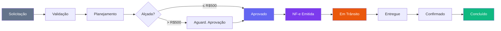
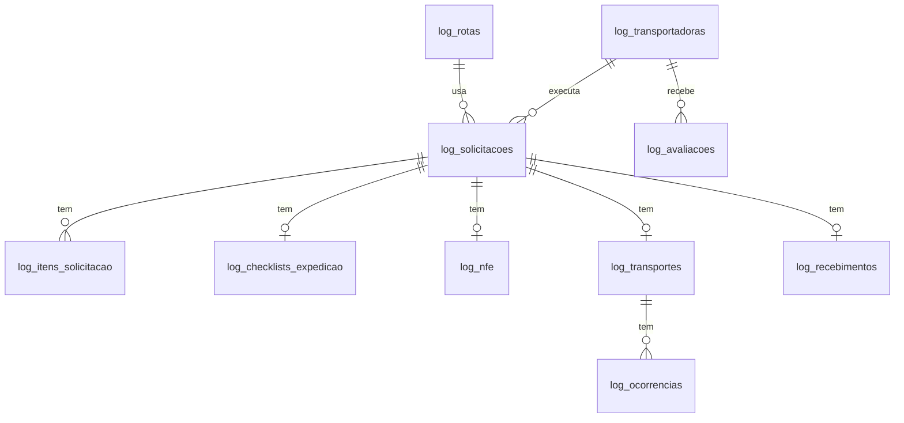

# Módulo Logística e Transportes

> Gestão completa do ciclo de transporte de materiais, máquinas e pessoas nas obras da TEG. Integra NF-e SEFAZ, checklist de expedição/recebimento e rastreamento em tempo real.

---

## Fluxo Principal (9 etapas)



---

## Status Flow

| Status | Cor | Descrição |
|--------|-----|-----------|
| `solicitado` | Slate | Aguardando validação logística |
| `validando` | Sky | Em análise pela equipe de logística |
| `planejado` | Blue | Modal, transportadora e veículo definidos |
| `aguardando_aprovacao` | Amber | Custo > R$500 — aguarda alçada |
| `aprovado` | Indigo | Aprovado — pronto para expedição |
| `nfe_emitida` | Violet | NF-e autorizada na SEFAZ |
| `em_transito` | Orange | Carga em movimento |
| `entregue` | Teal | Recebido no destino fisicamente |
| `confirmado` | Emerald | Recebimento confirmado pelo destinatário |
| `concluido` | Green | Processo encerrado |
| `recusado` | Red | Recusado na validação |
| `cancelado` | Gray | Cancelado em qualquer etapa |

---

## Alçadas de Aprovação

| Valor Estimado | Aprovador |
|----------------|-----------|
| Até R$ 500 | Auto-aprovado (Coordenador) |
| R$ 501 – R$ 2.000 | Gerente de Logística |
| Acima de R$ 2.000 | Diretoria |

> A detecção de alçada é automática no hook `usePlanejaarSolicitacao()`.

---

## Tipos de Transporte

| Tipo | Descrição |
|------|-----------|
| `viagem` | Deslocamento de pessoas |
| `mobilizacao` | Mobilização de equipes para obras |
| `transferencia_material` | Transporte de materiais/insumos |
| `transferencia_maquina` | Transporte de máquinas/equipamentos |

## Modalidades

| Modal | Descrição |
|-------|-----------|
| `frota_propria` | Veículos próprios da TEG |
| `frota_locada` | Veículos alugados |
| `transportadora` | Empresa terceirizada |
| `motoboy` | Entrega rápida local |
| `correios` | Envio postal/expresso |

---

## NF-e

> **Regra crítica:** Nenhuma carga pode ser despachada sem NF-e com status `autorizada`.

O fluxo de NF-e na implementação atual:
1. Operador preenche o formulário na tela de Expedição
2. Dados são salvos em `log_nfe` com status `transmitida`
3. Simulação SEFAZ gera `chave_acesso` (44 dígitos) e `protocolo` fictícios
4. Status muda para `autorizada`, solicitação avança para `nfe_emitida`

> **Produção:** substituir a simulação por chamada n8n → webservice SEFAZ ou Supabase Edge Function.

---

## Expedição — Checklist Bloqueante

Todos os 7 itens devem estar marcados antes de liberar o despacho:

- [ ] Itens conferidos
- [ ] Volumes identificados
- [ ] Embalagem verificada
- [ ] Documentação separada
- [ ] Motorista habilitado
- [ ] Veículo vistoriado
- [ ] Contato com destinatário

---

## Recebimento — Checklist

- [ ] Quantidades conferidas
- [ ] Estado verificado
- [ ] Seriais conferidos
- [ ] Temperatura verificada (se aplicável)

Resultado: `confirmado` / `parcial` / `recusado`

**SLA de confirmação:** 4 horas após entrega física.

---

## Avaliação de Transportadoras

Ao confirmar recebimento, o destinatário avalia a transportadora em 3 critérios (1–5 estrelas):
- **Prazo** — pontualidade na entrega
- **Qualidade** — estado da carga
- **Comunicação** — atendimento e transparência

A média é calculada automaticamente pelo trigger `fn_atualiza_avaliacao_transportadora()`.

---

## Transportadoras

> O módulo separado de Transportadoras foi **removido**. O cadastro de transportadoras é gerido como fornecedores no módulo **Cadastros**, tabela `cmp_fornecedores`.
> Filtrar por `tipo = 'transportadora'` para listar apenas transportadoras.

---

## Nova Solicitação — Formulário Simplificado

O formulário de Nova Solicitação foi simplificado em 2026-03-12. Os campos a seguir foram **removidos** do form:

| Campo removido | Motivo |
|----------------|--------|
| Rota Padrão | Não obrigatório no fluxo principal |
| OC Vinculada | Vinculação opcional, pode ser feita depois |
| Obra | Preenchida automaticamente via contexto do usuário |
| Urgente | Simplificação UX — urgência tratada via prioridade de status |

O formulário atual solicita apenas: tipo de transporte, modal, origem, destino, data desejada, descrição da carga e custo estimado.

---

## Estrutura de Arquivos

```
frontend/src/
├── components/
│   └── LogisticaLayout.tsx          # Sidebar orange/amber + nav mobile
├── pages/logistica/
│   ├── LogisticaHome.tsx            # Dashboard — KPIs + Em Trânsito + Urgentes
│   ├── Solicitacoes.tsx             # CRUD + fluxo de aprovação + planejamento
│   ├── SolicitacoesPipeline.tsx     # Pipeline Kanban de solicitações
│   ├── Expedicao.tsx                # Checklist + NF-e + despacho
│   ├── ExpedicaoPipeline.tsx        # Pipeline Kanban de expedição
│   ├── Transportes.tsx              # Rastreamento + ocorrências
│   ├── TransportesPipeline.tsx      # Pipeline Kanban de transportes
│   └── Recebimentos.tsx             # Confirmação + avaliação
├── hooks/
│   └── useLogistica.ts             # Todos os hooks React Query
└── types/
    └── logistica.ts                # Tipos TypeScript
```

---

## Schema do Banco

**Migration:** `supabase/016_logistica_transportes.sql`

### Tabelas principais

| Tabela | Descrição |
|--------|-----------|
| `log_transportadoras` | Cadastro de transportadoras com avaliação média |
| `log_rotas` | Rotas padrão com distância e custo de referência |
| `log_solicitacoes` | Solicitações de transporte (entidade central) |
| `log_itens_solicitacao` | Itens/cargas da solicitação |
| `log_checklists_expedicao` | Checklist de expedição (1:1 com solicitação) |
| `log_nfe` | Notas fiscais eletrônicas |
| `log_transportes` | Execução do transporte + GPS |
| `log_ocorrencias` | Ocorrências durante transporte |
| `log_recebimentos` | Confirmação de entrega |
| `log_avaliacoes` | Avaliações das transportadoras |

### Triggers

| Trigger | Função |
|---------|--------|
| `trg_numero_log_solicitacao` | Gera `LOG-YYYY-NNNN` automaticamente |
| `trg_set_updated_at_log_*` | Mantém `updated_at` atualizado |
| `trg_atualiza_avaliacao_transportadora` | Recalcula média após nova avaliação |

---

## KPIs do Painel

| KPI | Descrição |
|-----|-----------|
| `abertas` | Solicitado / Validando / Planejado / Ag. Aprovação / Aprovado |
| `em_transito` | Em movimento agora |
| `urgentes_pendentes` | Urgentes nas etapas abertas |
| `nfe_emitidas_mes` | NF-e autorizadas no mês corrente |
| `entregues_hoje` | Entregues fisicamente hoje |
| `confirmadas_hoje` | Confirmadas pelo destinatário hoje |
| `taxa_entrega_prazo` | % entregues antes da data desejada |
| `taxa_avarias` | % com ocorrência de avaria de carga |
| `tempo_medio_confirmacao_h` | Horas médias entre entrega e confirmação |

---

## Ocorrências de Transporte

| Tipo | Descrição |
|------|-----------|
| `avaria_veiculo` | Problema mecânico |
| `acidente` | Acidente de trânsito |
| `atraso` | Atraso na rota |
| `desvio_rota` | Desvio do trajeto planejado |
| `parada_nao_programada` | Parada não prevista |
| `avaria_carga` | Dano à carga transportada |
| `roubo` | Roubo ou furto |
| `outro` | Outros tipos |

---

## Integração com Outros Módulos

| Módulo | Integração |
|--------|-----------|
| **Auth/Perfis** | Solicitante, validador, aprovador identificados por UUID |
| **Alçadas** | Detecção automática de nível por `custo_estimado` |
| **Estoque** | Transferências de material referenciam itens do almoxarifado |
| **Manutenção/Frotas** | Placa e motorista podem vir do cadastro de veículos |
| **Financeiro** | `custo_estimado` pode gerar CP após confirmação |

---

## Relacionamentos



---

## Componentes Especiais

### PlanejamentoRotaModal

Modal de planejamento de rota com:
- Mapa interativo via **Leaflet** (OpenStreetMap)
- Autocomplete de endereços para origem e destino
- Cálculo de distância estimada
- Seleção de modal, transportadora e veículo

### RomaneioDocumentoCard

Card de documento do romaneio de carga exibido na expedição, com dados do transporte, NF-e, itens e checklist.

---

## Integração Financeira

Ao aprovar/concluir um transporte, o sistema pode gerar automaticamente um registro em `fin_contas_pagar` para pagamento da transportadora:
- Aprovação de transporte com custo → cria CP com status `previsto`
- Confirmação de entrega → atualiza CP para `aguardando_aprovacao`

---

*Documentação gerada em 2026-03-03. Atualizado em 2026-04-07: PlanejamentoRotaModal com Leaflet, RomaneioDocumentoCard, integração financeira.*
