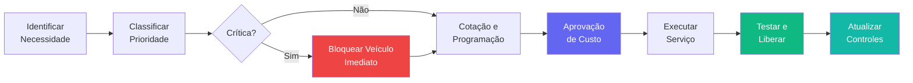

# Módulo Manutenção e Uso de Frotas

> Garante disponibilidade e segurança da frota com custo controlado, por meio de manutenção preventiva e corretiva, telemetria, gestão de abastecimento e tratativa de uso inadequado.

---

## Fluxo de Manutenção (7 etapas)



---

## Origens da Necessidade

| Origem | Descrição |
|--------|-----------|
| **Preventiva** | Calendário por km ou tempo (ex: troca de óleo a cada 5.000 km / 3 meses) |
| **Corretiva** | Falha identificada em checklist diário ou durante operação |
| **Telemetria** | Alarme automático (código OBD, desvio de consumo, alerta de pneu) |
| **Sinistro** | Dano após acidente/ocorrência |

---

## Prioridades da OS

| Prioridade | Critério | Prazo | Ação |
|------------|----------|-------|------|
| **Crítica** | Risco de segurança ou veículo inoperante | Imediato | Veículo bloqueado automaticamente |
| **Alta** | Falha funcional sem risco imediato | Até 24h | OS prioritária |
| **Média** | Desgaste acelerado ou alerta preventivo | Até 72h | Programar |
| **Baixa** | Estética ou conforto | Próxima programação | — |

---

## Alçadas de Aprovação

| Valor da OS | Aprovador |
|-------------|-----------|
| Até R$ 300 | Analista de Frotas (auto-aprovado) |
| R$ 301 – R$ 1.500 | Coordenador / Gerente |
| Acima de R$ 1.500 | Diretoria |
| Sinistros | Diretoria + Seguradora |

> OS com prioridade **Crítica** têm aprovação expedita com prazo de 2 horas.

---

## Status da Ordem de Serviço

```
aberta → em_cotacao → aguardando_aprovacao → aprovada → em_execucao → concluida
                                                       ↘ rejeitada / cancelada
```

| Status | Descrição |
|--------|-----------|
| `aberta` | OS criada, aguardando cotação ou aprovação direta |
| `em_cotacao` | Coletando orçamentos (mínimo 3 fornecedores) |
| `aguardando_aprovacao` | Cotação selecionada, aguarda alçada |
| `aprovada` | Aprovada pela alçada competente |
| `em_execucao` | Veículo na oficina |
| `concluida` | Serviço concluído, veículo liberado |
| `rejeitada` | Rejeitada pelo aprovador |
| `cancelada` | Cancelada em qualquer etapa |

---

## Checklist Diário (Pré-viagem)

Obrigatório antes de liberar veículo. Veículo só recebe status `em_uso` se **todos os itens** estiverem OK.

- [ ] Nível de óleo, água e fluido de freio
- [ ] Calibragem dos pneus
- [ ] Funcionamento de lanternas e faróis
- [ ] Freios e buzina
- [ ] Documentação do veículo (CRLV, seguro)
- [ ] Nível de água do radiador
- [ ] Limpeza e conservação interna/externa

---

## Gestão de Abastecimento

- Controle por veículo: placa, motorista, km, litros, valor, posto
- Desvio automático detectado quando `km/L atual < média histórica × 0,85`
- Cálculo de `km/L` automático com base no hodômetro anterior
- Atualização automática do hodômetro do veículo após abastecimento

**Indicadores:**
- Consumo médio (km/L) por veículo
- Custo por km rodado
- Desvios por motorista

---

## Telemetria e Compliance

| Evento | Ação automática |
|--------|-----------------|
| Excesso de velocidade | Registro de ocorrência, status `registrada` |
| Frenagem brusca | Idem |
| Aceleração brusca | Idem |
| Uso fora do horário | Idem |
| Saída da área autorizada | Idem |
| Parada não autorizada | Idem |

**Fluxo de tratativa:**
```
registrada → analisada → comunicado_rh → encerrada
```

---

## Status dos Veículos

| Status | Cor | Descrição |
|--------|-----|-----------|
| `disponivel` | Emerald | Pronto para uso |
| `em_uso` | Sky | Em operação (checklist aprovado) |
| `em_manutencao` | Amber | Em OS ativa (não crítica) |
| `bloqueado` | Red | OS crítica — uso proibido |
| `baixado` | Slate | Desativado da frota |

---

## Alertas de Documentos

O sistema alerta quando documentação está vencida ou vencendo em 30 dias:
- **CRLV** — Certificado de Registro e Licenciamento
- **Seguro** — Apólice do veículo
- **Tacógrafo** — Verificação anual (para veículos obrigados)
- **Manutenção preventiva** — por data ou hodômetro

---

## Estrutura de Arquivos

```
frontend/src/
├── components/
│   └── FrotasLayout.tsx              # Sidebar rose/pink + nav mobile
├── pages/frotas/
│   ├── FrotasHome.tsx                # Dashboard KPIs + status frota + OS críticas
│   ├── Veiculos.tsx                  # CRUD veículos + alertas de documentos
│   ├── Ordens.tsx                    # OS completo: cotação, aprovação, execução, conclusão
│   ├── Checklists.tsx                # Checklist diário + histórico
│   ├── Abastecimentos.tsx            # Registro + desvios + KPIs
│   └── Telemetria.tsx                # Ocorrências + fluxo de tratativa
├── hooks/
│   └── useFrotas.ts                  # Todos os hooks React Query
└── types/
    └── frotas.ts                     # Tipos TypeScript
```

---

## Schema do Banco

**Migration:** `supabase/017_frotas_manutencao.sql`

### Tabelas

| Tabela | Descrição |
|--------|-----------|
| `fro_veiculos` | Cadastro completo da frota |
| `fro_planos_preventiva` | Planos de manutenção por km/tempo |
| `fro_ordens_servico` | OS com alçada e controle de orçamento |
| `fro_itens_os` | Peças e mão de obra da OS |
| `fro_cotacoes_os` | Cotações (mín. 3) por OS |
| `fro_checklists` | Checklist diário (pré/pós viagem) |
| `fro_abastecimentos` | Registros de combustível |
| `fro_ocorrencias_telemetria` | Eventos de mau uso rastreados |
| `fro_fornecedores` | Oficinas, autopeças, borracharias |
| `fro_avaliacoes_fornecedor` | Avaliações prazo/qualidade/preço |

### Triggers

| Trigger | Função |
|---------|--------|
| `trg_numero_os` | Gera `FRO-OS-YYYY-NNNN` |
| `trg_updated_at_fro_*` | Mantém timestamps |
| `trg_avaliacao_fro_fornecedor` | Recalcula média após avaliação |

---

## KPIs do Painel

| KPI | Descrição |
|-----|-----------|
| `taxa_disponibilidade` | % veículos disponíveis (excl. baixados) |
| `os_abertas` | OS em qualquer status ativo |
| `os_criticas` | OS críticas abertas |
| `preventivas_vencidas` | Preventivas com km ou data vencida |
| `preventivas_proximas_7d` | Preventivas nos próximos 7 dias |
| `custo_manutencao_mes` | Soma valor_final OS concluídas no mês |
| `custo_abastecimento_mes` | Soma valor_total abastecimentos no mês |
| `ocorrencias_abertas` | Telemetria registrada ou analisada |

---

## Integração com Outros Módulos

| Módulo | Integração |
|--------|-----------|
| **Auth/Perfis** | Motorista, analista, aprovador por UUID |
| **Alçadas** | Aprovação de OS por valor (R$300/R$1.500/acima) |
| **Logística** | Disponibilidade de veículos para transporte |
| **Estoque/Patrimonial** | Veículos como imobilizados; peças de reposição |

---

*Documentação gerada em 2026-03-03.*
