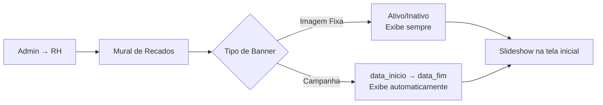

# Mural de Recados — Comunicação Empresarial

> Painel de banners em slideshow na tela inicial do TEG+ ERP, com gestão de **Imagens Fixas** e **Campanhas com vigência programada**. Administrado pela equipe de RH via painel admin.

---

## Visão Geral

```
[ModuloSelector]
  ├── Header (logo, saudação)
  ├── BannerSlideshow ← novo painel central
  │     ├── Imagens Fixas (sempre exibidas se ativas)
  │     └── Campanhas (exibidas apenas na vigência)
  └── Grade de Módulos
```

---

## Fluxo de Gerenciamento



---

## Tipos de Banner

| Tipo | Exibição | Campos Extras | Uso Recomendado |
|------|----------|---------------|-----------------|
| **Fixa** | Permanente (se ativo) | — | Logo empresa, boas-vindas, módulos ativos |
| **Campanha** | Período programado | `data_inicio` + `data_fim` | Eventos, prazos, campanhas internas |

---

## Componentes Criados

### `BannerSlideshow.tsx` — `frontend/src/components/`
Slideshow cinematográfico com:
- **Ken Burns** — zoom suave via `@keyframes kenBurns` (10s, infinite alternate)
- **Crossfade** — transição opacity 700ms entre slides (stack de layers)
- **Progress bar** — linha glowing de 2px no rodapé do card, reinicia a cada slide
- **Dot indicators** — pill ativo (`w-5 h-1.5`) + dots circulares (`w-1.5 h-1.5`)
- **Arrows** — aparecem no hover (opacity transition), glassmorphic backdrop-blur
- **Touch/swipe** — diff > 48px detecta direção no mobile
- **Teclado** — `ArrowLeft` / `ArrowRight` globais
- **Pause on hover** — timer limpo, indicator "pausado" no canto superior esquerdo
- **Auto-advance** — intervalo de 5.5s, reseta quando slide muda
- **Default slides** — 3 banners padrão quando nenhum cadastrado no banco
- **Aspect ratio** — `21/8` (ultra-wide cinema feel)
- **Outer glow** — radial gradient teal/violet atrás do card

### `RHLayout.tsx` — `frontend/src/components/`
Layout do módulo RH:
- Tema: violet (`bg-violet-500/15 text-violet-300 border-violet-500/25`)
- Nav: Painel + Mural de Recados (admin-only, com ícone `Shield`)
- Filtro por `isAdmin` — itens `adminOnly: true` só aparecem para admins
- Padrão idêntico ao `FrotasLayout`

### `pages/rh/RHHome.tsx`
- Shortcut card para o Mural Admin (visível apenas para admin)
- Lista de funcionalidades planejadas
- Timeline Q2/Q3/Q4 2026

### `pages/rh/MuralAdmin.tsx`
Painel completo de gestão:
- **Grid de cards** com thumbnail 21:8, badges tipo/status, informações
- **Toggle ativo/inativo** inline (ícone Eye/EyeOff)
- **Edit** abre modal pré-preenchido
- **Delete** com confirmação inline (sem modal extra)
- **Tabs** filtro: Todos / Imagens Fixas / Campanhas
- **Modal BannerModal**:
  - Preview ao vivo do banner
  - Seletor Imagem Fixa / Campanha (botões estilo toggle)
  - Upload com 2 modos: URL externa + arquivo (Supabase Storage bucket `mural-banners`)
  - Campos campanha: `data_inicio` + `data_fim` (validação HTML5)
  - Ordem + toggle Ativo
- **Proteção de rota**: redirect/mensagem se não for admin

---

## Banco de Dados

### Tabela `mural_banners`

| Coluna | Tipo | Descrição |
|--------|------|-----------|
| `id` | uuid PK | Identificador único |
| `titulo` | text (min 3) | Título exibido no banner |
| `subtitulo` | text? | Texto secundário (opcional) |
| `imagem_url` | text | URL da imagem (Unsplash, CDN, Storage) |
| `tipo` | enum | `fixa` \| `campanha` |
| `ativo` | boolean | Controle de exibição |
| `ordem` | int | Ordem no slideshow (ASC) |
| `data_inicio` | date? | Início vigência (campanha) |
| `data_fim` | date | Fim vigência (campanha, obrigatório) |
| `cor_titulo` | text? | Cor hex do título (default `#FFFFFF`) |
| `cor_subtitulo` | text? | Cor hex subtítulo (default `#CBD5E1`) |
| `criado_por` | uuid? | FK → auth.users |
| `created_at` | timestamptz | Criação automática |
| `updated_at` | timestamptz | Atualização via trigger |

### Constraints
- `campanha_requer_data_fim` — campanha deve ter `data_fim`
- `datas_validas` — `data_inicio <= data_fim`

### RLS
| Policy | Quem | Operação | Condição |
|--------|------|----------|----------|
| `mural_banners_select_publico` | authenticated | SELECT | `ativo=true` + vigência |
| `mural_banners_admin_all` | admin | ALL | perfil.role = 'admin' |

---

## Hooks — `frontend/src/hooks/useMural.ts`

| Hook | Uso |
|------|-----|
| `useBanners()` | Slideshow — banners ativos e vigentes |
| `useBannersAdmin()` | Admin — todos sem filtro |
| `useSalvarBanner()` | Criar ou atualizar (upsert por id) |
| `useToggleBanner()` | Toggle ativo/inativo inline |
| `useExcluirBanner()` | Excluir banner |
| `useUploadBannerImagem()` | Upload para `mural-banners` storage bucket |

---

## CSS Adicionado — `index.css`

```css
@keyframes kenBurns {
  0%   { transform: scale(1)    translate(0%, 0%); }
  100% { transform: scale(1.10) translate(-1.5%, -0.8%); }
}

@keyframes slideProgress {
  from { width: 0%; }
  to   { width: 100%; }
}

@keyframes fadeInUp {
  from { opacity: 0; transform: translateY(24px); }
  to   { opacity: 1; transform: translateY(0); }
}
```

---

## Rotas

```
/rh         → RHHome (todos os usuários autenticados)
/rh/mural   → MuralAdmin (somente admins; redirect se não admin)
```

O módulo RH permanece como `active: false` no `MODULOS` do `ModuloSelector`, mas a função `canAccess()` permite que **admins** acessem diretamente via card especial com badge "Admin" e label "Mural Admin".

---

## Configuração Supabase Storage (opcional)

Para habilitar upload direto de imagens:

1. Criar bucket `mural-banners` no Dashboard → Storage
2. Definir como **Public**
3. Adicionar policy RLS: `admin` pode `INSERT` no bucket

Sem o bucket, o sistema funciona com URLs externas (Unsplash, CDN, etc).

---

## Seed Padrão

3 banners fixos inseridos na migration `018_mural_recados.sql`:
1. "Bem-vindo ao TEG+ ERP" — foto corporativa
2. "Módulos Disponíveis" — foto de escritório moderno
3. "Segurança em Primeiro Lugar" — foto de obra/segurança

---

## Links Relacionados

- [[01 - Arquitetura Geral]]
- [[08 - Migrações SQL]]
- [[20 - Módulo Financeiro]] — padrão de layout seguido
