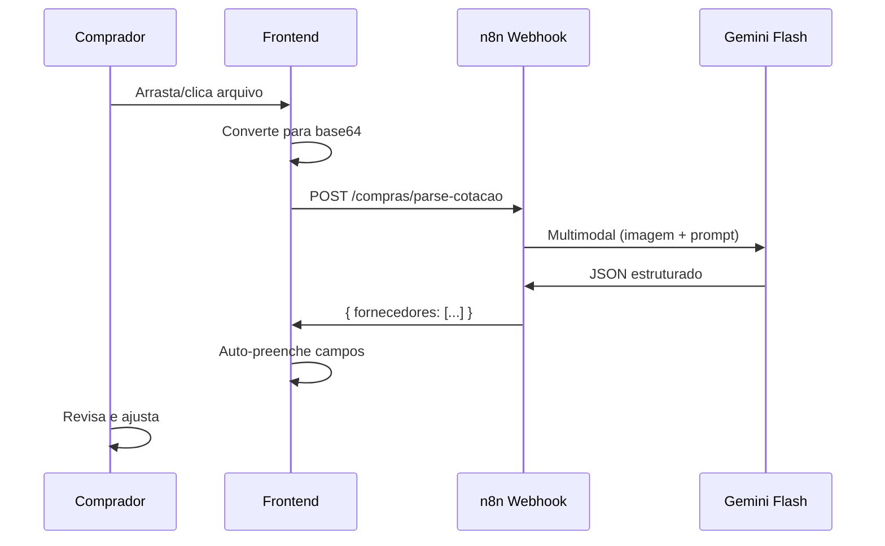

# Upload Inteligente de Cotacao

## Visao Geral

Feature que permite ao comprador **fazer upload de um documento de cotacao** (foto, PDF, screenshot) e a **IA preenche automaticamente** todos os campos do fornecedor no formulario.

Usa **Gemini 2.5 Flash** (multimodal) via n8n para extrair dados estruturados de qualquer formato.



---

## Componentes

### UploadCotacao.tsx

Componente de drag & drop com estados visuais:

| Estado | Visual | Acao |
|--------|--------|------|
| `idle` | Violeta, icone sparkles | Aguardando upload |
| `processing` | Ambar, spinner | Chamando Gemini |
| `success` | Verde, check | Campos preenchidos |
| `error` | Vermelho, alerta | Mensagem de erro |

**Props:**
```ts
interface Props {
  onParsed: (fornecedores: FornecedorParsed[]) => void
  disabled?: boolean
}
```

**Formatos aceitos:** JPG, PNG, WebP, PDF
**Tamanho maximo:** 10 MB

### Integracao no CotacaoForm

O componente fica **acima dos cards de fornecedor**. Ao receber dados da IA:

1. Identifica slots vazios no formulario
2. Preenche com dados extraidos
3. Adiciona novos slots se necessario
4. Mantem fornecedores ja preenchidos manualmente

---

## Workflow n8n

**Nome:** TEG+ | Compras - AI Parse Cotacao
**ID:** `P5xDZQJ2Hh6mVXO0`
**Status:** Ativo
**Endpoint:** `POST /compras/parse-cotacao`

### Nodes

1. **Webhook Parse Cotacao** — Recebe `{ file_base64, file_name, mime_type }`
2. **Analisar Cotacao com Gemini** — Chama Gemini 2.5 Flash multimodal
3. **Responder Sucesso** — Retorna fornecedores parseados
4. **Tratar Erro** — Captura erros do Gemini
5. **Responder Erro** — Retorna `{ success: false, error: "..." }`

### Prompt da IA

O prompt instrui o Gemini a extrair:
- `fornecedor_nome` — Nome da empresa
- `fornecedor_cnpj` — CNPJ formatado
- `fornecedor_contato` — Telefone ou email
- `valor_total` — Valor total da proposta
- `prazo_entrega_dias` — Prazo em dias
- `condicao_pagamento` — Condicoes (ex: 30/60 dias)
- `itens[]` — Lista de itens com descricao, qtd, valor_unitario, valor_total
- `observacao` — Notas adicionais

### Tipos de documento suportados

| Tipo | Tratamento |
|------|-----------|
| Foto de proposta impressa | Vision multimodal |
| Screenshot de WhatsApp | Vision multimodal |
| PDF de cotacao | PDF inline + vision |
| Planilha/texto | Extrai texto UTF-8 |

---

## API

### api.ts

```ts
parseCotacaoFile: (data: {
  file_base64: string
  file_name: string
  mime_type: string
}) => request<ParseCotacaoResult>('/compras/parse-cotacao', {
  method: 'POST',
  body: JSON.stringify(data),
})
```

### ParseCotacaoResult

```ts
interface ParseCotacaoResult {
  success: boolean
  error?: string
  fornecedores: {
    fornecedor_nome: string
    fornecedor_cnpj?: string
    fornecedor_contato?: string
    valor_total: number
    prazo_entrega_dias?: number
    condicao_pagamento?: string
    itens?: { descricao: string; qtd: number; valor_unitario: number; valor_total: number }[]
    observacao?: string
  }[]
}
```

---

## Requisitos de Ambiente

| Variavel | Local | Descricao |
|----------|-------|-----------|
| `GEMINI_API_KEY` | n8n env vars | Chave API do Google Gemini |
| `VITE_N8N_WEBHOOK_URL` | frontend .env | URL base dos webhooks n8n |

---

## Links Relacionados

- [[10 - n8n Workflows]] — Workflow 4b: AI Parse Cotacao
- [[04 - Componentes]] — UploadCotacao.tsx
- [[14 - Compradores e Categorias]] — Quem usa o upload
- [[11 - Fluxo Requisição]] — Fluxo completo da RC ate a cotacao
