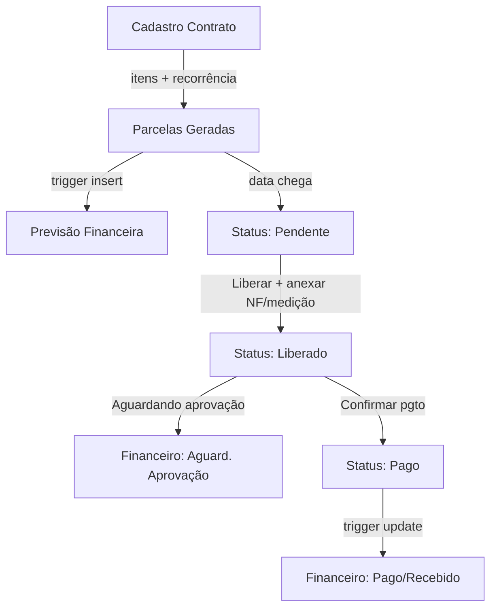

# Módulo Contratos — Gestão de Pagamentos e Recebimentos

## Visão Geral

O módulo de Contratos permite cadastrar contratos vinculados a **fornecedores** (despesa) ou **clientes** (receita), com itens, prazos e parcelas que podem ser **recorrentes** (mensal, bimestral, trimestral, semestral, anual) ou **personalizadas** (valores e datas customizados).

Ao chegar na data de vencimento, o sistema gera automaticamente um **Pagamento Pendente** ou **Recebimento Pendente**, criando uma previsão no módulo Financeiro (fin_contas_pagar / fin_contas_receber).

O usuário de contratos então **Libera o Pagamento** (ou Recebimento), anexando a medição, NF ou recibo.



---

## Rotas e Telas

| Rota | Componente | Descrição |
|------|-----------|-----------|
| `/contratos` | DashboardContratos | Painel com KPIs, parcelas pendentes e próximos vencimentos |
| `/contratos/lista` | ListaContratos | Lista completa de contratos com filtros por status e tipo |
| `/contratos/novo` | NovoContrato | Formulário de cadastro com itens e recorrência |
| `/contratos/parcelas` | Parcelas | Gestão de parcelas com fluxo de liberação e pagamento |

---

## Tabelas do Banco de Dados

### Existentes (022_contratos.sql)
- `con_clientes` — Clientes (CEMIG, etc.)
- `con_contratos` — Contratos (ampliado com tipo_contrato, fornecedor_id, recorrencia, etc.)
- `con_medicoes` — Medições de contrato
- `con_medicao_itens` — Itens de medição
- `con_pleitos` — Pleitos
- `con_alertas` — Alertas

### Novas (024_contratos_gestao.sql)
- `con_contrato_itens` — Itens do contrato (descrição, quantidade, valor unitário)
- `con_parcelas` — Parcelas com status (previsto → pendente → liberado → pago)
- `con_parcela_anexos` — Anexos de parcelas (NF, medição, recibo, comprovante)

### Campos adicionados em con_contratos
- `tipo_contrato` — 'receita' ou 'despesa'
- `fornecedor_id` — Vínculo com cmp_fornecedores (contratos de despesa)
- `centro_custo` — Centro de custo para classificação financeira
- `classe_financeira` — Classe financeira
- `recorrencia` — 'mensal', 'bimestral', 'trimestral', 'semestral', 'anual', 'personalizado'
- `dia_vencimento` — Dia fixo de vencimento (1-31)
- `parcelas_geradas` — Flag de controle de geração

---

## Fluxo de Parcelas

### 1. Criação do Contrato
- Usuário preenche dados do contrato (contraparte, objeto, valores, datas)
- Adiciona itens opcionais
- Seleciona recorrência (ex: mensal, dia 15)
- Ao salvar, se recorrência ≠ personalizado, as parcelas são geradas automaticamente via `con_gerar_parcelas_recorrentes()`

### 2. Geração de Previsão Financeira
- Trigger `trg_con_criar_previsao` executa ao inserir parcela
- Se contrato é **despesa**: cria registro em `fin_contas_pagar` com status 'previsto'
- Se contrato é **receita**: cria registro em `fin_contas_receber` com status 'previsto'

### 3. Data de Vencimento Chega
- Função `con_verificar_parcelas_vencendo()` (executada via cron/n8n diariamente)
- Parcelas com `status = 'previsto'` e `data_vencimento <= hoje` mudam para `'pendente'`

### 4. Liberação (Contratista)
- Usuário do módulo Contratos clica em "Liberar Pagamento" (ou "Liberar Recebimento")
- Anexa NF, medição ou recibo
- Informa número da NF
- Trigger `trg_con_fin_parcela` atualiza o financeiro:
  - Despesa: `fin_contas_pagar.status = 'aguardando_aprovacao'`
  - Receita: `fin_contas_receber.status = 'faturado'`

### 5. Confirmação de Pagamento/Recebimento
- Após aprovação financeira, clica em "Confirmar Pagamento/Recebimento"
- Trigger atualiza o financeiro para 'pago'/'recebido'

---

## Hooks React

| Hook | Função |
|------|--------|
| `useContratosDashboard()` | Dashboard com RPC `get_dashboard_contratos_gestao` |
| `useContratos(filters?)` | Lista contratos com joins (cliente, fornecedor, obra) |
| `useContrato(id)` | Contrato individual |
| `useCriarContrato()` | Cria contrato + itens + gera parcelas |
| `useContratoItens(id)` | Itens de um contrato |
| `useParcelas(contratoId?, filters?)` | Lista parcelas com join ao contrato |
| `useCriarParcela()` | Cria parcela individual (personalizado) |
| `useLiberarParcela()` | Libera parcela (pendente → liberado) |
| `useConfirmarPagamento()` | Confirma pagamento (liberado → pago) |
| `useUploadAnexoParcela()` | Upload de NF/medição/recibo |
| `useAnexosParcela(id)` | Lista anexos de uma parcela |

---

## Arquivos

```
frontend/src/
├── types/contratos.ts          # Tipos TypeScript
├── hooks/useContratos.ts       # React Query hooks
├── components/ContratosLayout.tsx  # Layout com sidebar indigo
└── pages/contratos/
    ├── DashboardContratos.tsx   # Painel principal
    ├── ListaContratos.tsx       # Lista de contratos
    ├── NovoContrato.tsx         # Formulário de criação
    └── Parcelas.tsx             # Gestão de parcelas

supabase/
└── 024_contratos_gestao.sql    # Migração SQL
```
