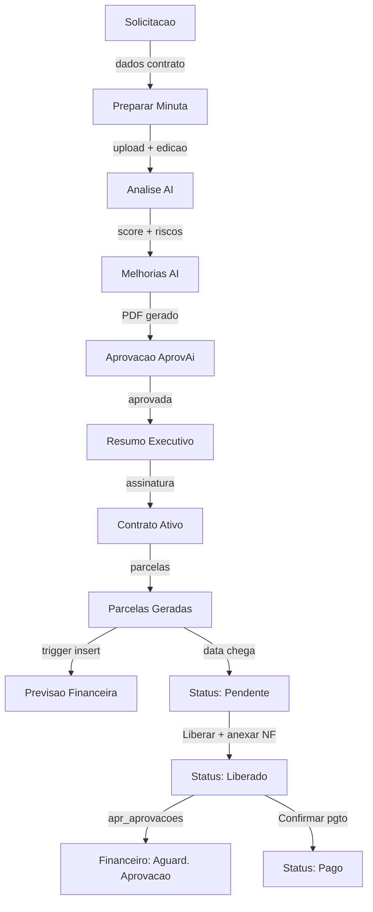

# Módulo Contratos v2 — Gestão Completa com AI

## Visão Geral

O módulo de Contratos v2 implementa um fluxo completo de **7 etapas** para gestao contratual, desde a solicitacao ate a assinatura, com integracao de **analise juridica por IA**, **geracao de PDF formal**, e **aprovacao via AprovAi**.

### Funcionalidades Principais
- **Solicitacoes de Contrato**: fluxo estruturado com dados do contratante e contratado
- **Preparacao de Minuta**: upload de arquivo + edicao inline + analise AI
- **Analise Juridica por IA**: score, riscos, sugestoes, conformidade, papel TEG, poder de barganha
- **Melhorias AI**: geracao automatica de melhorias baseadas na analise
- **Geracao de PDF Formal**: PDF nativo (jsPDF) com layout profissional TEG+
- **Aprovacao via AprovAi**: minutas contratuais integradas ao sistema `apr_aprovacoes`
- **Resumo Executivo**: visao consolidada por contrato
- **Gestao Financeira**: parcelas recorrentes + integracao com Financeiro (CP/CR)



---

## Rotas e Telas

| Rota | Componente | Descricao |
|------|-----------|-----------|
| `/contratos` | DashboardContratos | Painel com KPIs e visao geral |
| `/contratos/gestao` | GestaoContratos | Gestao consolidada (lista + detalhes + acoes) |
| `/contratos/solicitacoes` | SolicitacoesLista | Lista de solicitacoes de contrato |
| `/contratos/solicitacoes/nova` | NovaSolicitacao | Formulario com CNPJ auto-fill |
| `/contratos/solicitacoes/:id` | SolicitacaoDetalhe | Detalhe + acoes da solicitacao |
| `/contratos/minuta/:id` | PreparaMinuta | Upload, edicao, analise AI, melhorias, PDF |
| `/contratos/resumo/:id` | ResumoExecutivo | Resumo executivo do contrato |
| `/contratos/previsao` | Parcelas | Previsao financeira (parcelas) |
| `/contratos/equipe` | EquipePJ | Equipe PJ vinculada |
| `/contratos/aditivos` | Aditivos | Aditivos contratuais |

---

## Funcionalidades AI

### Analise Juridica por IA
- Endpoint n8n: `POST /webhook/contratos/analisar-minuta`
- Recebe texto da minuta + contexto TEG (contratante/contratado)
- Retorna: `score` (0-100), `resumo`, `riscos[]`, `sugestoes[]`, `oportunidades[]`, `clausulas_analisadas[]`, `conformidade{}`, `papel_teg`, `poder_barganha`
- UI: painel AnalisePanel com ScoreRing, cards por categoria, badges de severidade

### Melhorias AI
- Endpoint n8n: `POST /webhook/contratos/melhorar-minuta`
- 3 agentes paralelos: n8n minuta AI + EGP AI + layout improvements
- Retorna texto melhorado com sugestoes integradas
- UI: status bar com progresso (mesmo padrao UX da analise)

### Geracao de PDF Formal
- Implementado nativamente com `jsPDF` (sem dependencias externas)
- Layout profissional: cabecalho TEG+, dados das partes, clausulas formatadas
- Gerado no frontend a partir do texto da minuta

### Integracao AprovAi
- Minutas aprovadas via analise geram registro em `apr_aprovacoes` com `tipo = 'minuta_contratual'`
- Visivel na tela AprovAi com card violeta dedicado
- Aprovadores podem aprovar/rejeitar com observacao

---

## Tabelas do Banco de Dados

### Existentes (022_contratos.sql)
- `con_clientes` — Clientes (CEMIG, etc.)
- `con_contratos` — Contratos (ampliado com tipo_contrato, fornecedor_id, recorrencia, etc.)
- `con_medicoes` — Medições de contrato
- `con_medicao_itens` — Itens de medição
- `con_pleitos` — Pleitos
- `con_alertas` — Alertas

### Novas (024_contratos_gestao.sql)
- `con_contrato_itens` — Itens do contrato (descrição, quantidade, valor unitário)
- `con_parcelas` — Parcelas com status (previsto → pendente → liberado → pago)
- `con_parcela_anexos` — Anexos de parcelas (NF, medição, recibo, comprovante)

### Campos adicionados em con_contratos
- `tipo_contrato` — 'receita' ou 'despesa'
- `fornecedor_id` — Vínculo com cmp_fornecedores (contratos de despesa)
- `centro_custo` — Centro de custo para classificação financeira
- `classe_financeira` — Classe financeira
- `recorrencia` — 'mensal', 'bimestral', 'trimestral', 'semestral', 'anual', 'personalizado'
- `dia_vencimento` — Dia fixo de vencimento (1-31)
- `parcelas_geradas` — Flag de controle de geração

---

## Fluxo de Parcelas

### 1. Criação do Contrato
- Usuário preenche dados do contrato (contraparte, objeto, valores, datas)
- Adiciona itens opcionais
- Seleciona recorrência (ex: mensal, dia 15)
- Ao salvar, se recorrência ≠ personalizado, as parcelas são geradas automaticamente via `con_gerar_parcelas_recorrentes()`

### 2. Geração de Previsão Financeira
- Trigger `trg_con_criar_previsao` executa ao inserir parcela
- Se contrato é **despesa**: cria registro em `fin_contas_pagar` com status 'previsto'
- Se contrato é **receita**: cria registro em `fin_contas_receber` com status 'previsto'

### 3. Data de Vencimento Chega
- Função `con_verificar_parcelas_vencendo()` (executada via cron/n8n diariamente)
- Parcelas com `status = 'previsto'` e `data_vencimento <= hoje` mudam para `'pendente'`

### 4. Liberação (Contratista)
- Usuário do módulo Contratos clica em "Liberar Pagamento" (ou "Liberar Recebimento")
- Anexa NF, medição ou recibo
- Informa número da NF
- Trigger `trg_con_fin_parcela` atualiza o financeiro:
  - Despesa: `fin_contas_pagar.status = 'aguardando_aprovacao'`
  - Receita: `fin_contas_receber.status = 'faturado'`

### 5. Confirmação de Pagamento/Recebimento
- Após aprovação financeira, clica em "Confirmar Pagamento/Recebimento"
- Trigger atualiza o financeiro para 'pago'/'recebido'

---

## Hooks React

| Hook | Função |
|------|--------|
| `useContratosDashboard()` | Dashboard com RPC `get_dashboard_contratos_gestao` |
| `useContratos(filters?)` | Lista contratos com joins (cliente, fornecedor, obra) |
| `useContrato(id)` | Contrato individual |
| `useCriarContrato()` | Cria contrato + itens + gera parcelas |
| `useContratoItens(id)` | Itens de um contrato |
| `useParcelas(contratoId?, filters?)` | Lista parcelas com join ao contrato |
| `useCriarParcela()` | Cria parcela individual (personalizado) |
| `useLiberarParcela()` | Libera parcela (pendente → liberado) |
| `useConfirmarPagamento()` | Confirma pagamento (liberado → pago) |
| `useUploadAnexoParcela()` | Upload de NF/medição/recibo |
| `useAnexosParcela(id)` | Lista anexos de uma parcela |

---

## Arquivos

```
frontend/src/
├── types/contratos.ts             # Tipos TypeScript (Minuta, MinutaAiAnalise, etc.)
├── hooks/useContratos.ts          # React Query hooks (contratos, parcelas)
├── hooks/useSolicitacoes.ts       # Hooks de solicitacoes + minutas + AI
├── components/ContratosLayout.tsx  # Layout com sidebar indigo
└── pages/contratos/
    ├── DashboardContratos.tsx      # Painel principal
    ├── GestaoContratos.tsx         # Gestao consolidada
    ├── SolicitacoesLista.tsx       # Lista de solicitacoes
    ├── NovaSolicitacao.tsx         # Nova solicitacao (CNPJ auto-fill)
    ├── SolicitacaoDetalhe.tsx      # Detalhe + acoes
    ├── PreparaMinuta.tsx           # Upload, edicao, analise AI, melhorias, PDF
    ├── ResumoExecutivo.tsx         # Resumo executivo
    ├── Parcelas.tsx                # Previsao financeira
    ├── EquipePJ.tsx                # Equipe PJ
    ├── Aditivos.tsx                # Aditivos contratuais
    ├── Medicoes.tsx                # Medicoes (placeholder)
    ├── Reajustes.tsx               # Reajustes (placeholder)
    ├── Assinaturas.tsx             # Assinaturas (placeholder)
    ├── ListaContratos.tsx          # Lista legacy
    └── NovoContrato.tsx            # Formulario legacy

supabase/
├── 022_contratos.sql               # Schema original
└── 024_contratos_gestao.sql        # Extensao gestao v2
```

---

## Links Relacionados

- [[20 - Módulo Financeiro]] — Integracao CP/CR via parcelas
- [[12 - Fluxo Aprovação]] — Aprovacao de minutas via AprovAi
- [[07 - Schema Database]] — Tabelas `con_*`, `apr_aprovacoes`
- [[21 - Fluxo Pagamento]] — Ciclo parcela → pagamento
