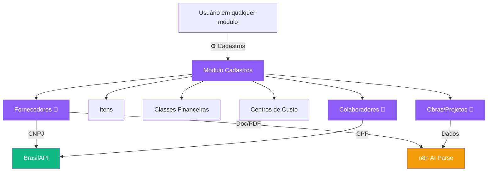
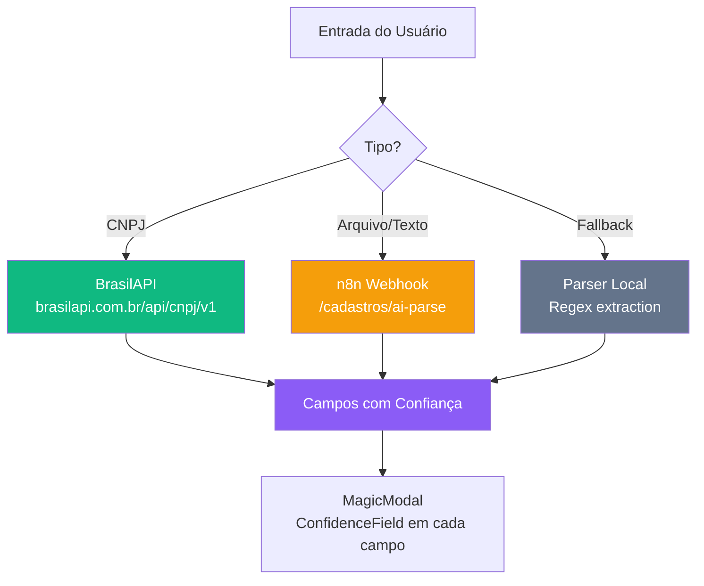

# Módulo Cadastros — Master Data com AI

## Visão Geral

O módulo de **Cadastros** centraliza o gerenciamento de dados mestres (master data) do ERP em uma experiência unificada e **facilitada por IA**. É acessível de qualquer módulo via ícone ⚙️ "Cadastros" na sidebar.

**Conceito:** MagicModal — modal com toggle AI/Manual que permite:
- **Modo AI (Drop & Fill):** arrastar documentos ou colar CNPJ/CPF → IA preenche todos os campos automaticamente com indicadores de confiança
- **Modo Manual:** formulário tradicional com sugestões inteligentes



> 🤖 = entidade com suporte a AI parse. As demais (Itens, Classes, C. Custo) são CRUD simples.

---

## Acesso — ⚙️ Gear Icon em Todos os Módulos

O módulo Cadastros **não aparece na mandala** (ModuloSelector). Em vez disso, um ícone de engrenagem (⚙️ Settings) com label "Cadastros" foi adicionado à **sidebar de todos os 7 módulos**:

| Módulo | Layout | Localização |
|--------|--------|-------------|
| Compras | `Layout.tsx` | Após NAV, antes de Admin link |
| Financeiro | `FinanceiroLayout.tsx` | Após NAV items |
| Estoque | `EstoqueLayout.tsx` | Após NAV items |
| Logística | `LogisticaLayout.tsx` | Após NAV items |
| Frotas | `FrotasLayout.tsx` | Após NAV + em drawer mobile |
| RH | `RHLayout.tsx` | Após NAV + em drawer mobile |
| Contratos | `ContratosLayout.tsx` | Após NAV items |

**Padrão visual:** Separador `<hr>` + NavLink com ícone `Settings` (lucide-react) + label "Cadastros" → rota `/cadastros`

---

## Rotas e Telas

| Rota | Componente | Descrição | AI? |
|------|-----------|-----------|-----|
| `/cadastros` | `CadastrosHome.tsx` | Dashboard 2×3 grid com cards por entidade, contagens, botões rápidos | — |
| `/cadastros/fornecedores` | `FornecedoresCad.tsx` | Lista cards + MagicModal com CNPJ lookup | 🤖 |
| `/cadastros/itens` | `ItensCad.tsx` | Tabela CRUD + modal simples, filtro Curva ABC | — |
| `/cadastros/classes` | `ClassesFinanceiras.tsx` | Tabela CRUD + modal (código, descrição, tipo, ativo) | — |
| `/cadastros/centros-custo` | `CentrosCusto.tsx` | Tabela CRUD + modal (código, descrição, obra, ativo) | — |
| `/cadastros/obras` | `ObrasCad.tsx` | Lista cards + MagicModal | 🤖 |
| `/cadastros/colaboradores` | `ColaboradoresCad.tsx` | Lista cards + MagicModal com CPF lookup | 🤖 |

---

## Componentes Shared

### `MagicModal`
Modal genérico com header contendo **pill toggle AI/Manual**:
- Modo AI → renderiza `AiDropZone` + callback `onParse`
- Modo Manual (ou pós-AI) → renderiza formulário children
- Props: `open`, `onClose`, `title`, `showAiToggle`, `onParse`, `onSave`, `children`

### `AiDropZone`
Zona de drop com input para CNPJ/CPF/texto:
- Drag & drop de arquivos (PDF, imagem → base64)
- Botão "Buscar" → `onParse({ type, value })`
- Visual: gradiente violet com ícone Sparkles
- Props: `onParse`, `showCnpjField?`, `showCpfField?`

### `ConfidenceField`
Input wrapper com indicador visual de confiança AI:
- Borda esquerda colorida: emerald (≥90%), amber (70-90%), rose (<70%)
- Badge com porcentagem no canto superior direito
- Props: `confidence?`, `label`, `children` (renderiza input customizado)

---

## Banco de Dados

### Migration `025_cadastros_master.sql`

**Novas tabelas:**

#### `fin_classes_financeiras`
| Coluna | Tipo | Descrição |
|--------|------|-----------|
| id | uuid PK | Identificador |
| codigo | text NOT NULL UNIQUE | Código da classe (ex: "3.1.01") |
| descricao | text NOT NULL | Descrição |
| tipo | text NOT NULL | 'receita' ou 'despesa' |
| ativo | boolean DEFAULT true | Ativo/inativo |
| created_at / updated_at | timestamptz | Timestamps |

#### `sys_centros_custo`
| Coluna | Tipo | Descrição |
|--------|------|-----------|
| id | uuid PK | Identificador |
| codigo | text NOT NULL UNIQUE | Código do centro (ex: "CC-001") |
| descricao | text NOT NULL | Descrição |
| obra_id | uuid FK → obras | Obra vinculada |
| ativo | boolean DEFAULT true | Ativo/inativo |
| created_at / updated_at | timestamptz | Timestamps |

#### `rh_colaboradores`
| Coluna | Tipo | Descrição |
|--------|------|-----------|
| id | uuid PK | Identificador |
| nome | text NOT NULL | Nome completo |
| cpf | text UNIQUE | CPF |
| cargo | text | Cargo |
| email | text | Email |
| telefone | text | Telefone |
| obra_id | uuid FK → obras | Obra vinculada |
| data_admissao | date | Data de admissão |
| ativo | boolean DEFAULT true | Ativo/inativo |
| created_at / updated_at | timestamptz | Timestamps |

**RLS:** Habilitado em todas as tabelas — SELECT/INSERT/UPDATE para autenticados.
**Triggers:** `updated_at` automático.
**Índices:** `ativo`, `obra_id` onde aplicável.

> **Nota:** Fornecedores e Itens reutilizam tabelas existentes (`cmp_fornecedores`, `est_itens`). Obras reutiliza `obras`.

---

## AI Pipeline

### Estratégia de Parsing (3 camadas)



1. **CNPJ via BrasilAPI** (grátis, sem autenticação)
   - Endpoint: `https://brasilapi.com.br/api/cnpj/v1/{cnpj}`
   - Retorna: razão social, fantasia, CNAE, endereço, telefone, email
   - Confidence: 95% para dados diretos, 80% para inferidos

2. **n8n AI Parse** (documentos e texto)
   - Endpoint: `${VITE_N8N_WEBHOOK_URL}/cadastros/ai-parse`
   - Payload: `{ entity, content, fileBase64?, fileName? }`
   - Retorna: `AiCadastroResult` com campos + confidence por campo

3. **Regex Fallback** (offline)
   - Extração local de CNPJ, emails, telefones via regex
   - Confidence: 50-60%

---

## Hooks React

| Hook | Função | Fonte |
|------|--------|-------|
| `useCadFornecedores()` | Lista fornecedores | `cmp_fornecedores` |
| `useSalvarFornecedor()` | Upsert fornecedor | `cmp_fornecedores` |
| `useCadClasses()` | Lista classes financeiras | `fin_classes_financeiras` |
| `useSalvarClasse()` | Upsert classe | `fin_classes_financeiras` |
| `useCadCentrosCusto()` | Lista centros de custo | `sys_centros_custo` |
| `useSalvarCentroCusto()` | Upsert centro | `sys_centros_custo` |
| `useCadObras()` | Lista obras | `obras` |
| `useSalvarObra()` | Upsert obra | `obras` |
| `useCadColaboradores()` | Lista colaboradores | `rh_colaboradores` |
| `useSalvarColaborador()` | Upsert colaborador | `rh_colaboradores` |
| `useEstoqueItens()` | Lista itens (reuso) | `est_itens` |
| `useSalvarItem()` | Upsert item (reuso) | `est_itens` |
| `useAiCadastroParse()` | Parse AI (3 estratégias) | BrasilAPI / n8n / regex |

**Cross-module cache invalidation:** Mutations invalidam tanto queries do cadastros (`cad-*`) quanto do módulo original (`fornecedores`, `obras`, etc.) para manter consistência.

---

## Arquivos

```
frontend/src/
├── types/cadastros.ts                  # Tipos: ClasseFinanceira, CentroCusto, Colaborador, AiCadastroField, AiCadastroResult
├── hooks/useCadastros.ts               # 13 hooks (queries + mutations + AI parse)
├── components/
│   ├── CadastrosLayout.tsx             # Layout sidebar violet com 7 nav items
│   ├── MagicModal.tsx                  # Modal AI/Manual toggle
│   ├── AiDropZone.tsx                  # Drag-drop + CNPJ/CPF input
│   └── ConfidenceField.tsx             # Input com indicador de confiança
└── pages/cadastros/
    ├── CadastrosHome.tsx               # Dashboard 2×3 grid
    ├── FornecedoresCad.tsx             # Cards + MagicModal (CNPJ AI)
    ├── ItensCad.tsx                     # Tabela CRUD
    ├── ClassesFinanceiras.tsx          # Tabela CRUD
    ├── CentrosCusto.tsx                # Tabela CRUD
    ├── ObrasCad.tsx                     # Cards + MagicModal (AI)
    └── ColaboradoresCad.tsx            # Cards + MagicModal (CPF AI)

supabase/
└── 025_cadastros_master.sql            # 3 tabelas + RLS + triggers + índices
```

---

## Cor e Tema

| Propriedade | Valor |
|-------------|-------|
| Cor principal | **Violet** (`bg-violet-50`, `text-violet-700`, `border-violet-200`) |
| Sidebar active | `bg-violet-50 text-violet-700 border-violet-200` (light) |
| Module badge | ⚙️ "Cadastros / Configurações" |
| Nav back | `navigate(-1)` — retorna ao módulo anterior |

---

## Status de Implementação

### Concluído ✅
- [x] Migration 025 (3 tabelas) — aplicada em produção
- [x] Types + interfaces TypeScript
- [x] 13 hooks (query + mutation + AI)
- [x] 3 componentes shared (MagicModal, AiDropZone, ConfidenceField)
- [x] CadastrosLayout com sidebar violet
- [x] 7 páginas de entidades
- [x] Rotas `/cadastros/*` no App.tsx
- [x] Gear icon ⚙️ em todos os 7 layouts de módulos
- [x] TypeScript `tsc --noEmit` zero errors
- [x] Vite build sucesso

### Planejado 🔜
- [ ] Workflow n8n para `/cadastros/ai-parse` (requer setup n8n)
- [ ] Testes automatizados (Vitest)
- [ ] Migrar `useFinanceiro` hooks (useDistinctCentroCusto, useDistinctClasseFinanceira) para usar novas tabelas master
- [ ] Bulk import via CSV/Excel

---

## Links Relacionados

- [[00 - TEG+ INDEX]] — Índice principal
- [[03 - Páginas e Rotas]] — Rotas do módulo
- [[05 - Hooks Customizados]] — useCadastros detalhado
- [[08 - Migrações SQL]] — Migration 025
- [[20 - Módulo Financeiro]] — Fornecedores (tabela compartilhada)
- [[22 - Módulo Estoque e Patrimonial]] — Itens (tabela compartilhada)
- [[26 - Upload Inteligente Cotacao]] — Referência de AI parse pattern
