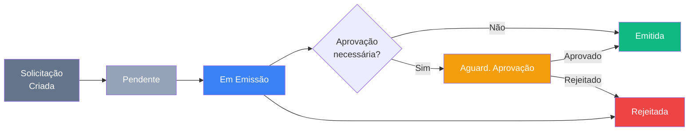

# Módulo Fiscal

> Gestão do ciclo de emissão de Notas Fiscais (NF-e/NFS-e) originadas de compras, logística ou manualmente. Inclui pipeline de solicitações, repositório histórico e painel gerencial.

---

## Visão Geral

O módulo Fiscal centraliza o controle de Notas Fiscais emitidas pela TEG. Solicitações de NF chegam de três origens:

| Origem | Descrição |
|--------|-----------|
| `logistica` | NF-e gerada a partir de uma solicitação de transporte aprovada |
| `compras` | NF vinculada a um Pedido de Compra (PO) |
| `manual` | Solicitação avulsa criada diretamente no módulo Fiscal |

---

## Fluxo de Emissão



---

## Status das Solicitações de NF

| Status | Cor | Descrição |
|--------|-----|-----------|
| `pendente` | Slate | Aguardando início de emissão |
| `em_emissao` | Blue | Operador fiscal processando |
| `aguardando_aprovacao` | Amber | Aguarda alçada aprovadora |
| `emitida` | Green | NF emitida com sucesso |
| `rejeitada` | Red | Rejeitada pelo aprovador ou cancelada |

---

## Páginas e Componentes

### `PainelFiscal.tsx` — `/fiscal`

Dashboard principal do módulo. Exibe:

- **4 KPIs do mês corrente:** Emitidas, Pendentes (+ em emissão), Rejeitadas, Valor Total
- **NFs por Origem:** gráfico de barras horizontais (Logística / Compras / Manual)
- **Top Obras por valor:** ranking das 5 obras com maior volume de NFs no mês
- **Quick Actions:** atalhos para Pipeline e Histórico
- **Pendentes na Fila:** lista das últimas 5 solicitações pendentes/em emissão
- **Rejeitadas:** lista das solicitações rejeitadas para ação corretiva

### `FiscalPipeline.tsx` — `/fiscal/pipeline`

Tela principal de trabalho do operador fiscal. Funcionalidades:

- **Visão Kanban** e **Visão Lista** alternáveis
- Colunas Kanban: Pendente → Em Emissão → Aguard. Aprovação → Emitida / Rejeitada
- Filtros por origem, obra, período e texto livre
- Ações por solicitação: Iniciar emissão, Emitir NF, Aprovar, Rejeitar, Anexar DANFE
- Formulário de emissão com campos: número NF, série, chave de acesso, valor, CFOP, natureza da operação
- Upload de DANFE (PDF)
- Suporte a criação de nova solicitação manual diretamente no pipeline

### `NotasFiscais.tsx` — `/fiscal/historico`

Repositório histórico de todas as NFs emitidas. Funcionalidades:

- Listagem com filtros por origem, obra, período
- Download/visualização de DANFE
- Exportação de relatório

---

## Hooks e Tipos

### Hooks (`src/hooks/`)

| Hook | Arquivo | Responsabilidade |
|------|---------|------------------|
| `useSolicitacoesNF` | `useSolicitacoesNF.ts` | CRUD de solicitações de NF |
| `useSolResumo` | `useSolicitacoesNF.ts` | Resumo calculado (contagens por status) |
| `useCriarSolicitacao` | `useSolicitacoesNF.ts` | Mutation — criar nova solicitação |
| `useIniciarEmissao` | `useSolicitacoesNF.ts` | Mutation — avançar para `em_emissao` |
| `useEmitirNF` | `useSolicitacoesNF.ts` | Mutation — emitir NF com dados fiscais |
| `useAnexarNFExterna` | `useSolicitacoesNF.ts` | Mutation — anexar NF emitida externamente |
| `useAprovarSolicitacao` | `useSolicitacoesNF.ts` | Mutation — aprovar solicitação |
| `useRejeitarSolicitacao` | `useSolicitacoesNF.ts` | Mutation — rejeitar solicitação |
| `useUploadDANFE` | `useSolicitacoesNF.ts` | Upload de DANFE para Storage |
| `useNotasFiscais` | `useNotasFiscais.ts` | Consulta ao repositório de NFs emitidas |
| `useNfResumo` | `useNotasFiscais.ts` | Resumo calculado das NFs (total, count) |

### Tipo principal (`src/types/solicitacaoNF.ts`)

```ts
interface SolicitacaoNF {
  id: string
  numero?: string           // gerado automaticamente
  status: StatusSolicitacaoNF
  origem: 'logistica' | 'compras' | 'manual'
  fornecedor_nome?: string
  descricao?: string
  natureza_operacao?: string
  valor_total?: number
  obra_id?: string
  obra?: { nome: string }
  solicitado_em: string
  emitido_em?: string
  danfe_url?: string
}

// Estágios do pipeline Kanban
const FISCAL_PIPELINE_STAGES: StatusFiscalPipeline[]
```

---

## Schema do Banco

As tabelas do módulo fiscal utilizam o prefixo `fis_`.

| Tabela | Descrição |
|--------|-----------|
| `fis_solicitacoes_nf` | Solicitações de emissão de NF (pipeline) |
| `fis_notas_fiscais` | Repositório de NFs emitidas |

> Nota: as tabelas são criadas e geridas via migrations Supabase. Consulte a migration correspondente para schema completo.

---

## Integração com Outros Módulos

| Módulo | Integração |
|--------|-----------|
| **Logística** | Transporte aprovado pode gerar solicitação de NF automaticamente |
| **Compras** | PO emitido pode acionar solicitação de NF |
| **Financeiro** | NF emitida pode ser vinculada a CP/CR para controle de vencimentos |
| **Cadastros** | Fornecedor da NF referencia `cmp_fornecedores` |

---

## KPIs do Painel

| KPI | Fonte | Descrição |
|-----|-------|-----------|
| `emitidas` | `fis_solicitacoes_nf` | Solicitações com status `emitida` no mês |
| `pendentes` | `fis_solicitacoes_nf` | Status `pendente` no mês |
| `em_emissao` | `fis_solicitacoes_nf` | Status `em_emissao` no mês |
| `rejeitadas` | `fis_solicitacoes_nf` | Status `rejeitada` no mês |
| `valor_total` | `fis_notas_fiscais` | Soma de `valor_total` das NFs emitidas no mês |
| `nfs_por_origem` | `fis_notas_fiscais` | Agrupamento por campo `origem` |
| `top_obras` | `fis_notas_fiscais` | Top 5 obras por valor total de NFs |

---

## Funções de Sincronização

| Função | Descrição |
|--------|-----------|
| `sync_nf_from_pedido_anexo()` | Cria solicitação de NF automaticamente quando um anexo de NF é adicionado a um pedido de compra |
| `fis_sync_nf_to_logistica()` | Sincroniza NF emitida com o módulo de Logística, atualizando `log_nfe` com dados fiscais |

Essas funções conectam o módulo Fiscal aos fluxos de Compras e Logística, evitando retrabalho manual.

---

## Links Relacionados

- [[03 - Páginas e Rotas]] — Rotas do módulo
- [[20 - Módulo Financeiro]] — Integração financeira
- [[23 - Módulo Logística e Transportes]] — Origem de solicitações via transporte
