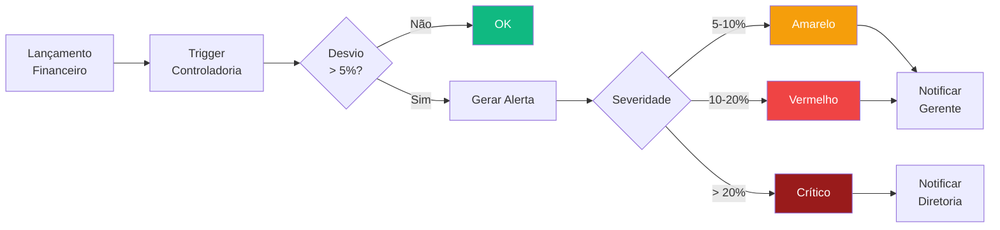

# Módulo Controladoria

> Visão executiva financeira do portfólio de obras. Consolida orçamentos, DRE, KPIs de desempenho e controle orçamentário (orçado vs realizado) com dados históricos TOTVS + NIBO.

---

## Visão Geral

O módulo Controladoria é o centro de inteligência financeira do TEG+. Ele agrega dados de múltiplos módulos (Financeiro, Contratos, Compras, Obras) para fornecer uma visão consolidada de:

- Custo por obra vs orçamento aprovado
- DRE simplificado por período
- Controle Orçamentário (Orçado vs Realizado) mensal/trimestral/anual
- Plano Orçamentário anual por categoria de custo
- Relatórios com base de dados histórica TOTVS + NIBO (`fin_legado_custos`)
- Alertas automáticos de desvio orçamentário

---

## Páginas e Componentes

### `ControladoriaHome.tsx` — `/controladoria`

Dashboard principal. Cards de atalho para as visões principais:
- Orçamentos, DRE, KPIs, Alertas
- Custo por Obra (custo realizado vs orçado com % desvio)
- Alertas não lidos

> **Atenção:** Os cards de "Controle Projetos" e "Cenários" foram **removidos da navegação lateral** (junho/2026). Os cards do home grid devem ser removidos também quando solicitado.

---

### `RelatoriosLegado.tsx` — `/controladoria/relatorios-legado`

Visão analítica da base histórica de custos TOTVS + NIBO.

- **Filtro De → Até** (seletor mês/ano, default: dez/23 → mês atual)
- Agrupamento por polo/frente com **nomes reais** (Frutal, Três Marias, Araxá/Perdizes…)
- Drilldown por polo via `PainelLegadoBreakdown.tsx`
- Fonte: `fin_legado_custos` (31.312 linhas: 9.657 TOTVS + 21.655 NIBO, R$ 95,2mi)

**Mapa de polos:**

| Código | Nome exibido |
|--------|-------------|
| F1 | Frutal |
| F2 | Três Marias |
| F3.1/3.2 | Araxá / Perdizes |
| F3.3/3.4 | Patrocínio / Ituiutaba |
| F3.5/3.6/3.7 | Uberlândia |
| F3.12 | Paracatu |
| F4 | Rio Paranaíba |
| F8 | Comendador Gomes |
| — | Sem polo (overhead) |

---

### `Orcamentos.tsx` — `/controladoria/orcamentos`

Gestão de orçamentos por **centro de custo** (não por obra):
- CRUD de orçamentos (versão, valor aprovado, status)
- Filtros por centro de custo, status e período
- Tabela exibe coluna "Centro de Custo" com `descricao` do CC

> Migration `ctrl_orcamentos_centro_custo`: `centro_custo_id uuid` adicionado, `obra_id` tornado nullable.

---

### `DRE.tsx` — `/controladoria/dre`

Demonstração de Resultado do Exercício consolidada:
- DRE por período (mensal, trimestral, anual)
- Agrupamento por obra ou consolidado
- Comparativo com período anterior
- Exportação CSV/PDF

---

### `KPIs.tsx` — `/controladoria/kpis`

Painel de indicadores-chave:
- Margem bruta e líquida por obra
- EBITDA e EBITDA %
- Índice de eficiência operacional
- Custo por HH (homem-hora) alocado
- Tendência de consumo orçamentário

---

### `PlanoOrcamentario.tsx` — `/controladoria/plano-orcamentario`

Plano orçamentário anual por **categoria de custo**:
- Exibição em tabela por 1º/2º/3º/4º trimestre + Total Ano
- Categorias em 3 grupos: Custos Diretos, Despesas Administrativas, Despesas Após o Lucro

**Categorias (SECTIONS):**

| Grupo | Itens |
|-------|-------|
| CUSTOS DIRETOS E IND. OBRAS | Materiais (Aço, Concreto) · Mão de Obra Direta · Alojamentos e Alimentação · Frotas · Serviços Terc. + Outros C. Diretos · Equipamentos e EPIs |
| DESPESAS ADMINISTRATIVAS | Pessoal · Administrativo · Serviços Administrativos · Sistemas · Desp Fin. e Outra Desp Adm |
| DESPESAS APÓS O LUCRO | Amortizações · Investimentos · Impostos (PIS/COFINS/IRPJ/CSLL) |

- Dados carregados via `usePlanoOrcamentario(ano)` → tabela `ctrl_orcamento_linhas`
- V1 2026 carregado: 168 linhas (14 categorias × 12 meses), R$ 65,72mi

---

### `ControleOrcamentario.tsx` — `/controladoria/controle-orcamentario`

Orçado vs Realizado por categoria, com filtro de período:

**Filtros de período:**
- **Ano todo** (padrão/default)
- 1º, 2º, 3º, 4º Trimestre
- Janeiro … Dezembro (meses individuais)

**Lógica de codificação:**

| `mes` | Significado |
|-------|------------|
| 0 | Ano todo (sem filtro de mês) |
| 1–12 | Mês específico |
| 101–104 | 1º–4º Trimestre |

**Abas:**
- **Acompanhamento** — tabela orçado vs realizado com variação % por categoria
- **Plano** — redirect/embed do `PlanoOrcamentario`

**Dados:**
- Orçado: `ctrl_orcamento_linhas` filtrado por mês(es)
- Realizado: view `vw_ctrl_realizado_categoria` (agrega `fin_legado_custos` grupo_dre → categoria)

---

### `AlertasDesvio.tsx` — `/controladoria/alertas`

Central de alertas de desvio orçamentário:
- Listagem de alertas ativos, lidos e resolvidos
- Severidade: amarelo / vermelho / crítico
- Ação: marcar como lido, criar plano de ação, resolver

---

## Severidades de Alerta

| Severidade | Critério | Cor |
|------------|----------|-----|
| `amarelo` | Desvio entre 5% e 10% | Amber |
| `vermelho` | Desvio entre 10% e 20% | Red |
| `critico` | Desvio acima de 20% | Red (pulsante) |

---

## Hooks (`src/hooks/useControladoria.ts`)

| Hook | Responsabilidade |
|------|------------------|
| `useCustoPorObra()` | Custos realizados agrupados por obra |
| `useAlertasDesvio({ resolvido })` | Alertas de desvio orçamentário |
| `useOrcamentos({ centro_custo_id? })` | Orçamentos por centro de custo |
| `useDRE({ periodo, obra_id? })` | DRE consolidado ou por obra |
| `useKPIs({ obra_id?, periodo })` | KPIs de margem e eficiência |
| `usePlanoOrcamentario(ano)` | Plano por trimestre (ctrl_orcamento_linhas agregado) |
| `useControleOrcamentario(ano, mes)` | Orçado vs realizado por categoria e período |
| `useLegadoResumo(de, ate)` | Resumo da base histórica TOTVS+NIBO por polo |
| `useLookupCentrosCusto()` | Lista de centros de custo para filtros |

**Helper interno `mesesDoFiltro(mes)`:**
```ts
function mesesDoFiltro(mes: number): number[] | null {
  if (mes >= 101 && mes <= 104) { const q = mes - 100; return [q * 3 - 2, q * 3 - 1, q * 3] }
  if (mes >= 1 && mes <= 12) return [mes]
  return null  // null = ano todo (sem filtro)
}
```

---

## Schema do Banco

Prefixo de tabelas: `ctrl_`

| Tabela/View | Descrição |
|-------------|-----------|
| `ctrl_orcamentos` | Orçamentos por centro de custo (obra_id nullable, centro_custo_id adicionado em jun/26) |
| `ctrl_orcamento_linhas` | Linhas do plano orçamentário: categoria × mês × valor (168 linhas p/ 2026) |
| `ctrl_alertas_desvio` | Alertas de desvio orçamentário |
| `ctrl_kpis_snapshot` | Snapshots diários de KPIs por obra |
| `fin_legado_custos` | Base histórica TOTVS + NIBO — 31.312 linhas, R$ 95,2mi (origem='totvs' ou 'nibo') |
| `vw_ctrl_realizado_categoria` | View que agrega `fin_legado_custos` por (ano, mes, categoria) mapeando grupo_dre → categoria do plano |
| `vw_legado_resumo` | View de resumo por polo/período para Relatórios Legado |

### `fin_legado_custos` — Composição atual (jun/26)

| Origem | Linhas | Valor |
|--------|--------|-------|
| totvs | 9.657 | R$ 26,8mi |
| nibo | 21.655 | R$ 68,4mi |
| **Total** | **31.312** | **R$ 95,2mi** |

Período: dez/2023 → jul/2025 (NIBO) + histórico TOTVS.

> **Regra:** tela exibe APENAS o que está no banco. Nunca hardcodar valores de Excel/snapshot.

---

## Fluxo de Desvio Orçamentário



---

## Integração com Outros Módulos

| Módulo | Integração |
|--------|-----------|
| **Financeiro** | CP/CR alimentam o realizado da Controladoria |
| **Contratos** | Medições aprovadas geram receita no DRE |
| **Compras** | Pedidos de compra emitidos alimentam custo realizado |
| **Obras** | Apontamentos de HH calculam custo de mão de obra |
| **Cadastros** | Classes financeiras e centros de custo estruturam o DRE |

---

## RPCs do Banco

| RPC | Descrição |
|-----|-----------|
| `ctrl_calcular_dre_mes(obra_id, ano, mes)` | Calcula DRE simplificado para uma obra em um mês |
| `ctrl_gerar_snapshot_kpis()` | Gera snapshot diário de KPIs — executado via cron n8n |

---

## Links Relacionados

- [[03 - Páginas e Rotas]] — Rotas do módulo
- [[20 - Módulo Financeiro]] — Fonte do realizado
- [[27 - Módulo Contratos Gestão]] — Receitas via medições
- [[32 - Módulo Obras]] — Custo HH
