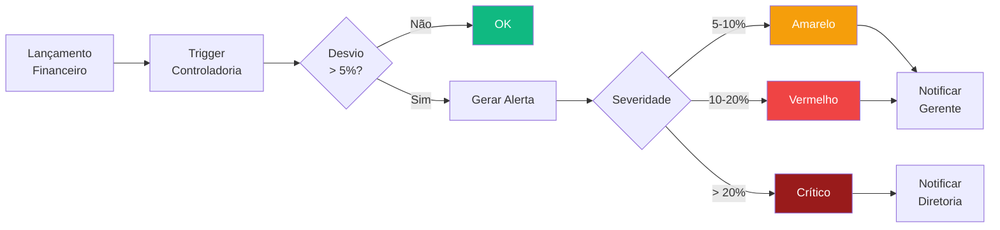

# Módulo Controladoria

> Visão executiva financeira do portfólio de obras. Consolida orçamentos, DRE, KPIs de desempenho, análise de cenários e alertas de desvio orçamentário para suporte à decisão gerencial.

---

## Visão Geral

O módulo Controladoria é o centro de inteligência financeira do TEG+. Ele agrega dados de múltiplos módulos (Financeiro, Contratos, Compras, Obras) para fornecer uma visão consolidada de:

- Custo por obra vs orçamento aprovado
- DRE simplificado por período
- KPIs de margem, EBITDA e eficiência
- Alertas automáticos de desvio orçamentário
- Cenários de forecast (otimista / base / pessimista)

---

## Páginas e Componentes

### `ControladoriaHome.tsx` — `/controladoria`

Dashboard principal. Exibe:
- **4 KPIs rápidos:** Custo Total (portfólio), Margem Média, Alertas Ativos, Orçamentos Aprovados
- **Quick Actions:** atalhos para Orçamentos, DRE, KPIs, Alertas
- **Custo por Obra:** lista de obras com custo realizado, orçado e percentual de desvio
- **Alertas não lidos:** últimos 5 alertas de desvio pendentes de leitura

### `Orcamentos.tsx` — `/controladoria/orcamentos`

Gestão de orçamentos por obra:
- CRUD de orçamentos (versão, valor aprovado, status)
- Comparação entre versões de orçamento
- Filtros por obra, status e período

### `DRE.tsx` — `/controladoria/dre`

Demonstração de Resultado do Exercício consolidada:
- DRE por período (mensal, trimestral, anual)
- Agrupamento por obra ou consolidado
- Comparativo com período anterior
- Exportação em CSV/PDF

### `KPIs.tsx` — `/controladoria/kpis`

Painel de indicadores-chave:
- Margem bruta e líquida por obra
- EBITDA e EBITDA %
- Índice de eficiência operacional
- Custo por HH (homem-hora) alocado
- Tendência de consumo orçamentário

### `Cenarios.tsx` — `/controladoria/cenarios`

Simulação de cenários financeiros:
- 3 cenários: Otimista, Base, Pessimista
- Parâmetros ajustáveis: % desvio custo, variação receita, prazo
- Impacto no resultado projetado por obra

### `PlanoOrcamentario.tsx` — `/controladoria/plano-orcamentario`

Plano orçamentário anual/mensal por obra:
- Inserção de valores orçados por categoria de custo e mês
- Aprovação do plano orçamentário
- Versionamento de planos

### `ControleOrcamentario.tsx` — `/controladoria/controle-orcamentario`

Orçado vs Realizado em tempo real:
- Comparativo mensal por obra e categoria
- Variação absoluta e percentual
- Semáforo visual (verde/amarelo/vermelho)
- Drill-down por centro de custo

### `PainelIndicadores.tsx` — `/controladoria/indicadores`

Painel executivo consolidado:
- Visão geral de todas as obras em um único painel
- Ranking de obras por rentabilidade
- Heatmap de desvios

### `AlertasDesvio.tsx` — `/controladoria/alertas`

Central de alertas de desvio orçamentário:
- Listagem de alertas ativos, lidos e resolvidos
- Severidade: amarelo / vermelho / crítico
- Ação: marcar como lido, criar plano de ação, resolver
- Filtros por obra, severidade e período

---

## Severidades de Alerta

| Severidade | Critério | Cor |
|------------|----------|-----|
| `amarelo` | Desvio entre 5% e 10% do orçado | Amber |
| `vermelho` | Desvio entre 10% e 20% do orçado | Red |
| `critico` | Desvio acima de 20% do orçado | Red (pulsante) |

---

## Hooks (`src/hooks/useControladoria.ts`)

| Hook | Responsabilidade |
|------|------------------|
| `useCustoPorObra()` | Custos realizados agrupados por obra |
| `useAlertasDesvio({ resolvido })` | Alertas de desvio orçamentário filtrados |
| `useOrcamentos()` | Lista de orçamentos por status |
| `useDRE({ periodo, obra_id? })` | DRE consolidado ou por obra |
| `useKPIs({ obra_id?, periodo })` | KPIs calculados de margem e eficiência |
| `useCenarios()` | Cenários de simulação financeira |
| `usePlanoOrcamentario({ obra_id })` | Plano orçamentário por obra e mês |
| `useControleOrcamentario({ obra_id })` | Comparativo orçado vs realizado |

---

## Schema do Banco

Prefixo de tabelas: `ctrl_`

| Tabela | Descrição |
|--------|-----------|
| `ctrl_orcamentos` | Orçamentos por obra (versão, valor, status) |
| `ctrl_orcamento_itens` | Itens do orçamento por categoria e mês |
| `ctrl_alertas_desvio` | Alertas gerados por desvio orçamentário |
| `ctrl_cenarios` | Cenários de simulação financeira |
| `ctrl_kpis_snapshot` | Snapshots diários de KPIs por obra |

---

## Fluxo de Desvio Orçamentário

---

## Integração com Outros Módulos

| Módulo | Integração |
|--------|-----------|
| **Financeiro** | CP/CR alimentam o realizado da Controladoria |
| **Contratos** | Medições aprovadas geram receita no DRE |
| **Compras** | Pedidos de compra emitidos alimentam custo realizado |
| **Obras** | Apontamentos de HH calculam custo de mão de obra |
| **Cadastros** | Classes financeiras e centros de custo estruturam o DRE |

---

## RPCs do Banco

| RPC | Descrição |
|-----|-----------|
| `ctrl_calcular_dre_mes(obra_id, ano, mes)` | Calcula DRE simplificado para uma obra em um mês específico — receitas, custos diretos, margem |
| `ctrl_gerar_snapshot_kpis()` | Gera snapshot diário de KPIs por obra — margem, CPI, SPI, desvio orçamentário — salvo em `ctrl_kpis_snapshot` |

Os snapshots são executados via cron n8n diariamente e alimentam o dashboard de indicadores com série histórica.

---

## Indicadores de Produção

Além dos KPIs financeiros, a Controladoria acompanha indicadores de produção por obra:
- HH/km de rede construída
- Custo/km
- Produtividade por frente de trabalho

---

## Links Relacionados

- [[03 - Páginas e Rotas]] — Rotas do módulo
- [[20 - Módulo Financeiro]] — Fonte do realizado
- [[27 - Módulo Contratos Gestão]] — Receitas via medições
- [[32 - Módulo Obras]] — Custo HH
