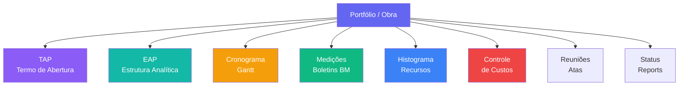

# Módulo PMO/EGP — Escritório de Gestão de Projetos

> Gerenciamento completo do portfólio de obras da TEG com visão física-financeira, cronograma, EAP, TAP, medições, histograma de recursos, controle de custos, reuniões e status reports.

---

## Visão Geral

O módulo EGP (Escritório de Gestão de Projetos) — acessível via rota `/egp` — centraliza a gestão técnica e financeira do portfólio de obras. Cada projeto/obra é representado como um **Portfólio** com todas as suas dimensões associadas: escopo (EAP), tempo (cronograma), recursos (histograma), custos, medições contratuais e indicadores de desempenho.

---

## Estrutura de Portfólio

---

## Status de Portfólio

| Status | Descrição |
|--------|-----------|
| `em_analise_ate` | Em análise pela ATE (Análise Técnico-Econômica) |
| `revisao_cliente` | Aguardando revisão/aprovação do cliente |
| `liberado_iniciar` | Aprovado — aguardando início de obra |
| `obra_andamento` | Obra em execução |
| `obra_paralisada` | Obra paralisada temporariamente |
| `obra_concluida` | Obra concluída |
| `cancelada` | Cancelada |

---

## Páginas e Componentes

### Dashboard — `PMOHome.tsx` (`EGPHome`) — `/egp`

Dashboard executivo do portfólio:
- **KPIs consolidados:** Obras em andamento, Valor total do portfólio, Margem média, Obras concluídas
- **Quick Links:** Portfolio, Fluxo OS, Indicadores, Reuniões, Multas, Histograma
- **Lista de portfólios:** status, progresso físico, valor OSC, custo real, margem

### Portfolio — `/egp/portfolio`

| Componente | Rota | Descrição |
|------------|------|-----------|
| `Portfolio.tsx` | `/egp/portfolio` | Lista de todos os portfólios/obras com filtros e KPIs |
| `NovoPortfolio.tsx` | `/egp/portfolio/novo` | Formulário de criação de novo portfólio |
| `PortfolioDetalhe.tsx` | `/egp/portfolio/:id` | Visão detalhada com todas as dimensões da obra |

### TAP (Termo de Abertura do Projeto) — `/egp/tap`

| Componente | Rota | Descrição |
|------------|------|-----------|
| `TapHub.tsx` | `/egp/tap` | Seletor — lista portfólios para navegar ao TAP |
| `TapPage.tsx` | `/egp/tap/:portfolioId` | Formulário completo do TAP: objetivo, escopo, cronograma macro, riscos, equipe, recursos |

### EAP (Estrutura Analítica do Projeto) — `/egp/eap`

| Componente | Rota | Descrição |
|------------|------|-----------|
| `EAPHub.tsx` | `/egp/eap` | Seletor de portfólio |
| `EAP.tsx` | `/egp/eap/:portfolioId` | Árvore hierárquica do escopo do projeto (WBS) com pacotes de trabalho e entregáveis |

### Cronograma — `/egp/cronograma`

| Componente | Rota | Descrição |
|------------|------|-----------|
| `CronogramaHub.tsx` | `/egp/cronograma` | Seletor de portfólio |
| `Cronograma.tsx` | `/egp/cronograma/:portfolioId` | Diagrama de Gantt com atividades, durações, dependências e % de avanço físico |

### Medições — `/egp/medicoes`

| Componente | Rota | Descrição |
|------------|------|-----------|
| `MedicoesHub.tsx` | `/egp/medicoes` | Seletor de portfólio |
| `Medicoes.tsx` | `/egp/medicoes/:portfolioId` | Boletins de Medição (BM) com itens medidos, valores e aprovação |

### Histograma de Recursos — `/egp/histograma`

| Componente | Rota | Descrição |
|------------|------|-----------|
| `HistogramaHub.tsx` | `/egp/histograma` | Seletor de portfólio |
| `Histograma.tsx` | `/egp/histograma/:portfolioId` | Histograma de alocação de recursos (HH) por período e frente de trabalho |

### Controle de Custos — `/egp/custos`

| Componente | Rota | Descrição |
|------------|------|-----------|
| `CustosHub.tsx` | `/egp/custos` | Seletor de portfólio |
| `ControleCustos.tsx` | `/egp/custos/:portfolioId` | Orçado vs realizado por pacote de trabalho/EAP |

### Reuniões — `/egp/reunioes`

Componente `Reunioes.tsx` — Atas de reuniões de acompanhamento:
- Registro de pauta, participantes, deliberações e ações
- Histórico de reuniões por portfólio
- Exportação de ata em PDF

### Fluxo OS — `/egp/fluxo-os`

Componente `FluxoOS.tsx` — Fluxo de Ordens de Serviço do portfólio:
- Visão kanban das OS por status
- Vinculação com atividades do cronograma

### Status Reports — `/egp/indicadores`

Componente `StatusReportList.tsx` — Relatórios de status periódicos:
- Status Report semanal/quinzenal por portfólio
- KPIs físico-financeiros: CPI (Cost Performance Index), SPI (Schedule Performance Index)
- Semáforo de risco
- Multas e penalidades por atraso

---

## Hooks (`src/hooks/usePMO.ts`)

| Hook | Responsabilidade |
|------|------------------|
| `usePortfolios()` | Lista todos os portfólios com KPIs consolidados |
| `usePortfolioDetalhe(id)` | Detalhe de portfólio específico |
| `useTAP(portfolioId)` | TAP do portfólio |
| `useEAP(portfolioId)` | Estrutura analítica do projeto |
| `useCronograma(portfolioId)` | Atividades do cronograma Gantt |
| `useMedicoes(portfolioId)` | Boletins de medição |
| `useHistograma(portfolioId)` | Histograma de recursos por período |
| `useControleCustos(portfolioId)` | Controle orçado vs realizado |
| `useReunioes(portfolioId?)` | Atas de reuniões |
| `useStatusReports(portfolioId?)` | Status reports periódicos |
| `useFluxoOS(portfolioId?)` | Ordens de serviço |

---

## Schema do Banco

Prefixo de tabelas: `pmo_`

| Tabela | Descrição |
|--------|-----------|
| `pmo_portfolios` | Portfólios/obras com dados gerenciais e financeiros |
| `pmo_tap` | Termo de Abertura do Projeto |
| `pmo_eap` | Estrutura Analítica do Projeto (hierarquia) |
| `pmo_eap_itens` | Pacotes de trabalho e entregáveis |
| `pmo_cronograma` | Atividades do cronograma |
| `pmo_medicoes` | Boletins de medição |
| `pmo_medicao_itens` | Itens de cada medição |
| `pmo_histograma` | Alocação de recursos por período |
| `pmo_custos` | Controle de custos por EAP |
| `pmo_reunioes` | Atas e deliberações |
| `pmo_reuniao_acoes` | Ações resultantes de reuniões |
| `pmo_status_reports` | Status reports periódicos |
| `pmo_multas` | Registro de multas contratuais |

---

## KPIs do Dashboard

| KPI | Descrição |
|-----|-----------|
| `obras_andamento` | Portfólios com status `obra_andamento` |
| `valor_total_osc` | Soma do valor total de OSC (Ordem de Serviço de Construção) |
| `margem_media` | Média de `(valor_osc - custo_real) / valor_osc` |
| `progresso_fisico` | % de avanço físico médio do portfólio |
| `cpi` | Cost Performance Index por portfólio |
| `spi` | Schedule Performance Index por portfólio |

---

## Integração com Outros Módulos

| Módulo | Integração |
|--------|-----------|
| **Controladoria** | KPIs e custos da Controladoria alimentam o EGP |
| **Contratos** | Medições do EGP podem ser vinculadas a contratos |
| **Obras** | Apontamentos de campo alimentam o avanço físico |
| **Financeiro** | Custos realizados alimentam o controle de custos EGP |
| **RH** | Histograma consome dados de alocação de colaboradores |

---

## Links Relacionados

- [[03 - Páginas e Rotas]] — Rotas do módulo
- [[27 - Módulo Contratos Gestão]] — Contratos e medições
- [[30 - Módulo Controladoria]] — Orçado vs realizado
- [[32 - Módulo Obras]] — Apontamentos de campo
