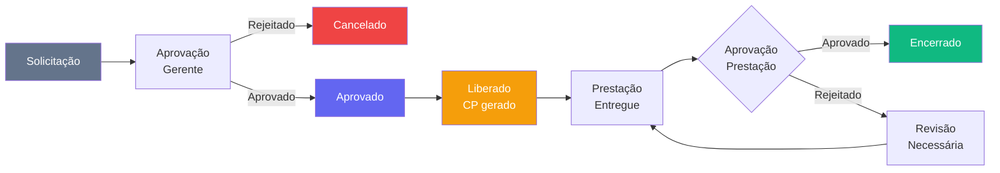

# Módulo Obras

> Gestão operacional do dia a dia das obras: apontamentos de campo, Relatório Diário de Obra (RDO), adiantamentos financeiros, prestação de contas e planejamento de equipe.

---

## Visão Geral

O módulo Obras é a interface operacional para o pessoal de campo e supervisores. Enquanto o PMO/EGP cuida da visão gerencial e estratégica, o módulo Obras trata das atividades diárias de execução: quem está na obra, o que foi feito hoje, quais custos foram incorridos e como as equipes estão distribuídas.

---

## Páginas e Componentes

### `ObrasHome.tsx` — `/obras`

Dashboard operacional. Exibe:
- **4 KPIs rápidos:** Apontamentos do mês, Horas apontadas, Adiantamentos pendentes, Equipes ativas
- **Apontamentos recentes:** lista dos últimos apontamentos com status (rascunho / confirmado / validado)
- **Mobilizações:** lista das mobilizações de equipe em andamento com tipo e status
- **Atalhos rápidos:** botão para criar nova mobilização diretamente do dashboard

### `Apontamentos.tsx` — `/obras/apontamentos`

Registro de apontamentos de campo (HH — Homem-Hora):
- Apontamento por colaborador, obra, frente de trabalho e data
- Status do apontamento: `rascunho` → `confirmado` → `validado`
- Filtros por obra, período, colaborador e status
- Exportação de relatório de HH por período
- Consolidação para alimentar o histograma no PMO

**Status dos Apontamentos:**

| Status | Descrição |
|--------|-----------|
| `rascunho` | Criado mas não confirmado pelo supervisor |
| `confirmado` | Confirmado pelo supervisor no campo |
| `validado` | Validado pela gestão de obras |

### `RDO.tsx` — `/obras/rdo`

Relatório Diário de Obra:
- Registro diário por obra: condições climáticas, efetivo presente, atividades executadas, equipamentos utilizados, ocorrências
- Fotos e evidências (upload)
- Assinatura eletrônica pelo engenheiro responsável
- Histórico de RDOs por obra e data
- Exportação em PDF

### `Adiantamentos.tsx` — `/obras/adiantamentos`

Controle de adiantamentos financeiros para obras:
- Solicitação de adiantamento: obra, responsável, valor, finalidade
- Status: `solicitado` → `aprovado` → `liberado` → `prestado` → `encerrado`
- Vinculação com CP (Contas a Pagar) para controle financeiro
- Alertas de adiantamentos sem prestação de contas vencidos

**Status dos Adiantamentos:**

| Status | Descrição |
|--------|-----------|
| `solicitado` | Aguardando aprovação |
| `aprovado` | Aprovado pela alçada competente |
| `liberado` | Valor transferido para o responsável |
| `prestado` | Prestação de contas entregue |
| `encerrado` | Prestação aprovada, processo encerrado |
| `cancelado` | Cancelado antes da liberação |

### `PrestacaoContas.tsx` — `/obras/prestacao`

Prestação de contas de adiantamentos:
- Comprovantes de despesas (upload de notas, recibos)
- Categorização das despesas por classe financeira
- Saldo devolvido ou diferença a reembolsar
- Aprovação da prestação pelo gestor
- Vinculação com o adiantamento correspondente

### `PlanejamentoEquipe.tsx` — `/obras/equipe`

Planejamento e gestão de equipe por obra:
- Mobilização de colaboradores para obras: tipo, data início/fim, função
- Tipos de mobilização: `mobilizacao`, `desmobilizacao`, `transferencia`, `ferias`, `afastamento`
- Status: `planejada` → `em_andamento` → `concluida`
- Visão de equipe atual por obra
- Histórico de movimentações de pessoal

---

## Hooks (`src/hooks/useObras.ts`)

| Hook | Responsabilidade |
|------|------------------|
| `useObrasKPIs()` | KPIs consolidados do dashboard |
| `useApontamentos(filtros?)` | Lista de apontamentos com filtros |
| `useCriarApontamento()` | Mutation — criar novo apontamento |
| `useAtualizarApontamento()` | Mutation — atualizar status/dados |
| `useMobilizacoes(filtros?)` | Mobilizações de equipe |
| `useCriarMobilizacao()` | Mutation — criar nova mobilização |
| `useEquipes(obra_id?)` | Equipe atual por obra |
| `useRDOs(filtros?)` | Relatórios Diários de Obra |
| `useAdiantamentos(filtros?)` | Adiantamentos por status |
| `usePrestacoes(filtros?)` | Prestações de contas |

---

## Schema do Banco

Prefixo de tabelas: `obr_`

| Tabela | Descrição |
|--------|-----------|
| `obr_frentes` | Frentes de trabalho por obra |
| `obr_apontamentos` | Apontamentos de HH por colaborador e obra |
| `obr_rdo` | Relatórios Diários de Obra |
| `obr_adiantamentos` | Adiantamentos financeiros |
| `obr_prestacao_contas` | Prestações de contas com comprovantes |
| `obr_equipes` | Composição de equipe por obra |
| `obr_mobilizacoes` | Mobilizações e desmobilizações de equipe |
| `obr_planejamento_equipe` | Planejamento de alocação de colaboradores por período |

> **Nota:** `obr_planejamento_equipe` foi adicionado em migration separada (036) para integração com RH.

---

## Fluxo de Adiantamento

---

## Integração com Outros Módulos

| Módulo | Integração |
|--------|-----------|
| **Financeiro** | Adiantamentos geram CP; prestações aprovadas encerram o CP |
| **PMO/EGP** | Apontamentos alimentam histograma e avanço físico |
| **Cadastros** | Colaboradores apontados referenciados em `rh_colaboradores` |
| **SSMA** | RDO pode registrar ocorrências de segurança |

---

## KPIs do Dashboard

| KPI | Descrição |
|-----|-----------|
| `apontamentos_mes` | Total de apontamentos no mês corrente |
| `horas_mes` | Soma de HH apontados no mês |
| `adiantamentos_pendentes` | Adiantamentos liberados sem prestação |
| `equipes_ativas` | Mobilizações com status `em_andamento` |
| `rdos_hoje` | RDOs registrados hoje |

---

## Links Relacionados

- [[03 - Páginas e Rotas]] — Rotas do módulo
- [[31 - Módulo PMO-EGP]] — Visão gerencial das obras
- [[20 - Módulo Financeiro]] — Adiantamentos e CP
- [[33 - Módulo SSMA]] — Segurança no campo
