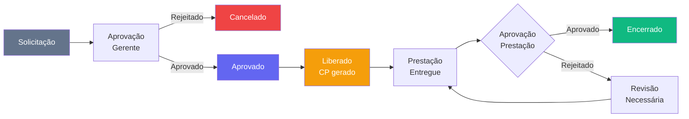

# Módulo Obras

> Gestão operacional do dia a dia das obras: apontamentos de campo, RDO, adiantamentos financeiros, prestação de contas e planejamento de equipe (mobilização + frota).

---

## Visão Geral

O módulo Obras é a interface operacional para o pessoal de campo e supervisores. Enquanto o PMO/EGP cuida da visão gerencial e estratégica, o módulo Obras trata das atividades diárias de execução: quem está na obra, o que foi feito hoje, quais custos foram incorridos e como as equipes e máquinas estão distribuídas.

---

## Páginas e Componentes

### `ObrasHome.tsx` — `/obras`

Dashboard operacional. Exibe:
- **`ObrasPainel`** embutido no topo — indicadores de mobilização no padrão EGP (ver abaixo)
- **Apontamentos recentes:** lista dos últimos apontamentos com status (rascunho / confirmado / validado)
- **Mobilizações:** lista das mobilizações de equipe em andamento com tipo e status
- **Atalhos rápidos:** botões para criar nova mobilização e navegar para planejamento de equipe

> Os 4 KPI cards antigos (Apontamentos, RDOs, Adiantamentos, Prestações) foram removidos e substituídos pelo `ObrasPainel`.

---

### `ObrasPainel.tsx` — embutido em `/obras` e registrado no hub `/paineis`

Indicadores de mobilização no padrão EGP ("Obras · Indicadores consolidados"). Combina dados de `obr_planejamento_equipe` + `fro_alocacoes` + `fro_veiculos`.

**KPIs (6, layout EGP — label / valor colorido / nota):**

| KPI | Fonte | Cor |
|-----|-------|-----|
| Obras com equipe | obr_planejamento_equipe (status ativo) | laranja |
| Pessoas mobilizadas | total de linhas ativas | índigo |
| Supervisores | papel = supervisor | violeta |
| Encarregados | papel = encarregado | âmbar |
| Engenheiros | papel = engenheiro | azul |
| Máquinas | fro_alocacoes status='ativa' com obra_id | verde |

**Barras horizontais (6 blocos em grid 2 colunas):**
1. Efetivo por obra
2. Efetivo por polo/projeto
3. Composição por papel (engenheiro / supervisor / encarregado / apoio / time)
4. Efetivo por frente de trabalho (encarregado.funcao_equipe + time vinculado)
5. Frota por obra
6. Frota por tipo (grupo de categoria do veículo)

---

### `EquipeObras.tsx` — `/obras/equipe`

Planejamento e gestão de equipe por obra. Três abas em `ControladoriaFlow`:

#### Aba Lista
Cadastro e gerenciamento de alocações (`obr_planejamento_equipe`):
- Agrupamento por Projeto › Obra › Papel (engenheiro → supervisor → encarregado → apoio → time)
- Criar alocação: selecionar colaborador, papel, obra, datas, função de equipe
- Encarregado carrega o time vinculado (lider_id)
- Status da alocação: `planejado` → `mobilizado` → `ativo` → `desmobilizado` / `cancelado`
- Edição inline e exclusão

#### Aba Programação
Linha do tempo (Gantt semanal) agrupada por Projeto › Engenheiro › Obra:
- **Filtros (mesma linha):** Projeto (select), Obra (select dependente), busca por nome/função
- **Semanas:** sempre começam na semana atual (segunda de hoje), nunca na data de início mais antiga
- **Scrollbar sticky:** barra horizontal fixada no topo, sincronizada com a tabela
- **Drag-to-reallocate:** arraste o nome de uma pessoa para outra obra → realocar a partir de hoje (cascateia supervisor/encarregado com seu time)
- **Bloco Recursos (frota):** colapsável por obra, mostra máquinas alocadas (fro_alocacoes status='ativa') com barra de período; auto-expande na busca

#### Aba Quadro Geral (Kanban)
Cards de obras com cards de pessoas por papel. Drag & drop entre obras.

**Status das alocações:**

| Status | Descrição |
|--------|-----------|
| `planejado` | Programado, ainda não iniciado |
| `mobilizado` | Em deslocamento para a obra |
| `ativo` | Presente e trabalhando na obra |
| `desmobilizado` | Retornou da obra |
| `cancelado` | Cancelado antes de iniciar |

---

### `Apontamentos.tsx` — `/obras/apontamentos`

Registro de apontamentos de campo (HH — Homem-Hora):
- Apontamento por colaborador, obra, frente de trabalho e data
- Status: `rascunho` → `confirmado` → `validado`
- Filtros por obra, período, colaborador e status
- Exportação de relatório de HH por período

---

### `RDO.tsx` — `/obras/rdo`

Relatório Diário de Obra:
- Registro diário por obra: condições climáticas, efetivo presente, atividades executadas, equipamentos, ocorrências
- Fotos e evidências (upload)
- Assinatura eletrônica pelo engenheiro responsável
- Histórico de RDOs por obra e data
- Exportação em PDF

---

### `Adiantamentos.tsx` — `/obras/adiantamentos`

Controle de adiantamentos financeiros para obras:
- Solicitação: obra, responsável, valor, finalidade
- Status: `solicitado` → `aprovado` → `liberado` → `prestado` → `encerrado`
- Vinculação com CP (Contas a Pagar) para controle financeiro
- Alertas de adiantamentos vencidos sem prestação

**Status dos Adiantamentos:**

| Status | Descrição |
|--------|-----------|
| `solicitado` | Aguardando aprovação |
| `aprovado` | Aprovado pela alçada |
| `liberado` | Valor transferido |
| `prestado` | Prestação entregue |
| `encerrado` | Prestação aprovada |
| `cancelado` | Cancelado antes da liberação |

---

### `PrestacaoContas.tsx` — `/obras/prestacao`

Prestação de contas de adiantamentos:
- Comprovantes de despesas (upload de notas, recibos)
- Categorização por classe financeira
- Saldo devolvido ou diferença a reembolsar
- Aprovação pelo gestor

---

## Hooks (`src/hooks/useObras.ts`)

| Hook | Responsabilidade |
|------|------------------|
| `useObrasKPIs()` | KPIs consolidados do dashboard |
| `useObrasComProjeto()` | Lista de obras com nome do projeto vinculado |
| `useApontamentos(filtros?)` | Lista de apontamentos com filtros |
| `useCriarApontamento()` | Mutation — criar novo apontamento |
| `useAtualizarApontamento()` | Mutation — atualizar status/dados |
| `useExcluirApontamento()` | Mutation — excluir apontamento |
| `useMobilizacoes(filtros?)` | Mobilizações de equipe |
| `useCriarMobilizacao()` | Mutation — criar nova mobilização |
| `useEquipes(obra_id?)` | Equipe atual por obra |
| `useRDOs(filtros?)` | Relatórios Diários de Obra |
| `useCriarRDO()` | Mutation — criar RDO |
| `useAtualizarRDO()` | Mutation — atualizar RDO |
| `useAdiantamentos(filtros?)` | Adiantamentos por status |
| `useCriarAdiantamento()` | Mutation — criar adiantamento |
| `useAtualizarAdiantamento()` | Mutation — atualizar adiantamento |
| `useAprovarAdiantamento()` | Mutation — aprovação |
| `usePrestacaoContas(filtros?)` | Prestações de contas |
| `useCriarPrestacao()` | Mutation — criar prestação |
| `useAprovarPrestacao()` | Mutation — aprovar prestação |
| `useRejeitarPrestacao()` | Mutation — rejeitar prestação |
| `usePlanejamentoEquipe(filtros?)` | Alocações de equipe em `obr_planejamento_equipe` |
| `useColaboradoresAtivos()` | Colaboradores disponíveis para alocar |
| `useCriarPlanEquipe()` | Mutation — criar alocação |
| `useAtualizarPlanEquipe()` | Mutation — editar alocação (status, datas, obra) |
| `useExcluirPlanEquipe()` | Mutation — excluir alocação |
| `useMoverLiderTime()` | Mutation — move encarregado + time vinculado de obra |

---

## Schema do Banco

Prefixo de tabelas: `obr_`

| Tabela | Descrição |
|--------|-----------|
| `obr_frentes` | Frentes de trabalho por obra |
| `obr_apontamentos` | Apontamentos de HH por colaborador e obra |
| `obr_rdo` | Relatórios Diários de Obra |
| `obr_adiantamentos` | Adiantamentos financeiros |
| `obr_prestacao_contas` | Prestações de contas com comprovantes |
| `obr_equipes` | Composição de equipe por obra (legado) |
| `obr_mobilizacoes` | Mobilizações e desmobilizações |
| `obr_planejamento_equipe` | Alocações por colaborador/papel/obra/período — tabela central do módulo Equipe |

**Tabelas de outros módulos usadas aqui:**
- `fro_alocacoes` + `fro_veiculos` — frota/máquinas alocadas por obra (lidas; escrita pelo módulo Frotas)
- `rh_colaboradores` — fonte de colaboradores para alocação

---

## Fluxo de Adiantamento

---

## Integração com Outros Módulos

| Módulo | Integração |
|--------|-----------|
| **Financeiro** | Adiantamentos geram CP; prestações aprovadas encerram o CP |
| **PMO/EGP** | Apontamentos alimentam histograma e avanço físico; `obr_planejamento_equipe` é lida pelo histograma de recursos do EGP |
| **Frotas** | `fro_alocacoes` + `fro_veiculos` exibidos no bloco Recursos da Programação e no ObrasPainel |
| **RH** | `rh_colaboradores` é a fonte dos colaboradores alocados; base_id → frente usada para agrupamento |
| **Painéis** | `ObrasPainel` registrado em `registry.tsx` sob o pilar Projetos |
| **SSMA** | RDO pode registrar ocorrências de segurança |

---

## Links Relacionados

- [[03 - Páginas e Rotas]] — Rotas do módulo
- [[31 - Módulo PMO-EGP]] — Visão gerencial das obras
- [[20 - Módulo Financeiro]] — Adiantamentos e CP
- [[24 - Módulo Frotas e Manutenção]] — Frota alocada por obra
- [[33 - Módulo SSMA]] — Segurança no campo
