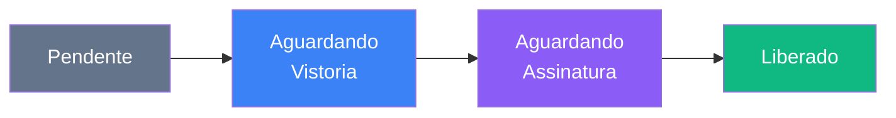
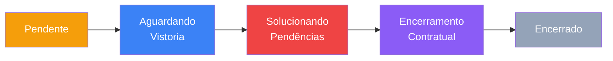
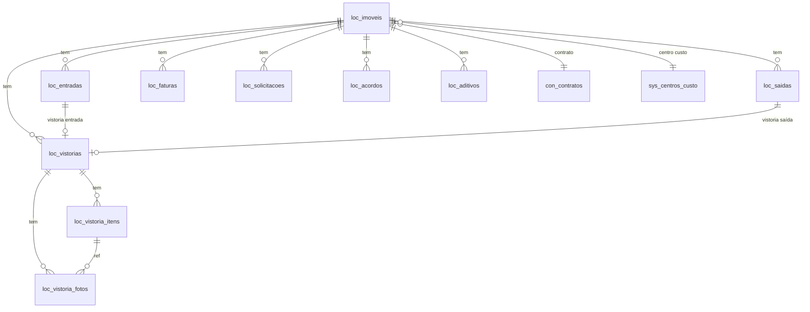

# Módulo Locação de Imóveis

> Gestão completa do ciclo de locação de imóveis utilizados nas obras da TEG: casas, alojamentos, escritórios de campo e galpões. Controla desde a solicitação de entrada até a devolução do imóvel, passando por vistorias, acordos, faturas e aditivos contratuais.

---

## Visão Geral

O módulo Locação foi criado em abril de 2026 para centralizar o controle de imóveis locados pela TEG para suporte às obras. Antes, esse controle era feito via planilhas ou diluído no módulo Contratos. Agora possui fluxo próprio com dois pipelines (entrada e saída), catálogo de imóveis, vistorias com checklist comparativo, gestão de faturas recorrentes e solicitações de manutenção/serviço.

---

## Fluxo de Entrada (4 etapas)



| Status | Cor | Descrição |
|--------|-----|-----------|
| `pendente` | Slate | Solicitação de entrada registrada |
| `aguardando_vistoria` | Blue | Vistoria de entrada agendada/em andamento |
| `aguardando_assinatura` | Violet | Vistoria concluída, contrato pendente de assinatura |
| `liberado` | Green | Contrato assinado, imóvel liberado para uso |

---

## Fluxo de Saída (5 etapas)



| Status | Cor | Descrição |
|--------|-----|-----------|
| `pendente` | Amber | Aviso de saída registrado |
| `aguardando_vistoria` | Blue | Vistoria de saída agendada |
| `solucionando_pendencias` | Red | Divergências encontradas na vistoria — reparos em andamento |
| `encerramento_contratual` | Violet | Pendências resolvidas, rescisão/encerramento do contrato |
| `encerrado` | Slate | Imóvel devolvido, processo concluído |

---

## Status dos Imóveis

| Status | Descrição |
|--------|-----------|
| `ativo` | Imóvel em uso regular |
| `inativo` | Imóvel cadastrado mas sem contrato ativo |
| `em_entrada` | Processo de entrada em andamento |
| `em_saida` | Processo de saída em andamento |

---

## Tipos de Fatura

O módulo gerencia faturas recorrentes vinculadas a cada imóvel:

| Tipo | Descrição |
|------|-----------|
| `energia` | Conta de luz |
| `agua` | Conta de água |
| `internet` | Provedor de internet |
| `iptu` | Imposto Predial e Territorial Urbano |
| `condominio` | Taxa condominial |
| `telefone` | Linha telefônica fixa |
| `limpeza` | Serviço de limpeza |
| `outro` | Outros custos recorrentes |

**Status da fatura:** `previsto` → `lancado` → `enviado_pagamento` → `pago`

---

## Vistorias — Checklist Comparativo

O sistema de vistoria permite comparação lado a lado entre a condição de entrada e a de saída de cada ambiente/item:

- **Ambientes:** sala, quartos, cozinha, banheiros, área externa, etc.
- **Itens por ambiente:** pintura, piso, vidros, portas, tomadas, encanamento, etc.
- **Estados possíveis:** `otimo`, `bom`, `regular`, `ruim`, `nao_se_aplica`
- **Divergência automática:** quando `estado_saida` é pior que `estado_entrada`, o item é marcado com `divergencia = true`
- **Fotos:** upload de fotos por item (tabela `loc_vistoria_fotos`), vinculadas ao tipo de vistoria (entrada/saída)

O componente `VistoriaComparativo` exibe as duas vistorias em paralelo, destacando visualmente as divergências.

---

## Solicitações de Manutenção e Serviço

| Tipo | Descrição |
|------|-----------|
| `servico` | Serviço avulso no imóvel (ex: instalação de ar-condicionado) |
| `manutencao` | Reparo/manutenção (ex: conserto de encanamento) |
| `acordo` | Negociação com locador (ex: abatimento por benfeitoria) |
| `renovacao` | Renovação de contrato |

**Urgências:** `baixa`, `normal`, `alta`, `urgente`

**Status:** `aberta` → `em_andamento` → `concluida` (ou `cancelada`)

Solicitações podem ser vinculadas a uma requisição de compras (`cmp_requisicao_id`) para aquisição de materiais, ou a um contrato (`con_contrato_id`).

---

## Acordos e Aditivos

### Acordos (`loc_acordos`)

Registram negociações específicas com o locador:

| Tipo | Exemplo |
|------|---------|
| `benfeitoria` | Reforma no imóvel com abatimento no aluguel |
| `abatimento` | Desconto concedido pelo locador |
| `multa` | Multa por descumprimento contratual |
| `negociacao` | Acordo informal documentado |
| `outro` | Outros tipos |

### Aditivos (`loc_aditivos`)

Alterações formais no contrato de locação:

| Tipo | Descrição |
|------|-----------|
| `renovacao` | Extensão do prazo do contrato |
| `reajuste` | Reajuste de valor por índice (IGPM, IPCA, etc.) |
| `alteracao_valor` | Mudança de valor sem índice formal |
| `outro` | Outros aditivos |

**Status do aditivo:** `rascunho` → `aguardando_assinatura` → `assinado`

---

## Páginas e Componentes

### Páginas (9)

| Rota | Componente | Descrição |
|------|-----------|-----------|
| `/locacao` | `LocacaoHome` | Dashboard com KPIs, barras de status dos pipelines, faturas próximas e solicitações abertas |
| `/locacao/entradas` | `EntradasPipeline` | Pipeline Kanban do fluxo de entrada |
| `/locacao/saida` | `SaidaPipeline` | Pipeline Kanban do fluxo de saída |
| `/locacao/gestao` | `Gestao` | Gestão consolidada de imóveis e operações |
| `/locacao/acordos` | `Acordos` | CRUD de acordos com locadores |
| `/locacao/aditivos` | `AditivosRenovacoes` | Gestão de aditivos e renovações contratuais |
| `/locacao/ativos` | `Ativos` | Catálogo de imóveis ativos com dados do locador |
| `/locacao/faturas` | `Faturas` | Controle de faturas e contas recorrentes |
| `/locacao/manutencoes` | `ManutencoesServicos` | Solicitações de manutenção e serviço |

### Componentes (`src/components/locacao/`)

| Componente | Descrição |
|-----------|-----------|
| `LocFluxoTimeline` | Timeline visual do fluxo de entrada ou saída com etapas coloridas |
| `NovaSolicitacaoModal` | Modal para criar solicitação de manutenção/serviço/acordo/renovação |
| `VistoriaChecklist` | Formulário de checklist de vistoria com ambientes e itens |
| `VistoriaComparativo` | Comparação lado a lado entre vistoria de entrada e saída |
| `LocacaoLayout` | Layout com sidebar amber/orange e navegação mobile |

---

## Hooks (`src/hooks/useLocacao.ts`) — 422 linhas

| Hook | Responsabilidade |
|------|------------------|
| `useLocacaoKPIs()` | KPIs calculados do dashboard |
| `useImoveis(filtros?)` | Lista de imóveis com joins (centro de custo, contrato) |
| `useImovel(id)` | Imóvel individual |
| `useCriarImovel()` | Mutation — cadastrar imóvel |
| `useAtualizarImovel()` | Mutation — atualizar dados do imóvel |
| `useEntradas(filtros?)` | Lista de entradas com join ao imóvel |
| `useCriarEntrada()` | Mutation — iniciar processo de entrada |
| `useAtualizarEntrada()` | Mutation — avançar status da entrada |
| `useSaidas(filtros?)` | Lista de saídas com join ao imóvel |
| `useCriarSaida()` | Mutation — iniciar processo de saída |
| `useAtualizarSaida()` | Mutation — avançar status da saída |
| `useVistorias(filtros?)` | Vistorias com itens e fotos |
| `useCriarVistoria()` | Mutation — criar vistoria (entrada ou saída) |
| `useFaturas(filtros?)` | Faturas por imóvel/status/período |
| `useCriarFatura()` | Mutation — registrar fatura |
| `useAtualizarFatura()` | Mutation — avançar status da fatura |
| `useSolicitacoesLocacao(filtros?)` | Solicitações de manutenção/serviço |
| `useCriarSolicitacao()` | Mutation — abrir solicitação |
| `useAcordos(filtros?)` | Lista de acordos |
| `useCriarAcordo()` | Mutation — registrar acordo |
| `useAditivos(filtros?)` | Lista de aditivos |
| `useCriarAditivo()` | Mutation — criar aditivo |

---

## Tipos (`src/types/locacao.ts`) — 414 linhas

### Status Unions

```ts
StatusImovel     = 'ativo' | 'inativo' | 'em_entrada' | 'em_saida'
StatusEntrada    = 'pendente' | 'aguardando_vistoria' | 'aguardando_assinatura' | 'liberado'
StatusSaida      = 'pendente' | 'aguardando_vistoria' | 'solucionando_pendencias' | 'encerramento_contratual' | 'encerrado'
StatusVistoria   = 'pendente' | 'em_andamento' | 'concluida'
StatusFatura     = 'previsto' | 'lancado' | 'enviado_pagamento' | 'pago'
StatusSolicitacao = 'aberta' | 'em_andamento' | 'concluida' | 'cancelada'
StatusAditivo    = 'rascunho' | 'aguardando_assinatura' | 'assinado'
```

### Interfaces principais

`LocImovel`, `LocEntrada`, `LocSaida`, `LocVistoria`, `LocVistoriaItem`, `LocVistoriaFoto`, `LocFatura`, `LocSolicitacao`, `LocAcordo`, `LocAditivo`

### Pipeline Stages

`ENTRADA_PIPELINE_STAGES` e `SAIDA_PIPELINE_STAGES` definem cores, classes Tailwind e labels para cada etapa dos pipelines Kanban.

---

## Schema do Banco

**Migration:** `supabase/20260406000001_create_locacao_module.sql`

Prefixo de tabelas: `loc_`

| Tabela | Descrição |
|--------|-----------|
| `loc_imoveis` | Cadastro de imóveis com dados do locador, endereço, valor e obra vinculada |
| `loc_entradas` | Processos de entrada (solicitação → vistoria → assinatura → liberação) |
| `loc_saidas` | Processos de saída (aviso → vistoria → pendências → encerramento) |
| `loc_vistorias` | Registros de vistoria (entrada ou saída) com status e PDF |
| `loc_vistoria_itens` | Checklist de itens por ambiente com estado de entrada e saída |
| `loc_vistoria_fotos` | Fotos por item de vistoria com tipo (entrada/saída) |
| `loc_faturas` | Faturas recorrentes (energia, água, IPTU, etc.) com status de pagamento |
| `loc_solicitacoes` | Solicitações de manutenção/serviço/acordo/renovação |
| `loc_acordos` | Acordos negociados com locadores (benfeitorias, abatimentos, multas) |
| `loc_aditivos` | Aditivos contratuais (renovação, reajuste, alteração de valor) |

### RLS

Todas as 10 tabelas possuem RLS habilitado com policies para usuários autenticados (SELECT, INSERT, UPDATE).

### Relacionamentos



---

## Estrutura de Arquivos

```
frontend/src/
├── components/
│   ├── LocacaoLayout.tsx                # Sidebar amber + nav mobile
│   └── locacao/
│       ├── LocFluxoTimeline.tsx          # Timeline visual de etapas
│       ├── NovaSolicitacaoModal.tsx      # Modal nova solicitação
│       ├── VistoriaChecklist.tsx         # Checklist de vistoria
│       └── VistoriaComparativo.tsx       # Comparativo entrada vs saída
├── pages/locacao/
│   ├── LocacaoHome.tsx                  # Dashboard KPIs + status pipelines
│   ├── EntradasPipeline.tsx             # Pipeline Kanban de entradas
│   ├── SaidaPipeline.tsx                # Pipeline Kanban de saídas
│   ├── Gestao.tsx                       # Gestão consolidada
│   ├── Acordos.tsx                      # Acordos com locadores
│   ├── AditivosRenovacoes.tsx           # Aditivos e renovações
│   ├── Ativos.tsx                       # Catálogo de imóveis
│   ├── Faturas.tsx                      # Controle de faturas
│   └── ManutencoesServicos.tsx          # Manutenção e serviços
├── hooks/
│   └── useLocacao.ts                    # 22 hooks React Query (422 linhas)
└── types/
    └── locacao.ts                       # Tipos e pipeline stages (414 linhas)

supabase/
└── 20260406000001_create_locacao_module.sql  # 10 tabelas com RLS
```

---

## KPIs do Dashboard

| KPI | Descrição |
|-----|-----------|
| Imóveis ativos | Total de imóveis com `status = 'ativo'` |
| Custo mensal | Soma de `valor_aluguel_mensal` dos imóveis ativos |
| Faturas pendentes | Faturas com status `previsto` ou `lancado` |
| Solicitações abertas | Solicitações com status `aberta` ou `em_andamento` |
| Entradas em andamento | Entradas com status diferente de `liberado` |
| Saídas em andamento | Saídas com status diferente de `encerrado` |

---

## Integração com Outros Módulos

| Módulo | Integração |
|--------|-----------|
| **Contratos** | Imóvel pode ser vinculado a `con_contratos` para gestão contratual formal |
| **Financeiro** | Faturas de locação podem gerar CP para pagamento |
| **Compras** | Solicitações de manutenção podem gerar requisição de compras |
| **Cadastros** | Centro de custo e obra referenciados em `sys_centros_custo` e `cad_obras` |
| **Obras** | Cada imóvel pode ser vinculado a uma obra específica |

---

## Links Relacionados

- [[03 - Páginas e Rotas]] — Rotas do módulo
- [[27 - Módulo Contratos Gestão]] — Contratos de locação
- [[20 - Módulo Financeiro]] — Faturas e CP
- [[14 - Compradores e Categorias]] — Categoria "Locação" com alçada especial
