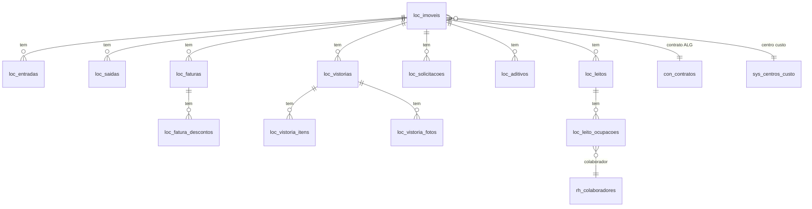

# Módulo Locação de Imóveis

> Gestão completa do ciclo de locação de imóveis usados nas obras da TEG: casas, alojamentos, cantinas, centros de distribuição, escritórios de campo, galpões e hotéis. Controla da solicitação de entrada à devolução, passando por vistorias, faturas recorrentes, aditivos, **controle de leitos/alojamento** (com check-in por QR no Portal do colaborador) e um **mapa geográfico** dos imóveis.

---

## Visão Geral

Criado em abril/2026 para centralizar o controle de imóveis locados. Evoluiu (jun–jul/2026) para incluir **cadastro direto de imóvel** (bypass do pipeline), **controle de leitos** por alojamento e **mapa**. Convive com dois modelos de entrada:

- **Pipeline formal** (entrada → vistoria → assinatura → liberação), para locações que passam por processo completo.
- **Cadastro direto** (`loc_novo_imovel`), para imóveis já operando — cria o imóvel, opcionalmente o contrato de aluguel (ALG) em `con_contratos` e os leitos, em uma transação.

> ⚠️ **Rotas mudaram (jul/2026):** o módulo hoje é **`/locacoes` (plural)**. As antigas rotas `/locacao/*` (singular) foram substituídas. Grande parte das telas virou **aba dentro de Gestão** — ver "Estrutura de Rotas".

---

## Estrutura de Rotas

Gate de permissão: `<ModuleRoute moduleKey="locacoes">`. Layout: `LocacaoLayout` (accent **amber/orange**, sidebar + nav mobile). O dashboard usa `ResponsivePainel` (desktop `LocacaoHome` / mobile `LocacaoHomeMobile`).

| Rota | Componente | Descrição |
|------|-----------|-----------|
| `/locacoes` | `LocacaoHome` / `LocacaoHomeMobile` | Dashboard: KPIs, status dos pipelines, faturas próximas, solicitações abertas |
| `/locacoes/entradas` | `EntradasPipeline` | Pipeline Kanban do fluxo de **entrada** |
| `/locacoes/saida` | `SaidaPipeline` | Pipeline Kanban do fluxo de **saída** |
| `/locacoes/gestao` | `Gestao` | **Hub com 5 abas** (ver abaixo) — onde vivem catálogo, faturas, leitos etc. |

### Abas de Gestão (`Gestao.tsx`)

As telas de operação **não são rotas próprias** — são abas renderizadas dentro de `/locacoes/gestao`:

| Aba (key) | Label | Componente | Conteúdo |
|-----------|-------|-----------|----------|
| `ativos` | Ativos | `Ativos` | Catálogo de imóveis + botão **Novo Imóvel** (modal) |
| `aditivos` | Aditivos & Renovações | `AditivosRenovacoes` | Aditivos contratuais |
| `faturas` | Faturas | `Faturas` | Faturas recorrentes + envio ao Financeiro |
| `servicos` | Manutenções e Serviços | `ManutencoesServicos` | Solicitações de manutenção/serviço |
| `acordos` | **Controle Leitos** | `ControleLeitos` | Alojamento, leitos e ocupações *(a key `acordos` foi reaproveitada; a antiga aba Acordos foi descontinuada)* |

> `MapaImoveis` e as sub-visões (Alojamento / Histórico) são acessadas de dentro de Controle Leitos / Ativos, não como rota.

---

## Fluxo de Entrada (4 etapas)


```mermaid
flowchart LR
    A[Pendente] --> B[Aguardando\nVistoria]
    B --> C[Aguardando\nAssinatura]
    C --> D[Liberado]

    style A fill:#64748B,color:#fff
    style B fill:#3B82F6,color:#fff
    style C fill:#8B5CF6,color:#fff
    style D fill:#10B981,color:#fff
```

| Status (`loc_entradas.status`) | Cor | Descrição |
|--------|-----|-----------|
| `pendente` | Slate | Solicitação de entrada registrada |
| `aguardando_vistoria` | Blue | Vistoria de entrada agendada/em andamento |
| `aguardando_assinatura` | Violet | Vistoria concluída, contrato pendente de assinatura |
| `liberado` | Green | Contrato assinado, imóvel liberado para uso |

`loc_entradas` carrega os dados do imóvel de forma **denormalizada** (endereço, locador, valor, dia de vencimento) — na liberação, viram um registro em `loc_imoveis`.

---

## Fluxo de Saída (5 etapas)


```mermaid
flowchart LR
    A[Pendente] --> B[Aguardando\nVistoria]
    B --> C[Solucionando\nPendências]
    C --> D[Encerramento\nContratual]
    D --> E[Encerrado]

    style A fill:#F59E0B,color:#fff
    style B fill:#3B82F6,color:#fff
    style C fill:#EF4444,color:#fff
    style D fill:#8B5CF6,color:#fff
    style E fill:#94A3B8,color:#fff
```

| Status (`loc_saidas.status`) | Cor | Descrição |
|--------|-----|-----------|
| `pendente` | Amber | Aviso de saída registrado |
| `aguardando_vistoria` | Blue | Vistoria de saída agendada |
| `solucionando_pendencias` | Red | Divergências na vistoria — reparos em andamento |
| `encerramento_contratual` | Violet | Pendências resolvidas, rescisão/encerramento |
| `encerrado` | Slate | Imóvel devolvido, processo concluído |

`loc_saidas` guarda `caucao_valor` / `caucao_devolvido` e `valores_em_aberto` (jsonb) para acerto final.

---

## Status e Tipos de Imóvel

**Status (`loc_imoveis.status`):** `ativo` · `inativo` · `em_entrada` · `em_saida`

**Tipo (`loc_imoveis.tipo`)** — usado no cadastro direto e no mapa:

| Tipo | Significado |
|------|-------------|
| `ALOJ` | Alojamento (tem leitos) |
| `CANT` | Cantina |
| `CD` | Centro de Distribuição |
| `ESC` | Escritório de campo |
| `HTL` | Hotel (não gera contrato ALG) |

> Imóveis não-HTL criados pelo cadastro direto geram um **contrato de aluguel (ALG)** vinculado em `con_contratos`. HTL não tem contrato.

Colunas geográficas em `loc_imoveis`: `latitude`, `longitude`, `geo_aprox` (bool — indica geocodificação aproximada), consumidas pelo **Mapa**.

---

## Novo Imóvel (cadastro direto)

Botão **"Novo Imóvel"** na aba Ativos abre `NovoImovelModal`, que chama a RPC:

```
loc_novo_imovel(
  p_tipo, p_titulo, p_descricao, p_endereco, p_numero, p_complemento,
  p_bairro, p_cep, p_cidade, p_uf, p_area_m2, p_valor_aluguel, p_dia_vencimento,
  p_locador_nome, p_locador_cpf_cnpj, p_locador_contato, p_empresa_id,
  p_centro_custo_id, p_qtd_leitos, p_contrato_numero, p_contrato_inicio,
  p_contrato_fim, p_arquivo_url, p_criado_por
)
```

Em uma transação, a RPC: (1) cria o `loc_imoveis` já `ativo`; (2) se não-HTL, cria o **contrato ALG** em `con_contratos` e vincula (`contrato_id`); (3) se `p_qtd_leitos > 0`, gera os leitos via lógica de `loc_leitos_gerar`. Bypassa todo o pipeline de entrada.

---

## Controle de Leitos / Alojamento

Gestão de vagas em alojamentos (tela **Controle Leitos**, hook `useLeitos.ts`). Duas tabelas:

### `loc_leitos` — a vaga física
| Campo | Descrição |
|-------|-----------|
| `numero_seq` | **Número sequencial GLOBAL** (bigint) — identifica o leito no Portal/QR |
| `imovel_id` | Alojamento dono do leito |
| `codigo` / `codigo_leito` | Código legível (ex.: `L01`) |
| `quarto`, `tipo`, `ordem` | Organização interna |
| `qr_token` (uuid) | Token do **QR** para check-in pelo colaborador |
| `ativo` | Leito disponível |

### `loc_leito_ocupacoes` — quem está no leito
| Campo | Descrição |
|-------|-----------|
| `leito_id`, `colaborador_id`, `colaborador_nome` | Ocupação |
| `data_inicio` / `data_fim` | Período (aberto = ocupado) |
| `checkin_em` / `checkout_em` | Timestamps do check-in/out (via Portal) |
| `origem` | Como foi alocado (RH / Portal-QR / etc.) |

> **Anti-dupla-alocação:** constraint `EXCLUDE` impede que um colaborador ou um leito tenham dois períodos abertos sobrepostos.

### RPCs de leito (ERP)
| RPC | Uso |
|-----|-----|
| `loc_leitos_gerar(p_imovel_id, p_qtd, p_prefixo='L')` | Cria N leitos para um alojamento |
| `loc_leito_alocar(p_leito_id, p_colaborador_id, p_data_inicio, p_obs)` | Aloca colaborador a um leito |
| `loc_leito_liberar(p_ocupacao_id, p_data_fim)` | Encerra a ocupação (check-out administrativo) |
| `loc_leito_mover(p_ocupacao_id, p_novo_leito_id, p_data)` | Move colaborador de leito |

### Check-in por QR no Portal do colaborador (Fase 2 — implementada)
O colaborador escaneia o QR do leito e faz check-in pelo **Portal TEG**. RPCs (com overloads por `numero` bigint **ou** `codigo` text):

| RPC (Portal) | Uso |
|-------------|-----|
| `portalteg_leito_info(p_leito_numero \| p_leito_codigo)` | Dados do leito ao escanear |
| `portalteg_leito_checkin(p_colaborador_id, p_leito_numero \| p_leito_codigo, p_imovel_id)` | Check-in (abre ocupação) |
| `portalteg_leito_checkout(p_colaborador_id, p_leito_numero \| p_leito_codigo)` | Check-out |
| `portalteg_leito_atual(p_colaborador_id)` | Leito atual do colaborador |

### Hooks (`useLeitos.ts`)
`useAlojamentos`, `useLeitos`, `useAtualizarAlojamento`, `useImoveisMapa`, `useBasesMapa`, `useOcupacoesAtivas`, `useLeitosHistorico`, `useGerarLeitos`, `useAtualizarLeito`, `useExcluirLeito`, `useAlocarLeito`, `useLiberarLeito`, `useMoverLeito`.

---

## Mapa de Imóveis

`MapaImoveis.tsx` plota os imóveis (`latitude`/`longitude`) e as bases (`est_bases`) num mapa. Hooks: `useImoveisMapa()` (lê `loc_imoveis` com coords) e `useBasesMapa()` (lê `est_bases`). `geo_aprox = true` marca coordenadas obtidas por geocodificação aproximada (endereço), não GPS.

---

## Faturas Recorrentes

Faturas vinculadas a cada imóvel (`loc_faturas`).

| Tipo (`loc_faturas.tipo`) | Descrição |
|------|-----------|
| `energia`, `agua`, `internet`, `iptu`, `condominio`, `telefone`, `limpeza`, `aluguel`, `outro` | Custos recorrentes do imóvel |

**Campos-chave:** `competencia` (mês de referência), `vencimento`, `valor_previsto`, `valor_confirmado`, `recorrente` + `dia_recorrencia`, `centro_custo_id`, `obra_id`.
**Status:** `previsto` → `lancado` → `enviado_pagamento` → `pago`.

**Descontos:** `loc_fatura_descontos` (descrição, valor, anexo) permite abater valores de uma fatura antes do envio.

### Geração automática do mês
`loc_gerar_faturas_mes(p_competencia date)` — gera as faturas recorrentes de todos os imóveis para a competência informada (a partir de `recorrente`/`dia_recorrencia`).

### Envio ao Financeiro (Previsão de Pagamento)
Faturas em `previsto`/`lancado` com valor > 0 são enviadas ao Financeiro pelo botão **"Enviar p/ Financeiro"** (Faturas.tsx).

- **RPC:** `loc_enviar_faturas_financeiro(p_fatura_ids uuid[])` — cria 1 `fin_contas_pagar` por fatura elegível, status `previsto`, `origem='locacao'`, fornecedor = `locador_nome`.
- **Reverter:** `loc_cancelar_envio_fatura(p_fatura_id)` desfaz o envio (remove o CP e volta a fatura a `lancado`).
- **Link FK:** o CP guarda `loc_fatura_id` (migration 147); no Painel de Pagamentos a linha ganha badge indigo "Locação YYYY-MM".
- **Idempotência:** reenvio da mesma fatura é pulado (`ja_enviada`), não duplica CP.
- **Permissão:** o envio é gated por permissão (migration 172).

> **Atenção histórica:** o check constraint de `origem` em `fin_contas_pagar` não incluía `'locacao'` até a migration **146b** (jun/2026). A RPC criada em **124** ficou inerte por meses — envios falhavam em silêncio. Verificar antes de assumir que CPs históricos de locação foram gerados.

---

## Vistorias — Checklist Comparativo

Comparação lado a lado entre entrada e saída de cada ambiente/item.

- **Estados (`loc_vistoria_itens.estado_*`):** `otimo`, `bom`, `regular`, `ruim`, `nao_se_aplica`
- **Divergência automática:** quando `estado_saida` é pior que `estado_entrada`, `divergencia = true`
- **Fotos:** `loc_vistoria_fotos` (por item, com `tipo` entrada/saída)
- **PDF:** `loc_vistorias.pdf_url`; flag `tem_pendencias`
- **Componentes:** `VistoriaChecklist` (form), `VistoriaComparativo` (entrada×saída), `VistoriaModal` / `VistoriaMobile` (edição desktop/mobile)

---

## Solicitações de Manutenção e Serviço

`loc_solicitacoes` — tipos `servico` · `manutencao` · `acordo` · `renovacao`; urgências `baixa`/`normal`/`alta`/`urgente`; status `aberta` → `em_andamento` → `concluida` (ou `cancelada`). Pode vincular `cmp_requisicao_id` (compras) ou `con_contrato_id`, com `data_limite` e anexo.

---

## Aditivos e Acordos

**Aditivos (`loc_aditivos`):** `renovacao` · `reajuste` · `alteracao_valor` · `outro`; status `rascunho` → `aguardando_assinatura` → `assinado`; guarda `valor_anterior`/`valor_novo`/`indice_reajuste`.

**Acordos (`loc_acordos`):** a tabela existe (`benfeitoria`/`abatimento`/`multa`/`negociacao`/`outro`) mas **não há aba dedicada no momento** — a antiga aba "Acordos" foi substituída por "Controle Leitos".

---

## Schema do Banco

Prefixo: `loc_`. Migration base: `supabase/20260406000001_create_locacao_module.sql`. Incrementos: `073` (grupo/contrato), `124` `146` `146b` `147` (fatura→CP), `160` (hardening + `loc_gerar_faturas_mes`), `170` (centro de custo em fatura), `171` (tipo aluguel), `172` (permissão de envio).

> ⚠️ **Leitos e Novo Imóvel** (`loc_leitos`, `loc_leito_ocupacoes`, `loc_fatura_descontos`, RPCs `loc_leito_*`, `loc_novo_imovel`, colunas geo de `loc_imoveis`) foram aplicados **direto no banco** (não há arquivo SQL commitado). **A fonte da verdade é o banco** — introspectar antes de alterar.

**14 tabelas:**

| Tabela | Descrição |
|--------|-----------|
| `loc_imoveis` | Cadastro de imóveis (+ tipo, geo lat/long, prefeito_*, contrato) |
| `loc_entradas` | Pipeline de entrada (dados denormalizados do imóvel) |
| `loc_saidas` | Pipeline de saída (caução, valores em aberto) |
| `loc_vistorias` | Vistorias (entrada/saída) com PDF e pendências |
| `loc_vistoria_itens` | Checklist por ambiente (estado entrada×saída, divergência) |
| `loc_vistoria_fotos` | Fotos por item de vistoria |
| `loc_faturas` | Faturas recorrentes (competência, previsto/confirmado, recorrência) |
| `loc_fatura_descontos` | Descontos com anexo aplicados a uma fatura |
| `loc_solicitacoes` | Manutenção/serviço/acordo/renovação |
| `loc_acordos` | Acordos com locadores (sem aba dedicada hoje) |
| `loc_aditivos` | Aditivos contratuais |
| `loc_leitos` | Leitos/vagas de alojamento (numero_seq global, qr_token) |
| `loc_leito_ocupacoes` | Ocupações (EXCLUDE anti-dupla-alocação, check-in/out) |

### RLS
Todas as tabelas com RLS habilitado (SELECT/INSERT/UPDATE para autenticados). O envio de faturas ao Financeiro tem gate de permissão adicional (172).

### Relacionamentos

```mermaid
erDiagram
    loc_imoveis ||--o{ loc_entradas : "tem"
    loc_imoveis ||--o{ loc_saidas : "tem"
    loc_imoveis ||--o{ loc_vistorias : "tem"
    loc_imoveis ||--o{ loc_faturas : "tem"
    loc_imoveis ||--o{ loc_solicitacoes : "tem"
    loc_imoveis ||--o{ loc_aditivos : "tem"
    loc_imoveis ||--o{ loc_leitos : "tem"
    loc_faturas ||--o{ loc_fatura_descontos : "tem"
    loc_vistorias ||--o{ loc_vistoria_itens : "tem"
    loc_vistorias ||--o{ loc_vistoria_fotos : "tem"
    loc_leitos ||--o{ loc_leito_ocupacoes : "tem"
    loc_imoveis }o--|| con_contratos : "contrato ALG"
    loc_imoveis }o--|| sys_centros_custo : "centro custo"
    loc_leito_ocupacoes }o--|| rh_colaboradores : "colaborador"
```

---

## RPCs (resumo)

| RPC | Papel |
|-----|-------|
| `loc_novo_imovel(...)` | Cadastro direto: imóvel + contrato ALG + leitos |
| `loc_leitos_gerar` / `loc_leito_alocar` / `loc_leito_liberar` / `loc_leito_mover` | Ciclo de leitos |
| `loc_gerar_faturas_mes(p_competencia)` | Gera faturas recorrentes do mês |
| `loc_enviar_faturas_financeiro(p_fatura_ids[])` | Faturas → `fin_contas_pagar` (idempotente) |
| `loc_cancelar_envio_fatura(p_fatura_id)` | Reverte o envio ao Financeiro |
| `portalteg_leito_checkin` / `_checkout` / `_info` / `_atual` | Check-in por QR no Portal |
| `loc_gerar_titulo`, `loc_cidade_sigla`, `loc_rua_abrev`, `loc_norm_txt`, `loc_leito_codigo_gen` | Helpers (título, sigla, normalização) |

---

## Estrutura de Arquivos

```
frontend/src/
├── components/
│   ├── LocacaoLayout.tsx                 # Sidebar amber + nav mobile
│   └── locacao/
│       ├── LocFluxoTimeline.tsx           # Timeline de etapas
│       ├── NovaSolicitacaoModal.tsx       # Modal de solicitação
│       ├── NovoImovelModal.tsx            # Modal cadastro direto (loc_novo_imovel)
│       ├── VistoriaChecklist.tsx          # Form de checklist
│       ├── VistoriaComparativo.tsx        # Entrada × saída
│       ├── VistoriaModal.tsx              # Edição de vistoria (desktop)
│       └── VistoriaMobile.tsx             # Edição de vistoria (mobile)
├── pages/locacao/
│   ├── LocacaoHome.tsx / LocacaoHomeMobile.tsx   # Dashboard (ResponsivePainel)
│   ├── EntradasPipeline.tsx / SaidaPipeline.tsx  # Pipelines Kanban
│   ├── Gestao.tsx                          # Hub de 5 abas
│   ├── Ativos.tsx                          # Catálogo (aba)
│   ├── Faturas.tsx                         # Faturas (aba)
│   ├── AditivosRenovacoes.tsx              # Aditivos (aba)
│   ├── ManutencoesServicos.tsx            # Manutenções (aba)
│   ├── ControleLeitos.tsx                 # Leitos/alojamento (aba "acordos")
│   └── MapaImoveis.tsx                     # Mapa geográfico
├── hooks/
│   ├── useLocacao.ts                       # Hooks React Query (imóveis, faturas, etc.)
│   └── useLeitos.ts                        # Hooks de leitos/alojamento/mapa
└── types/
    └── locacao.ts                          # Unions e pipeline stages

supabase/
├── 20260406000001_create_locacao_module.sql
└── migrations/ … 073, 124, 146, 146b, 147, 160, 170, 171, 172
   (leitos / novo_imovel / geo aplicados direto no banco — sem SQL commitado)
```

---

## KPIs do Dashboard

| KPI | Fonte |
|-----|-------|
| Imóveis ativos | `loc_imoveis` com `status='ativo'` |
| Custo mensal | Soma de `valor_aluguel_mensal` dos ativos |
| Faturas pendentes | `loc_faturas` em `previsto`/`lancado` |
| Solicitações abertas | `loc_solicitacoes` em `aberta`/`em_andamento` |
| Entradas/Saídas em andamento | Pipelines fora do status final |
| Ocupação de leitos | `loc_leito_ocupacoes` abertas vs `loc_leitos` ativos |

---

## Integração com Outros Módulos

| Módulo | Integração |
|--------|-----------|
| **Financeiro** | Faturas geram CP via `loc_enviar_faturas_financeiro` (FK `loc_fatura_id`, idempotente) |
| **Contratos** | Cadastro direto cria contrato **ALG** em `con_contratos` (não-HTL) |
| **RH / Colaboradores** | Ocupação de leito referencia `rh_colaboradores` |
| **Portal TEG** | Check-in de leito por QR (`portalteg_leito_*`) |
| **Compras** | Solicitações podem gerar `cmp_requisicao_id` |
| **Cadastros/Obras** | `sys_centros_custo`, `cad_obras`, `est_bases` (mapa) |

---

## Links Relacionados

- [[03 - Páginas e Rotas]] — Rotas `/locacoes`
- [[27 - Módulo Contratos Gestão]] — Contratos ALG de locação
- [[20 - Módulo Financeiro]] — Faturas → CP
- [[53 - Módulo DP — Ponto]] — Colaboradores nos leitos
- [[14 - Compradores e Categorias]] — Categoria "Locação"
