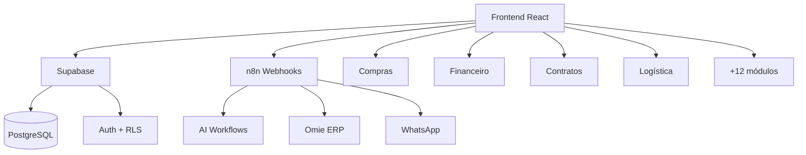

# 🚀 Onboarding DEV — TEG+ ERP

> **Objetivo**: Dev novo → primeiro PR em menos de 1 dia.

---

## Pré-requisitos

| Ferramenta | Versão mínima | Verificar |
|------------|---------------|-----------|
| Node.js | 18+ | `node -v` |
| npm/pnpm | 9+ / 8+ | `npm -v` |
| Git | 2.40+ | `git --version` |
| VS Code | Último | Extensões abaixo |
| Supabase CLI | 1.x | `supabase --version` (opcional) |

### Extensões VS Code recomendadas

- ESLint
- Tailwind CSS IntelliSense
- Prettier
- GitLens
- Thunder Client (testar APIs)
- Markdown All in One (para docs Obsidian)

---

## Passo a Passo

### 1. Clonar o repositório

```bash
git clone https://github.com/leandroteg/teg-plus.git
cd teg-plus
```

### 2. Instalar dependências

```bash
cd frontend
npm install
```

### 3. Configurar variáveis de ambiente

```bash
cp .env.example .env
```

Preencher com as credenciais do ambiente de dev. Ver [[16 - Variáveis de Ambiente]] para detalhes.

> ⚠️ **NUNCA** commitar `.env` com credenciais reais.

### 4. Rodar localmente

```bash
npm run dev
```

Acesse `http://localhost:5173`. Login com credenciais de teste fornecidas pelo tech lead.

### 5. Entender a estrutura

```
teg-plus/
├── frontend/
│   ├── src/
│   │   ├── components/    → Componentes reutilizáveis (ver [[04 - Componentes]])
│   │   ├── hooks/         → Custom hooks (ver [[05 - Hooks Customizados]])
│   │   ├── pages/         → Páginas por módulo (ver [[03 - Páginas e Rotas]])
│   │   ├── types/         → TypeScript types
│   │   ├── utils/         → Utilitários
│   │   ├── contexts/      → React contexts (auth, theme)
│   │   └── lib/           → Supabase client, helpers
│   └── public/
├── docs/                  → Esta documentação (Obsidian vault)
└── supabase/              → Migrations SQL
```

### 6. Leituras obrigatórias (nesta ordem)

1. [[00 - Premissas do Projeto]] — Contexto de negócio e decisões estratégicas
2. [[01 - Arquitetura Geral]] — Stack e visão de alto nível
3. [[07 - Schema Database]] — Modelo de dados (82 objetos, prefixos por módulo)
4. [[09 - Auth Sistema]] — Autenticação, roles e permissões
5. [[36 - Guia de Contribuição]] — Como contribuir corretamente
6. [[40 - ADRs Index]] — Por que as decisões técnicas foram tomadas

### 7. Primeiro PR

1. Pegue uma issue marcada `good-first-issue` no GitHub
2. Crie uma branch: `fix/issue-NNN-descricao-curta`
3. Faça as alterações seguindo o [[36 - Guia de Contribuição]]
4. Abra PR com template padrão
5. Peça review ao tech lead

---

## Mapa Mental do Sistema



---

## Quem procurar

| Assunto | Contato |
|---------|---------|
| Acesso e permissões | Tech Lead |
| Dúvidas de negócio | Product Owner |
| Infraestrutura / Deploy | DevOps |
| Dúvidas de código | Qualquer dev do time |

---

## Checklist do Primeiro Dia

- [ ] Repositório clonado e rodando local
- [ ] `.env` configurado com credenciais de dev
- [ ] Consegue fazer login no sistema local
- [ ] Leu docs 00, 01, 07, 09
- [ ] Entendeu a estrutura de pastas
- [ ] Abriu primeiro PR (mesmo que pequeno)

---

## Links

- [[00 - TEG+ INDEX]]
- [[01 - Arquitetura Geral]]
- [[15 - Deploy e GitHub]]
- [[16 - Variáveis de Ambiente]]
- [[36 - Guia de Contribuição]]
- [[37 - Troubleshooting FAQ]]
