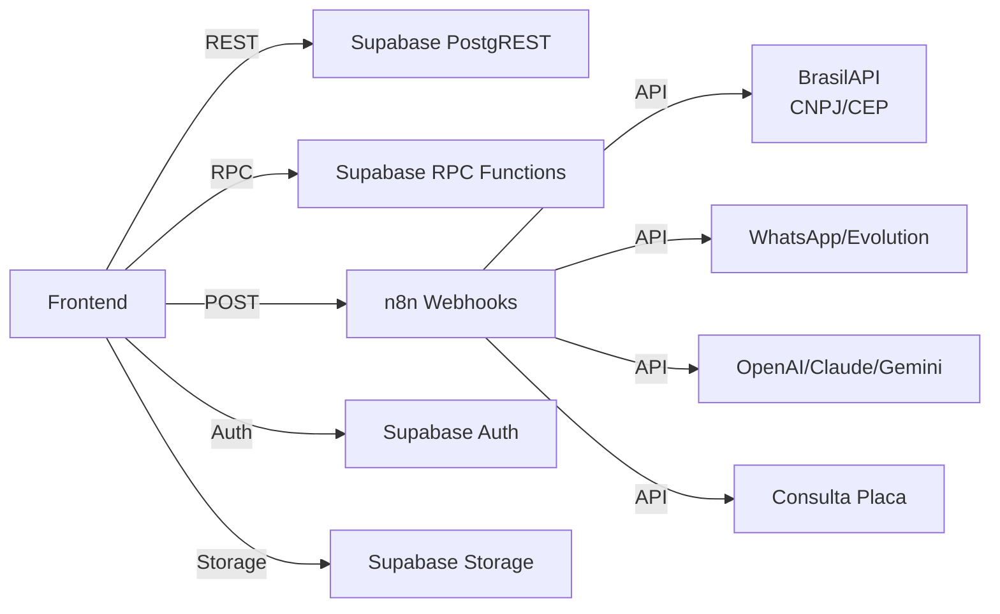

# 🔌 Mapa de APIs & Endpoints — TEG+ ERP

---

## Visão Geral



---

## 1. Supabase PostgREST (CRUD direto)

Todas as tabelas são acessadas via Supabase client. Prefixos indicam o módulo:

| Prefixo | Módulo | Tabelas principais | Operações |
|---------|--------|--------------------|-----------|
| `sys_` | Sistema | `sys_usuarios`, `sys_obras`, `sys_perfis`, `sys_config` | CRUD |
| `cmp_` | Compras | `cmp_requisicoes`, `cmp_cotacoes`, `cmp_pedidos`, `cmp_fornecedores` | CRUD |
| `apr_` | Aprovações | `apr_alcadas`, `apr_aprovacoes` | CRUD |
| `fin_` | Financeiro | `fin_contas_pagar`, `fin_contas_receber`, `fin_docs` | CRUD |
| `con_` | Contratos | `con_contratos`, `con_parcelas`, `con_medicoes` | CRUD |
| `est_` | Estoque | `est_itens`, `est_movimentacoes`, `est_saldos` | CRUD |
| `log_` | Logística | `log_solicitacoes`, `log_transportes`, `log_viagens` | CRUD |
| `fro_` | Frotas | `fro_veiculos`, `fro_os`, `fro_abastecimentos` | CRUD |
| `pat_` | Patrimônio | `pat_imobilizados`, `pat_depreciacoes` | CRUD |
| `fis_` | Fiscal | `fis_notas_fiscais`, `fis_solicitacoes_nf` | CRUD |
| `rh_` | RH | `rh_colaboradores` | CRUD |

### Padrão de uso no frontend

```typescript
// Query
const { data } = await supabase
  .from('con_contratos')
  .select('id, numero, status, contraparte_nome')
  .eq('obra_id', obraId)
  .order('created_at', { ascending: false })

// Mutation
const { error } = await supabase
  .from('con_contratos')
  .update({ status: 'ativo' })
  .eq('id', contratoId)
```

---

## 2. Supabase RPC Functions

Funções server-side para lógica complexa:

| Função | Módulo | Descrição | Parâmetros |
|--------|--------|-----------|------------|
| `get_dashboard_kpis` | Sistema | KPIs consolidados do dashboard | `obra_id` |
| `aprovar_requisicao` | Compras | Aprovação com validação de alçada | `requisicao_id, token, decisao` |
| `calcular_saldo_estoque` | Estoque | Saldo por item/base | `item_id, base_id` |
| `gerar_numero_sequencial` | Sistema | Próximo número (REQ, PO, CT) | `prefixo, obra_id` |
| `fn_log_viagem_recalcular` | Logística | Recalcula paradas e custo rateado | `p_viagem_id` |

### Padrão de chamada

```typescript
const { data, error } = await supabase.rpc('aprovar_requisicao', {
  p_requisicao_id: id,
  p_token: token,
  p_decisao: 'aprovado'
})
```

---

## 3. n8n Webhooks — Parses e Automações

### 3.1 Parse de Cotação (AI)

| Item | Detalhe |
|------|---------|
| **Webhook** | `POST /webhook/compras/parse-cotacao` |
| **Módulo** | Compras |
| **Timeout** | 180s |

**Payload:**
```json
{
  "file_base64": "<base64>",
  "file_name": "cotacao.pdf",
  "mime_type": "application/pdf"
}
```

**Resposta:**
```json
{
  "success": true,
  "fornecedores": [
    {
      "fornecedor_nome": "ABC Ltda",
      "fornecedor_cnpj": "12345678000190",
      "valor_total": 15000,
      "prazo_entrega_dias": 10,
      "condicao_pagamento": "30/60",
      "itens": [
        {
          "descricao": "Cabo XLPE 240mm",
          "qtd": 100,
          "valor_unitario": 150,
          "valor_total": 15000,
          "match_status": "auto_match"
        }
      ]
    }
  ],
  "parser_confidence": 0.92
}
```

---

### 3.2 Consulta CNPJ

| Item | Detalhe |
|------|---------|
| **Webhook** | `POST /webhook/consulta-cnpj` |
| **Módulo** | Cadastros |
| **Fallbacks** | BrasilAPI → ReceitaWS |

**Payload:**
```json
{ "valor": "12345678000190" }
```

**Resposta normalizada:**
```json
{
  "cnpj": "12345678000190",
  "razao_social": "EMPRESA XYZ LTDA",
  "nome_fantasia": "XYZ",
  "situacao": "ATIVA",
  "endereco": {
    "cep": "30130000",
    "logradouro": "Rua da Bahia",
    "numero": "100",
    "bairro": "Centro",
    "cidade": "Belo Horizonte",
    "uf": "MG"
  },
  "telefone": "31999999999",
  "email": "contato@xyz.com",
  "socios": [{ "nome": "João Silva", "qualificacao": "Administrador" }]
}
```

**Hook frontend**: `useConsultaCNPJ(onResult?)` — auto-fill no blur, cache local, retry automático

---

### 3.3 Consulta CEP

| Item | Detalhe |
|------|---------|
| **Webhook** | `POST /webhook/consulta-cep` |
| **Módulo** | Cadastros, Logística |

**Payload:**
```json
{ "valor": "30130000" }
```

**Resposta**: logradouro, bairro, cidade, estado

---

### 3.4 Consulta Placa

| Item | Detalhe |
|------|---------|
| **Webhook** | `POST /webhook/consulta-placa` |
| **Módulo** | Frotas |

**Payload:**
```json
{ "valor": "ABC1D23" }
```

**Resposta**: marca, modelo, ano, combustível, categoria, cor

---

### 3.5 SuperTEG Chat (Agente AI)

| Item | Detalhe |
|------|---------|
| **Webhook** | `POST /webhook/superteg/chat` |
| **Módulo** | Sistema |
| **Sessão** | Via `session_id` no payload |

Ver [[49 - SuperTEG AI Agent]] para documentação completa.

---

### 3.6 Outros Webhooks

| Webhook | Método | Módulo | Descrição |
|---------|--------|--------|-----------|
| `/webhook/requisicao-criada` | POST | Compras | Notificação + início workflow aprovação |
| `/webhook/aprovacao-token` | POST | Aprovações | Processar decisão via token (WhatsApp/email) |
| `/webhook/contrato-analise` | POST | Contratos | Análise AI de minuta → resumo executivo |
| `/webhook/nf-parse` | POST | Fiscal | Parse de XML de NF-e |
| `/webhook/whatsapp-send` | POST | Sistema | Envio de mensagem WhatsApp |
| `/webhook/cadastro-ai` | POST | Cadastros | Enriquecimento AI de cadastro |
| `/webhook/logistica/consulta-cep` | POST | Logística | Consulta CEP para rota |

### Padrão de chamada

```typescript
const response = await fetch(`${import.meta.env.VITE_N8N_WEBHOOK_URL}/contrato-analise`, {
  method: 'POST',
  headers: { 'Content-Type': 'application/json' },
  body: JSON.stringify({ contrato_id: id })
})
```

---

## 4. APIs Externas (Fallback direto do frontend)

| API | Endpoint | Uso | Quando |
|-----|----------|-----|--------|
| BrasilAPI CNPJ | `brasilapi.com.br/api/cnpj/v1/{cnpj}` | Dados de empresa | Fallback 1 do n8n |
| ReceitaWS CNPJ | `receitaws.com.br/v1/cnpj/{cnpj}` | Sócios de empresa | Fallback 2 (apenas sócios) |

---

## 5. Supabase Auth

| Endpoint | Método | Descrição |
|----------|--------|-----------|
| `auth.signInWithPassword` | — | Login email + senha |
| `auth.signInWithOtp` | — | Magic link por email |
| `auth.resetPasswordForEmail` | — | Reset de senha |
| `auth.getSession` | — | Sessão atual |
| `auth.onAuthStateChange` | — | Listener de mudança de estado |

---

## 6. Supabase Storage (Buckets)

| Bucket | Módulo | Conteúdo |
|--------|--------|----------|
| `cotacoes` | Compras | PDFs e imagens de cotações |
| `cotacoes-docs` | Compras/SuperTEG | Docs enviados via SuperTEG para parse |
| `contratos` | Contratos | Minutas, anexos, docs assinados |
| `notas-fiscais` | Fiscal | XMLs e PDFs de NF-e/NFS-e |
| `comprovantes` | Financeiro | Comprovantes de pagamento |
| `obras` | Obras | Fotos, RDOs |
| `avatars` | Sistema | Fotos de perfil |

---

## Links

- [[01 - Arquitetura Geral]]
- [[06 - Supabase]]
- [[07 - Schema Database]]
- [[10 - n8n Workflows]]
- [[45 - Mapa de Integrações]]
- [[41 - Segurança e RLS]]
- [[49 - SuperTEG AI Agent]]
