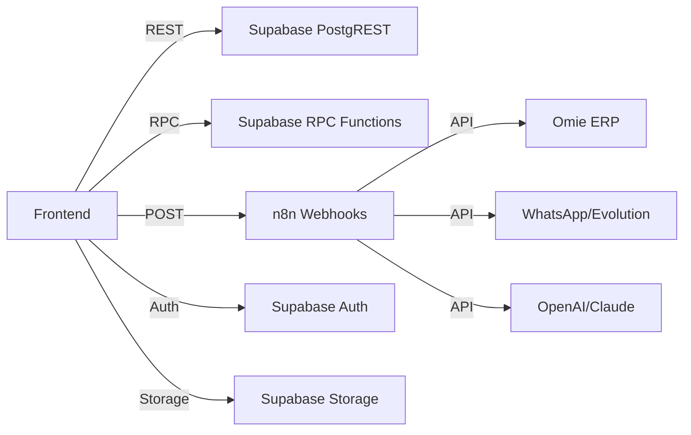

# 🔌 Mapa de APIs & Endpoints — TEG+ ERP

---

## Visão Geral



---

## 1. Supabase PostgREST (CRUD direto)

Todas as tabelas são acessadas via Supabase client. Prefixos indicam o módulo:

| Prefixo | Módulo | Tabelas principais | Operações |
|---------|--------|--------------------|-----------|
| `sys_` | Sistema | `sys_usuarios`, `sys_obras`, `sys_perfis`, `sys_config` | CRUD |
| `cmp_` | Compras | `cmp_requisicoes`, `cmp_cotacoes`, `cmp_pedidos`, `cmp_fornecedores` | CRUD |
| `apr_` | Aprovações | `apr_alcadas`, `apr_aprovacoes` | CRUD |
| `fin_` | Financeiro | `fin_contas_pagar`, `fin_contas_receber`, `fin_docs` | CRUD |
| `con_` | Contratos | `con_contratos`, `con_parcelas`, `con_medicoes` | CRUD |
| `est_` | Estoque | `est_itens`, `est_movimentacoes`, `est_saldos` | CRUD |
| `log_` | Logística | `log_solicitacoes`, `log_transportes`, `log_viagens` | CRUD |
| `fro_` | Frotas | `fro_veiculos`, `fro_os`, `fro_abastecimentos` | CRUD |
| `pat_` | Patrimônio | `pat_imobilizados`, `pat_depreciacoes` | CRUD |
| `fis_` | Fiscal | `fis_notas_fiscais`, `fis_solicitacoes_nf` | CRUD |
| `rh_` | RH | `rh_colaboradores` | CRUD |

### Padrão de uso no frontend

```typescript
// Query
const { data } = await supabase
  .from('con_contratos')
  .select('id, numero, status, contraparte_nome')
  .eq('obra_id', obraId)
  .order('created_at', { ascending: false })

// Mutation
const { error } = await supabase
  .from('con_contratos')
  .update({ status: 'ativo' })
  .eq('id', contratoId)
```

---

## 2. Supabase RPC Functions

Funções server-side para lógica complexa:

| Função | Módulo | Descrição | Parâmetros |
|--------|--------|-----------|------------|
| `get_dashboard_kpis` | Sistema | KPIs consolidados do dashboard | `obra_id` |
| `aprovar_requisicao` | Compras | Aprovação com validação de alçada | `requisicao_id, token, decisao` |
| `calcular_saldo_estoque` | Estoque | Saldo por item/base | `item_id, base_id` |
| `gerar_numero_sequencial` | Sistema | Próximo número (REQ, PO, CT) | `prefixo, obra_id` |

### Padrão de chamada

```typescript
const { data, error } = await supabase.rpc('aprovar_requisicao', {
  p_requisicao_id: id,
  p_token: token,
  p_decisao: 'aprovado'
})
```

---

## 3. n8n Webhooks

Endpoints expostos pelo n8n para automações:

| Webhook | Método | Módulo | Descrição |
|---------|--------|--------|-----------|
| `/webhook/requisicao-criada` | POST | Compras | Notificação + início workflow aprovação |
| `/webhook/aprovacao-token` | POST | Aprovações | Processar decisão via token (WhatsApp/email) |
| `/webhook/cotacao-upload` | POST | Compras | Upload inteligente de cotação (AI parse) |
| `/webhook/contrato-analise` | POST | Contratos | Análise AI de minuta → resumo executivo |
| `/webhook/omie-sync` | POST | Financeiro | Sync bidirecional com Omie ERP |
| `/webhook/omie-cp-sync` | POST | Financeiro | Sync contas a pagar |
| `/webhook/whatsapp-send` | POST | Sistema | Envio de mensagem WhatsApp |
| `/webhook/nf-parse` | POST | Fiscal | Parse de XML de NF-e |
| `/webhook/superteg-chat` | POST | AI | Chat com agente AI SuperTEG |
| `/webhook/cadastro-ai` | POST | Cadastros | Enriquecimento AI de cadastro |

### Padrão de chamada

```typescript
const response = await fetch(`${import.meta.env.VITE_N8N_WEBHOOK_URL}/contrato-analise`, {
  method: 'POST',
  headers: { 'Content-Type': 'application/json' },
  body: JSON.stringify({ contrato_id: id })
})
```

---

## 4. Supabase Auth

| Endpoint | Método | Descrição |
|----------|--------|-----------|
| `auth.signInWithPassword` | — | Login email + senha |
| `auth.signInWithOtp` | — | Magic link por email |
| `auth.resetPasswordForEmail` | — | Reset de senha |
| `auth.getSession` | — | Sessão atual |
| `auth.onAuthStateChange` | — | Listener de mudança de estado |

---

## 5. Supabase Storage (Buckets)

| Bucket | Módulo | Conteúdo |
|--------|--------|----------|
| `cotacoes` | Compras | PDFs e imagens de cotações |
| `contratos` | Contratos | Minutas, anexos, docs assinados |
| `notas-fiscais` | Fiscal | XMLs e PDFs de NF-e/NFS-e |
| `comprovantes` | Financeiro | Comprovantes de pagamento |
| `obras` | Obras | Fotos, RDOs |
| `avatars` | Sistema | Fotos de perfil |

---

## 6. Integrações Externas

### Omie ERP
- **Base URL**: `https://app.omie.com.br/api/v1/`
- **Auth**: App Key + App Secret (via n8n)
- **Endpoints usados**: `/geral/clientes/`, `/financas/contapagar/`, `/financas/contareceber/`
- **Rate limit**: 3 requisições/segundo
- Ver [[19 - Integração Omie]] para mapeamento completo

### WhatsApp (Evolution API)
- Envio de notificações de aprovação
- Processamento de respostas (aprovar/rejeitar via botão)

### AI (OpenAI / Claude)
- Parse inteligente de cotações (extração de dados de PDF)
- Análise de minutas contratuais
- Chat SuperTEG (agente conversacional)
- Enriquecimento de cadastros

---

## Links

- [[01 - Arquitetura Geral]]
- [[06 - Supabase]]
- [[07 - Schema Database]]
- [[10 - n8n Workflows]]
- [[19 - Integração Omie]]
- [[41 - Segurança e RLS]]
