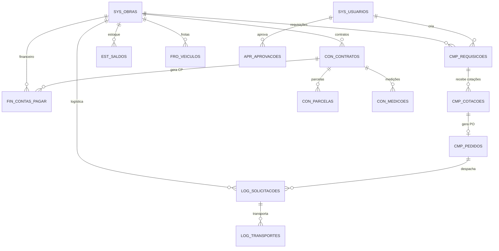
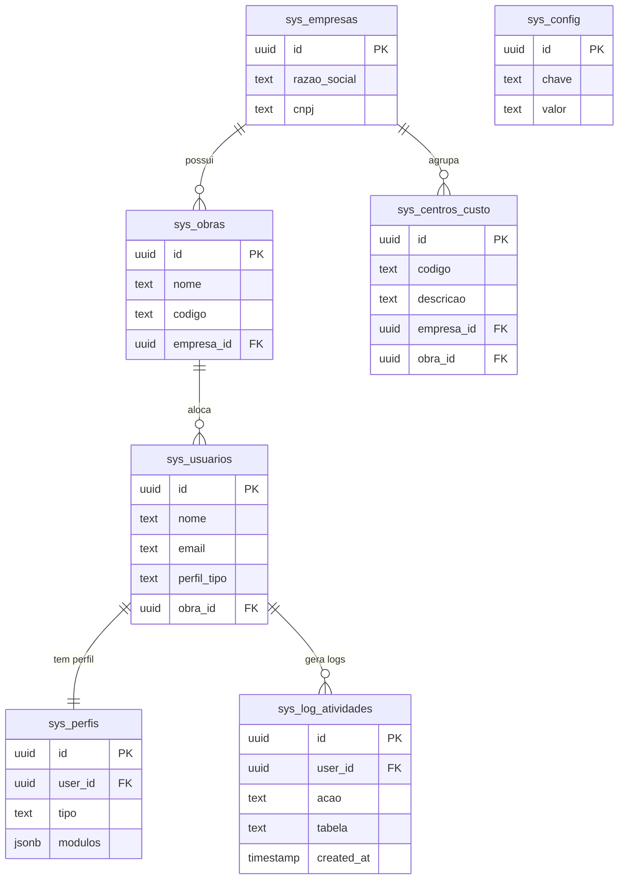
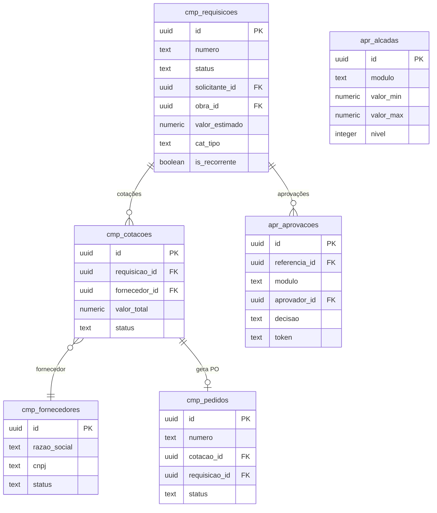
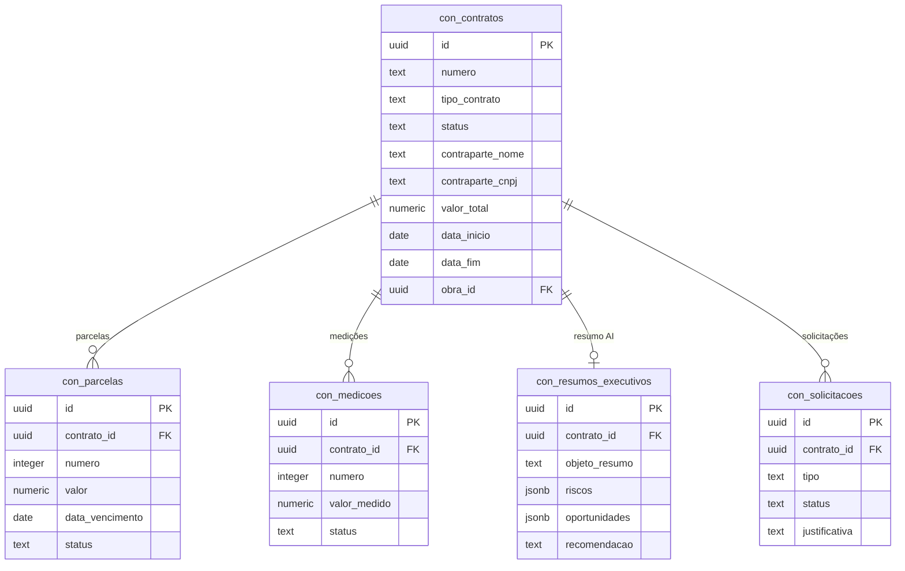
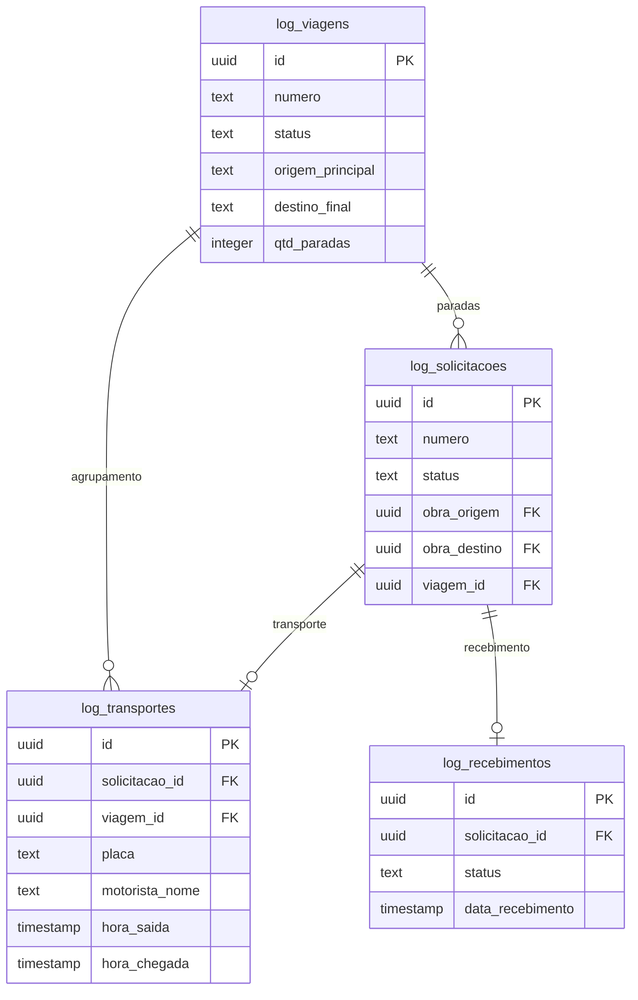
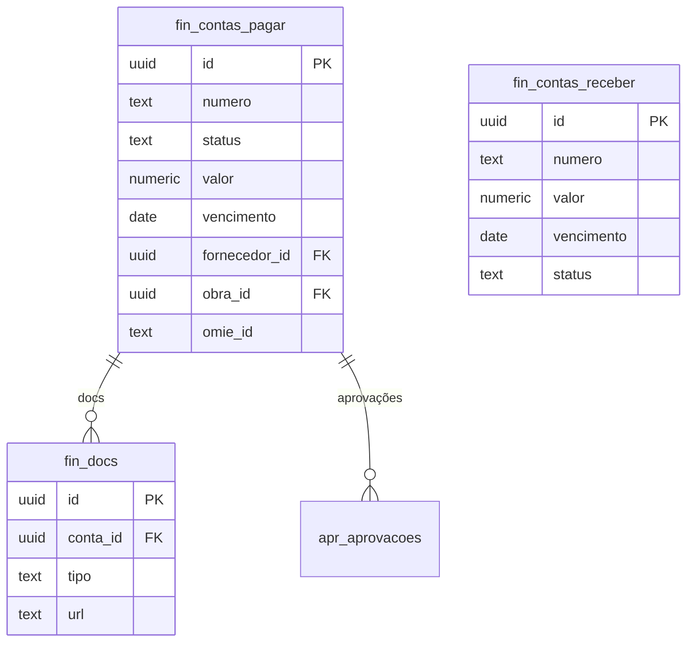

# 🗄️ Modelo de Dados ERD — TEG+ ERP

> Complemento visual ao [[07 - Schema Database]]. Aqui estão os diagramas ER por domínio.
> **82 objetos** | **~100 FKs** | Prefixos por módulo

---

## Visão Macro — Inter-módulos

---

## Sistema (`sys_`)

---

## Compras (`cmp_`)

---

## Contratos (`con_`)

---

## Logística (`log_`)

---

## Financeiro (`fin_`)

---

## Convenções do Schema

| Convenção | Regra |
|-----------|-------|
| Prefixo | Módulo (`sys_`, `cmp_`, `con_`, etc.) |
| PK | Sempre `id UUID DEFAULT gen_random_uuid()` |
| FK | `<tabela_referencia>_id` |
| Timestamps | `created_at`, `updated_at` (com trigger) |
| Soft delete | `deleted_at TIMESTAMP` (quando aplicável) |
| Status | `TEXT` com enum check constraint |
| Valores | `NUMERIC(15,2)` para monetários |
| Datas | `DATE` para date-only, `TIMESTAMPTZ` para data+hora |

---

## Links

- [[07 - Schema Database]] — Referência completa de todas as tabelas
- [[08 - Migrações SQL]] — Histórico de alterações
- [[06 - Supabase]] — Configuração do banco
- [[41 - Segurança e RLS]] — Políticas de acesso por tabela
