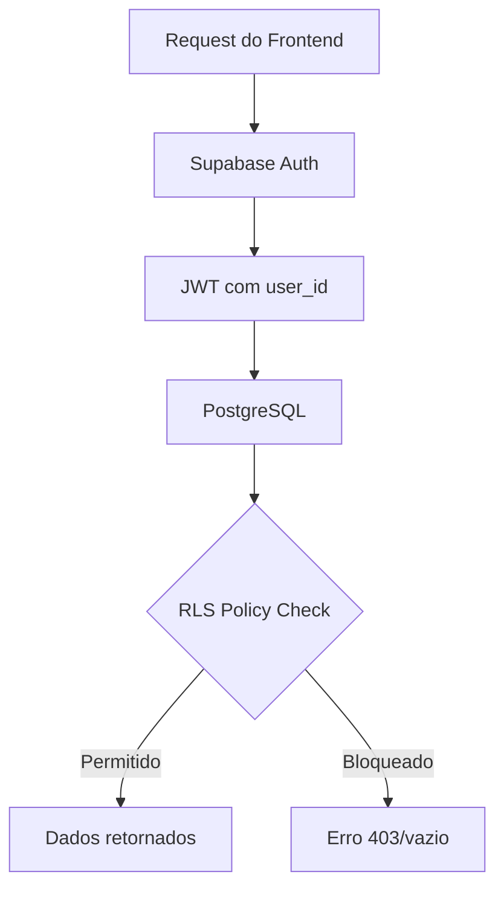

# 🔒 Segurança & RLS Policies — TEG+ ERP

---

## Visão Geral

O TEG+ usa **Row Level Security (RLS)** do PostgreSQL/Supabase como camada principal de autorização. Toda query passa por policies antes de retornar dados.



---

## Modelo de Permissões (RBAC)

### Perfis de Usuário

| Perfil (`perfil_tipo`) | Nível | Acesso |
|------------------------|-------|--------|
| `admin` | Sistema | Tudo — todas obras, todos módulos |
| `diretoria` | Empresa | Todas obras da empresa, aprovações de alto valor |
| `gerente` | Obra | Obra específica, todos módulos liberados |
| `coordenador` | Módulo | Obra + módulos específicos |
| `analista` | Operação | Obra + módulo + operações CRUD |
| `operador` | Leitura+ | Obra + módulo + leitura + criação limitada |
| `visualizador` | Leitura | Apenas leitura na obra/módulo |

### Controle de Módulos

Cada usuário tem `modulos: string[]` em `sys_perfis` que define quais módulos pode acessar:

```typescript
// Frontend: ModuleRoute verifica acesso
const hasModule = (mod: string) => perfil.modulos.includes(mod)
```

---

## Padrões de RLS Policy

### 1. Filtro por Obra (mais comum)

```sql
-- Usuário só vê dados da sua obra
CREATE POLICY "usuarios_mesma_obra" ON cmp_requisicoes
  FOR SELECT
  USING (
    obra_id IN (
      SELECT obra_id FROM sys_usuarios WHERE id = auth.uid()
    )
  );
```

### 2. Admin vê tudo

```sql
CREATE POLICY "admin_full_access" ON cmp_requisicoes
  FOR ALL
  USING (
    EXISTS (
      SELECT 1 FROM sys_usuarios
      WHERE id = auth.uid() AND perfil_tipo = 'admin'
    )
  );
```

### 3. Próprio registro

```sql
-- Usuário só edita o que ele criou
CREATE POLICY "editar_propria_requisicao" ON cmp_requisicoes
  FOR UPDATE
  USING (solicitante_id = auth.uid())
  WITH CHECK (solicitante_id = auth.uid());
```

### 4. Aprovador autorizado

```sql
-- Só aprovadores do nível correto
CREATE POLICY "aprovador_autorizado" ON apr_aprovacoes
  FOR INSERT
  WITH CHECK (
    EXISTS (
      SELECT 1 FROM apr_alcadas a
      JOIN sys_usuarios u ON u.id = auth.uid()
      WHERE a.modulo = NEW.modulo
        AND u.perfil_tipo = ANY(a.perfis_autorizados)
    )
  );
```

---

## Mapa de Policies por Tabela

| Tabela | SELECT | INSERT | UPDATE | DELETE | Filtro principal |
|--------|--------|--------|--------|--------|-----------------|
| `sys_usuarios` | Todos auth | Admin | Self/Admin | Admin | `auth.uid()` |
| `sys_obras` | Todos auth | Admin | Admin | — | — |
| `cmp_requisicoes` | Obra | Obra | Criador/Admin | Admin | `obra_id` |
| `cmp_cotacoes` | Obra+Comprador | Comprador | Comprador | Admin | `obra_id` |
| `apr_aprovacoes` | Aprovador | Aprovador | — | — | `aprovador_id` |
| `con_contratos` | Obra | Coordenador+ | Coordenador+ | Admin | `obra_id` |
| `fin_contas_pagar` | Obra+Financeiro | Financeiro | Financeiro | Admin | `obra_id` |
| `est_itens` | Obra | Almoxarife+ | Almoxarife+ | Admin | `obra_id` |
| `log_solicitacoes` | Obra | Logística | Logística | Admin | `obra_id` |

---

## Chaves de Acesso

| Chave | Escopo | Onde usar |
|-------|--------|-----------|
| `anon key` | Passa por RLS | Frontend (público) |
| `service_role key` | **Bypass RLS** | n8n, Edge Functions (server-side APENAS) |

> ⚠️ **NUNCA** usar `service_role key` no frontend. Ela bypassa todas as policies.

---

## Superfície de Ataque — Pontos de Atenção

| Risco | Mitigação |
|-------|-----------|
| Token JWT expirado | Auto-refresh via `onAuthStateChange` |
| service_role exposta | Só no n8n (server-side), `.env` não commitado |
| Escalação de perfil | `perfil_tipo` só alterável por admin via RPC |
| SQL injection | PostgREST parametriza automaticamente |
| CORS | Configurado no Supabase dashboard |
| Dados entre obras | RLS filtra por `obra_id` em todas as tabelas |

---

## Checklist para Novas Tabelas

Ao criar uma nova tabela:

- [ ] Habilitar RLS: `ALTER TABLE xxx ENABLE ROW LEVEL SECURITY;`
- [ ] Policy SELECT com filtro de obra
- [ ] Policy INSERT com validação de perfil
- [ ] Policy UPDATE restrita (criador ou admin)
- [ ] Policy DELETE restrita (admin apenas, geralmente)
- [ ] Testar com `anon key` — deve filtrar corretamente
- [ ] Testar com `service_role` — deve retornar tudo
- [ ] Documentar na tabela acima

---

## Links

- [[09 - Auth Sistema]] — Fluxo de autenticação
- [[06 - Supabase]] — Configuração geral
- [[07 - Schema Database]] — Todas as tabelas
- [[37 - Troubleshooting FAQ]] — Erros comuns de RLS
- [[13 - Alçadas]] — Regras de aprovação por valor
